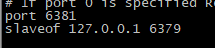
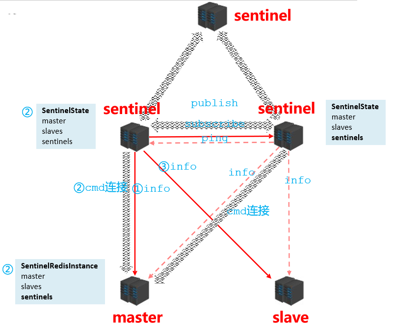
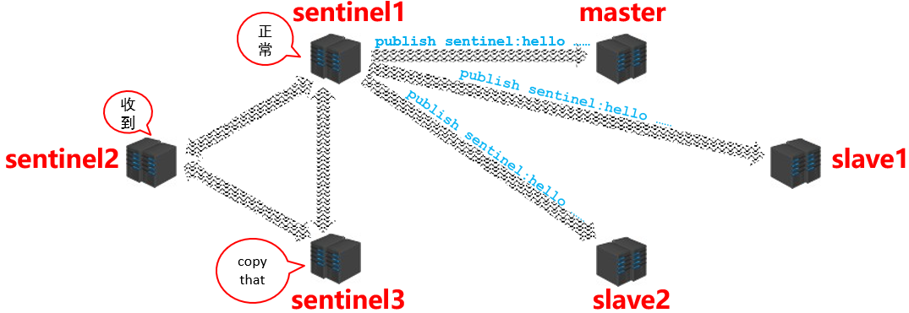
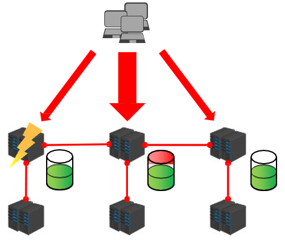
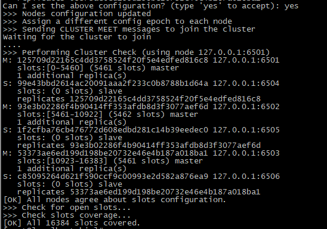
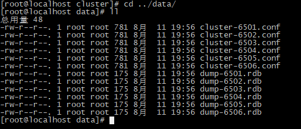
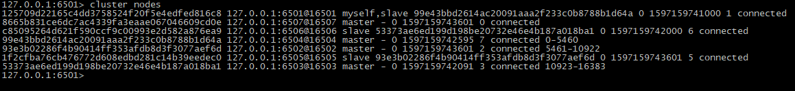
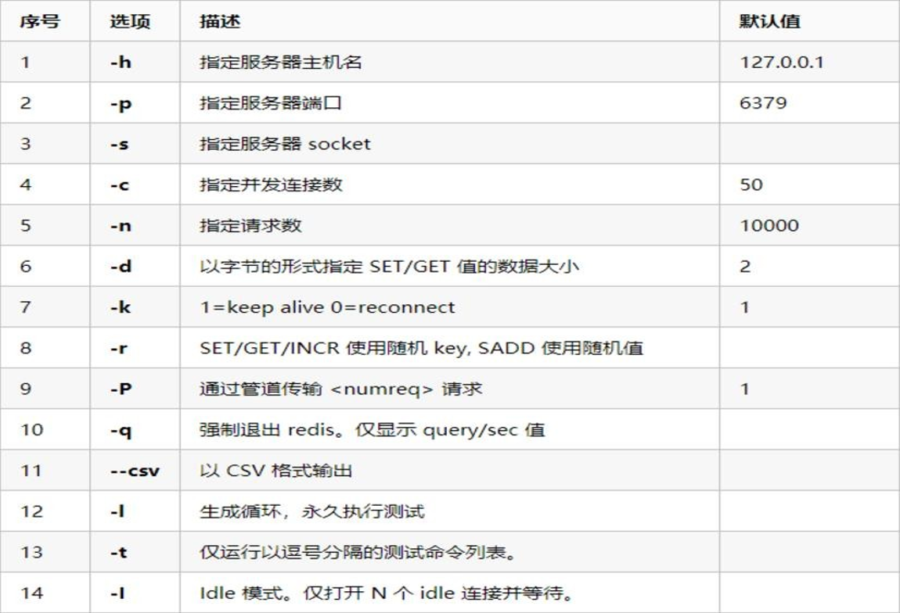

# 高级Redis拓展资料

## 1、Redis集群解决方案（掌握）

​	单机Redis的读写速度非常快，能够支持大量用户的访问。虽然Redis的性能很高，但是对于大型网站来说，每秒需要获取的数据远远超过单台redis服务所能承受的压力，所以我们迫切需要一种方案能够解决单台Redis服务性能不足的问题。这就需要使用到Redis的集群了。Redis集群有多种方案，下面分别进行讲解。

###  1-1、主从复制Replication

redis支持主从复制的模式。

在主从复制模式下Redis节点分为两种角色：主节点(也称为master)和从节点(也称为slave)。这种模式集群是由一个主节点和多个从节点构成。

原则：Master会将数据同步到slave，而slave不会将数据同步到master。Slave启动时会连接master来同步数据。


#### 1-1-1、docker容器版方式

首先在docker容器中安装三个redis实例

```shell
#master角色
docker run -di --name=redis6379 -p 6379:6379 redis redis-server 
#slave角色 
docker run -di --name=redis6380 -p 6380:6379 redis redis-server 
#slave角色 
docker run -di --name=redis6381 -p 6381:6379 redis redis-server 
```


查看运行

```
docker ps
```


配置redis集群

使用如下命令查看容器内网的ip地址等信息

```
docker inspect containerid[容器名称或者容器id]
```


查看3个redis容器的内网ip地址为：


```shell
redis6379   172.17.0.3  :6379
redis6380   172.17.0.5  :6380
redis6381   172.17.0.6  :6381
```

进入docker容器内部，查看当前redis角色（主还是从）

```
#进入容器内
docker exec -it redis6379 redis-cli
#查看容器信息
info
```


查看角色


可以看到当前3台redis都是master角色，使用redis-cli命令修改redis6380、redis6381的主机为172.17.0.2:6379

```shell
#进入到redis6380容器内，以redis-cli命令方式
docker exec -it redis6380 redis-cli
#然后修改这两个从机所属的主机
slaveof 172.17.0.3 6379

#进入到redis6381容器内，以redis-cli命令方式
docker exec -it redis6381 redis-cli
#然后修改这两个从机所属的主机
slaveof 172.17.0.3 6379
```


再次查看主机redis6379容器信息,发现有两个从机

```shell
##进入到redis6379容器内，以redis-cli命令方式
docker exec -it redis6379 redis-cli
#查看详细信息
info replication
```


操作演示

在master节点redis6379中写操作可以


在slave节点redis6380和redis6381中读操作


在slave节点中进行写操作，发现不可以，因为从节点只可以读操作


==注意：也可以在redis destop manager软件上查看，但是如果服务器是阿里云服务器则需要配置安全规则，把端口号给放开才可以。==

#### 1-1-2、Linux版方式

##### 1-1-2-1 Redis 的下载与安装

扩展：

建议在安装之前更新yum工具

```
yum update
```

安装gcc工具

```
yum install gcc-c++ -y
```


（1)下载Redis

下载安装包：

```bash
wget http://download.redis.io/releases/redis-5.0.0.tar.gz
```


解压安装包：

```bash
tar –xvf redis-5.0.0.tar.gz
```


编译（在解压的目录中执行）：

```bash
make
```


安装（在解压的目录中执行）：

```bash
#指定安装位置
make install PREFIX=/usr/local/redis
```

把redis-5.0.0包中的redis.conf拷贝至/usr/local/redis包下


查看usr/local/redis

```
cd /usr/local/redis
```


编辑redis.conf作为master节点的配置

```shell
#进入
vi redis.conf
#改为yes，后台运行
daemonize yes
#保存退出
esc :wq!
```

复制redis.conf作为slave节点的配置

```shell
cp redis.conf redis6380.conf
cp redis.conf redis6381.conf
```


编辑redis6380.conf和redis6381.conf

```shell
redis6380.conf
	port 6380
	slaveof 127.0.0.1 6379
	
redis6381.conf
	port 6381
	slaveof 127.0.0.1 6379
```




然后启动redis三个实例

```
#master实例
./bin/redis-server redis.conf
#slave实例1
./bin/redis-server redis6380.conf
#slave实例2
./bin/redis-server redis6381.conf
```


查看进程

```
ps -ef | grep redis
```


使用redis-cli命令去查看节点信息

```shell
cd /bin

redis-cli

info
```


发现主节点master中已经包含了两个slave节点信息

接下来进入测试阶段，看是否是master节点执行一般写操作也可以执行读操作，slave节点只执行读操作

master节点下


slave节点下


结果发现，master节点下一般执行写操作，也可以读操作，slave节点下只能执行读操作，比较适用于读写分离操作。


### 1-2、哨兵机制

sentinel(哨兵)是用于监控redis集群中Master状态的工具，其本身也是一个独立运行的进程，是Redis 的高可用解决方案，sentinel哨兵模式已经被集成在redis2.4之后的版本中。

sentinel可以监视一个或者多个redis master服务，以及这些master服务的所有从服务；当某个master服务下线时，自动将该master下的某个从服务升级为master服务替代已下线的master服务继续处理请求，并且其余从节点开始从新的主节点复制数据。

在redis安装完成后，会有一个redis-sentinel的文件，这就是启动sentinel的脚本文件，同时还有一个sentinel.conf文件，这个是sentinel的配置文件。

sentinel工作模式：


注意：可能有些同学会有疑问，现在我们已经基于sentinel实现了高可用，但是如果sentinel挂了怎么办呢？其实sentinel本身也可以实现集群，也就是说sentinel也是高可用的。

#### 1-2-1 Redis sentinel使用

##### 1-2-1-1 配置sentinel

Sentinel在redis的安装包中有，我们直接使用就可以了，但是先需要修改配置文件，执行命令：

```
1、从原始redis解压包中的bin文件夹中有一个sentinel.conf这个配置文件是哨兵配置文件
cd redis-5.0.0
```


```
2、然后把该文件拷贝至/usr/local/redis文件夹内
在/usr/local/redis目录下执行命令
cp /root/redis-5.0.0/sentinel.conf sentinel01.conf
```


```
查看sentinel.conf
#正常查看
cat sentinel01.conf
#去掉注释和空格的查看
cat sentinel.conf | grep -v "#" | grep -v "^$"
```


生成三个哨兵配置，端口号由26401-26403

```shell
#第一个sentinel26401.conf
cat sentinel.conf | grep -v "#" | grep -v "^$" >sentinel26401.conf

#编辑sentinel26401.conf
vi sentinel26401.conf
#注意：
	26401是哨兵1的端口号，6401是master节点的端口号
```


> 参数说明：
>
> - sentinel monitor mymaster 192.168.200.129 6379 1
>
>   `mymaster` 主节点名,可以任意起名，但必须和后面的配置保持一致。
>
>   `192.168.200.128 6379` 主节点连接地址。
>
>   `1` 将主服务器判断为失效需要投票，这里设置至少需要 1个 Sentinel 同意。
>
> - sentinel down-after-milliseconds mymaster 10000
>
>   设置Sentinel认为服务器已经断线所需的毫秒数。
>
> - sentinel failover-timeout mymaster 60000
>
>   设置failover（故障转移）的过期时间。当failover开始后，在此时间内仍然没有触发任何failover操作，当前sentinel 会认为此次failover失败。
>
> - sentinel parallel-syncs mymaster 1
>
>   设置在执行故障转移时， 最多可以有多少个从服务器同时对新的主服务器进行同步， 这个数字越小，表示同时进行同步的从服务器越少，那么完成故障转移所需的时间就越长。

第一个哨兵已经配置完毕，接下来第二个和第三个就可以复制然后修改即可

```shell
#第二个哨兵，
sed "s/26401/26402/g" sentinel26401.conf > sentinel26402.conf
#第三个哨兵
sed "s/26401/26403/g" sentinel26401.conf > sentinel26403.conf
```


>解析说明：
>
>​	sed：Stream Editor文本流编辑，sed是一个“非交互式的”面向字符流的编辑器。能同时处理多个文件多行的内容，可以不对原文件改动，把整个文件输入到屏幕,可以把只匹配到模式的内容输入到屏幕上。还可以对原文件改动，但是不会再屏幕上返回结果。
>
>sed "s/26401/26403/g" sentinel26401.conf > sentinel26403.conf
>
>s 是替代命令
>
>g -- 全部替代
>无g -- 只替代每行第一个。
>
>"s/26401/26403/g"表示执行把26401全部替换成26403 

查看一下sentinel26403.conf,发现里面的内容已经改变了。


重新创建三个实例进行主从复制操作，端口号从6401-6403

```
#复制redis6401.conf
cat redis6379.conf | grep -v "#" | grep -v "^$" >redis6401.conf
vi redis6401.conf
```


拷贝6402和6403

```shell
cp redis6401.conf redis6402.conf
#修改端口号，并加入slaveof
vi redis6402.conf
	port 6402
	slaveof 127.0.0.1 6401
	
cp redis6401.conf redis6403.conf
#修改端口号，并加入slaveof
vi redis6403.conf
	port 6403
	slaveof 127.0.0.1 6401
```


查看主从复制

```
#启动redis6401-6403 服务器
./bin/redis-server redis6401.conf 
./bin/redis-server redis6402.conf 
./bin/redis-server redis6403.conf 
#启动redis6401-6403 客户端
./bin/redis-cli -p 6401  #master
./bin/redis-cli -p 6402  #slave
./bin/redis-cli -p 6402  #slave

#在redis-cli命令下查看信息
info
```

master


slave


##### 1-2-1-2 启动哨兵sentinel

```
#启动哨兵1
./bin/redis-sentinel  sentinel26401.conf 
#启动哨兵2
./bin/redis-sentinel  sentinel26402.conf 
#启动哨兵2
./bin/redis-sentinel  sentinel26403.conf 
```


目前发现：哨兵起来之后，会自动打印出另外两个哨兵

##### 1-2-1-3 主从切换

说明：主从切换，其实当master宕机的时候，哨兵会根据选举机制，把其中一个slave选举成master,如果之前的master恢复了，那么该之前的master也不再是主节点，而是变为slave节点

其实：只要前期把主从复制，哨兵机制配置好，我们不需要怎么操作主从切换，只需要把master分支对应的哨兵给关闭掉即可自动完成主从切换，但是我们要观察切换的过程

```
#在master分支对应的哨兵窗口中关闭
ctrl+c
#我们观察slave分支对应的哨兵窗口中
```


从截图上看，6403是master了，我们去6403中去看一下，发现确实6403由slave变为master,6401和6402变为了slave


> 解析：
>
> ​	sdown表示一个哨兵单方面说下线，也称之为主观下线
>
> ​	odown表示所有的哨兵都确认下线，也称之为客观下线

#### 1-2-2 哨兵工作原理

哨兵在进行主从切换过程中经历三个阶段

- 监控
- 通知
- 故障转移

##### 1-2-2-1 监控

用于同步各个节点的状态信息


- 获取各个sentinel的状态（是否在线）


- 获取master的状态

```markdown
master属性
	prunid
	prole：master
各个slave的详细信息	
```

- 获取所有slave的状态（根据master中的slave信息）

```markdown
slave属性
	prunid
	prole：slave
	pmaster_host、master_port
	poffset
```

其内部的工作原理具体如下：




##### 1-2-2-2 通知

sentinel在通知阶段要不断的去获取master/slave的信息，然后在各个sentinel之间进行共享，具体的流程如下：



##### 1-2-2-3 故障转移

当master宕机后sentinel是如何知晓并判断出master是真的宕机了呢？我们来看具体的操作流程


当sentinel认定master下线之后，此时需要决定更换master，那这件事由哪个sentinel来做呢？这时候sentinel之间要进行选举，如下图所示：


在选举的时候每一个人手里都有一票，而每一个人的又都想当这个处理事故的人，那怎么办？大家就开始抢，于是每个人都会发出一个指令，在内网里边告诉大家我要当选举人，比如说现在的sentinel1和sentinel4发出这个选举指令了，那么sentinel2既能接到sentinel1的也能接到sentinel4的，接到了他们的申请以后呢，sentinel2他就会把他的一票投给其中一方，投给谁呢？谁先过来我投给谁，假设sentinel1先过来，所以这个票就给到了sentinel1。那么给过去以后呢，现在sentinel1就拿到了一票，按照这样的一种形式，最终会有一个选举结果。对应的选举最终得票多的，那自然就成为了处理事故的人。需要注意在这个过程中有可能会存在失败的现象，就是一轮选举完没有选取，那就会接着进行第二轮第三轮直到完成选举。

接下来就是由选举胜出的sentinel去从slave中选一个新的master出来的工作，这个流程是什么样的呢？

首先它有一个在服务器列表中挑选备选master的原则

- 不在线的OUT


- 响应慢的OUT


- 与原master断开时间久的OUT


- 优先原则

  ​	优先级
  ​		offset
  ​		runid

选出新的master之后，发送指令（ sentinel ）给其他的slave：

- 向新的master发送slaveof no one


- 向其他slave发送slaveof 新masterIP端口


**总结**：故障转移阶段

1. 发现问题，主观下线与客观下线
2. 竞选负责人
3. 优选新master
4. 新master上任，其他slave切换master，原master作为slave故障恢复后连接


### 1-3、Redis Cluster（集群）

现状问题：业务发展过程中遇到的峰值瓶颈

- redis提供的服务OPS可以达到10万/秒，当前业务OPS已经达到10万/秒
- 内存单机容量达到256G，当前业务需求内存容量1T
- 使用集群的方式可以快速解决上述问题

#### 1-3-1 集群简介

集群就是使用网络将若干台计算机联通起来，并提供统一的管理方式，使其对外呈现单机的服务效果


**集群作用：**

- 分散单台服务器的访问压力，实现负载均衡
- 分散单台服务器的存储压力，实现可扩展性
- 降低单台服务器宕机带来的业务灾难




#### 1-3-2 Cluster集群结构设计

**数据存储设计：**

1. 通过算法设计，计算出key应该保存的位置

2. 将所有的存储空间计划切割成16384份，每台主机保存一部分

   注意：每份代表的是一个存储空间，不是一个key的保存空间

3. 将key按照计算出的结果放到对应的存储空间


那redis的集群是如何增强可扩展性的呢？譬如我们要增加一个集群节点


当我们查找数据时，集群是如何操作的呢？

- 各个数据库相互通信，保存各个库中槽的编号数据
- 一次命中，直接返回
- 一次未命中，告知具体位置


#### 1-3-3 Cluster集群结构搭建

首先要明确的几个要点：

- 配置服务器（3主3从）
- 建立通信（Meet）
- 分槽（Slot）
- 搭建主从（master-slave）


开始正式操作

##### 1、创建文件夹

```shell
#在/usr/local/redis文件夹中创建一个cluster文件夹
mkdir cluster
```


##### 2、创建conf文件

​		在cluster文件夹中创建一个redis6501.conf文件

```shell
#创建文件
vi redis6501.conf
#然后添加以下内容
bind 127.0.0.1
port 6501
dir "/usr/local/redis/data"
dbfilename "dump-6501.rdb"
cluster-enabled yes
cluster-config-file "cluster-6501.conf"
cluster-node-timeout 5000
```

##### 3、实现6个实例，三主三从模式

```shell
[root@localhost cluster]# sed "s/6501/6502/g" redis6501.conf > redis6502.conf  
[root@localhost cluster]# sed "s/6501/6503/g" redis6501.conf > redis6503.conf    
[root@localhost cluster]# sed "s/6501/6504/g" redis6501.conf > redis6504.conf   
[root@localhost cluster]# sed "s/6501/6505/g" redis6501.conf > redis6505.conf   
[root@localhost cluster]# sed "s/6501/6506/g" redis6501.conf > redis6506.conf 
```


##### 4、启动6个实例，开启7个窗口


```shell
#进入cluster文件夹
cd /usr/local/redis/cluster
#执行启动命令
../bin/redis-server redis6501.conf
../bin/redis-server redis6502.conf
../bin/redis-server redis6503.conf
../bin/redis-server redis6504.conf
../bin/redis-server redis6505.conf
../bin/redis-server redis6506.conf
```


##### 5、创建cluster集群

指令：

```properties
redis-cli –-cluster create masterhost1:masterport1 masterhost2:masterport2  masterhost3:masterport3 [masterhostn:masterportn …] slavehost1:slaveport1  slavehost2:slaveport2 slavehost3:slaveport3 -–cluster-replicas n
```

> 注意：master与slave的数量要匹配，一个master对应n个slave，由最后的参数n决定
>
> master与slave的匹配顺序为第一个master与前n个slave分为一组，形成主从结构

执行创建cluster

```properties
[root@localhost bin]# ./redis-cli --cluster create 127.0.0.1:6501 127.0.0.1:6502 127.0.0.1:6503 127.0.0.1:6504 127.0.0.1:6505 127.0.0.1:6506 --cluster-replicas 1
```

执行过程，输入yes


解析：

```shell
>>> Performing hash slots allocation on 6 nodes...  #哈希槽分了6个节点
Master[0] -> Slots 0 - 5460      #第一个主节点 哈希槽 0-5460
Master[1] -> Slots 5461 - 10922  #第二个主节点 哈希槽 5461-10922
Master[2] -> Slots 10923 - 16383 #第三个主节点 哈希槽 10923-16383
Adding replica 127.0.0.1:6504 to 127.0.0.1:6501  #添加主从节点，6504挂到6501主节点
Adding replica 127.0.0.1:6505 to 127.0.0.1:6502
Adding replica 127.0.0.1:6506 to 127.0.0.1:6503
>>> Trying to optimize slaves allocation for anti-affinity
[WARNING] Some slaves are in the same host as their master
M: 125709d22165c4dd3758524f20f5e4edfed816c8 127.0.0.1:6501 #分配第一个master主节点
   slots:[0-5460] (5461 slots) master
M: 93e3b02286f4b90414ff353afdb8d3f3077aef6d 127.0.0.1:6502
   slots:[5461-10922] (5462 slots) master
M: 53373ae6ed199d198be20732e46e4b187a018ba1 127.0.0.1:6503
   slots:[10923-16383] (5461 slots) master
S: 99e43bbd2614ac20091aaa2f233c0b8788b1d64a 127.0.0.1:6504
   replicates 125709d22165c4dd3758524f20f5e4edfed816c8
S: 1f2cfba76cb476772d608edbd281c14b39eedec0 127.0.0.1:6505
   replicates 93e3b02286f4b90414ff353afdb8d3f3077aef6d
S: c85095264d621f590ccf9c00993e2d582a876ea9 127.0.0.1:6506
   replicates 53373ae6ed199d198be20732e46e4b187a018ba1
Can I set the above configuration? (type 'yes' to accept): 
```

输入yes



结果显示16384个哈希槽已经分配完毕

进入/usr/local/redis/data文件夹下查看



查看cluster-6501.conf

```shell
#结果输出
[root@localhost data]# cat cluster-6501.conf 
99e43bbd2614ac20091aaa2f233c0b8788b1d64a 127.0.0.1:6504@16504 slave 125709d22165c4dd3758524f20f5e4edfed816c8 0 1597146968379 4 connected  #slave  6504
125709d22165c4dd3758524f20f5e4edfed816c8 127.0.0.1:6501@16501 myself,master - 0 1597146967000 1 connected 0-5460  #master  6501
93e3b02286f4b90414ff353afdb8d3f3077aef6d 127.0.0.1:6502@16502 master - 0 1597146967373 2 connected 5461-10922    #master  6502
1f2cfba76cb476772d608edbd281c14b39eedec0 127.0.0.1:6505@16505 slave 93e3b02286f4b90414ff353afdb8d3f3077aef6d 0 1597146967000 5 connected  #slave 6505
53373ae6ed199d198be20732e46e4b187a018ba1 127.0.0.1:6503@16503 master - 0 1597146967000 3 connected 10923-16383   #master 6503
c85095264d621f590ccf9c00993e2d582a876ea9 127.0.0.1:6506@16506 slave 53373ae6ed199d198be20732e46e4b187a018ba1 0 1597146968581 6 connected   #slave 6506
vars currentEpoch 6 lastVoteEpoch 0
```


##### 6、测试集群主从复制操作

```shell
#启动6501master分支
cd /usr/local/redis/bin
./redis-cli -p 6501
```

但是会报一个问题出来，错误，因为set的这对k&v自动分配到9189这个槽中了，而这个哈希槽在6502的节点上


所以我们要让他自动进行转发到对应的节点上

```shell
#输入命令 -c表示集群
./redis-cli -p 6501 -c
```


加入-c之后会cluster集群机制会分配固定的slot，然后自动重定向到6502节点中

##### 7、测试主从切换操作

此时，我们把6501的服务给停掉，然后观察6504的节点

```shell
#6501的服务端，
进行ctrl+c停止服务
#然后进入6504的客户端中 
[root@localhost bin]# ./redis-cli  -p 6504 -c
127.0.0.1:6504> cluster nodes
```


能够查看到6504已经变为master主节点了

查看6501节点信息，结果变成了slave节点了

```shell
[root@localhost bin]# ./redis-cli  -p 6501 -c
127.0.0.1:6501> cluster nodes
```


也可以查看/usr/local/redis/data文件夹下的cluster-6501.conf文件


##### 8、添加集群slave节点

要想添加节点，必须再创建一个实例

```shell
#进入cluster文件夹中
cd /usr/local/redis/cluster
#复制两个实例
sed "s/6501/6507/g" redis6501.conf >redis6507.conf  #新增的master节点
sed "s/6501/6508/g" redis6501.conf >redis6508.conf  #新增的slave节点
```

然后启动6508服务端

```
[root@localhost redis]# ./bin/redis-server ./cluster/redis6508.conf 
```


查看6501或者6504节点的信息

```shell
[root@localhost bin]# ./redis-cli  -p 6501 -c 
127.0.0.1:6501> cluster nodes
```


发现没有6508的信息，那是因为我们只是创建了一个节点，但是还没有把节点加入到集群中

添加slave指令

```shell
redis-cli --cluster add-node new-slave-host:new-slave-port master-host:master-port --cluster-slave --cluster-master-id masterid
```

> add-node表示添加节点，
>
> new-slave-host:new-slave-port表示新的slave节点ip：新的slave节点的端口号
>
> master-host:master-port表示新的slave节点绑定到哪个现有的master节点ip：master节点端口号
>
> --cluster-slave --cluster-master-id 关键字
>
> masterid表示绑定master节点的id

添加slave节点到集群中

```shell
[root@localhost bin]# ./redis-cli --cluster add-node 127.0.0.1:6508 127.0.0.1:6503 --cluster-slave --cluster-master-id 53373ae6ed199d198be20732e46e4b187a018ba1 
```


查看集群中的节点信息

```
127.0.0.1:6501> cluster nodes
```


##### 9、删除集群节点

如果删除的节点是master，必须保障其中没有槽slot

删除指令

```shell
redis-cli --cluster del-node del-slave-host:del-slave-port del-slave-id
```

> del-node表示删除节点关键字
>
> del-slave-host:del-slave-port 表示要删除节点的ip:删除节点的端口号
>
> del-slave-id删除节点的id

删除具体操作

```shell
#删除节点
[root@localhost bin]# ./redis-cli --cluster del-node 127.0.0.1:6508  74fb47cfc8aa1c62ef862df261509b8ebb4b04fa
>>> Removing node 74fb47cfc8aa1c62ef862df261509b8ebb4b04fa from cluster 127.0.0.1:6508
>>> Sending CLUSTER FORGET messages to the cluster...
>>> SHUTDOWN the node.
```

查看集群信息，发现已经没有6508了


##### 10、添加集群master节点

启动6507实例

```shell
[root@localhost redis]# ./bin/redis-server ./cluster/redis6507.conf  
```

添加master节点指令

```shell
redis-cli --cluster add-node new-master-host:new-master-port now-host:now-port
```

> add-node 添加节点
>
> new-master-host:new-master-port 新的master的ip:端口号
>
> now-host:now-port 由于我们添加的是master,那么这个ip:端口号可以是集群中任意节点的ip和端口号

具体添加操作

```shell
[root@localhost bin]# ./redis-cli --cluster add-node 127.0.0.1:6507 127.0.0.1:6506
>>> Adding node 127.0.0.1:6507 to cluster 127.0.0.1:6506
>>> Performing Cluster Check (using node 127.0.0.1:6506)
S: c85095264d621f590ccf9c00993e2d582a876ea9 127.0.0.1:6506
   slots: (0 slots) slave
   replicates 53373ae6ed199d198be20732e46e4b187a018ba1
M: 99e43bbd2614ac20091aaa2f233c0b8788b1d64a 127.0.0.1:6504
   slots:[0-5460] (5461 slots) master
   1 additional replica(s)
S: 125709d22165c4dd3758524f20f5e4edfed816c8 127.0.0.1:6501
   slots: (0 slots) slave
   replicates 99e43bbd2614ac20091aaa2f233c0b8788b1d64a
M: 53373ae6ed199d198be20732e46e4b187a018ba1 127.0.0.1:6503
   slots:[10923-16383] (5461 slots) master
   1 additional replica(s)
S: 1f2cfba76cb476772d608edbd281c14b39eedec0 127.0.0.1:6505
   slots: (0 slots) slave
   replicates 93e3b02286f4b90414ff353afdb8d3f3077aef6d
M: 93e3b02286f4b90414ff353afdb8d3f3077aef6d 127.0.0.1:6502
   slots:[5461-10922] (5462 slots) master
   1 additional replica(s)
[OK] All nodes agree about slots configuration.
>>> Check for open slots...
>>> Check slots coverage...
[OK] All 16384 slots covered.
>>> Send CLUSTER MEET to node 127.0.0.1:6507 to make it join the cluster.
[OK] New node added correctly.
```

查看集群节点信息，发现四个master节点，但是6507的master节点没有分配哈希槽。



##### 11、分配哈希槽

###### 第一种情况：

分槽是从具有槽的master中划分一部分给其他master，过程中不创建新的槽

分槽指令

```shell
redis-cli --cluster reshard new-master-host:new-master:port --cluster-from src-master-id1, src-master-id2, src-master-idn --cluster-to target-master-id --cluster-slots slots
```

> reshard 重新分配
>
>  new-master-host:new-master:port 新master节点ip:端口号
>
> --cluster-from 从哪分
>
> src-master-id1, src-master-id2, src-master-idn 表示现有master节点的id
>
> --cluster-to 分到哪
>
> target-master-id 目标的master的id
>
> --cluster-slots 指定集群分配的哈希槽
>
> slots表示分配的哈希槽数

具体分槽操作

```shell
[root@localhost bin]# ./redis-cli --cluster reshard 127.0.0.1:6507 --cluster-from 99e43bbd2614ac20091aaa2f233c0b8788b1d64a,93e3b02286f4b90414ff353afdb8d3f3077aef6d,53373ae6ed199d198be20732e46e4b187a018ba1 --cluster-to 8665b831ce6dc7ac4339fa3eaae067046609cd0e --cluster-slots 3000
```

我们查看集群节点状态，


发现6507分配的槽，分配的0-998 5461-6461 10923-11921 很乱，是因为我们没有按照16384/4的比例来进行分配造成的。

###### 第二种情况：

​	从具有槽的master中分配指定数量的槽到另一个master中，常用于清空指定master中的槽

分槽指令

```shell
redis-cli --cluster reshard src-master-host:src-master-port --cluster-from src-master-id --cluster-to target-master-id --cluster-slots slots --cluster-yes
```

具体分槽操作

```shell
[root@localhost bin]# ./redis-cli --cluster reshard 127.0.0.1:6507 --cluster-from  8665b831ce6dc7ac4339fa3eaae067046609cd0e --cluster-to 99e43bbd2614ac20091aaa2f233c0b8788b1d64a --cluster-slots 999 --cluster-yes
```

查看分槽情况


重复此操作，可以看到6507节点已经没有分配的槽了


## 2、企业级解决方案（了解）

### 2-1 缓存预热

**场景**：“宕机”

服务器启动后迅速宕机

**问题排查**：

1.请求数量较高，大量的请求过来之后都需要去从缓存中获取数据，但是缓存中又没有，此时从数据库中查找数据然后将数据再存入缓存，造成了短期内对redis的高强度操作从而导致问题

2.主从之间数据吞吐量较大，数据同步操作频度较高

**解决方案：**

- 前置准备工作：

1.日常例行统计数据访问记录，统计访问频度较高的热点数据

2.利用LRU数据删除策略，构建数据留存队列例如：storm与kafka配合

- 准备工作：

1.将统计结果中的数据分类，根据级别，redis优先加载级别较高的热点数据

2.利用分布式多服务器同时进行数据读取，提速数据加载过程

3.热点数据主从同时预热

- 实施：

4.使用脚本程序固定触发数据预热过程

5.如果条件允许，使用了CDN（内容分发网络），效果会更好


**总的来说**：缓存预热就是系统启动前，提前将相关的缓存数据直接加载到缓存系统。避免在用户请求的时候，先查询数据库，然后再将数据缓存的问题！用户直接查询事先被预热的缓存数据！

### 2-2 缓存雪崩

**场景**：数据库服务器崩溃，一连串的场景会随之儿来

1.系统平稳运行过程中，忽然数据库连接量激增

2.应用服务器无法及时处理请求

3.大量408，500错误页面出现

4.客户反复刷新页面获取数据

5.数据库崩溃

6.应用服务器崩溃

7.重启应用服务器无效

8.Redis服务器崩溃

9.Redis集群崩溃

10.重启数据库后再次被瞬间流量放倒


**问题排查**：

1.在一个较短的时间内，缓存中较多的key集中过期

2.此周期内请求访问过期的数据，redis未命中，redis向数据库获取数据

3.数据库同时接收到大量的请求无法及时处理

4.Redis大量请求被积压，开始出现超时现象

5.数据库流量激增，数据库崩溃

6.重启后仍然面对缓存中无数据可用

7.Redis服务器资源被严重占用，Redis服务器崩溃

8.Redis集群呈现崩塌，集群瓦解

9.应用服务器无法及时得到数据响应请求，来自客户端的请求数量越来越多，应用服务器崩溃

10.应用服务器，redis，数据库全部重启，效果不理想


总而言之就两点：短时间范围内，大量key集中过期


**解决方案**

- 思路：

1.更多的页面静态化处理

2.构建多级缓存架构

​	Nginx缓存+redis缓存+ehcache缓存

3.检测Mysql严重耗时业务进行优化

​	对数据库的瓶颈排查：例如超时查询、耗时较高事务等

4.灾难预警机制

​	监控redis服务器性能指标

​		CPU占用、CPU使用率

​		内存容量

​		查询平均响应时间

​		线程数

5.限流、降级

短时间范围内牺牲一些客户体验，限制一部分请求访问，降低应用服务器压力，待业务低速运转后再逐步放开访问

- 落地实践：

1.LRU与LFU切换

2.数据有效期策略调整

​	根据业务数据有效期进行分类错峰，A类90分钟，B类80分钟，C类70分钟

​	过期时间使用固定时间+随机值的形式，稀释集中到期的key的数量

3.超热数据使用永久key

4.定期维护（自动+人工）

​	对即将过期数据做访问量分析，确认是否延时，配合访问量统计，做热点数据的延时

5.加锁：慎用！


**总的来说**：缓存雪崩就是瞬间过期数据量太大，导致对数据库服务器造成压力。如能够有效避免过期时间集中，可以有效解决雪崩现象的 出现（约40%），配合其他策略一起使用，并监控服务器的运行数据，根据运行记录做快速调整。

### 2-3 缓存击穿

**场景**：还是数据库服务器崩溃，但是跟之前的场景有点不太一样

1.系统平稳运行过程中

2.数据库连接量瞬间激增

3.Redis服务器无大量key过期

4.Redis内存平稳，无波动

5.Redis服务器CPU正常

6.数据库崩溃

**问题排查：**

1.Redis中某个key过期，该key访问量巨大

2.多个数据请求从服务器直接压到Redis后，均未命中

3.Redis在短时间内发起了大量对数据库中同一数据的访问


总而言之就两点：单个key高热数据，key过期


**解决方案**：

1.预先设定

​	以电商为例，每个商家根据店铺等级，指定若干款主打商品，在购物节期间，加大此类信息key的过期时长 注意：购物节不仅仅指当天，以及后续若干天，访问峰值呈现逐渐降低的趋势

2.现场调整

​	监控访问量，对自然流量激增的数据延长过期时间或设置为永久性key

3.后台刷新数据

​	启动定时任务，高峰期来临之前，刷新数据有效期，确保不丢失

4.二级缓存

​	设置不同的失效时间，保障不会被同时淘汰就行

5.加锁

​	分布式锁，防止被击穿，但是要注意也是性能瓶颈，慎重！


**总的来说**：缓存击穿就是单个高热数据过期的瞬间，数据访问量较大，未命中redis后，发起了大量对同一数据的数据库访问，导致对数 据库服务器造成压力。应对策略应该在业务数据分析与预防方面进行，配合运行监控测试与即时调整策略，毕竟单个key的过 期监控难度较高，配合雪崩处理策略即可。

### 2-4 缓存穿透

**场景**：数据库服务器又崩溃了，跟之前的一样吗？

1.系统平稳运行过程中

2.应用服务器流量随时间增量较大

3.Redis服务器命中率随时间逐步降低

4.Redis内存平稳，内存无压力

5.Redis服务器CPU占用激增

6.数据库服务器压力激增

7.数据库崩溃


**问题排查：**

1.Redis中大面积出现未命中

2.出现非正常URL访问


**问题分析**：

- 获取的数据在数据库中也不存在，数据库查询未得到对应数据
- Redis获取到null数据未进行持久化，直接返回
- 下次此类数据到达重复上述过程
- 出现黑客攻击服务器

**解决方案**：

1.缓存null

​	对查询结果为null的数据进行缓存（长期使用，定期清理），设定短时限，例如30-60秒，最高5分钟

2.白名单策略

​	提前预热各种分类数据id对应的bitmaps，id作为bitmaps的offset，相当于设置了数据白名单。当加载正常数据时放行，加载异常数据时直接拦截（效率偏低）

​	使用布隆过滤器（有关布隆过滤器的命中问题对当前状况可以忽略）

2.实施监控

​	实时监控redis命中率（业务正常范围时，通常会有一个波动值）与null数据的占比

​		非活动时段波动：通常检测3-5倍，超过5倍纳入重点排查对象

​		活动时段波动：通常检测10-50倍，超过50倍纳入重点排查对象

​	根据倍数不同，启动不同的排查流程。然后使用黑名单进行防控（运营）

4.key加密

​	问题出现后，临时启动防灾业务key，对key进行业务层传输加密服务，设定校验程序，过来的key校验

​	例如每天随机分配60个加密串，挑选2到3个，混淆到页面数据id中，发现访问key不满足规则，驳回数据访问


**总的来说**：缓存击穿是指访问了不存在的数据，跳过了合法数据的redis数据缓存阶段，每次访问数据库，导致对数据库服务器造成压力。通常此类数据的出现量是一个较低的值，当出现此类情况以毒攻毒，并及时报警。应对策略应该在临时预案防范方面多做文章。

无论是黑名单还是白名单，都是对整体系统的压力，警报解除后尽快移除。

### 2-5 性能指标监控

redis中的监控指标如下：

- 性能指标：Performance

>响应请求的平均时间:
>
>```properties
>latency
>```
>
>平均每秒处理请求总数
>
>```properties
>instantaneous_ops_per_sec
>```
>
>缓存查询命中率（通过查询总次数与查询得到非nil数据总次数计算而来）
>
>```properties
>hit_rate(calculated)
>```

- 内存指标：Memory

>当前内存使用量
>
>```properties
>used_memory
>```
>
>内存碎片率（关系到是否进行碎片整理）
>
>```properties
>mem_fragmentation_ratio
>```
>
>为避免内存溢出删除的key的总数量
>
>```properties
>evicted_keys
>```
>
>基于阻塞操作（BLPOP等）影响的客户端数量
>
>```properties
>blocked_clients
>```

- 基本活动指标：Basic_activity

>当前客户端连接总数
>
>```properties
>connected_clients
>```
>
>当前连接slave总数
>
>```properties
>connected_slaves
>```
>
>最后一次主从信息交换距现在的秒
>
>```properties
>master_last_io_seconds_ago
>```
>
>key的总数
>
>```properties
>keyspace
>```

- 持久性指标：Persistence

>当前服务器最后一次RDB持久化的时间
>
>```properties
>rdb_last_save_time
>```
>
>当前服务器最后一次RDB持久化后数据变化总量
>
>```properties
>rdb_changes_since_last_save
>```


- 错误指标：Error

>被拒绝连接的客户端总数（基于达到最大连接值的因素）
>
>```properties
>rejected_connections
>```
>
>key未命中的总次数
>
>```properties
>keyspace_misses
>```
>
>主从断开的秒数
>
>```properties
>master_link_down_since_seconds
>```

### 2-6 性能指标监控工具

要对redis的相关指标进行监控，我们可以采用一些用具：

- CloudInsight Redis
- Prometheus
- Redis-stat
- Redis-faina
- RedisLive
- zabbix

也有一些命令工具：

- benchmark

>测试当前服务器的并发性能
>
>```properties
>./redis-benchmark [-h ] [-p ] [-c ] [-n <requests]> [-k ]
>```
>
>范例1：50个连接，10000次请求对应的性能
>
>```properties
>./redis-benchmark
>```
>
>
>
>范例2：100个连接，5000次请求对应的性能
>
>```properties
>./redis-benchmark -c 100 -n 5000
>```
>
>

- redis-cli

  ​	monitor：启动服务器调试信息

>```properties
>monitor
>```

  

​	slowlog：慢日志

>获取慢查询日志
>
>```properties
>slowlog [operator]
>```
>
>
>
>​	get ：获取慢查询日志信息
>
>​	len ：获取慢查询日志条目数
>
>​	reset ：重置慢查询日志
>
>相关配置
>
>```properties
>slowlog-log-slower-than 1000 #设置慢查询的时间下线，单位：微妙
>slowlog-max-len 100	#设置慢查询命令对应的日志显示长度，单位：命令数
>```


