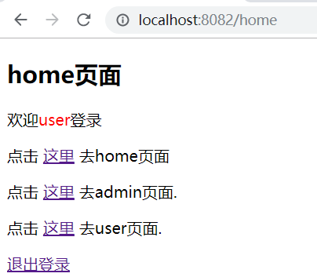
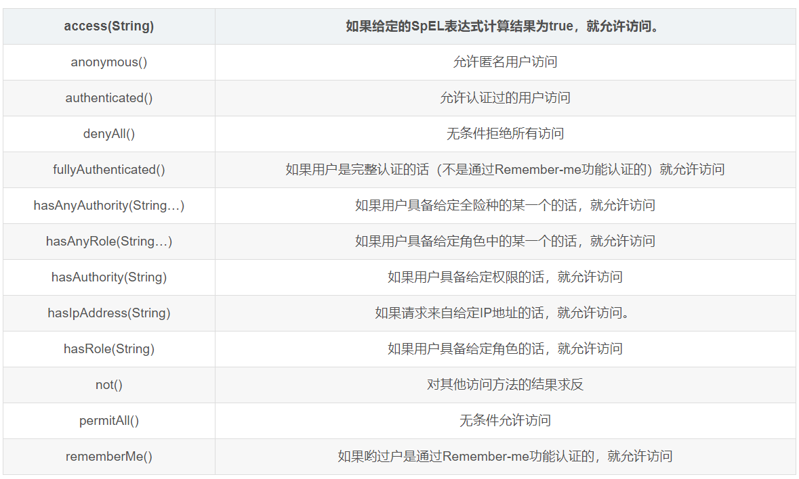

# SpringBoot整合SpringSecurity课件笔记

## 1、SpringSecurity简介

​		一个能够为基于Spring的企业应用系统提供声明式的安全訪问控制解决方式的安全框架（简单说是对访问权限进行控制嘛），应用的安全性包括用户认证（Authentication）和用户授权（Authorization）两个部分。用户认证指的是验证某个用户是否为系统中的合法主体，也就是说用户能否访问该系统。用户认证一般要求用户提供用户名和密码。系统通过校验用户名和密码来完成认证过程。用户授权指的是验证某个用户是否有权限执行某个操作。在一个系统中，不同用户所具有的权限是不同的。比如对一个文件来说，有的用户只能进行读取，而有的用户可以进行修改。一般来说，系统会为不同的用户分配不同的角色，而每个角色则对应一系列的权限。     spring   security的主要核心功能为 认证和授权，所有的架构也是基于这两个核心功能去实现的。

 **spring security 的核心功能主要包括：**

​	 认证 （你是谁）
​	授权 （你能干什么）
​	攻击防护 （防止伪造身份）

​     其核心就是一组过滤器链，项目启动后将会自动配置。最核心的就是 Basic Authentication Filter 用来认证用户的身份，一个在spring security中一种过滤器处理一种认证方式。


解析：Username Password Authentication Filter表示username password认证过滤器， 

```
会检查是否是一个登录请求；
是否包含username 和 password （也就是该过滤器需要的一些认证信息） ；
如果不满足则放行给下一个。
```

​		下一个按照自身职责判定是否是自身需要的信息，basic的特征就是在请求头中有 Authorization:Basic eHh4Onh4 的信息。中间可能还有更多的认证过滤器。最后一环是 FilterSecurityInterceptor，这里会判定该请求是否能进行访问rest服务，判断的依据是 BrowserSecurityConfig中的配置，如果被拒绝了就会抛出不同的异常（根据具体的原因）。Exception Translation Filter 会捕获抛出的错误，然后根据不同的认证方式进行信息的返回提示。
==注意：绿色的过滤器可以配置是否生效，其他的都不能控制。==

## 2、SpringSecurity快速入门

### 2.1 入门小demo案例

第一步，创建一个springboot工程，并且加入依赖坐标

```xml
 <parent>
        <groupId>org.springframework.boot</groupId>
        <artifactId>spring-boot-starter-parent</artifactId>
        <version>2.0.1.RELEASE</version>
    </parent>
    <dependencies>
        <dependency>
            <groupId>org.springframework.boot</groupId>
            <artifactId>spring-boot-starter-web</artifactId>
        </dependency>
        <dependency>
            <groupId>org.springframework.boot</groupId>
            <artifactId>spring-boot-starter-security</artifactId>
        </dependency>
    </dependencies>
```

==注意在pom.xml中引入security依赖，引入依赖后，项目的所有接口都会被保护起来。==

第二步，创建一个HelloContoller控制类

```java
package com.security.controller;

import org.springframework.web.bind.annotation.GetMapping;
import org.springframework.web.bind.annotation.RestController;

@RestController
public class HelloController {
    @GetMapping("/hello")
    public String hello() {
        return "hello";
    }
}

```

第三步，启动springboot入口类，并在浏览器上访问/hello

```java
package com.security;

import org.springframework.boot.SpringApplication;
import org.springframework.boot.autoconfigure.SpringBootApplication;

@SpringBootApplication
public class SecurityApplication {
    public static void main(String[] args) {
        SpringApplication.run(SecurityApplication.class,args);
    }
}

```

在浏览器上访问url:http://localhost:8080/hello,由于加入security权限控制，系统会直接跳转到登录页面


==注意：在默认情况下，用户名默认是user,密码在idea的控制台中会打印出随机字符串作为密码==

控制台打印随机密码截图：


如果输入的是错误的用户名和密码，则会显示：


如果说输入的是正确的，则会直接展示：


### 2.2 基于内存的用户自定义用户名和密码

配置用户名和密码方式有两种方式：

#### 第一种方式：

​		在application.yml或者application.properties文件配置

```properties
#配置端口号
server:
  port: 8080
#配置用户名和密码
spring:
  security:
    user:
      name: admin
      password: 123
```

第一种方式测试：

​	重新启动工程，访问：http://localhost:8080/hello

​	此时只能输入用户名:admin，密码：123才可以进去

#### 第二种方式(常用)：

第一步，创建一个Security配置类

```java
/*
权限控制配置类
 */
@Configuration
@EnableWebSecurity//可以不需要加
public class SecurityConfig extends WebSecurityConfigurerAdapter{
    /*
        重写configure方法，参数为AuthenticationManagerBuilder类型的
        目的是配置用户和角色
     */
    @Override
    protected void configure(AuthenticationManagerBuilder auth) throws Exception {
        auth.inMemoryAuthentication()//认证到内存中
                .withUser("lisi")//设置用户名
                .password("$2a$10$j1ZIQnzTX5z/Aw8q6cuRLOGGjn2y/I3EgHLLso4HMcgfYQ7lMOISG")//设置密码
                .roles("admin","user")//设置该用户拥有的角色
                .and()//连接关系符，和的关系
                .withUser("erzi")
                .password("$2a$10$j1ZIQnzTX5z/Aw8q6cuRLOGGjn2y/I3EgHLLso4HMcgfYQ7lMOISG")
                .roles("user");
    }
    //进行配置注入密码加密类
    @Bean
    public PasswordEncoder passwordEncoder(){
        return new BCryptPasswordEncoder();
    }
    //角色-资源 访问控制
    @Override
    protected void configure(HttpSecurity http) throws Exception {
        http.authorizeRequests()//http认证请求
                .antMatchers("/product/**").hasAnyRole("admin")//为当前请求路径赋予权限
                .antMatchers("/hello/**").hasRole("user")
                .anyRequest().authenticated()//所有请求都要经过认证
                .and()
                .formLogin()//而且支持基于from表单的登录
                .and()
                .httpBasic();//HTTPBasic方式的认证
    }
}
-----------------
 代码解析：	
 	本类中有两个重写的configure方法，
 		其中第一个configure方法，参数是AuthenticationManagerBuilder，是用来做认证的
 			案例中的用户名:lisi,密码是123，拥有的角色是admin和user两个角色
 			案例中的用户名:erzi,密码是123，拥有的角色是user一个角色
 		第二个configure方法，参数是HttpSecurity，是用来做授权的
 			请求以/product开头的url，必须经过认证，只允许拥有admin角色的用户访问
 			请求以/hello开头的url,也必须经过认证，只允许拥有user角色的用户访问
```

==注意：在当前配置类中加入了BCrypatPasswordEncoder进行密码加密操作，代码中的密码是加密之后的密文，相对应的明文都是123==

第二步，分别创建一个HelloController和ProductController

```java
@RestController
@RequestMapping("/hello")
public class HelloController {

    @GetMapping("/index")
    public String index() {
        return "hello security";
    }
}
------------------------------------------------
@RestController
@RequestMapping("/product")
public class ProductController {

    @GetMapping("/index")
    public String index() {
        return "welcome product";
    }
}
```

第三步，测试

​	重启工程，然后访问

利用lisi用户访问url :http://localhost:8080/product/index 和http://localhost:8080/hello/index请求的时候，可以直接放行进去

利用erzi用户访问url:http://localhost:8080/hello/index 请求可以放行进去，但是访问http://localhost:8080/product/index的时候，直接报403，没有权限


**关于@EnableWebSecurity注解的解析：**
		网上有很多文章说，开发spring security程序必须添加@EnableWebSecurity这个注解，否则不生效
但是也看到很多用springboot的并未明确写要开启这个配置，因此有点疑惑
其实说法都是正确的，

​		如果未加starter，的确要开启这个注解
​		如果添加了starter，那么就不需要了，以 spring-boot-starter-security为例，利用快捷键(ctrl+shift+N)搜索SecurityAutoConfiguration这个类中，看到导入WebSecurityEnablerConfiguration这个类
再次查看这个类，发现它带有@EnableWebSecurity注解


### 2.3 用户自定义登录页面

​			默认情况下，当用户没有登录就去访问受保护资源时，系统会默认请求/login（get方式），这时重定向到登录页（spring security自带）。当输入用户名密码点击登录按钮的时候，系统会请求/login(post方式)。现在我们希望自定义登录页面（默认的登录页面很丑），但是身份校验还是希望由security来进行。这时候我们只需要将登录页面重定向到我们自定义页面即可，这时候DIY表单，但是在这里切记一点。登录页面重定向的地址和表单提交的地址务必一致！

#### 第一步，自定义配置 AuthConfig

在原来的基础上扩展了DIY登录页面的控制器的设置


```java
 //角色-资源 访问控制
    @Override
    protected void configure(HttpSecurity http) throws Exception {
        http.authorizeRequests()//http认证请求
                .antMatchers("/product/**").hasAnyRole("admin")//为当前请求路径赋予权限
                .antMatchers("/hello/**").hasRole("user")
                .anyRequest().authenticated()//所有请求都要经过认证
                .and()
                .formLogin()//而且支持基于from表单的登录，默认页面
                .loginPage("/login")//跳转登录页面的控制器，该地址要保证和表单提交的地址一致！
                .permitAll()
                .and()
                .httpBasic()//HTTPBasic方式的认证
                .and()
                .csrf().disable(); //暂时禁用CSRF，否则无法提交表单
    }
```

#### 第二步，创建一个LoginController控制器类

```java
@Controller
public class LoginController {

    @GetMapping("/login")
    public String login(){
        return "login";
    }
}
```

#### 第三步，创建一个login.html页面

```html
<!DOCTYPE html>
<html lang="en">
<head>
    <meta charset="UTF-8">
    <title>自定义登录页面</title>
</head>
<body>
<h2>自定义登录页面</h2>
<hr>
<form action="/login" method="POST" name="f">
    用户名<input type="text" name="username"/> <br>
    密码 <input type="password" name="password"> <br>
    <input type="submit" value="登录">
</form>
</body>
</html>
------
注意：用户名的name值必须是username，密码的name值必须是password
```

#### 第四步，加入thymeleaf依赖坐标

```xml
 <!--thymeleaf依赖-->
        <dependency>
            <groupId>org.springframework.boot</groupId>
            <artifactId>spring-boot-starter-thymeleaf</artifactId>
        </dependency>
```

#### 第五步，测试

在浏览器url:http://localhost:8080/hello/index，自动跳转到 自定义页面，然后输入用户名和密码进行跳转


## 3、基于数据库表进行认证的用户名和密码

创建一个springboot工程


### 3.1 准备工作

#### 1，加入依赖坐标

```xml
    <parent>
        <groupId>org.springframework.boot</groupId>
        <artifactId>spring-boot-starter-parent</artifactId>
        <version>2.0.1.RELEASE</version>
    </parent>
    <dependencies>
        <dependency>
            <groupId>org.springframework.boot</groupId>
            <artifactId>spring-boot-starter-web</artifactId>
        </dependency>
        <dependency>
            <groupId>org.springframework.boot</groupId>
            <artifactId>spring-boot-starter-security</artifactId>
        </dependency>
        <dependency>
            <groupId>org.springframework.boot</groupId>
            <artifactId>spring-boot-starter-test</artifactId>
        </dependency>
        <!--thymeleaf依赖-->
        <dependency>
            <groupId>org.springframework.boot</groupId>
            <artifactId>spring-boot-starter-thymeleaf</artifactId>
        </dependency>
        <dependency>
            <groupId>org.projectlombok</groupId>
            <artifactId>lombok</artifactId>
            <optional>true</optional>
        </dependency>
        <!--Spring Boot热加载 -->
        <dependency>
            <groupId>org.springframework.boot</groupId>
            <artifactId>spring-boot-devtools</artifactId>
            <optional>true</optional>
        </dependency>
        <!--JDBC-->
        <dependency>
            <groupId>mysql</groupId>
            <artifactId>mysql-connector-java</artifactId>
            <version>5.1.6</version>
        </dependency>
        <!--spring-data-jpa-->
        <dependency>
            <groupId>org.springframework.boot</groupId>
            <artifactId>spring-boot-starter-data-jpa</artifactId>
        </dependency>
        <dependency>
            <groupId>org.apache.commons</groupId>
            <artifactId>commons-lang3</artifactId>
            <version>3.8.1</version>
        </dependency>
    </dependencies>
```

#### 2，创建sql脚本

```sql
SET FOREIGN_KEY_CHECKS=0;

-- ----------------------------
-- Table structure for `user`
-- ----------------------------
DROP TABLE IF EXISTS `user`;
CREATE TABLE `user` (
  `Id` int(11) NOT NULL AUTO_INCREMENT,
  `userName` varchar(255) DEFAULT NULL COMMENT '姓名',
  `password` varchar(255) DEFAULT NULL COMMENT '密码',
  `roles` varchar(255) DEFAULT NULL,
  PRIMARY KEY (`Id`)
) ENGINE=MyISAM AUTO_INCREMENT=4 DEFAULT CHARSET=utf8 COMMENT='用户表';

-- ----------------------------
-- Records of user
-- ----------------------------
INSERT INTO `user` VALUES ('1', 'ouyang', 'bbd126f4856c57f68d4e30264da6a4e6', 'ROLE_ADMIN,ROLE_USER');
INSERT INTO `user` VALUES ('2', 'admin', 'bbd126f4856c57f68d4e30264da6a4e6', 'ROLE_ADMIN');
INSERT INTO `user` VALUES ('3', 'user', 'bbd126f4856c57f68d4e30264da6a4e6', 'ROLE_USER');

```

#### 3，创建实体

```java
package com.sercurity.domain;

import lombok.Data;
import org.hibernate.annotations.GenericGenerator;

import javax.persistence.*;
import java.io.Serializable;

/**用户实体类
 */
@Data
@Entity
@Table(name = "user")
public class UserInfo implements Serializable {

    @Id
    @GeneratedValue(strategy = GenerationType.IDENTITY)
    private long id ;
    @Column(name = "username")
    private String userName;

    private String password;

    private String roles;
}
```

#### 4，创建application.yml

```properties
server:
  port: 8082

spring:
    datasource:
        url: jdbc:mysql://127.0.0.1:3306/users_role
        username: root
        password: 123
        driver-class-name: com.mysql.jdbc.Driver
        druid:
            initialSize: 1
            minIdle: 1
            maxActive: 50
            maxWait: 6000
            timeBetweenEvictionRunsMillis: 6000
            minEvictableIdleTimeMillis: 30000
            testWhileIdle: true
            testOnBorrow: true
            testOnReturn: true
            validationQuery: SELECT 1 from dual
            connectionProperties: config.decrypt=false
```

### 3.2 前台页面


#### 1，home.html

```html
<!DOCTYPE HTML>
<html xmlns="http://www.w3.org/1999/xhtml" xmlns:th="http://www.thymeleaf.org"
xmlns:sec="http://www.thymeleaf.org/thymeleaf-extras-springsecurity3">
<head>
    <title>home页面</title>
</head>
<body>
<h2>home页面</h2>
<p>点击 <a th:href="@{/home}">这里</a> 去home页面</p>
<p>点击 <a th:href="@{/admin}">这里</a> 去admin页面.</p>
<p>点击 <a th:href="@{/user}">这里</a> 去user页面.</p>
<p> <a th:href="@{/logout}">退出登录</a></p>
</body>
</html>
```

#### 2，login.html

```html
<!DOCTYPE html>
<html xmlns="http://www.w3.org/1999/xhtml" xmlns:th="http://www.thymeleaf.org"
      xmlns:sec="http://www.thymeleaf.org/thymeleaf-extras-springsecurity3">
<head>
    <title>登录页面</title>
</head>
<body>
<div th:if="${param.error}" style="color: red;">
    Invalid username and password.
</div>
<div th:if="${param.logout}" style="color: red;">
    You have been logged out.
</div>
<form th:action="@{/login}" method="post">
    <div><label> User Name : <input type="text" name="username"/> </label></div>
    <div><label> Password: <input type="password" name="password"/> </label></div>
    <div><input type="submit" value="submit"/>
        <input type="reset" value="reset"/></div>
</form>
<p>点击 <a th:href="@{/home}">这里</a> 去home页面.</p>
</body>
</html>
```

#### 3，admin.html

```html
<!DOCTYPE HTML>
<html>
<head>
    <title>amdin</title>
</head>
<body>
<h2>admin</h2>
<p> <a th:href="@{/logout}">logout</a></p>
<p>Click <a th:href="@{/home}">here</a> go to home page.</p>
</body>
</html>
```

#### 4，user.html

```html
<!DOCTYPE HTML>
<html>
<head>
    <title>user</title>
</head>
<body>
<h2>user</h2>
<p> <a th:href="@{/logout}">logout</a></p>
<p>Click <a th:href="@{/home}">here</a> go to home page.</p>
</body>
</html>
```

### 3.3 后台代码

#### 1，创建dao

```java
package com.sercurity.dao;

import com.sercurity.domain.UserInfo;
import org.springframework.data.jpa.repository.JpaRepository;

public interface UserDao extends JpaRepository<UserInfo,Long>{
    //根据用户名查询实体
    public UserInfo findByUserName(String username);
}

```

#### 2，创建security配置类

```java
package com.sercurity.config;

import org.springframework.context.annotation.Bean;
import org.springframework.context.annotation.Configuration;
import org.springframework.security.config.annotation.authentication.builders.AuthenticationManagerBuilder;
import org.springframework.security.config.annotation.web.builders.HttpSecurity;
import org.springframework.security.config.annotation.web.configuration.WebSecurityConfigurerAdapter;
import org.springframework.security.crypto.bcrypt.BCryptPasswordEncoder;
import org.springframework.security.crypto.password.PasswordEncoder;
import org.springframework.security.web.util.matcher.AntPathRequestMatcher;

/*
security配置类
 */
@Configuration
public class WebSecurityConfig extends WebSecurityConfigurerAdapter{

    @Bean
    public PasswordEncoder passwordEncoder(){
        return new BCryptPasswordEncoder();
    }

    @Override
    protected void configure(HttpSecurity http) throws Exception {
        http.authorizeRequests()
                //不需要认证，直接放行的资源
                .antMatchers("/", "/home","/toLogin","/**/customer/**").permitAll()
                .antMatchers("/js/**", "/css/**", "/images/**", "/fronts/**", "/doc/**", "/toLogin").permitAll()
                //访问/user请求的资源，必须是USER角色
                .antMatchers("/user/**").hasAnyRole("USER")
                .antMatchers("/**").access("hasRole('ADMIN')")
                .anyRequest().authenticated()
                //自定义登录界面
                .and().formLogin().loginPage("/toLogin").loginProcessingUrl("/login").failureUrl("/toLogin?error").permitAll()
                .and().logout().logoutRequestMatcher(new AntPathRequestMatcher("/logout"))
                .and().exceptionHandling().accessDeniedPage("/toLogin?deny")
                .and().httpBasic()
                .and().sessionManagement().invalidSessionUrl("/toLogin")
                .and().csrf().disable();
    }
}

```

#### 3，创建控制器

方式一：创建Controller类形式

```java
package com.sercurity.controller;

import org.springframework.stereotype.Controller;
import org.springframework.web.bind.annotation.GetMapping;

@Controller
public class SecurityController {

    @GetMapping(value = {"/","/home"})
    public String home(){
        return "home";
    }
    @GetMapping("/toLogin")
    public String login(){
        return "login";
    }
    @GetMapping("/user")
    public String user(){
        return "/user/user";
    }
    @GetMapping("/admin")
    public String admin(){
        return "/admin/admin";
    }

}

```

方式二：创建配置类形式

```java
@Configuration
public class WebMvcConfig extends WebMvcConfigurationSupport {

    @Override
    protected void addViewControllers(ViewControllerRegistry registry) {
        registry.addViewController("/").setViewName("home");
        registry.addViewController("/home").setViewName("home");
        registry.addViewController("/toLogin").setViewName("login");
        registry.addViewController("/user").setViewName("user/user");
        registry.addViewController("/admin").setViewName("admin/admin");
    }
}
```

### 3.4 测试

#### 测试1.

​		首先在浏览器中输入url：http://localhost:8082

发现可以直接看到页面数据信息，原因是：

​	1.我们在配置中对“/”进行了不拦截放行设置

​	2.当访问"/"的时候直接访问的是home.html页面内容

​	3.点击这里去home页面链接也是直接放行，不拦截


#### 测试2：

​	点击这里去admin页面，会发现系统直接进行了拦截，然后重定向到登录页面login.html

解析：

​	1.之所以被拦截，是因为我们在配置中设置了拦截，而且发现security中没有登录的用户信息


#### 测试3：

​	测试输入用户名和密码进行登录，采用拥有角色admin和user的账户执行测试。

发现可以进来，说明执行了UserService的业务，具体的执行过程可以进行debug调试。


如果使用user角色的账户执行进入admin.html页面测试


则发现还是停留在当前页面上，没有进入，说明没有权限报302状态码


## 4、用户名显示

第一步，在controller类中加入Authentication认证接口类

```java
 @GetMapping(value = {"/","/home"})
    public String home(Authentication authentication, ModelMap map){
        if(authentication!=null){
            map.put("username",authentication.getName());
        }
        return "home";
    }
    @GetMapping("/user")
    public String user(Authentication authentication, ModelMap map){
        map.put("username",authentication.getName());
        return "/user/user";
    }
    @GetMapping("/admin")
    public String admin(Authentication authentication, ModelMap map){
        map.put("username",authentication.getName());
        return "/admin/admin";
    }
```

第二步，home.html

```
<p th:if="${username}!=null">欢迎<font color="red" th:text="${username}"></font>登录</p>
```

第三步，user.html

```
<p>欢迎<font color="red" th:text="${username}"></font>登录</p>
```

第四步，admin.html

```
<p>欢迎<font color="red" th:text="${username}"></font>登录</p>
```

第五步，测试



## 5、退出登录

### 5.1，在页面上加入退出登录的链接

```html
<p> <a th:href="@{/logout}">退出登录</a></p>
```

### 5.2，在配置文件中加入退出登录配置

```java
.and().logout().logoutRequestMatcher(new AntPathRequestMatcher("/logout"))
```


### 5.3，测试退出登录

点击“退出登录”或者“logout”按钮，则会直接执行security的退出操作。直接跳转到登录页面。


## 6、启用Remember-me功能(待定)

​		站在用户的角度来讲，如果应用程序不用每次都提示他们登录是更好的。这就是为什么许多站点提供了Remember-me功能。你只要登录过一次，应用就会记住你。 
  Spring Security使得为应用添加Remember-me功能变得非常容易。只需要在configure()方法所传入的HttpSecurity对象上调用rememberMe()即可。

在用户登陆一次以后，系统会记住用户一段时间，在这段时间，用户不用反复登陆就可以使用我们的系统。

第一步，在login.html页面中加入

```html
<div><input id="remember_me" name="remember-me" type="checkbox"/>
        <label for="remember_me" class="inline">Remember me</label></div>
```

第二步，配置security配置

```
//开启rememberme功能
                .and().rememberMe().tokenValiditySeconds(2419200).key("spittrKey")
```


第三步，在userService注解上加上注解名称


第四步，在security配置WebSecurityConfig类中加入注入UserDeatilService

```
 @Autowired
    UserService userDetailsService;

    //解决rem
    @Autowired
    public void configureGlobal(AuthenticationManagerBuilder auth) {
        // 在这里将 UserDetailsSercie 实例注入
        try {
            auth.userDetailsService(userDetailsService);
        } catch (Exception e) {
            e.printStackTrace();
        }
    }
```


第六步，测试


## 附件：

​	附件1：拦截请求定义保护路径的配制方法



