# Springboot,SpringSecurity整合CAS课件笔记

## 学习CAS

### 一、搭建单点登录服务端，开发单点登录客户端 

#### 1.什么是单点登录 

[		单点登录](http://baike.baidu.com/item/单点登录)[（](http://baike.baidu.com/item/单点登录)Single Sign On），简称为 SSO，是目前比较流行的企业业务整合的解决方案之一。SSO 的定义是在多个应用系统中，用户只需要登录一次就可以访问所有相互信任的应用系统。 

​		我们目前的系统存在诸多子系统，而这些子系统是分别部署在不同的服务器中，那么使用传统方式的 session 是无法解决的，我们需要使用相关的单点登录技术来解决。 

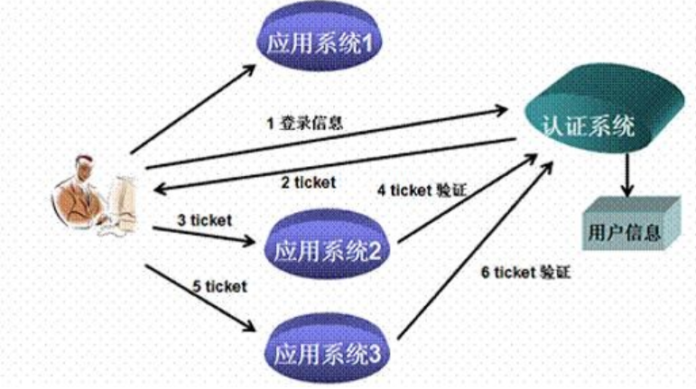

#### 2.什么是 CAS 

​		CAS 是 Yale 大学发起的一个开源项目，旨在为 Web 应用系统提供一种可靠的单点登录方法，CAS 在 2004 年 12 月正式成为 JA-SIG 的一个项目。CAS 具有以下特点： 

【1】开源的企业级单点登录解决方案。 

【2】CAS Server 为需要独立部署的 Web 应用。 

【3】CAS Client 支持非常多的客户端(这里指单点登录系统中的各个 Web 应用)，包括 Java, .Net, PHP, Perl, Apache, uPortal, Ruby 等。 

​		从结构上看，CAS 包含两个部分： CAS Server 和 CAS Client。CAS Server 需要独立部署，主要负责对用户的认证工作；CAS Client 负责处理对客户端受保护资源的访问请求，需要登录时，重定向到 CAS Server。下图是 CAS 最基本的协议过程： 

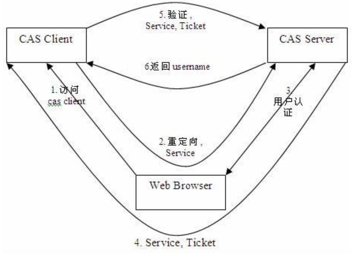

SSO 单点登录访问流程主要有以下步骤： 

\1.   访问服务：SSO 客户端发送请求访问应用系统提供的服务资源。 

\2.   定向认证：SSO 客户端会重定向用户请求到 SSO 服务器。 

\3.   用户认证：用户身份认证。 

\4.   发放票据：SSO 服务器会产生一个随机的 Service Ticket。 

\5.   验证票据：SSO 服务器验证票据 Service Ticket 的合法性，验证通过后，允许客户端访问服务。 

\6.   传输用户信息：SSO服务器验证票据通过后，传输用户认证结果信息给客户端。

#### 3.CAS 服务端部署 

Cas 服务端其实就是一个 war 包。 

在资料\cas\source\cas-server-4.0.0-release\cas-server-4.0.0\modules 目录下 

cas-server-webapp-4.0.0.war  将其改名为 cas.war 放入 tomcat 目录下的 webapps 下。启动 tomcat 自动解压 war 包。浏览器输入 http://localhost:8080/cas/login  ，可看到登录页面 

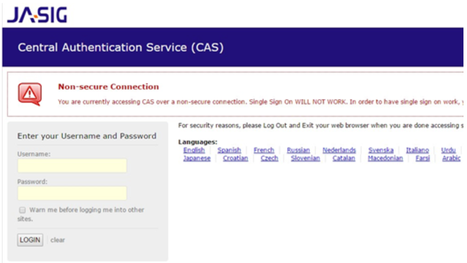

不要嫌弃这个页面丑，我们后期可以再提升它的颜值。暂时把注意力放在功能实现上。 

这里有个固定的用户名和密码  ==casuser /Mellon==

登录成功后会跳到登录成功的提示页面 

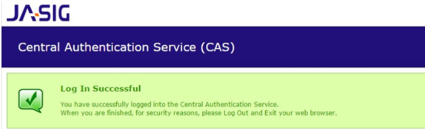

可以更改用户名和密码：

在cas/WEB-INF/deployerConfigContext.xml中修改

找到下面配置

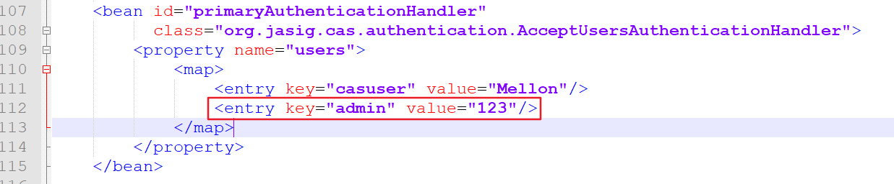

那么接下来就可以使用admin和123来测试登录cas服务器端

#### 4.CAS 服务端配置 

##### **4.1** 端口修改 

如果我们不希望用 8080 端口访问 CAS, 可以修改端口 

（1）修改 TOMCAT 的端口 

打开 tomcat 目录 conf\server.xml  找到下面的配置 ,将端口8080，改为9100

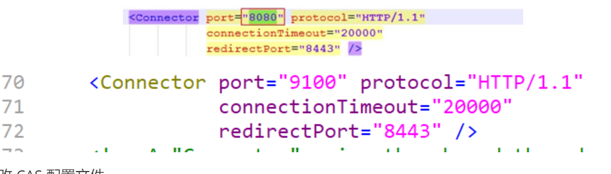

2）修改 CAS 配置文件 

修改 cas 的 WEB-INF/cas.properties 

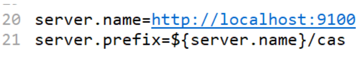

#### 5.去除 **https** 认证 

​		CAS 默认使用的是 HTTPS 协议，如果使用 HTTPS 协议需要 SSL 安全证书（需向特定的机构申请和购买） 。如果对安全要求不高或是在开发测试阶段，可使用 HTTP 协议。我们这里讲解通过修改配置，让 CAS 使用 HTTP 协议。 

（1）修改 cas 的 WEB-INF/deployerConfigContext.xml 

找到下面的配置 

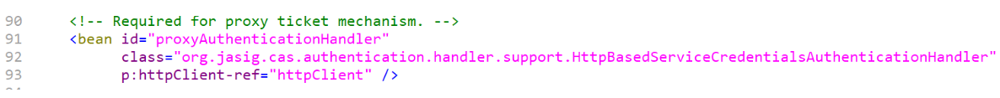

这里需要增加参数p:requireSecure="false"，requireSecure 属性意思为是否需要安全验证，即 HTTPS，false 为不采用

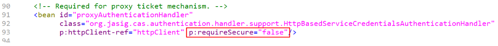

(2) 修改 cas的/WEB-INF/[**spring**](http://lib.csdn.net/base/javaee)[-](http://lib.csdn.net/base/javaee)configuration/ticketGrantingTicketCookieGenerator.xml找到下面配置

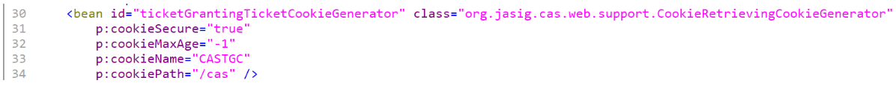

参数 p:cookieSecure="true"，同理为 HTTPS 验证相关，TRUE 为采用 HTTPS 验证，FALSE 为不采用 https 验证。 

参数 p:cookieMaxAge="-1"，是 COOKIE 的最大生命周期，-1 为无生命周期，即只在当前打开

的窗口有效，关闭或重新打开其它窗口，仍会要求验证。可以根据需要修改为大于 0 的数字，比如 3600 等，意思是在 3600 秒内，打开任意窗口，都不需要验证。 

我们这里将 cookieSecure 改为 false ,  cookieMaxAge 改为 3600 

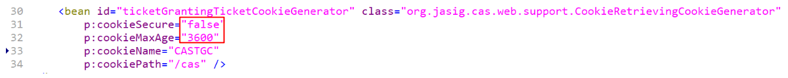

（3）修改 cas 的 WEB-INF/spring-configuration/warnCookieGenerator.xml 

找到下面配置 

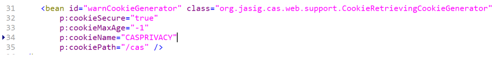

我们这里将 cookieSecure 改为 false,  cookieMaxAge 改为 3600

#### 6.CAS 客户端入门小 Demo 

##### **6.1** 客户端工程 **1** 搭建 

1、创建springboot工程cas_client1并加入依赖坐标

```xml
 <parent>
        <groupId>org.springframework.boot</groupId>
        <artifactId>spring-boot-starter-parent</artifactId>
        <version>2.0.1.RELEASE</version>
    </parent>
    <dependencies>
        <!--web场景启动器，包含 Tomcat 和 spring-mvc restful  aop jackjson支持。 -->
        <dependency>
            <groupId>org.springframework.boot</groupId>
            <artifactId>spring-boot-starter-web</artifactId>
        </dependency>
        <!-- CAS第三方依赖包 -->
        <dependency>
            <groupId>net.unicon.cas</groupId>
            <artifactId>cas-client-autoconfig-support</artifactId>
            <version>1.5.0-GA</version>
        </dependency>
    </dependencies>
```

2、配置application.yml

```properties
server:
  port: 9200
cas:
  server-url-prefix: http://127.0.0.1:9100/cas
  server-login-url: http://127.0.0.1:9100/cas/login
  client-host-url: http://127.0.0.1:9200
  validation-type: cas
```

3、创建引导类

```java
@SpringBootApplication
public class CasApplication {
    public static void main(String[] args) {
        SpringApplication.run(CasApplication.class,args);
    }
}
```

4、创建配置类

```java
package com.cas.config;

import net.unicon.cas.client.configuration.CasClientConfigurerAdapter;
import net.unicon.cas.client.configuration.EnableCasClient;
import org.springframework.boot.web.servlet.FilterRegistrationBean;
import org.springframework.context.annotation.Configuration;

@Configuration
@EnableCasClient//开启cas支持
public class CasConfigure extends CasClientConfigurerAdapter {
    @Override
    public void configureAuthenticationFilter(FilterRegistrationBean authenticationFilter) {
        authenticationFilter.getInitParameters().put("authenticationRedirectStrategyClass","com.patterncat.CustomAuthRedirectStrategy");
    }
}

```

5、创建一个控制类

```java
package com.cas.controller;

import org.springframework.boot.SpringApplication;
import org.springframework.web.bind.annotation.GetMapping;
import org.springframework.web.bind.annotation.RestController;

@RestController
public class CasController  {

    @GetMapping("/login")
    public String index(){
        return "login Success";
    }
}

```

##### 6.2客户端工程 **2** 搭建 

创建方式如客户端工程1一样，只是要修改一下application.yml

```properties
server:
  port: 9300
cas:
  server-url-prefix: http://127.0.0.1:9100/cas
  server-login-url: http://127.0.0.1:9100/cas/login
  client-host-url: http://127.0.0.1:9300
  validation-type: cas
```


#### 7.单点登录测试 

第一步，首先启动cas的tomcat---9100端口

第二步，访问url:http://localhost:9200/login 请求，则会发现没有登录，直接跳转到cas登录页面

然后输入用户名和密码，才能展示login Success字样。

第三步，再打开一个窗口，访问url:http://localhost:9300/login请求，则会发现不需要跳转到cas登录页面了，而是直接看到了login Success字样，说明两个系统已经共享了session，达到了单点登录的效果。

#### 8.单点退出登录 

在cas_client2或者cas_client1工程中加入退出的controller

```java
@Controller
public class LogoutController {

    @RequestMapping("/logoutDefault")
    public String logout1(HttpSession session) {
        session.invalidate();
        // 直接退出，走默认退出方式
        return "redirect:http://127.0.0.1:9100/cas/logout";
    }
 }
```


### 二、实现 CAS 认证数据源设置 


### 三、更换 CAS 登录页面 


## 掌握 CAS 与 SpringSecurity 集成  


