# 第一章 环境搭建

## 学习目标：

- 能够描述黑马头条项目有哪些业务
- 能够了解黑马头条项目使用到什么技术
- 能够了解黑马头条数据库设计过程
- 能够掌握初始化工程的搭建
- 能够掌握接口开发的流程
- 能够完成频道管理的功能开发
- 能够掌握使用接口swagger、postman、knife4j


## 1 项目介绍

### 1.1项目背景

​		随着智能手机的普及，人们更加习惯于通过手机来看新闻。由于生活节奏的加快，很多人只能利用碎片时间来获取信息，因此，对于移动资讯客户端的需求也越来越高。黑马头条项目正是在这样背景下开发出来。黑马头条项目采用当下火热的微服务+大数据技术架构实现。本项目主要着手于获取最新最热新闻资讯，通过大数据分析用户喜好精确推送咨询新闻


### 1.2 项目概述

黑马头条项目是对在新闻类平台业务进行大数据统计分析的系统。碎片化、切换频繁、社交化和个性化现如今成为人们阅读行为的标签。黑马头条对海量信息进行搜集，通过系统计算分类，分析用户的兴趣进行推送从而满足用户的需求。


### 1.3 项目术语定义

- 项目：泛指黑马头条整个项目或某一项目模块
- 工程：泛指黑马头条某一项目的源码工程


- 用户：泛指黑马头条APP用户端用户
- 自媒体人：泛指通过黑马自媒体系统发送文章的用户
- 管理员：泛指黑马头条管理系统的使用用户


- App：泛指黑马头条APP
- WeMedia：泛指黑马头条自媒体系统
- Admin：泛指黑马头条管理系统

## 2 需求说明

### 2.1 功能架构图


### 2.2 APP主要功能大纲

- 频道栏：用户可以通过此功能添加自己感兴趣的频道，在添加标签时，系统可依据用户喜好进行推荐
- 文章列表：需要显示文章标题、文章图片、评论数等信息，且需要监控文章是否在APP端展现的行为

- 搜索文章：联想用户想搜索的内容，并记录用户的历史搜索信息
- 个人中心：用户可以在其个人中心查看收藏、关注的人、以及系统设置等功能
- 查看文章：用户点击文章进入查看文章页面，在此页面上可进行点赞、评论、不喜欢、分享等操作；除此之外还需要收集用户查看文章的时间，是否看我等行为信息

- 实名认证：用户可以进行身份证认证和实名认证，实名认证之后即可成为自媒体人，在平台上发布文章
- 注册登录：登录时，验证内容为手机号登录/注册，通过手机号验证码进行登录/注册，首次登录用户自动注册账号。

### 2.3 自媒体端功能大纲

- 内容管理：自媒体用户管理文章页面，可以根据条件进行筛选，文章包含草稿、已发布、未通过、已撤回状态。用户可以对文章进行修改，上/下架操作、查看文章状态等操作
- 评论管理：管理文章评论页面，显示用户已发布的全部文章，可以查看文章总评论数和粉丝评论数，可以对文章进行关闭评论等操作

- 素材管理：管理自媒体文章发布的图片，便于用户发布带有多张图片的文章

- 图文数据：自媒体人发布文章的数据：阅读数、评论数、收藏了、转发量，用户可以查看对应文章的阅读数据
- 粉丝画像：内容包括：粉丝性别分布、粉丝年龄分布、粉丝终端分布、粉丝喜欢分类分布

### 2.4 平台管理端功能大纲

- 用户管理：系统后台用来维护用户信息，可以对用户进行增删改查操作，对于违规用户可以进行冻结操
- 用户审核：管理员审核用户信息页面，用户审核分为身份审核和实名审核，身份审核是对用户的身份信息进行审核，包括但不限于工作信息、资质信息、经历信息等；实名认证是对用户实名身份进行认证

- 内容管理：管理员查询现有文章，并对文章进行新增、删除、修改、置顶等操作
- 内容审核：管理员审核自媒体人发布的内容，包括但不限于文章文字、图片、敏感信息等
- 频道管理：管理频道分类界面，可以新增频道，查看频道，新增或修改频道关联的标签
- 网站统计：统计内容包括：日活用户、访问量、新增用户、访问量趋势、热门搜索、用户地区分布等数据
- 内容统计：统计内容包括：文章采集量、发布量、阅读量、阅读时间、评论量、转发量、图片量等数据
- 权限管理：超级管理员对后台管理员账号进行新增或删除角色操作

### 2.5 其它需求


### 2.6 交互需求


## 3 技术结构图

包括前端（Weex、Vue、Echarts、WS）、网关（GateWay）、DevOps（单元测试、代码规范）

服务层中包括中间件（Kafka）、索引、微服务、大数据存储等重难点技术


- Weex+Vue+WebSocket ：使用Weex跨平台开发工具，整合集成VUE框架，完成黑马头条移动端功能开发，并集成WebSocket实现即时消息（文章推荐、私信）的推送
- Vue+Echarts ： 自媒体系统使用Vue开发关键，集成Echarts图表框架，完成相关粉丝画像、数据分析等功能
- Vue+Echarts+WebSocket ： 管理系统也是使用Vue开发，集成Echarts，完成网站统计、内容统计等功能，集成WebSocket，实现系统看板实时数据自动化更新
- Spring-Cloud-Gateway : 微服务之前架设的网关服务，实现服务注册中的API请求路由，以及控制流速控制和熔断处理都是常用的架构手段，而这些功能Gateway天然支持
- PMD&P3C : 静态代码扫描工具，在项目中扫描项目代码，检查异常点、优化点、代码规范等，为开发团队提供规范统一，提升项目代码质量
- Junit : 在持续集成思想中，单元测试偏向自动化过程，项目通过Junit+Maven的集成实现这种过程
- 运用Spring Boot快速开发框架，构建项目工程；并结合Spring Cloud全家桶技术，实现后端个人中心、自媒体、管理中心等微服务。
- 运用WebMagic爬虫技术，完善系统内容自动化采集
- 运用Kafka完成内部系统消息通知；与客户端系统消息通知；以及实时数据计算
- 运用MyCat数据库中间件计算，对系统数据进行分开分表，提升系统数据层性能
- 运用Redis缓存技术，实现热数据的计算，NoSession等功能，提升系统性能指标
- 运用Zoookeeper技术，完成大数据节点之后的协调与管理，提升系统存储层高可用
- 使用Mysql存储用户数据，以保证上层数据查询的高性能
- 使用Mongo存储用户热数据，以保证用户热数据高扩展和高性能指标
- 使用FastDFS作为静态资源存储器，在其上实现热静态资源缓存、淘汰等功能
- 运用Habse技术，存储系统中的冷数据，保证系统数据的可靠性
- 运用ES搜索技术，对冷数据、文章数据建立索引，以保证冷数据、文章查询性能
- 运用Sqoop、Kettle等工具，实现大数据的离线入仓；或者数据备份到Hadoop
- 运用Spark+Hive进行离线数据分析，实现系统中各类统计报表
- 运用Spark Streaming + Hive+Kafka实现实时数据分析与应用；比如文章推荐
- 运用Neo4j知识图谱技术，分析数据关系，产出知识结果，并应用到上层业务中，以帮助用户、自媒体、运营效果/能力提升。比如粉丝等级计算
- 运用AI技术，来完成系统自动化功能，以提升效率及节省成本。比如实名认证自动化

## 4 数据库设计

### 4.1 ER图设计

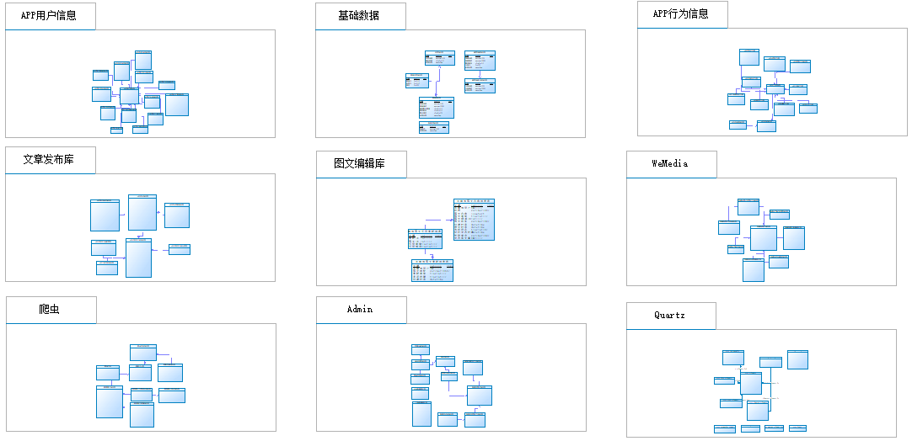

er图设计划分出了9个库，各个库主要解决的是某一个特定的业务。

数据库设计规范，详见资料文件夹下《黑马头条-数据库规范设计说明书.md》文件。

PowerDesinger工具使用，详见资料文件夹下'powerdesinger的基本使用'文件夹里的《powerdesinger的基本使用》文件。

### 4.2 分库设计

​		黑马头条项目采用的分库分表设计，因为业务比较复杂，后期的访问量巨大，为了分摊数据库的压力，整个项目用的不只是一个数据库。其中核心库有**5**个，每一个数据库解决的是一个业务点，非常接近与实际项目设计。

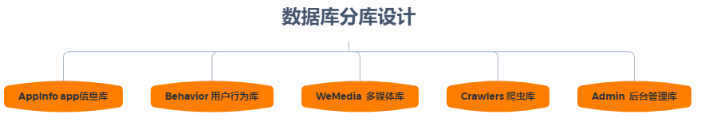

- AppInfo  app信息库，主要存储用户信息，文章信息，用户动态，用户评论，用户认证等信息
- Behavior  用户行为库，主要存储用户行为，包括用户的转发，点赞，评论行为等
- WeMedia  多媒体库，主要存储多媒体人图文数据统计，账号信息，粉丝相关信息等。
- Crawlers  爬虫库，主要存储从网络上爬取的文章信息等。
- Admin  后台管理库，主要存储后台管理员的信息。

### 4.3 核心数据流转图


> 说明：整个项目其核心数据为文章信息，上图主要说明文章的数据流转
>
> 1 爬虫系统从外网采集数据后入**爬虫库**，即爬虫库中保存了一份采集的文章信息
>
> 2 自媒体人可以通过发布文章后首先进入**自媒体库**
>
> 3 爬虫文章和自媒体文章最后都要经过审核成功后入**appinfo库**，这里面的文章信息，最终是要给app端用户所查看
>
> 4 在app端用户查看的时候，需要记录用户的一些行为，如转发、评论、点赞等需要入**用户行为库**

### 4.4 冗余设计

​		黑马头条项目全部采用逻辑关联，没有采用主外键约束。也是方便数据源冗余，尽可能少的使用多表关联查询。冗余是为了效率，减少join。单表查询比关联查询速度要快。某个访问频繁的字段可以冗余存放在两张表里，不用关联了。

​		如查询一个订单表需要查询该条订单的用户名称，就必须join另外用户表，如果业务表很大，那么就会查询的很慢，这个时候我们就可以使用冗余来解决这个问题，在新建订单的同时不仅仅需要把用户ID存储，同时也需要存储用户的名称，这样我们在查询订单表的时候就不需要去join另外用户表，也能查询出该条订单的用户名称。这样的冗余可以直接的提高查询效率，单表更快。

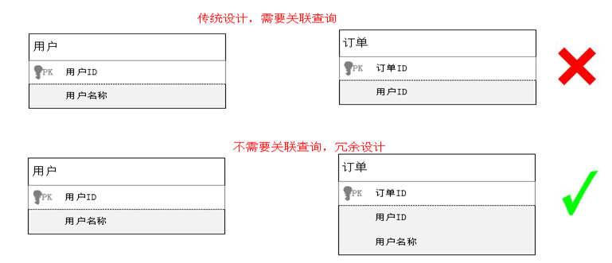

### 4.5 导入数据库

当天资料文件夹下：数据库脚本

## 5 初始工程搭建

### 5.1 主体结构说明

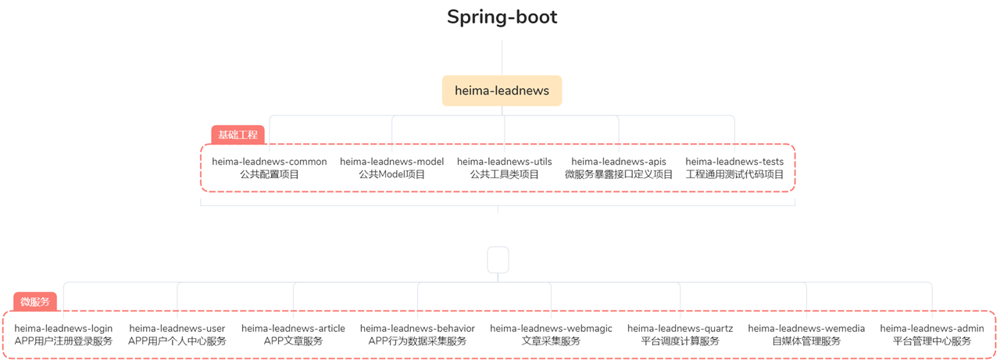

后端工程基于Spring-boot 2.1.5.RELEASE 版本构建，工程父项目为heima-leadnews，并通过继承方式集成Spring-boot。

【父项目下分4个公共子项目】：

- heima-leadnews-common : 是整个工程的配置核心，包括所有集成三方框架的配置定义，比如redis、kafka等。除此之外还包括项目每个模块及整个项目的常量定义和枚举;
- heima-leadnews-model ：项目中用到的Dto、Pojo，Vo定义工程;
- heima-leadnews-utils : 工程公用工具类项目，包含加密/解密、Date、JSON等工具类;
- heima-leadnew-apis : 整个项目微服务暴露的接口的定义项目，按每个模块进行子包拆分;

【多个微服务】：

- heima-leadnews-login：用于实现APP+自媒体端用户的登录与注册功能；

- heima-leadnews-user：用于实现APP端用户中心的功能，比如我的收藏、我的粉丝等功能；

- heima-leadnews-article：用于实现APP端文章的获取与搜索等功能；还包括频道、标签等功能；

- heima-leadnews-behavior：用于实现APP端各类行为数据的上传服务；

  

- heima-leadnews-quartz：用于封装项目中所有的调度计算任务；

- heima-leadnews-wemedia：用于实现自媒体管理端的功能；

- heima-leadnews-admin：用于实现后台管理系统的功能；

- heima-leadnews-gateway：网关

### 5.2 后端通用工程搭建

#### 5.2.1 开发环境说明

项目依赖环境（需提前安装好）：

- JDK1.8
- Intellij Idea
- Tomcat 8.5
- Git

#### 5.2.2 IDEA开发工具配置

- 设置本地仓库，建议使用资料中提供好的仓库

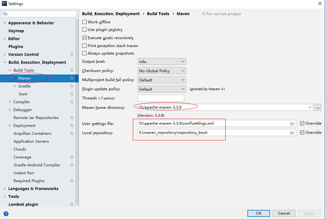


- 设置项目编码格式

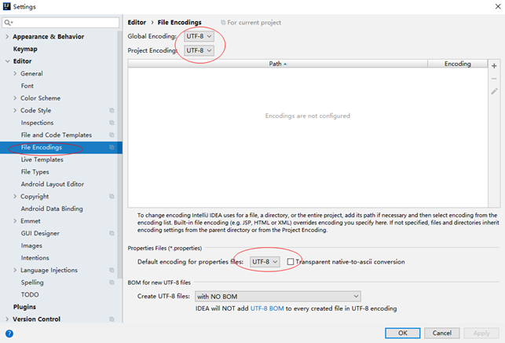


#### 5.2.3 后端初始项目导入

在当天资料中解压heima-leadnews.zip文件，拷贝到一个没有中文和空格的目录，使用idea打开即可

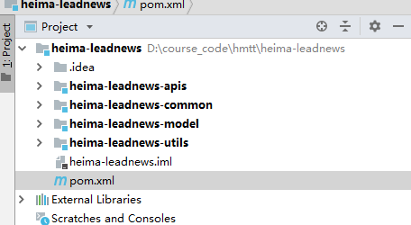

==1、注意：在父工程中的pom.xml中的修改一下==

xxl.job的版本号


修改为


因为仓库中有2.2.0没有2.2.0-SNAPSHOT版本

==2、在heima-leadnews-utils工程中修改一下==

com.heima.utils.common包下的“DataConvertUtils.java”暂时删掉

com.heima.utils包下的“threadlocal”文件夹暂时删掉

因为这几个文件需要用到AdUser实体类，所以会报错


## 6 后端开发-通用说明及开发规范

### 6.1 什么是前后端开发

项目基于前后端分离的架构进行开发，前后端分离架构总体上包括前端和服务端，通常是多人协作开发

- 对于后端java工程师：

  把精力放在设计模式，spring+springmvc，linux，mysql事务隔离与锁机制，mongodb，http/tcp，多线程，分布式架构，弹性计算架构，微服务架构，java性能优化，以及相关的项目管理等等。

- 对于前端工程师：

  把精力放在html5，css3，vuejs，webpack，nodejs，Google V8引擎，javascript多线程，模块化，面向切面编程，设计模式，浏览器兼容性，性能优化等等。

#### 6.1.1前后端分离开发流程


#### 6.1.2 前后端开发流程

1，需求分析

梳理用户的需求，分析业务流程

2，接口定义

根据需求分析定义接口，定义出接口文档

3，服务端和前端并行开发

服务端：依据接口文档进行服务端接口开发

前端：根据用户需求开发操作界面，并根据接口文档制作mock数据，进行测试

4，前后端集成接口联调

最终前端调用服务端接口完成业务

### 6.2 后端接口开发规范

#### 6.2.1 开发原则

- 自顶向下的设计原则：功能应该从表现层分析再到控制层、服务层、持久层逐层设计

- 自底向上的开发原则：上层需调用下层，因此开发应从底层向上层逐层开发

  项目中开发的层次次序参考DB->中间件->持久层->服务层->控制层

- 单一职责的开发原则：类或者方法提供的功能应该单一明确，特别越底层越应单一职责，以便维护

  项目中Mapper方法必须功能单一，参数明确，拒绝两种以上的持久逻辑使用同一个Mapper方法

- 依赖倒置的开发原则：上层依赖下层，是依赖下层接口，并不是依赖下层的实现

  项目中每层都是通过接口调用Controller->Service->Mapper

#### 6.2.2 开发步骤

- 明确类定义：明确哪些是重用类，哪些是需要新增的类
- 明确主键规则：确认操作表的ID生成规则，自增或id_work
- ControllerApi定义：定义接口
- Mapper实现:使用mybatis-plus封装的方法还是自定义mapper映射
- Service实现：可用通过时序图帮助我们梳理实现逻辑
- Controller实现：简单的Service层调用
- 单元测试或接口测试或前端直接联调测试

#### 6.2.3 接口版本规范说明

随着业务的复杂，同一个接口可能出现多个版本，为了方便后期切换和AB测试，需要定义接口的版本号

- 在某一个微服务下访问controller的时候在包名下加一个版本号,如下

  ```properties
  com.heima.article.controller.v1
  ```

- 在访问具体的接口方法的url映射的时候也应该加上版本说明，如下：

  ```java
  @RequestMapping("/api/v1/article")
  ```

### 6.3 接口通用请求和响应

**dto(Data Transfer Object)**:数据传输对象,用于展示层与服务层之间的数据传输对象

#### 6.3.1 通用的响应对象：

不分页：com.heima.model.common.dtos.ResponseResult

```java
/**
 * 通用的结果返回类
 * @param <T>
 */
public class ResponseResult<T> implements Serializable {

    private String host;

    private Integer code;

    private String errorMessage;

    private T data;

    public ResponseResult() {
        this.code = 200;
    }

    public ResponseResult(Integer code, T data) {
        this.code = code;
        this.data = data;
    }

    public ResponseResult(Integer code, String msg, T data) {
        this.code = code;
        this.errorMessage = msg;
        this.data = data;
    }

    public ResponseResult(Integer code, String msg) {
        this.code = code;
        this.errorMessage = msg;
    }

    public static ResponseResult errorResult(int code, String msg) {
        ResponseResult result = new ResponseResult();
        return result.error(code, msg);
    }

    public static ResponseResult okResult(int code, String msg) {
        ResponseResult result = new ResponseResult();
        return result.ok(code, null, msg);
    }

    public static ResponseResult okResult(Object data) {
        ResponseResult result = setAppHttpCodeEnum(AppHttpCodeEnum.SUCCESS,AppHttpCodeEnum.SUCCESS.getErrorMessage());
        if(data!=null) {
            result.setData(data);
        }
        return result;
    }

    public static ResponseResult errorResult(AppHttpCodeEnum enums){
        return setAppHttpCodeEnum(enums,enums.getErrorMessage());
    }

    public static ResponseResult errorResult(AppHttpCodeEnum enums,String errorMessage){
        return setAppHttpCodeEnum(enums,errorMessage);
    }

    public static ResponseResult setAppHttpCodeEnum(AppHttpCodeEnum enums){
        return okResult(enums.getCode(),enums.getErrorMessage());
    }

    private static ResponseResult setAppHttpCodeEnum(AppHttpCodeEnum enums,String errorMessage){
        return okResult(enums.getCode(),errorMessage);
    }

    public ResponseResult<?> error(Integer code, String msg) {
        this.code = code;
        this.errorMessage = msg;
        return this;
    }

    public ResponseResult<?> ok(Integer code, T data) {
        this.code = code;
        this.data = data;
        return this;
    }

    public ResponseResult<?> ok(Integer code, T data, String msg) {
        this.code = code;
        this.data = data;
        this.errorMessage = msg;
        return this;
    }

    public ResponseResult<?> ok(T data) {
        this.data = data;
        return this;
    }

    public Integer getCode() {
        return code;
    }

    public void setCode(Integer code) {
        this.code = code;
    }

    public String getErrorMessage() {
        return errorMessage;
    }

    public void setErrorMessage(String errorMessage) {
        this.errorMessage = errorMessage;
    }

    public T getData() {
        return data;
    }

    public void setData(T data) {
        this.data = data;
    }

    public String getHost() {
        return host;
    }

    public void setHost(String host) {
        this.host = host;
    }
}
```

分页通用返回：com.heima.model.common.dtos.PageResponseResult

```java
public class PageResponseResult extends ResponseResult {
    private Integer currentPage;
    private Integer size;
    private Integer total;

    public PageResponseResult(Integer currentPage, Integer size, Integer total) {
        this.currentPage = currentPage;
        this.size = size;
        this.total = total;
    }

    public int getCurrentPage() {
        return currentPage;
    }

    public void setCurrentPage(int currentPage) {
        this.currentPage = currentPage;
    }

    public int getSize() {
        return size;
    }

    public void setSize(int size) {
        this.size = size;
    }

    public int getTotal() {
        return total;
    }

    public void setTotal(int total) {
        this.total = total;
    }
}
```

#### 6.3.2 通用的请求dtos

com.heima.model.common.dtos.PageRequestDto

```java
@Data
@Slf4j
public class PageRequestDto {

    protected Integer size;
    protected Integer page;

    public void checkParam() {
        if (this.page == null || this.page < 0) {
            setPage(1);
        }
        if (this.size == null || this.size < 0 || this.size > 100) {
            setSize(10);
        }
    }
}
```

#### 6.3.3 通用的异常枚举

com.heima.model.common.enums.AppHttpCodeEnum

```java
public enum AppHttpCodeEnum {

    // 成功段0
    SUCCESS(0,"操作成功"),
    // 登录段1~50
    NEED_LOGIN(1,"需要登录后操作"),
    LOGIN_PASSWORD_ERROR(2,"密码错误"),
    // TOKEN50~100
    TOKEN_INVALID(50,"无效的TOKEN"),
    TOKEN_EXPIRE(51,"TOKEN已过期"),
    TOKEN_REQUIRE(52,"TOKEN是必须的"),
    // SIGN验签 100~120
    SIGN_INVALID(100,"无效的SIGN"),
    SIG_TIMEOUT(101,"SIGN已过期"),
    // 参数错误 500~1000
    PARAM_REQUIRE(500,"缺少参数"),
    PARAM_INVALID(501,"无效参数"),
    PARAM_IMAGE_FORMAT_ERROR(502,"图片格式有误"),
    SERVER_ERROR(503,"服务器内部错误"),
    // 数据错误 1000~2000
    DATA_EXIST(1000,"数据已经存在"),
    AP_USER_DATA_NOT_EXIST(1001,"ApUser数据不存在"),
    DATA_NOT_EXIST(1002,"数据不存在"),
    // 数据错误 3000~3500
    NO_OPERATOR_AUTH(3000,"无权限操作");

    int code;
    String errorMessage;

    AppHttpCodeEnum(int code, String errorMessage){
        this.code = code;
        this.errorMessage = errorMessage;
    }

    public int getCode() {
        return code;
    }

    public String getErrorMessage() {
        return errorMessage;
    }
}
```

### 6.4 通用环境说明

#### 6.4.1 多环境切换

在每一个微服务的工程中的根目录下创建三个文件，方便各个环境的切换

（1）maven_dev.properties  

​	定义开发环境的配置

（2）maven_prod.properties  

​	定义生产环境的配置

（3）maven_test.properties   

​	定义测试环境的配置，开发阶段使用这个测试环境

**默认加载的环境为test，在打包的过程中也可以指定参数打包  package -P test/prod/dev**

具体配置，请查看父工程下的maven插件的profiles配置

```xml
<profiles>
    <profile>
        <id>dev</id>
        <build>
            <filters>
                <filter>maven_dev.properties</filter>
            </filters>
        </build>
    </profile>
    <profile>
        <id>test</id>
        <activation>
            <activeByDefault>true</activeByDefault>
        </activation>
        <build>
            <filters>
                <filter>maven_test.properties</filter>
            </filters>
        </build>
    </profile>
    <profile>
        <id>prod</id>
        <build>
            <filters>
                <filter>maven_prod.properties</filter>
            </filters>
        </build>
    </profile>
</profiles>
```

#### 6.4.2 实体类

所有实体类都是按业务模板划分，如下图

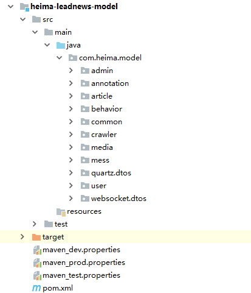


## 7 频道管理

### 7.1 需求说明

```
频道管理是属于运营管理系统中的模块
频道管理是给自媒体管理平台和app端使用
查询的操作
	入参:
		频道名称，page,size  
```


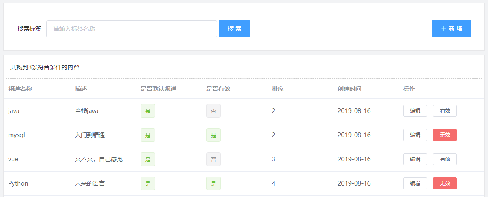

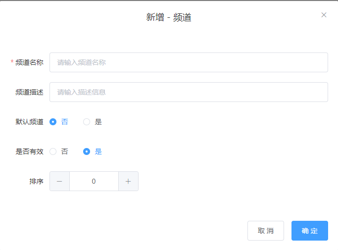

==把资料中的sql脚本导入到本地的数据库中==

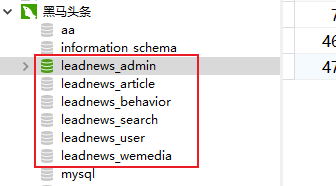

leadnews_admin数据库中的ad_channel  频道表

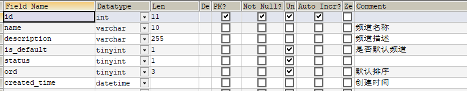

在heima_leadnews_model工程中创建频道的对应实体类：

```java
package com.heima.model.admin.pojos;

import com.baomidou.mybatisplus.annotation.IdType;
import com.baomidou.mybatisplus.annotation.TableField;
import com.baomidou.mybatisplus.annotation.TableId;
import com.baomidou.mybatisplus.annotation.TableName;
import lombok.Data;

import java.io.Serializable;
import java.util.Date;

/**
 * <p>
 * 频道信息表
 * </p>
 *
 * @author itheima
 */
@Data
@TableName("ad_channel")
public class AdChannel implements Serializable {

    private static final long serialVersionUID = 1L;

    @TableId(value = "id", type = IdType.AUTO)
    private Integer id;

    /**
     * 频道名称
     */
    @TableField("name")
    private String name;

    /**
     * 频道描述
     */
    @TableField("description")
    private String description;

    /**
     * 是否默认频道
     */
    @TableField("is_default")
    private Boolean isDefault;

    @TableField("status")
    private Boolean status;

    /**
     * 默认排序
     */
    @TableField("ord")
    private Integer ord;

    /**
     * 创建时间
     */
    @TableField("created_time")
    private Date createdTime;

}
```

### 7.2 平台运营微服务搭建（admin）

（1）在heima-leadnews创建模块：heima-leadnews-admin

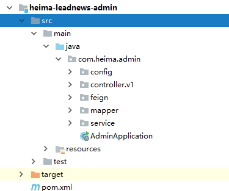

命名规范：

- com.heima.${模块名称}为基础包名  如平台管理就是  com.heima.admin
- config  配置信息
- controller.v1  控制层
- feign   需要远程调用的feign接口
- service  业务层
- mapper  持久层

（2）依赖信息  pom文件

```xml
<parent>
    <artifactId>heima-leadnews</artifactId>
    <groupId>com.heima</groupId>
    <version>1.0-SNAPSHOT</version>
</parent>
<modelVersion>4.0.0</modelVersion>

<artifactId>heima-leadnews-admin</artifactId>
<dependencies>
    <!-- 引入依赖模块 -->
    <dependency>
        <groupId>com.heima</groupId>
        <artifactId>heima-leadnews-model</artifactId>
    </dependency>
    <dependency>
        <groupId>com.heima</groupId>
        <artifactId>heima-leadnews-common</artifactId>
    </dependency>
    <dependency>
        <groupId>com.heima</groupId>
        <artifactId>heima-leadnews-apis</artifactId>
    </dependency>
    <!-- Spring boot starter -->
    <dependency>
        <groupId>org.springframework.boot</groupId>
        <artifactId>spring-boot-starter-web</artifactId>
    </dependency>
    <dependency>
        <groupId>org.springframework.boot</groupId>
        <artifactId>spring-boot-starter-test</artifactId>
        <scope>test</scope>
    </dependency>
</dependencies>
```

注意：其中mybatis-plus相关的依赖在heima-leadnews-model中定义  其中实体类需要mybatis-plus的注解

```xml
<dependencies>
    <dependency>
        <groupId>mysql</groupId>
        <artifactId>mysql-connector-java</artifactId>
    </dependency>
    <dependency>
        <groupId>org.mybatis</groupId>
        <artifactId>mybatis</artifactId>
    </dependency>
    <dependency>
        <groupId>org.springframework.boot</groupId>
        <artifactId>spring-boot-starter-web</artifactId>
    </dependency>
    <dependency>
        <groupId>org.projectlombok</groupId>
        <artifactId>lombok</artifactId>
        <scope>provided</scope>
    </dependency>
    <dependency>
        <groupId>org.apache.commons</groupId>
        <artifactId>commons-lang3</artifactId>
    </dependency>
    <dependency>
        <groupId>com.baomidou</groupId>
        <artifactId>mybatis-plus-boot-starter</artifactId>
    </dependency>
</dependencies>
```

（3）在resources下创建application.yml文件

```yaml
server:
  port: 9001
spring:
  application:
    name: leadnews-admin
  datasource:
    driver-class-name: com.mysql.jdbc.Driver
    url: jdbc:mysql://localhost:3306/leadnews_admin?useUnicode=true&characterEncoding=UTF-8&serverTimezone=Asia/Shanghai
    username: root
    password: root
# 设置Mapper接口所对应的XML文件位置，如果你在Mapper接口中有自定义方法，需要进行该配置
mybatis-plus:
  mapper-locations: classpath*:mapper/*.xml
  # 设置别名包扫描路径，通过该属性可以给包中的类注册别名
  type-aliases-package: com.heima.model.admin.pojos
```

新建日志文件：logback.xml

```xml
<?xml version="1.0" encoding="UTF-8"?>

<configuration>
    <!--定义日志文件的存储地址,使用绝对路径-->
    <property name="LOG_HOME" value="e:/logs"/>

    <!-- Console 输出设置 -->
    <appender name="CONSOLE" class="ch.qos.logback.core.ConsoleAppender">
        <encoder>
            <!--格式化输出：%d表示日期，%thread表示线程名，%-5level：级别从左显示5个字符宽度%msg：日志消息，%n是换行符-->
            <pattern>%d{yyyy-MM-dd HH:mm:ss.SSS} [%thread] %-5level %logger{36} - %msg%n</pattern>
            <charset>utf8</charset>
        </encoder>
    </appender>

    <!-- 按照每天生成日志文件 -->
    <appender name="FILE" class="ch.qos.logback.core.rolling.RollingFileAppender">
        <rollingPolicy class="ch.qos.logback.core.rolling.TimeBasedRollingPolicy">
            <!--日志文件输出的文件名-->
            <fileNamePattern>${LOG_HOME}/leadnews.%d{yyyy-MM-dd}.log</fileNamePattern>
        </rollingPolicy>
        <encoder>
            <pattern>%d{yyyy-MM-dd HH:mm:ss.SSS} [%thread] %-5level %logger{36} - %msg%n</pattern>
        </encoder>
    </appender>

    <!-- 异步输出 -->
    <appender name="ASYNC" class="ch.qos.logback.classic.AsyncAppender">
        <!-- 不丢失日志.默认的,如果队列的80%已满,则会丢弃TRACT、DEBUG、INFO级别的日志 -->
        <discardingThreshold>0</discardingThreshold>
        <!-- 更改默认的队列的深度,该值会影响性能.默认值为256 -->
        <queueSize>512</queueSize>
        <!-- 添加附加的appender,最多只能添加一个 -->
        <appender-ref ref="FILE"/>
    </appender>


    <logger name="org.apache.ibatis.cache.decorators.LoggingCache" level="DEBUG" additivity="false">
        <appender-ref ref="CONSOLE"/>
    </logger>
    <logger name="org.springframework.boot" level="debug"/>
    <root level="info">
        <!--<appender-ref ref="ASYNC"/>-->
        <appender-ref ref="FILE"/>
        <appender-ref ref="CONSOLE"/>
    </root>
</configuration>
```

（4）创建引导类：AdminApplication

```java
package com.heima.admin;

import com.baomidou.mybatisplus.extension.plugins.PaginationInterceptor;
import org.mybatis.spring.annotation.MapperScan;
import org.springframework.boot.SpringApplication;
import org.springframework.boot.autoconfigure.SpringBootApplication;
import org.springframework.context.annotation.Bean;

@SpringBootApplication
@MapperScan("com.heima.admin.mapper")
public class AdminApplication {

    public static void main(String[] args) {
        SpringApplication.run(AdminApplication.class,args);
    }

    /**
     * mybatis-plus分页插件
     */
    @Bean
    public PaginationInterceptor paginationInterceptor() {
        return new PaginationInterceptor();
    }
}
```

### 7.3 频道列表

#### 第一步, 接口定义

在heima-leadnews-apis模块中定义接口com.heima.api.admin.ChannelControllerApi

```java
package com.heima.apis.admin;

import com.heima.model.admin.dtos.ChannelDto;
import com.heima.model.common.dtos.ResponseResult;

public interface AdChannelControllerApi {

    /**
     * 根据名称分页查询频道列表
     * @param dto
     * @return
     */
    public ResponseResult findByNameAndPage(ChannelDto dto);
}
```

ChannelDto

```java
package com.heima.model.admin.dtos;

import com.heima.model.common.dtos.PageRequestDto;
import lombok.Data;

@Data
public class ChannelDto extends PageRequestDto {

    /**
     * 频道名称
     */
    private String name;
}
```

#### 第二步，持久层

在heima_leadnews_admin工程中的com.heima.admin.mapper包下定义接口

```java
package com.heima.admin.mapper;

import com.baomidou.mybatisplus.core.mapper.BaseMapper;
import com.heima.model.admin.pojos.AdChannel;
import org.apache.ibatis.annotations.Mapper;

@Mapper
public interface AdChannelMapper extends BaseMapper<AdChannel> {
}
```

#### 第三步， 业务层

在heima_leadnews_admin工程中的com.heima.admin.service包下定义业务层接口

```java
package com.heima.admin.service;

import com.baomidou.mybatisplus.extension.service.IService;
import com.heima.model.admin.dtos.ChannelDto;
import com.heima.model.admin.pojos.AdChannel;
import com.heima.model.common.dtos.ResponseResult;

public interface AdChannelService extends IService<AdChannel> {

    /**
     * 根据名称分页查询频道列表
     * @param dto
     * @return
     */
    public ResponseResult findByNameAndPage(ChannelDto dto);
}
```

实现类：com.heima.admin.service.impl.AdChannelServiceImpl

```java
package com.heima.admin.service.impl;

import com.baomidou.mybatisplus.core.conditions.query.LambdaQueryWrapper;
import com.baomidou.mybatisplus.core.metadata.IPage;
import com.baomidou.mybatisplus.extension.plugins.pagination.Page;
import com.baomidou.mybatisplus.extension.service.impl.ServiceImpl;
import com.heima.admin.mapper.AdChannelMapper;
import com.heima.admin.service.AdChannelService;
import com.heima.model.admin.dtos.ChannelDto;
import com.heima.model.admin.pojos.AdChannel;
import com.heima.model.common.dtos.PageResponseResult;
import com.heima.model.common.dtos.ResponseResult;
import com.heima.model.common.enums.AppHttpCodeEnum;
import org.apache.commons.lang3.StringUtils;
import org.springframework.stereotype.Service;

@Service
public class AdChannelServiceImpl extends ServiceImpl<AdChannelMapper, AdChannel> implements AdChannelService {


    @Override
    public ResponseResult findByNameAndPage(ChannelDto dto) {

        //1.参数检测
        if(dto==null){
            return ResponseResult.errorResult(AppHttpCodeEnum.PARAM_INVALID);
        }
        //分页参数检查
        dto.checkParam();

        //2.安装名称模糊分页查询
        Page page = new Page(dto.getPage(),dto.getSize());
        LambdaQueryWrapper<AdChannel> lambdaQueryWrapper = new LambdaQueryWrapper();
        if(StringUtils.isNotBlank(dto.getName())){
            lambdaQueryWrapper.like(AdChannel::getName,dto.getName());
        }
        IPage result = page(page, lambdaQueryWrapper);

        //3.结果封装
        ResponseResult responseResult = new PageResponseResult(dto.getPage(),dto.getSize(),(int)result.getTotal());
        responseResult.setData(result.getRecords());
        return responseResult;
    }
}
```

#### 第四步， 控制层

定义AdChannelController实现接口AdChannelControllerApi

```java
@RestController
@RequestMapping("/api/v1/channel")
public class AdChannelController  implements AdChannelControllerApi {

    @Autowired
    private AdChannelService channelService;

    @PostMapping("/list")
    @Override
    public ResponseResult findByNameAndPage(@RequestBody ChannelDto dto){
        return channelService.findByNameAndPage(dto);
    }
}
```

### 7.4 接口测试工具

#### 7.4.1 postman

(1)简介

Postman是一款功能强大的网页调试与发送网页**HTTP请求**的Chrome插件。**postman被500万开发者和超100,000家公司用于每月访问1.3亿个API。**java开发通常是作为后台开发语言，通常的项目中的接口开发需要一款测试工具来调试接口，这样无需前端页面也不耽误后台代码的开发进度，postman作为一个接口测试工具，是一个非常不错的选择。

官方网址：https://www.postman.com/

(2)安装

解压资料文件夹中的软件，安装即可

(3)请求和响应

- 发送请求，请求方式的选择

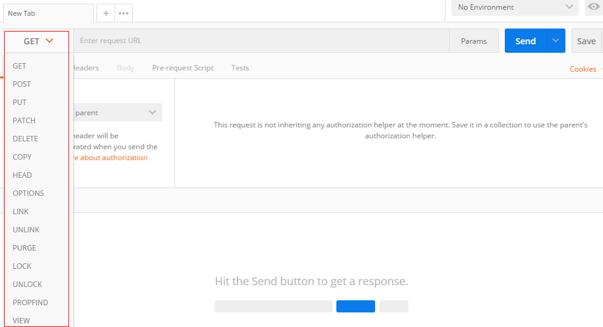

- 输入请求的url,并发送请求


- 通常的接口测试，请求和响应都是json（重要）

==分页查询==

请求参数设置

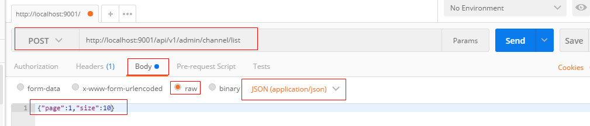

结果返回：

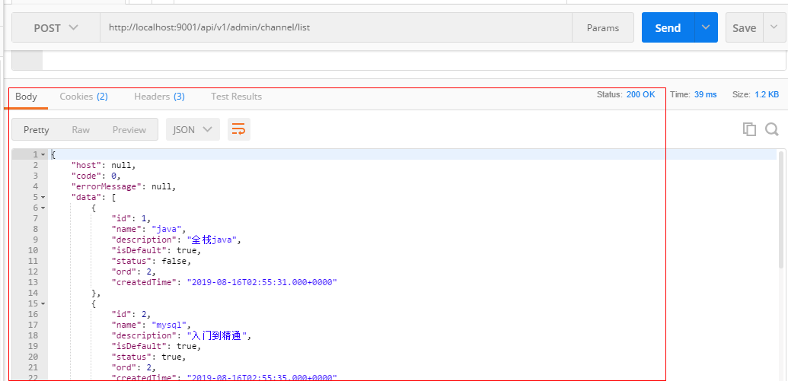

==条件查询+分页查询==

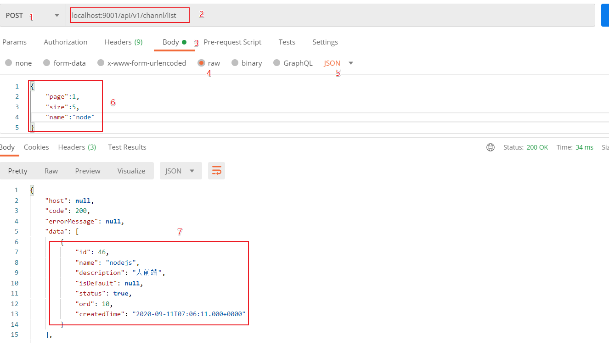

通过以上描述，希望初学者可以快速的安装和使用postman来进行接口的测试，当然，这里描述并不详尽，postman作为一个接口测试的利器，还有很多特别强大的功能并没有介绍，后面随着项目的深入会继续使用。

#### 7.4.2 Swagger介绍

(1)简介

Swagger 是一个规范和完整的框架，用于生成、描述、调用和可视化 RESTful 风格的 Web 服务(<https://swagger.io/>)。 它的主要作用是：

1. 使得前后端分离开发更加方便，有利于团队协作

2. 接口的文档在线自动生成，降低后端开发人员编写接口文档的负担

3. 功能测试 

   Spring已经将Swagger纳入自身的标准，建立了Spring-swagger项目，现在叫Springfox。通过在项目中引入Springfox ，即可非常简单快捷的使用Swagger。

(2)SpringBoot集成Swagger

- 引入依赖,在heima-leadnews-model模块中引入该依赖

  ```xml
  <dependency>
      <groupId>io.springfox</groupId>
      <artifactId>springfox-swagger2</artifactId>
  </dependency>
  <dependency>
      <groupId>io.springfox</groupId>
      <artifactId>springfox-swagger-ui</artifactId>
  </dependency>
  ```

只需要在heima-leadnews-model中进行配置即可，因为其他微服务工程都直接或间接依赖即可。

- 在heima-leadnews-admin工程的config包中添加一个配置类

```java
package com.heima.admin.config;

import org.springframework.boot.autoconfigure.condition.ConditionalOnProperty;
import org.springframework.context.annotation.Bean;
import org.springframework.context.annotation.Configuration;
import springfox.documentation.builders.ApiInfoBuilder;
import springfox.documentation.builders.PathSelectors;
import springfox.documentation.builders.RequestHandlerSelectors;
import springfox.documentation.service.ApiInfo;
import springfox.documentation.service.Contact;
import springfox.documentation.spi.DocumentationType;
import springfox.documentation.spring.web.plugins.Docket;
import springfox.documentation.swagger2.annotations.EnableSwagger2;

@Configuration
@EnableSwagger2
public class SwaggerConfiguration {

   @Bean
   public Docket buildDocket() {
      return new Docket(DocumentationType.SWAGGER_2)
              .apiInfo(buildApiInfo())
              .select()
              // 要扫描的API(Controller)基础包
              .apis(RequestHandlerSelectors.basePackage("com.heima"))
              .paths(PathSelectors.any())
              .build();
   }

   private ApiInfo buildApiInfo() {
      Contact contact = new Contact("黑马程序员","","");
      return new ApiInfoBuilder()
              .title("黑马头条-平台管理API文档")
              .description("平台管理服务api")
              .contact(contact)
              .version("1.0.0").build();
   }
}
```

==优化注意：==

SwaggerConfiguration类可以放在heima-leadnews-model微服务中

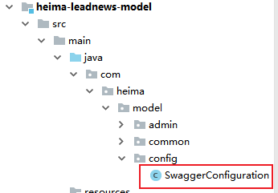

（3）Swagger常用注解

在Java类中添加Swagger的注解即可生成Swagger接口文档，常用Swagger注解如下：

@Api：修饰整个类，描述Controller的作用  @ApiOperation：描述一个类的一个方法，或者说一个接口  @ApiParam：单个参数的描述信息  

@ApiModel：用对象来接收参数  

@ApiModelProperty：用对象接收参数时，描述对象的一个字段  

@ApiResponse：HTTP响应其中1个描述  

@ApiResponses：HTTP响应整体描述  

@ApiIgnore：使用该注解忽略这个API  

@ApiError ：发生错误返回的信息  

@ApiImplicitParam：一个请求参数  

@ApiImplicitParams：多个请求参数的描述信息


 @ApiImplicitParam属性：

| 属性         | 取值   | 作用                                          |
| ------------ | ------ | --------------------------------------------- |
| paramType    |        | 查询参数类型                                  |
|              | path   | 以地址的形式提交数据                          |
|              | query  | 直接跟参数完成自动映射赋值                    |
|              | body   | 以流的形式提交 仅支持POST                     |
|              | header | 参数在request headers 里边提交                |
|              | form   | 以form表单的形式提交 仅支持POST               |
| dataType     |        | 参数的数据类型 只作为标志说明，并没有实际验证 |
|              | Long   |                                               |
|              | String |                                               |
| name         |        | 接收参数名                                    |
| value        |        | 接收参数的意义描述                            |
| required     |        | 参数是否必填                                  |
|              | true   | 必填                                          |
|              | false  | 非必填                                        |
| defaultValue |        | 默认值                                        |

我们在AdChannelControllerApi中添加Swagger注解，代码如下所示：

```java
@Api(value = "频道管理", tags = "channel", description = "频道管理API")
public interface AdChannelControllerApi {

    /**
     * 根据名称分页查询频道列表
     * @param dto
     * @return
     */
    @ApiOperation("频道分页列表查询")
    public ResponseResult findByNameAndPage(ChannelDto dto);
}
```

ChannelDto

```java
@Data
public class ChannelDto extends PageRequestDto {

    /**
     * 频道名称
     */
    @ApiModelProperty("频道名称")
    private String name;
}
```

PageRequestDto

```java
@Data
@Slf4j
public class PageRequestDto {

    @ApiModelProperty(value="当前页",required = true)
    protected Integer page;
    @ApiModelProperty(value="每页显示条数",required = true)
    protected Integer size;

    public void checkParam() {
        if (this.page == null || this.page < 0) {
            setPage(1);
        }
        if (this.size == null || this.size < 0 || this.size > 100) {
            setSize(10);
        }
    }
}
```

==注意：要在admin微服务的入口类上加入注解==

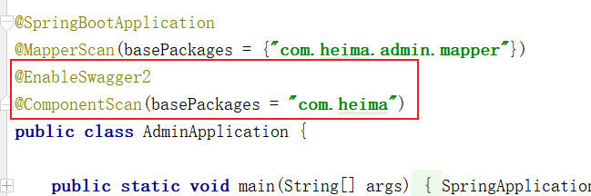

启动admin微服务，访问地址：http://localhost:9001/swagger-ui.html

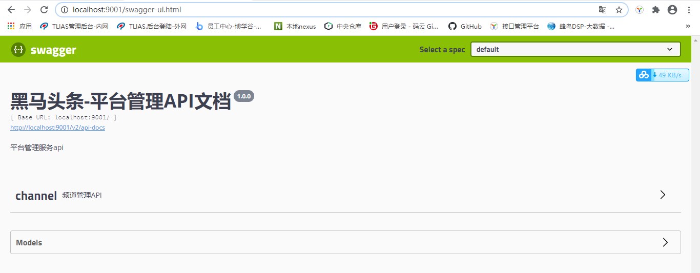

查询：

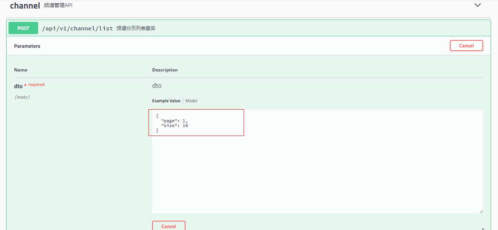

先点击**Try it out** 输入参数，然后点击**Execute**,结果如下：

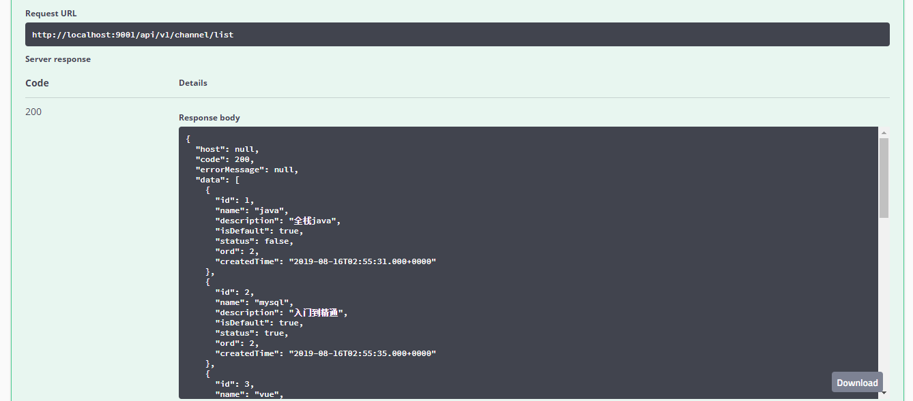


#### 7.4.3 knife4j

##### (1)简介

knife4j是为Java MVC框架集成Swagger生成Api文档的增强解决方案,前身是swagger-bootstrap-ui,取名kni4j是希望它能像一把匕首一样小巧,轻量,并且功能强悍!

gitee地址：https://gitee.com/xiaoym/knife4j

官方文档：https://doc.xiaominfo.com/

效果演示：http://knife4j.xiaominfo.com/doc.html

##### (2)核心功能

该UI增强包主要包括两大核心功能：文档说明 和 在线调试

- 文档说明：根据Swagger的规范说明，详细列出接口文档的说明，包括接口地址、类型、请求示例、请求参数、响应示例、响应参数、响应码等信息，使用swagger-bootstrap-ui能根据该文档说明，对该接口的使用情况一目了然。
- 在线调试：提供在线接口联调的强大功能，自动解析当前接口参数,同时包含表单验证，调用参数可返回接口响应内容、headers、Curl请求命令实例、响应时间、响应状态码等信息，帮助开发者在线调试，而不必通过其他测试工具测试接口是否正确,简介、强大。
- 个性化配置：通过个性化ui配置项，可自定义UI的相关显示信息
- 离线文档：根据标准规范，生成的在线markdown离线文档，开发者可以进行拷贝生成markdown接口文档，通过其他第三方markdown转换工具转换成html或pdf，这样也可以放弃swagger2markdown组件
- 接口排序：自1.8.5后，ui支持了接口排序功能，例如一个注册功能主要包含了多个步骤,可以根据swagger-bootstrap-ui提供的接口排序规则实现接口的排序，step化接口操作，方便其他开发者进行接口对接

##### (3)快速集成

###### 优化前

- 在heima-leadnews-common模块中的`pom.xml`文件中引入`knife4j`的依赖,如下：

```xml
<dependency>
     <groupId>com.github.xiaoymin</groupId>
     <artifactId>knife4j-spring-boot-starter</artifactId>
</dependency>
```

- 创建Swagger配置文件

在heima-leadnews-common模块中新建配置类

新建Swagger的配置文件`SwaggerConfiguration.java`文件,创建springfox提供的Docket分组对象,代码如下：

```java
package com.heima.common.knife4j;

import com.github.xiaoymin.knife4j.spring.annotations.EnableKnife4j;
import org.springframework.context.annotation.Bean;
import org.springframework.context.annotation.Configuration;
import org.springframework.context.annotation.Import;
import springfox.bean.validators.configuration.BeanValidatorPluginsConfiguration;
import springfox.documentation.builders.ApiInfoBuilder;
import springfox.documentation.builders.PathSelectors;
import springfox.documentation.builders.RequestHandlerSelectors;
import springfox.documentation.service.ApiInfo;
import springfox.documentation.spi.DocumentationType;
import springfox.documentation.spring.web.plugins.Docket;
import springfox.documentation.swagger2.annotations.EnableSwagger2;

@Configuration
@EnableSwagger2
@EnableKnife4j
@Import(BeanValidatorPluginsConfiguration.class)
public class Swagger2Configuration {

    @Bean(value = "defaultApi2")
    public Docket defaultApi2() {
        Docket docket=new Docket(DocumentationType.SWAGGER_2)
                .apiInfo(apiInfo())
                //分组名称
                .groupName("1.0")
                .select()
                //这里指定Controller扫描包路径
                .apis(RequestHandlerSelectors.basePackage("com.heima"))
                .paths(PathSelectors.any())
                .build();
        return docket;
    }
    private ApiInfo apiInfo() {
        return new ApiInfoBuilder()
                .title("黑马头条API文档")
                .description("黑马头条API文档")
                .version("1.0")
                .build();
    }
}
```

以上有两个注解需要特别说明，如下表：

| 注解              | 说明                                                         |
| ----------------- | ------------------------------------------------------------ |
| `@EnableSwagger2` | 该注解是Springfox-swagger框架提供的使用Swagger注解，该注解必须加 |
| `@EnableKnife4j`  | 该注解是`knife4j`提供的增强注解,Ui提供了例如动态参数、参数过滤、接口排序等增强功能,如果你想使用这些增强功能就必须加该注解，否则可以不用加 |

- 访问

  在heima-leadnews-admin中开启配置

  在config包下新建类KnifeConfig

  ```java
  @Configuration
  @ComponentScan("com.heima.common.knife4j")
  public class KnifeConfig {
  }
  ```


###### ==优化后==

1、在heima-leadnews-model微服务中pom.xml中加入knife4j的依赖坐标

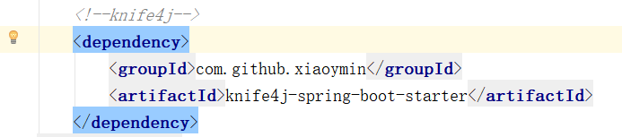

2、在原有swaggerConfig类之上进行添加注解

```
@EnableKnife4j //开启knife4j
@Import(BeanValidatorPluginsConfiguration.class)
```

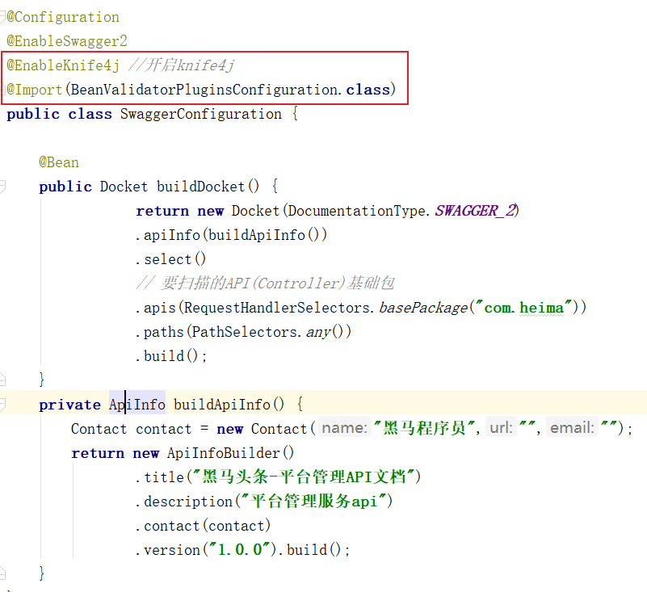

- 访问

在浏览器输入地址：`http://host:port/doc.html`

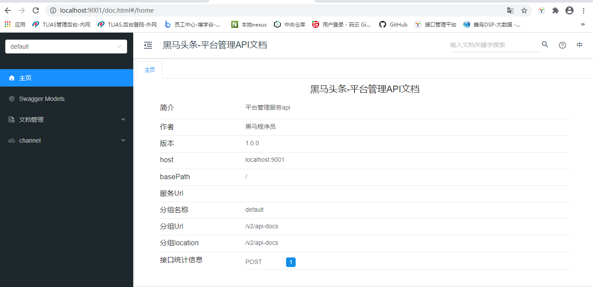

查询频道列表：

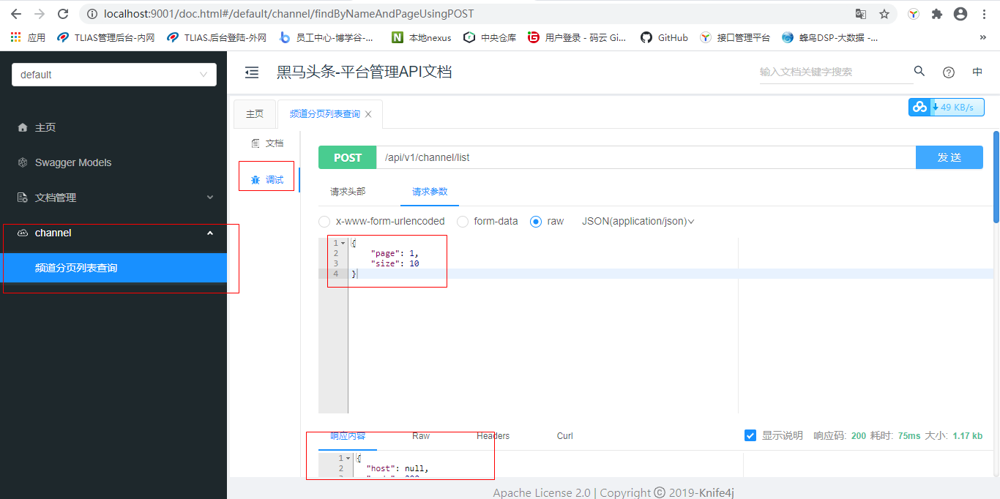

### 7.5 频道新增

#### 7.5.1接口定义

在AdChannelControllerApi接口中新增save方法

```java
 /**
     * 新增
     * @param channel
     * @return
     */
public ResponseResult save(AdChannel channel);
```

#### 7.5.2 业务层

在AdChannelService中新增方法

```java
/**
     * 新增
     * @param channel
     * @return
     */
public ResponseResult insert(AdChannel channel);
```

实现类：

```java
@Override
public ResponseResult insert(AdChannel adChannel) {
    //1.检查参数
    if(null == adChannel){
        return ResponseResult.errorResult(AppHttpCodeEnum.PARAM_INVALID);
    }

    //2.保存
    adChannel.setCreatedTime(new Date());
    save(adChannel);
    return ResponseResult.okResult(AppHttpCodeEnum.SUCCESS);
}
```

#### 7.5.3 控制层

```java
@Override
@PostMapping("/save")
public ResponseResult save(@RequestBody AdChannel channel) {
    return channelService.insert(channel);
}
```

#### 7.5.4 测试

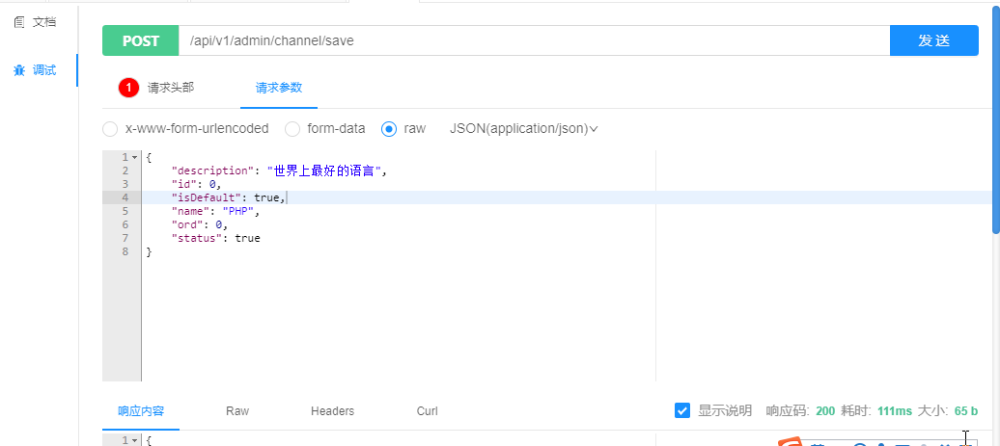

### 7.6 频道修改&频道有效无效设置

需求说明

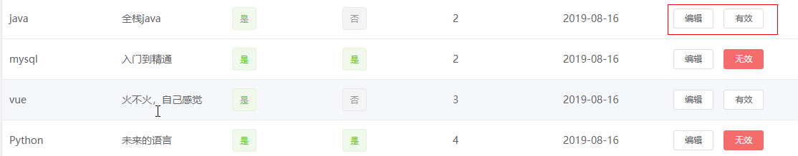

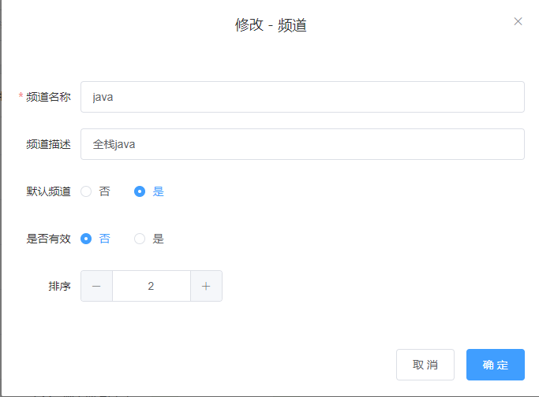

其中设置状态（有效和无效）和弹窗修改都属于同一个修改即可

#### 7.6.1 接口定义

在AdChannelControllerApi接口中新增update方法

```java
/**
     * 修改
     * @param adChannel
     * @return
     */
public ResponseResult update(AdChannel adChannel);
```

#### 7.6.2 业务层

AdChannelService中定义修改方法

```java
 /**
     * 修改
     * @param adChannel
     * @return
     */
public ResponseResult update(AdChannel adChannel);
```

实现类：

```java
@Override
public ResponseResult update(AdChannel adChannel) {

    //1.检查参数
    if(null == adChannel || adChannel.getId()==null){
        return ResponseResult.errorResult(AppHttpCodeEnum.PARAM_INVALID);
    }

    //2.修改
    updateById(adChannel);
    return ResponseResult.okResult(AppHttpCodeEnum.SUCCESS);
}
```

#### 7.6.3 控制层

```java
@Override
@PostMapping("/update")
public ResponseResult update(@RequestBody AdChannel adChannel) {
    return channelService.update(adChannel);
}
```

#### 7.6.4 测试

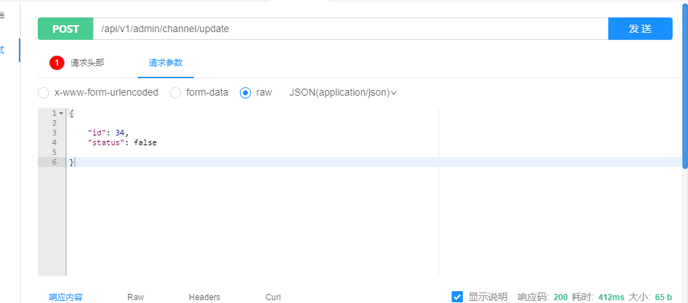


### 7.7 频道删除

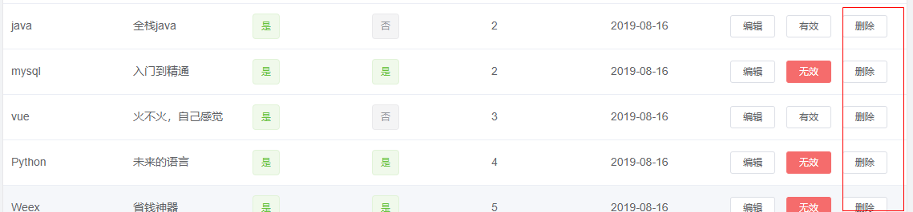

如果当前状态为有效则不能删除

#### 7.7.1 接口定义

在AdChannelControllerApi接口中新增deleteById方法,接收ChannelDto中的id参数

```java
/**
     * 删除
     * @param id
     * @return
     */
public ResponseResult deleteById(Integer id);
```

#### 7.7.2 业务层

AdChannelService中新增deleteById方法

```java
/**
     * 删除
     * @param id
     * @return
     */
public ResponseResult deleteById(Integer id);
```

实现类

```java
@Override
public ResponseResult deleteById(Integer id) {
    //1.检查参数
    if(id == null){
        return ResponseResult.errorResult(AppHttpCodeEnum.PARAM_INVALID);
    }
    //2.判断当前频道是否存在 和 是否有效
    AdChannel adChannel = getById(id);
    if(adChannel==null){
        return ResponseResult.errorResult(AppHttpCodeEnum.DATA_NOT_EXIST);
    }
    if(adChannel.getStatus()){
        return ResponseResult.errorResult(AppHttpCodeEnum.PARAM_INVALID,"频道有效不能删除");
    }

    //        int i = 10/0;

    //3.删除频道
    removeById(id);
    return ResponseResult.okResult(AppHttpCodeEnum.SUCCESS);
}
```

#### 7.7.3 控制层

```java
@Override
@GetMapping("/del/{id}")
public ResponseResult deleteById(@PathVariable("id") Integer id) {
    return channelService.deleteById(id);
}
```

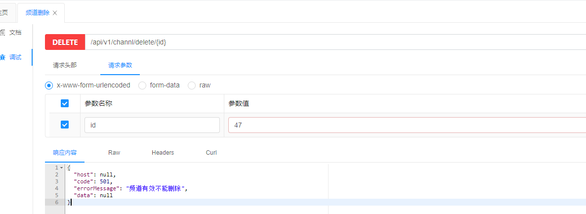