# 02 平台管理端基础数据准备&登录实现

## 今日目标

- 能够掌握项目中通用异常的处理方式
- 能够了解前端基础环境搭建
- 能够完成敏感词管理的开发
- 能够熟悉常用密码加密方式
- 能够完成admin端登录功能
- 能够完成nacos注册中心的搭建

## 1 通用异常

### 1.1 什么是通用异常

目前的代码中如果发生系统异常，则直接会给用户抛出不友好的异常信息。为了增加用户的体验，应该给一些适当信息进行提示。例如删除频道的代码，如下


目前红框圈起来的是可以给用户友好提示的，但是当执行删除这一行代码，如何失败了该如何处理。有可能系统会抛出异常。那这个时候就不应该把异常信息直接返回给用户。那该如何处理呢？

项目开发中肯定会设置**全局异常处理**，不管系统发生了任何不可知的异常信息，都应该给用户返回友好提示信息。


### 1.2 通用异常配置

在heima-leadnews-common模块中新建类ExceptionCatch

```java
package com.heima.common.exception;

import com.heima.model.common.dtos.ResponseResult;
import com.heima.model.common.enums.AppHttpCodeEnum;
import lombok.extern.log4j.Log4j2;
import org.springframework.web.bind.annotation.ControllerAdvice;
import org.springframework.web.bind.annotation.ExceptionHandler;
import org.springframework.web.bind.annotation.ResponseBody;

@ControllerAdvice//控制器增强
@Log4j2
public class ExceptionCatch {


    //捕获Exception此类异常
    @ExceptionHandler(Exception.class)
    @ResponseBody
    public ResponseResult exception(Exception exception) {
        exception.printStackTrace();
        //记录日志
        log.error("catch exception:{}", exception.getMessage());
        //返回通用异常
        return ResponseResult.errorResult(AppHttpCodeEnum.SERVER_ERROR);
    }
}
```

`@ControllerAdvice`  控制器增强注解

`@ExceptionHandler` 异常处理器 与上面注解一起使用，可以拦截指定的异常信息

### 1.3 集成到项目中使用

在heima-leadnews-admin模块中新增类ExceptionCatchConfig

```java
package com.heima.admin.config;

import org.springframework.context.annotation.ComponentScan;
import org.springframework.context.annotation.Configuration;

@Configuration
@ComponentScan("com.heima.common.exception")
public class ExceptionCatchConfig {
}
```

### 1.4 测试

如:在删除频道的时候传的id为数值类型，如果不添加全局异常返回如下：


添加异常信息以后，返回如下：


## 2 前端相关基础知识（了解）

### 2.1 webpack

#### 2.1.1 什么是webpack

webpack 是一个现代 JavaScript 应用程序的模块打包器(module bundler)，分析你的项目结构，找到JavaScript模块以及其它的一些浏览器不能直接运行的拓展语言（Sass，TypeScript等），并将其转换和打包为合适的格式供浏览器使用。


#### 2.1.2 webpack安装

注意：请先安装node环境

webpack基于node.js运行，首先需要安装node.js。(须安装)


安装webpack

`npm install webpack@3.6.0 -g`  (须安装)

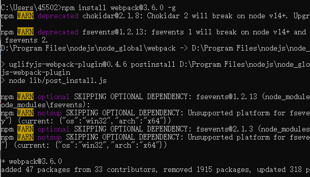

建议大家这样操作(随时切换镜像源)：

1. npm install nrm -g // 安装nrm

   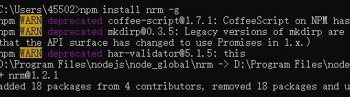

2. nrm ls // 查看镜像源

   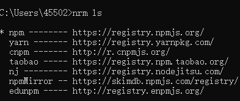

3. nrm use taobao // 选择淘宝镜像，也可以选择cnpm

   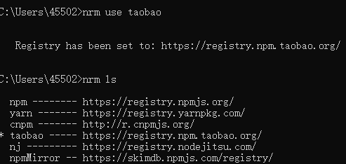
   
   安装cnpm
   
   https://www.cnblogs.com/uniapp/p/13115877.html

### 2.2 vue脚手架(可不做)

vue-cli是官方的一个脚手架工具，所谓脚手架呢就是一个架子，什么架子呢？项目结构的架子，里面有一些最基本的结构配置。利用vue-cli呢，我们可以生成这样的一个脚手架，所以呢它就被称为vue脚手架工具。

`npm install vue-cli -g`   安装

`vue init webpack admin`   初始化项目

### 3.3 导入admin前端工程

使用webstorm工具打开资料中前端项目

（1）安装js依赖，保证有网络，在项目的根目录执行命令`npm install或者cnpm install`


(2)修改文件，暂时不登录

文件的位置：project-heima-leadnews-admin-vue-teacher\src\views\login\index.vue

修改效果如下：


（3）启动项目

在`package.json`文件上右键，选择

然后双击 dev 就能启动项目了


（4）前端项目端口修改

修改文件：project-heima-leadnews-admin-vue-teacher\config\index.js，如下图效果


（5）启动成功以后，用浏览器打开，可以测试已开发好的频道功能

==注意==

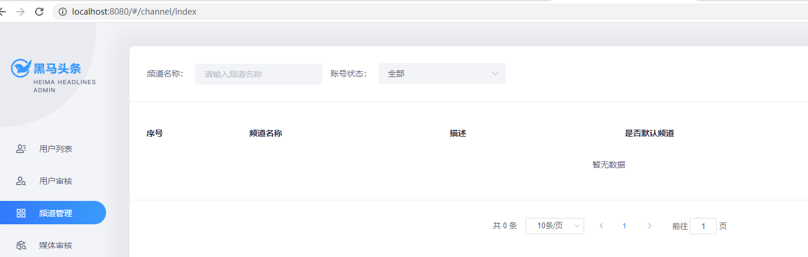

发现没有数据，在debug测试是否访问后台请求，发现也不能访问

原因是：在config文件夹中的index.js中要改代理配置，把ip改为自己的本地ip即可

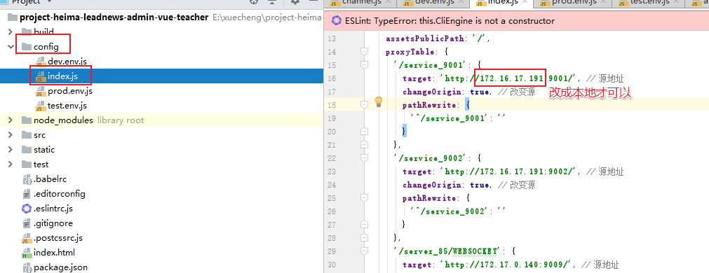

```js
   proxyTable: {
      '/service_9001': {
        target: 'http://localhost:9001/', // 源地址
        changeOrigin: true, // 改变源
        pathRewrite: {
          '^/service_9001': ''
        }
      },
      。。。。。。
```

重启前端工程，然后再次访问


==测试新增，修改，删除，启用/禁用功能==

注意：当前后台的接口名称必须和笔记保持一致，因为前台admin工程中已经固定了后台的接口api


## 3 敏感词管理

需求分析:

```
敏感词管理是干什么的?
	运营端设置一些敏感的词语，这些词语都是不能够通过审核的词语，比如涉黄涉爆，不利于团结的词语
	目的是为了将来以后自媒体人发布文章之后，我们运营端进行审核的时候进行判断是否通过审核
敏感词对应数据库表是哪个？
	ad_sensitive
		id  主键
		sensitives 敏感词
		created_time  创建时间
```


ad_sensitive 敏感词


实体类：

```java
package com.heima.model.admin.pojos;

import com.baomidou.mybatisplus.annotation.IdType;
import com.baomidou.mybatisplus.annotation.TableField;
import com.baomidou.mybatisplus.annotation.TableId;
import com.baomidou.mybatisplus.annotation.TableName;
import lombok.Data;

import java.io.Serializable;
import java.util.Date;

/**
 * <p>
 * 敏感词信息表
 * </p>
 *
 * @author itheima
 */
@Data
@TableName("ad_sensitive")
public class AdSensitive implements Serializable {

    private static final long serialVersionUID = 1L;

    /**
     * 主键
     */
    @TableId(value = "id", type = IdType.AUTO)
    private Integer id;

    /**
     * 敏感词
     */
    @TableField("sensitives")
    private String sensitives;

    /**
     * 创建时间
     */
    @TableField("created_time")
    private Date createdTime;

}
```

#### 3.1 接口定义

分别要完成敏感词管理的如下功能

- 敏感词的分页按照关键字模糊查询
- 敏感词新增
- 敏感词修改
- 敏感词删除

在heima-leadnews-model模块中创建SensitiveDto

```java
package com.heima.model.admin.dtos;

import com.heima.model.common.dtos.PageRequestDto;
import lombok.Data;

@Data
public class SensitiveDto extends PageRequestDto {

    /**
     * 敏感词名称
     */
    private String name;
}

```

在heima-leadnews-apis模块中新建接口com.heima.api.admin.SensitiveControllerApi

分别定义查询，新增，修改，删除方法

```java
package com.heima.apis.admin;

import com.heima.model.admin.dtos.SensitiveDto;
import com.heima.model.admin.pojos.AdSensitive;
import com.heima.model.common.dtos.ResponseResult;

public interface AdSensitiveControllerApi {

    /**
     * 根据名称分页查询敏感词
     * @param dto
     * @return
     */
    public ResponseResult list(SensitiveDto dto);

    /**
     * 新增
     * @param adSensitive
     * @return
     */
    public ResponseResult save(AdSensitive adSensitive);

    /**
     * 修改
     * @param adSensitive
     * @return
     */
    public ResponseResult update(AdSensitive adSensitive);

    /**
     * 删除敏感词
     * @param id
     * @return
     */
    public ResponseResult deleteById(Integer id);
}
```


#### 3.2 mapper接口

定义敏感词mapper接口：com.heima.admin.mapper.AdSensitiveMapper

```java
package com.heima.admin.mapper;

import com.baomidou.mybatisplus.core.mapper.BaseMapper;
import com.heima.model.admin.pojos.AdSensitive;
import org.apache.ibatis.annotations.Mapper;

@Mapper
public interface AdSensitiveMapper extends BaseMapper<AdSensitive> {
}

```

#### 3.3 业务层

定义敏感词业务接口com.heima.admin.service.AdSensitiveService

```java
package com.heima.admin.service;

import com.baomidou.mybatisplus.extension.service.IService;
import com.heima.model.admin.dtos.SensitiveDto;
import com.heima.model.admin.pojos.AdSensitive;
import com.heima.model.common.dtos.ResponseResult;

public interface AdSensitiveService extends IService<AdSensitive> {

    /**
     * 根据名称分页查询敏感词
     * @param dto
     * @return
     */
    public ResponseResult list(SensitiveDto dto);

    /**
     * 新增
     * @param adSensitive
     * @return
     */
    public ResponseResult insert(AdSensitive adSensitive);

    /**
     * 修改
     * @param adSensitive
     * @return
     */
    public ResponseResult update(AdSensitive adSensitive);

    /**
     * 删除敏感词
     * @param id
     * @return
     */
    public ResponseResult deleteById(Integer id);
}
```

实现类：

```java
package com.heima.admin.service.impl;

import com.baomidou.mybatisplus.core.conditions.query.LambdaQueryWrapper;
import com.baomidou.mybatisplus.core.metadata.IPage;
import com.baomidou.mybatisplus.extension.plugins.pagination.Page;
import com.baomidou.mybatisplus.extension.service.impl.ServiceImpl;
import com.heima.admin.mapper.AdSensitiveMapper;
import com.heima.admin.service.AdSensitiveService;
import com.heima.model.admin.dtos.SensitiveDto;
import com.heima.model.admin.pojos.AdSensitive;
import com.heima.model.common.dtos.PageResponseResult;
import com.heima.model.common.dtos.ResponseResult;
import com.heima.model.common.enums.AppHttpCodeEnum;
import org.apache.commons.lang3.StringUtils;
import org.springframework.stereotype.Service;

import java.util.Date;

@Service
public class AdSensitiveServiceImpl extends ServiceImpl<AdSensitiveMapper, AdSensitive> implements AdSensitiveService {

    @Override
    public ResponseResult list(SensitiveDto dto) {
        //1.检查参数
        if(dto==null){
            return ResponseResult.errorResult(AppHttpCodeEnum.PARAM_INVALID);
        }
        dto.checkParam();

        //2.根据名称模糊分页查询
        Page page = new Page<>(dto.getPage(),dto.getSize());
        LambdaQueryWrapper<AdSensitive> lambdaQueryWrapper = new LambdaQueryWrapper();
        if(StringUtils.isNotBlank(dto.getName())){
            lambdaQueryWrapper.like(AdSensitive::getSensitives,dto.getName());
        }

        IPage result = page(page, lambdaQueryWrapper);

        //3.结果返回
        ResponseResult responseResult = new PageResponseResult(dto.getPage(),dto.getSize(),(int)result.getTotal());
        responseResult.setData(result.getRecords());
        return responseResult;
    }

    @Override
    public ResponseResult insert(AdSensitive adSensitive) {
        //1.参数检查
        if(adSensitive == null){
            return ResponseResult.errorResult(AppHttpCodeEnum.PARAM_INVALID);
        }

        //2.保存
        adSensitive.setCreatedTime(new Date());
        save(adSensitive);
        return ResponseResult.okResult(AppHttpCodeEnum.SUCCESS);
    }

    @Override
    public ResponseResult update(AdSensitive adSensitive) {
        //1.参数检查
        if(adSensitive == null || adSensitive.getId() == null){
            return ResponseResult.errorResult(AppHttpCodeEnum.PARAM_INVALID);
        }

        //2.修改
        updateById(adSensitive);
        return ResponseResult.okResult(AppHttpCodeEnum.SUCCESS);
    }

    @Override
    public ResponseResult deleteById(Integer id) {
        //1.参数检查
        if(id == null){
            return ResponseResult.errorResult(AppHttpCodeEnum.PARAM_INVALID);
        }
        //2.判断当前敏感词是否存在
        AdSensitive adSensitive = getById(id);
        if(adSensitive == null){
            return ResponseResult.errorResult(AppHttpCodeEnum.DATA_NOT_EXIST);
        }
        //3.删除操作
        removeById(id);
        return ResponseResult.okResult(AppHttpCodeEnum.SUCCESS);
    }
}
```

#### 3.4 控制层

定义com.heima.admin.controller.v1.SensitiveController实现SensitiveControllerApi接口

```java
package com.heima.admin.controller.v1;

import com.heima.admin.service.AdSensitiveService;
import com.heima.apis.admin.AdSensitiveControllerApi;
import com.heima.model.admin.dtos.SensitiveDto;
import com.heima.model.admin.pojos.AdSensitive;
import com.heima.model.common.dtos.ResponseResult;
import org.springframework.beans.factory.annotation.Autowired;
import org.springframework.web.bind.annotation.*;

@RestController
@RequestMapping("/api/v1/sensitive")
public class AdSensitiveController implements AdSensitiveControllerApi {

    @Autowired
    private AdSensitiveService adSensitiveService;

    @PostMapping("/list")
    @Override
    public ResponseResult list(@RequestBody SensitiveDto dto) {
        return adSensitiveService.list(dto);
    }

    @PostMapping("/save")
    @Override
    public ResponseResult save(@RequestBody AdSensitive adSensitive) {
        return adSensitiveService.insert(adSensitive);
    }

    @PostMapping("/update")
    @Override
    public ResponseResult update(@RequestBody AdSensitive adSensitive) {
        return adSensitiveService.update(adSensitive);
    }

    @DeleteMapping("/del/{id}")
    @Override
    public ResponseResult deleteById(@PathVariable("id") Integer id) {
        return adSensitiveService.deleteById(id);
    }
}
```

#### 3.5 测试


如果集成页面进行测试，请严格按照讲义中的控制层路径进行定义


## 4 常见的加密方式

**由于在学习JWT的时候会涉及使用很多加密算法, 所以在这里做下扫盲, 简单了解就可以**

加密算法种类有:

### 4.1.可逆加密算法

**解释:**  加密后, 密文可以反向解密得到密码原文.

#### 4.1.1. 对称加密

【**文件加密和解密使用相同的密钥，即加密密钥也可以用作解密密钥**】 


**解释:** 在对称加密算法中，数据发信方将明文和加密密钥一起经过特殊的加密算法处理后，使其变成复杂的加密密文发送出去，收信方收到密文后，若想解读出原文，则需要使用加密时用的密钥以及相同加密算法的逆算法对密文进行解密，才能使其回复成可读明文。在对称加密算法中，使用的密钥只有一个，收发双方都使用这个密钥，这就需要解密方事先知道加密密钥。

**优点:**  对称加密算法的优点是算法公开、计算量小、加密速度快、加密效率高。

**缺点:**  没有非对称加密安全.

**用途：** 一般用于保存用户手机号、身份证等敏感但能解密的信息。

**常见的对称加密算法有**: `AES、DES、3DES、Blowfish、IDEA、RC4、RC5、RC6、HS256 `


#### 4.1.2. 非对称加密

【**两个密钥：公开密钥（publickey）和私有密钥，公有密钥加密，私有密钥解密**】


**解释: ** 同时生成两把密钥：私钥和公钥，私钥隐秘保存，公钥可以下发给信任客户端.

加密与解密:

- ​           私钥加密，持有公钥才可以解密
- ​           公钥加密，持有私钥才可解密

签名:

- ​	私钥签名,  持有公钥进行验证是否被篡改过.

**优点: ** 非对称加密与对称加密相比，其安全性更好；

**缺点:**  非对称加密的缺点是加密和解密花费时间长、速度慢，只适合对少量数据进行加密。
**用途：** 一般用于签名和认证。私钥服务器保存, 用来加密,  公钥客户拿着用于对于令牌或者签名的解密或者校验使用.

**常见的非对称加密算法有：** `RSA、DSA（数字签名用）、ECC（移动设备用）、RS256 (采用SHA-256 的 RSA 签名) `

### 4.2.不可逆加密算法

**解释:**  一旦加密就不能反向解密得到密码原文.

**种类:**  Hash加密算法, 散列算法, 摘要算法等

**用途：**一般用于效验下载文件正确性，一般在网站上下载文件都能见到；存储用户敏感信息，如密码、 卡号等不可解密的信息。

**常见的不可逆加密算法有：** `MD5、SHA、HMAC`

### 4.3.Base64编码 

Base64是网络上最常见的用于传输8Bit字节代码的编码方式之一。Base64编码可用于在HTTP环境下传递较长的标识信息。采用Base64Base64编码解码具有不可读性，即所编码的数据不会被人用肉眼所直接看到。**注意：Base64只是一种编码方式，不算加密方法。**

在线编码工具：

http://www.jsons.cn/img2base64/

## 5 密码加密的方式选型

### 5.1 MD5密码加密

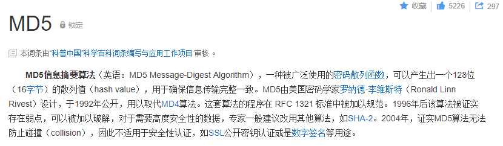

```java
//md5加密  DegestUtils：spring框架提供的工具类
String md5Str = DigestUtils.md5DigestAsHex("abc".getBytes());
System.out.println(md5Str);//900150983cd24fb0d6963f7d28e17f72
```

md5相同的密码每次加密都一样，不太安全

### 5.2 手动加密（md5+随机字符串）

在md5的基础上手动加盐（salt）处理

```java
//uername:zhangsan  password:123   salt:随时字符串
String salt = RandomStringUtils.randomAlphanumeric(10);//获取一个10位的随机字符串
System.out.println(salt);
String pswd = "123"+salt;

String saltPswd = DigestUtils.md5DigestAsHex(pswd.getBytes());
System.out.println(saltPswd);
```

这样同样的密码，加密多次值是不相同的，因为加入了随机字符串

### 5.3 . BCrypt密码加密

​	在用户模块，对于用户密码的保护，通常都会进行加密。我们通常对密码进行加密，然后存放在数据库中，在用户进行登录的时候，将其输入的密码进行加密然后与数据库中存放的密文进行比较，以验证用户密码是否正确。  目前，MD5和BCrypt比较流行。相对来说，BCrypt比MD5更安全。

BCrypt 官网[http://www.mindrot.org/projects/jBCrypt/](http://www.mindrot.org/projects/jBCrypt/)

（1）我们从官网下载源码

（2）新建工程，将源码类BCrypt拷贝到工程

（3）新建测试类，main方法中编写代码，实现对密码的加密

```java
String gensalt = BCrypt.gensalt();//这个是盐  29个字符，随机生成
System.out.println(gensalt);
String password = BCrypt.hashpw("123456", gensalt);  //根据盐对密码进行加密
System.out.println(password);//加密后的字符串前29位就是盐
```

（4）新建测试类，main方法中编写代码，实现对密码的校验。BCrypt不支持反运算，只支持密码校验。

```java
boolean checkpw = BCrypt.checkpw("123456",     "$2a$10$61ogZY7EXsMDWeVGQpDq3OBF1.phaUu7.xrwLyWFTOu8woE08zMIW");
System.out.println(checkpw);
```

## 6 jwt介绍

### 6.1 token认证

随着 Restful API、微服务的兴起，基于 Token 的认证现在已经越来越普遍。基于token的用户认证是一种**服务端无状态**的认证方式，所谓服务端无状态指的token本身包含登录用户所有的相关数据，而客户端在认证后的每次请求都会携带token，因此服务器端无需存放token数据。

​	当用户认证后，服务端生成一个token发给客户端，客户端可以放到 cookie 或 localStorage 等存储中，每次请求时带上 token，服务端收到token通过验证后即可确认用户身份。


### 6.2 什么是JWT？

​	我们现在了解了基于token认证的交互机制，但令牌里面究竟是什么内容？什么格式呢？市面上基于token的认证方式大都采用的是JWT(Json Web Token)。

​	JSON Web Token（JWT）是一个开放的行业标准（RFC 7519），它定义了一种简洁的、自包含的协议格式，用于在通信双方传递json对象，传递的信息经过数字签名可以被验证和信任。

**JWT令牌结构：**

JWT令牌由Header、Payload、Signature三部分组成，每部分中间使用点（.）分隔，比如：xxxxx.yyyyy.zzzzz

- Header

头部包括令牌的类型（即JWT）及使用的哈希算法（如HMAC、SHA256或RSA）。

一个例子：

```json
{
	"alg": "HS256"，
	"typ": "JWT"
}
```

将上边的内容使用Base64Url编码，得到一个字符串就是JWT令牌的第一部分。

- Payload

第二部分是负载，内容也是一个json对象，它是存放有效信息的地方，它可以存放jwt提供的现成字段，比
如：iss（签发者），exp（过期时间戳）， sub（面向的用户）等，也可自定义字段。
此部分不建议存放敏感信息，因为此部分可以解码还原原始内容。
一个例子：

```json
{
	"sub": "1234567890"，
	"name": "456"，
	"admin": true
}
```

最后将第二部分负载使用Base64Url编码，得到一个字符串就是JWT令牌的第二部分。

- Signature

第三部分是签名，此部分用于防止jwt内容被篡改。
这个部分使用base64url将前两部分进行编码，编码后使用点（.）连接组成字符串，最后使用header中声明
签名算法进行签名。
一个例子：

```json
HMACSHA256(
base64UrlEncode(header) + "." +
base64UrlEncode(payload)，
secret)
```

base64UrlEncode(header)：jwt令牌的第一部分。
base64UrlEncode(payload)：jwt令牌的第二部分。
secret：签名所使用的密钥。

下图中包含一个生成的jwt令牌：


### 6.3 生成token

需要引入jwt相关依赖

```xml
<dependency>
    <groupId>io.jsonwebtoken</groupId>
    <artifactId>jjwt</artifactId>
</dependency>
```

工具类

```java
package com.heima.utils.common;

import io.jsonwebtoken.*;

import javax.crypto.SecretKey;
import javax.crypto.spec.SecretKeySpec;
import java.util.*;

public class AppJwtUtil {

    // TOKEN的有效期一天（S）
    private static final int TOKEN_TIME_OUT = 3_600;
    // 加密KEY
    private static final String TOKEN_ENCRY_KEY = "MDk4ZjZiY2Q0NjIxZDM3M2NhZGU0ZTgzMjYyN2I0ZjY";
    // 最小刷新间隔(S)
    private static final int REFRESH_TIME = 300;

    // 生产ID
    public static String getToken(Long id){
        Map<String, Object> claimMaps = new HashMap<>();
        claimMaps.put("id",id);
        long currentTime = System.currentTimeMillis();
        return Jwts.builder()
                .setId(UUID.randomUUID().toString())
                .setIssuedAt(new Date(currentTime))  //签发时间
                .setSubject("system")  //说明
                .setIssuer("heima") //签发者信息
                .setAudience("app")  //接收用户
                .compressWith(CompressionCodecs.GZIP)  //数据压缩方式
                .signWith(SignatureAlgorithm.HS512, generalKey()) //加密方式
                .setExpiration(new Date(currentTime + TOKEN_TIME_OUT * 1000))  //过期时间戳
                .addClaims(claimMaps) //cla信息
                .compact();
    }

    /**
     * 获取token中的claims信息
     *
     * @param token
     * @return
     */
    private static Jws<Claims> getJws(String token) {
            return Jwts.parser()
                    .setSigningKey(generalKey())
                    .parseClaimsJws(token);
    }

    /**
     * 获取payload body信息
     *
     * @param token
     * @return
     */
    public static Claims getClaimsBody(String token) {
        try {
            return getJws(token).getBody();
        }catch (ExpiredJwtException e){
            return null;
        }
    }

    /**
     * 获取hearder body信息
     *
     * @param token
     * @return
     */
    public static JwsHeader getHeaderBody(String token) {
        return getJws(token).getHeader();
    }

    /**
     * 是否过期
     *
     * @param claims
     * @return -1：有效，0：有效，1：过期，2：过期
     */
    public static int verifyToken(Claims claims) {
        if(claims==null){
            return 1;
        }
        try {
            claims.getExpiration()
                    .before(new Date());
            // 需要自动刷新TOKEN
            if((claims.getExpiration().getTime()-System.currentTimeMillis())>REFRESH_TIME*1000){
                return -1;
            }else {
                return 0;
            }
        } catch (ExpiredJwtException ex) {
            return 1;
        }catch (Exception e){
            return 2;
        }
    }

    /**
     * 由字符串生成加密key
     *
     * @return
     */
    public static SecretKey generalKey() {
        byte[] encodedKey = Base64.getEncoder().encode(TOKEN_ENCRY_KEY.getBytes());
        SecretKey key = new SecretKeySpec(encodedKey, 0, encodedKey.length, "AES");
        return key;
    }

    public static void main(String[] args) {
       /* Map map = new HashMap();
        map.put("id","11");*/
        System.out.println(AppJwtUtil.getToken(1102L));
        Jws<Claims> jws = AppJwtUtil.getJws("eyJhbGciOiJIUzUxMiIsInppcCI6IkdaSVAifQ.H4sIAAAAAAAAADWLQQqEMAwA_5KzhURNt_qb1KZYQSi0wi6Lf9942NsMw3zh6AVW2DYmDGl2WabkZgreCaM6VXzhFBfJMcMARTqsxIG9Z888QLui3e3Tup5Pb81013KKmVzJTGo11nf9n8v4nMUaEY73DzTabjmDAAAA.4SuqQ42IGqCgBai6qd4RaVpVxTlZIWC826QA9kLvt9d-yVUw82gU47HDaSfOzgAcloZedYNNpUcd18Ne8vvjQA");
        Claims claims = jws.getBody();
        System.out.println(claims.get("id"));

    }
}
```

### 小结：

```
token
	其实就是令牌，在登录成功之后生成token令牌，并且放在请求头中进行返回浏览器
JWT
	json web token,其实是token的具体实现手段，是由三部分组成，头部，载荷，签名
	采用的是可逆加密算法，并且是对称性加密
	在生成token的时候进行加密
	在解析token的时候进行解密
	
这两个知识应用在什么位置?
	登录操作的时候必须携带token
	
问题:
	1、如何做到在访问其他服务之前先去查询是否携带有token,并且进行校验，校验成功则放行，校验失败则拦截？
	2、如何做到自动识别是登陆请求，生成token?
解决方案：在网关中可以实现，今天我们不会讲，在第三天讲网关的时候实现

```


## 7 admin端-登录实现

需求分析：

```
登录请求思路：
	根据入参的用户名，去查询ad_user表，如果有值我们获取数据库表中的密码password1
	根据入参的密码，进行md5和获取数据库表中的盐进行加密，去生成加密之后的密码Password
	然后password1和 password校验，如果成功则登录成功，否则登录失败。
	
	TODO...登录成功，则利用jwt去生成token，并且存储到请求头中。
表ad_user表
	name   登录名称
	password  密码(密文)
	salt  盐
	
```

ad_user 运营平台用户信息表


对应实体类

```java
package com.heima.model.admin.pojos;

import com.baomidou.mybatisplus.annotation.TableField;
import com.baomidou.mybatisplus.annotation.TableName;
import lombok.Data;

import java.io.Serializable;
import java.util.Date;

/**
 * <p>
 * 管理员用户信息表
 * </p>
 *
 * @author itheima
 */
@Data
@TableName("ad_user")
public class AdUser implements Serializable {

    private static final long serialVersionUID = 1L;

    /**
     * 主键
     */
    @TableId(type = IdType.AUTO)
    private Integer id;

    /**
     * 登录用户名
     */
    @TableField("name")
    private String name;

    /**
     * 登录密码
     */
    @TableField("password")
    private String password;

    /**
     * 盐
     */
    @TableField("salt")
    private String salt;

    /**
     * 昵称
     */
    @TableField("nickname")
    private String nickname;

    /**
     * 头像
     */
    @TableField("image")
    private String image;

    /**
     * 手机号
     */
    @TableField("phone")
    private String phone;

    /**
     * 状态
            0 暂时不可用
            1 永久不可用
            9 正常可用
     */
    @TableField("status")
    private Integer status;

    /**
     * 邮箱
     */
    @TableField("email")
    private String email;

    /**
     * 最后一次登录时间
     */
    @TableField("login_time")
    private Date loginTime;

    /**
     * 创建时间
     */
    @TableField("created_time")
    private Date createdTime;

}
```

### 7.1 接口定义

在heima-leadnews-apis中新建:com.heima.api.admin.LoginControllerApi

```java
package com.heima.api.admin;

import com.heima.model.admin.dtos.AdUserDto;
import com.heima.model.admin.pojos.AdUser;
import com.heima.model.common.dtos.ResponseResult;
import org.springframework.web.bind.annotation.RequestBody;

public interface LoginControllerApi {

    /**
     * admin登录功能
     * @param dto
     * @return
     */
    public ResponseResult login(@RequestBody AdUserDto dto);
}
```

AdUserDto

```java
package com.heima.model.admin.dtos;

import lombok.Data;

@Data
public class AdUserDto {

    //用户名
    private String name;

    //密码
    private String password;
}

```


### 7.2 mapper

```java
package com.heima.admin.mapper;

import com.baomidou.mybatisplus.core.mapper.BaseMapper;
import com.heima.model.admin.pojos.AdUser;

@Mapper
public interface AdUserMapper extends BaseMapper<AdUser> {
}
```


### 7.3 业务层代码

```java
package com.heima.admin.service;

import com.baomidou.mybatisplus.extension.service.IService;
import com.heima.model.admin.dtos.AdUserDto;
import com.heima.model.admin.pojos.AdUser;
import com.heima.model.common.dtos.ResponseResult;

public interface UserLoginService extends IService<AdUser> {
    /**
     * 登录功能
     * @param dto
     * @return
     */
    ResponseResult login(AdUserDto dto);
}
```

实现类：

```java
package com.heima.admin.service.impl;

import com.baomidou.mybatisplus.core.conditions.Wrapper;
import com.baomidou.mybatisplus.core.conditions.query.QueryWrapper;
import com.baomidou.mybatisplus.extension.service.impl.ServiceImpl;
import com.google.common.collect.Maps;
import com.heima.admin.mapper.AdUserMapper;
import com.heima.admin.service.UserLoginService;
import com.heima.model.admin.dtos.AdUserDto;
import com.heima.model.admin.pojos.AdUser;
import com.heima.model.common.dtos.ResponseResult;
import com.heima.model.common.enums.AppHttpCodeEnum;
import com.heima.utils.common.AppJwtUtil;
import com.heima.utils.common.MD5Utils;
import org.apache.commons.lang3.StringUtils;
import org.springframework.stereotype.Service;
import org.springframework.transaction.annotation.Transactional;
import org.springframework.util.DigestUtils;

import java.util.List;
import java.util.Map;

@Service
@Transactional
public class UserLoginServiceImpl extends ServiceImpl<AdUserMapper, AdUser> implements UserLoginService {
    @Override
    public ResponseResult login(AdUserDto dto) {
        //1.参数校验
        if (StringUtils.isEmpty(dto.getName()) || StringUtils.isEmpty(dto.getPassword())) {
            return ResponseResult.errorResult(AppHttpCodeEnum.PARAM_REQUIRE, "用户名或密码不能为空");
        }
        Wrapper wrapper = new QueryWrapper<AdUser>();
        ((QueryWrapper) wrapper).eq("name", dto.getName());
        
        List<AdUser> list = list(wrapper);
        if (list != null && list.size() == 1) {
            AdUser adUser = list.get(0);
            String pswd = DigestUtils.md5DigestAsHex((dto.getPassword() + adUser.getSalt()).getBytes());
            if (adUser.getPassword().equals(pswd)) {
                Map<String, Object> map = Maps.newHashMap();
                adUser.setPassword("");
                adUser.setSalt("");
                map.put("token", AppJwtUtil.getToken(adUser.getId().longValue()));
                map.put("user", adUser);
                return ResponseResult.okResult(map);
            } else {
                return ResponseResult.errorResult(AppHttpCodeEnum.LOGIN_PASSWORD_ERROR);
            }
        } else {
            return ResponseResult.errorResult(AppHttpCodeEnum.DATA_NOT_EXIST, "用户不存在");
        }
    }
}
```

### 7.4 控制层代码

```java
package com.heima.admin.controller.v1;

import com.heima.admin.service.UserLoginService;
import com.heima.apis.admin.LoginControllerApi;
import com.heima.model.admin.dtos.AdUserDto;
import com.heima.model.admin.pojos.AdUser;
import com.heima.model.common.dtos.ResponseResult;
import org.springframework.beans.factory.annotation.Autowired;
import org.springframework.web.bind.annotation.PostMapping;
import org.springframework.web.bind.annotation.RequestBody;
import org.springframework.web.bind.annotation.RequestMapping;
import org.springframework.web.bind.annotation.RestController;

@RestController
@RequestMapping("/login")
public class LoginController implements LoginControllerApi {

    @Autowired
    private UserLoginService userLoginService ;

    @Override
    @PostMapping("/in")
    public ResponseResult login(@RequestBody AdUserDto dto){
        return userLoginService.login(dto);
    }
}
```

### 7.5 测试

在表中创建一个用户guest，使用以下代码生成密码后修改表中的密码

```java
String salt = "123456";
String pswd = "guest"+salt;

String saltPswd = DigestUtils.md5DigestAsHex(pswd.getBytes());
System.out.println(saltPswd);
//34e20b52f5bd120db806e57e27f47ed0
```

生成密码后的结果为：

salt:123456

password:34e20b52f5bd120db806e57e27f47ed0

username:guest


接口工具测试，或者页面直接登录测试

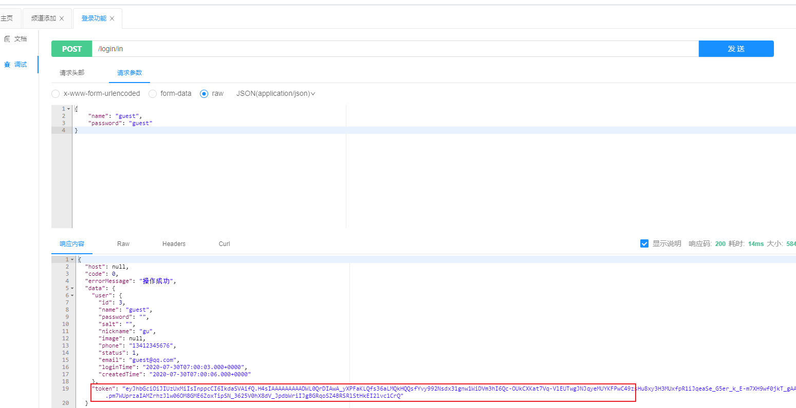

## 8 spring cloud nacos注册中心搭建

### 8.1 简介

Nacos是阿里的一个开源产品，它是针对微服务架构中的服务发现、配置管理、服务治理的综合型解决方案。
官方介绍是这样的：

> Nacos  致力于帮助您发现、配置和管理微服务。Nacos 提供了一组简单易用的特性集，帮助您实现动态服务
> 发现、服务配置管理、服务及流量管理。 Nacos 帮助您更敏捷和容易地构建、交付和管理微服务平台。
> Nacos 是构建以“服务”为中心的现代应用架构的服务基础设施。

官网地址：https://nacos.io

官方文档：https://nacos.io/zh-cn/docs/what-is-nacos.html

Nacos主要提供以下四大功能：

1. 服务发现与服务健康检查
   Nacos使服务更容易注册，并通过DNS或HTTP接口发现其他服务，Nacos还提供服务的实时健康检查，以防
   止向不健康的主机或服务实例发送请求。
2. 动态配置管理
   动态配置服务允许您在所有环境中以集中和动态的方式管理所有服务的配置。Nacos消除了在更新配置时重新
   部署应用程序，这使配置的更改更加高效和灵活。
3. 动态DNS服务
   Nacos提供基于DNS 协议的服务发现能力，旨在支持异构语言的服务发现，支持将注册在Nacos上的服务以
   域名的方式暴露端点，让三方应用方便的查阅及发现。
4. 服务和元数据管理
   Nacos 能让您从微服务平台建设的视角管理数据中心的所有服务及元数据，包括管理服务的描述、生命周
   期、服务的静态依赖分析、服务的健康状态、服务的流量管理、路由及安全策略。

### 8.2 虚拟机镜像准备

1)打开当天资料文件中的镜像，拷贝到一个地方，然后解压


2)解压后，双击`ContOS7-hmtt.vmx`文件，前提是电脑上已经安装了**VMware**


3) 修改虚拟网络地址（NAT）


①，选中VMware中的编辑

②，选择虚拟网络编辑器

③，找到NAT网卡，把网段改为200（当前挂载的虚拟机已固定ip地址）

④，修改虚拟机的网络模式为NAT,如下图


4）启动虚拟机，用户名：root   密码：itcast

可以使用工具连接


### 8.3 安装Nacos Server

在liunx下安装nacos必须先安装jdk8+才能运行

可以从https://github.com/alibaba/nacos/releases下载  `nacos -server-$version.zip` 包

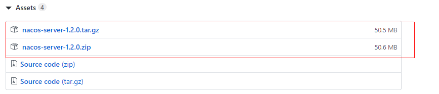

或者直接使用资料文件夹下已经提供好的安装包，上传到服务器上，上传服务器Alt+P


下载后解压：

```shell
unzip nacos‐server‐$version.zip 
或者 
tar ‐xvf nacos‐server‐$version.tar.gz
```

进入安装程序的bin目录：

```shell
sh startup.sh  -m standalone
```

如果您使用的是ubuntu系统，或者运行脚本报错提示[[符号找不到，可尝试如下运行：

```shell
bash startup.sh  -m standalone
```

如果是Windows，启动命令：

```shell
cmd startup.cmd  或者双击  startup.cmd 运行文件 
```

启动成功，可通过浏览器访问 http://192.168.200.130:8848/nacos  ，打开如下nacos控制台登录页面：

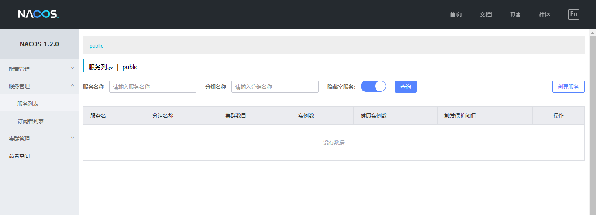

### 8.4 注册服务

在admin微服务中加入依赖

```xml
<dependency>
    <groupId>com.alibaba.cloud</groupId>
    <artifactId>spring-cloud-starter-alibaba-nacos-discovery</artifactId>
</dependency>
```

在admin微服务中的application.yml文件中加入配置

```yaml
spring:
  cloud:
    nacos:
      discovery:
        server-addr: 192.168.200.129:8848
```

引导类中加上注解`@EnableDiscoveryClient`可以让该服务注册到nacos注册中心上去


==注意：==

由于我们现在使用的是springBoot版本是高版本，可以不需要加`@EnableDiscoveryClient`注解也是可以的。

**测试：**

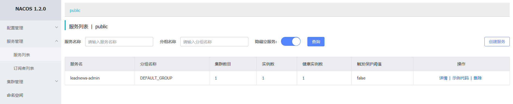


### 优化点：设置nacos开机自启动

第一步，进入/lib/systemd/system目录, 创建nacos.service文件

```shell
#1进入/目录下
cd /
#2进入system目录下
cd /lib/systemd/system
#3创建nacos.service文件
touch nacos.service 
#4查看nacos.service是否创建成功
ll nacos.service 
```

第二步，编辑nacos.service文件, 增加如下信息 (nacos路径替换成自己的路径即可）

```shell
#1编辑nacos.service
vi nacos.service
#2 加入信息
[Unit]
Description=nacos
After=network.target

[Service]
Type=forking
ExecStart=/root/nacos/bin/startup.sh -m standalone
ExecReload=/root/nacos/bin/shutdown.sh
ExecStop=/root/nacos/bin/shutdown.sh
PrivateTmp=true

[Install]
WantedBy=multi-user.target

==注意:root/nacos/bin是当前nacos执行脚本所在的路径，要改成你自己的
```

第三步，编辑nacos/bin目录下的startup.sh, 修改JAVA_HOME的路径, 注释其他三行.

```shell
#1切换到root目录下
cd ~
#2进入bin目录下
cd nacos/bin/
#3修改startup.sh
	注意：把JAVA_HOME的四行注释掉，然后添加一行,JAVA_HOME值等于jdk安装的目录地址
[ ! -e "$JAVA_HOME/bin/java" ] && JAVA_HOME=/usr/java/jdk1.8.0_161
```

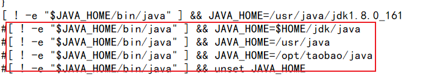

注意：如何查看jdk安装位置JAVA_HOME=/usr/local/jdk/jdk1.8.0_171

```
echo $JAVA_HOME
```

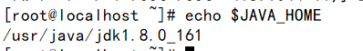

第四步，执行以下命令

```shell
#4.1. 重新加载所有service服务
systemctl daemon-reload
#4.2. 开机启动nacos.service
systemctl enable nacos.service
#4.3. 查看该service是否开机启用
systemctl is-enabled nacos.service
#4.4. 启动该服务
systemctl start nacos.service
#4.5. 查看该服务状态
systemctl status nacos.service
```


