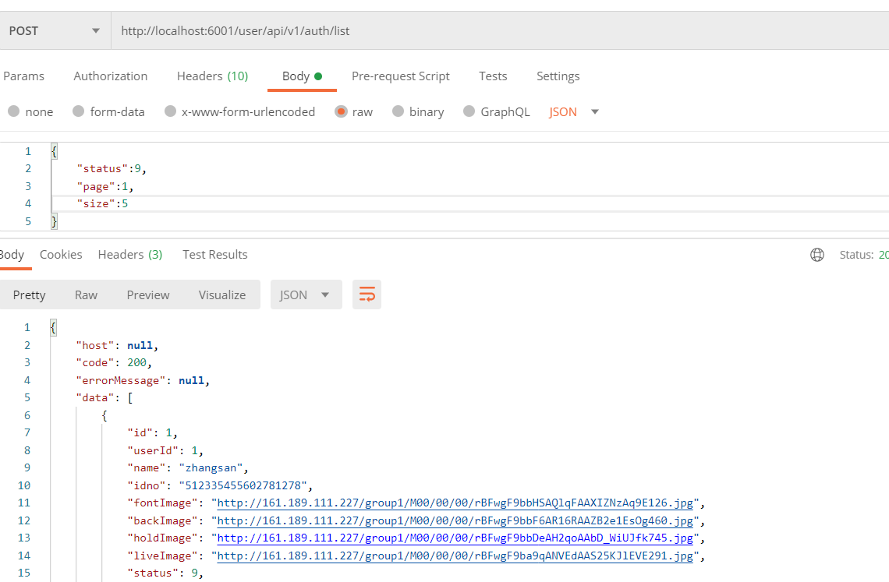

#  第三章 app端用户认证

## 目标

- 能够完成网关统一鉴权的功能

- 能够完成认证用户列表查询
- 能够熟悉app端用户认证审核流程
- 能够完成app用户审核代码开发

## 1 网关校验jwt

### 1.1 微服务网关概述

不同的微服务一般会有不同的网络地址，而外部客户端可能需要调用多个服务的接口才能完成一个业务需求，如果让客户端直接与各个微服务通信，会有以下的问题：

- 客户端会多次请求不同的微服务，增加了客户端的复杂性
- 存在跨域请求，在一定场景下处理相对复杂
- 认证复杂，每个服务都需要独立认证
- 难以重构，随着项目的迭代，可能需要重新划分微服务。例如，可能将多个服务合并成一个或者将一个服务拆分成多个。如果客户端直接与微服务通信，那么重构将会很难实施
- 某些微服务可能使用了防火墙 / 浏览器不友好的协议，直接访问会有一定的困难

以上这些问题可以借助网关解决。

网关是介于客户端和服务器端之间的中间层，所有的外部请求都会先经过 网关这一层。也就是说，API 的实现方面更多的考虑业务逻辑，而安全、性能、监控可以交由 网关来做，这样既提高业务灵活性又不缺安全性，典型的架构图如图所示：


优点如下：

- 安全 ，只有网关系统对外进行暴露，微服务可以隐藏在内网，通过防火墙保护。
- 易于监控。可以在网关收集监控数据并将其推送到外部系统进行分析。
- 易于认证。可以在网关上进行认证，然后再将请求转发到后端的微服务，而无须在每个微服务中进行认证。
- 减少了客户端与各个微服务之间的交互次数
- 易于统一授权。

总结：微服务网关就是一个系统，通过暴露该微服务网关系统，方便我们进行相关的鉴权，安全控制，日志统一处理，易于监控的相关功能。

实现微服务网关的技术有很多，

- nginx  Nginx (engine x) 是一个高性能的[HTTP](https://baike.baidu.com/item/HTTP)和[反向代理](https://baike.baidu.com/item/%E5%8F%8D%E5%90%91%E4%BB%A3%E7%90%86/7793488)web服务器，同时也提供了IMAP/POP3/SMTP服务
- zuul ,Zuul 是 Netflix 出品的一个基于 JVM 路由和服务端的负载均衡器。
- spring-cloud-gateway, 是spring 出品的 基于spring 的网关项目，集成断路器，路径重写，性能比Zuul好。

我们使用gateway这个网关技术，无缝衔接到基于spring cloud的微服务开发中来。

gateway官网：

https://spring.io/projects/spring-cloud-gateway

### 1.2 搭建gateway网关微服务

（1）创建heima-leadnews-admin-gateway微服务

pom文件

```xml
<dependencies>
    <dependency>
        <groupId>org.springframework.cloud</groupId>
        <artifactId>spring-cloud-starter-gateway</artifactId>
    </dependency>
    <dependency>
        <groupId>com.alibaba.cloud</groupId>
        <artifactId>spring-cloud-starter-alibaba-nacos-discovery</artifactId>
    </dependency>
    <dependency>
        <groupId>io.jsonwebtoken</groupId>
        <artifactId>jjwt</artifactId>
    </dependency>
</dependencies>
```

引导类：

```java
package com.heima.admin.gateway;

import org.springframework.boot.SpringApplication;
import org.springframework.boot.autoconfigure.SpringBootApplication;
import org.springframework.cloud.client.discovery.EnableDiscoveryClient;

@SpringBootApplication
@EnableDiscoveryClient  //开启注册中心,也可以不加
public class GatewayApplication {

    public static void main(String[] args) {
        SpringApplication.run(GatewayApplication.class,args);
    }
}
```

application.yml

```yaml
server:
  port: 6001
spring:
  application:
    name: leadnews-admin-gateway
  cloud:
    nacos:
      discovery:
        server-addr: 192.168.200.129:8848
    gateway:
      globalcors:
        cors-configurations:
          '[/**]': # 匹配所有请求
            allowedOrigins: "*" #跨域处理 允许所有的域
            allowedMethods: # 支持的方法
            - GET
            - POST
            - PUT
            - DELETE
      routes:
      # 平台管理
      - id: admin
        uri: lb://leadnews-admin
        predicates:
        - Path=/admin/**
        filters:  
        - StripPrefix= 1
```

### 1.3 全局过滤器实现jwt校验


问题：

```
1、如何判断当前请求到底是登录请求还是其他请求？
2、非登录请求一定要去拦截，校验token,如何校验？
```

思路分析：

1. 用户进入网关开始登陆，网关过滤器进行判断，如果是登录，则路由到后台管理微服务进行登录
2. 用户登录成功，后台管理微服务签发JWT TOKEN信息返回给用户
3. 用户再次进入网关开始访问，网关过滤器接收用户携带的TOKEN
4. 网关过滤器解析TOKEN ，判断是否有权限，如果有，则放行，如果没有则返回未认证错误

在网关微服务中新建全局过滤器：

第一步，准备工具类

把heima-leadnews-utils模块中的AppJwtUtil类拷贝到网关模块下，如下图：


第二步，编写全局过滤器

```java
package com.heima.admin.gateway.filter;

import com.heima.admin.gateway.utils.AppJwtUtil;
import io.jsonwebtoken.Claims;
import lombok.extern.log4j.Log4j2;
import org.apache.commons.lang3.StringUtils;
import org.springframework.cloud.gateway.filter.GatewayFilterChain;
import org.springframework.cloud.gateway.filter.GlobalFilter;
import org.springframework.core.Ordered;
import org.springframework.http.HttpHeaders;
import org.springframework.http.HttpStatus;
import org.springframework.http.server.reactive.ServerHttpRequest;
import org.springframework.http.server.reactive.ServerHttpResponse;
import org.springframework.stereotype.Component;
import org.springframework.web.server.ServerWebExchange;
import reactor.core.publisher.Mono;

@Component
@Log4j2
public class AuthorizeFilter implements GlobalFilter, Ordered {
    @Override
    public Mono<Void> filter(ServerWebExchange exchange, GatewayFilterChain chain) {
        //1.获取请求对象和响应对象
        ServerHttpRequest request = exchange.getRequest();
        ServerHttpResponse response = exchange.getResponse();
        //2.判断当前的请求是否为登录，如果是，直接放行
        if(request.getURI().getPath().contains("/login/in")){
            //放行
            return chain.filter(exchange);
        }

        //3.获取当前用户的请求头jwt信息
        HttpHeaders headers = request.getHeaders();
        String jwtToken = headers.getFirst("token");

        //4.判断当前令牌是否存在
        if(StringUtils.isEmpty(jwtToken)){
            //如果不存在，向客户端返回错误提示信息
            response.setStatusCode(HttpStatus.UNAUTHORIZED);
            return response.setComplete();
        }

        try {
            //5.如果令牌存在，解析jwt令牌，判断该令牌是否合法，如果不合法，则向客户端返回错误信息
            Claims claims = AppJwtUtil.getClaimsBody(jwtToken);
            int result = AppJwtUtil.verifyToken(claims);
            if(result == 0 || result == -1){
                //5.1 合法，则向header中重新设置userId
                Integer id = (Integer) claims.get("id");
                log.info("find userid:{} from uri:{}",id,request.getURI());
                //重新设置token到header中
                ServerHttpRequest serverHttpRequest = request.mutate().headers(httpHeaders -> {
                    httpHeaders.add("userId", id + "");
                }).build();
                exchange.mutate().request(serverHttpRequest).build();
            }
        }catch (Exception e){
            e.printStackTrace();
            //想客户端返回错误提示信息
            response.setStatusCode(HttpStatus.UNAUTHORIZED);
            return response.setComplete();
        }


        //6.放行
        return chain.filter(exchange);
    }

    /**
     * 优先级设置
     * 值越小，优先级越高
     * @return
     */
    @Override
    public int getOrder() {
        return 0;
    }
}
```

测试：

启动admin服务，继续访问其他微服务，会提示需要认证才能访问，这个时候需要在heads中设置token才能正常访问。

==访问admin服务中的频道查询，发现报401==


==先执行登录操作，获取token，然后携带着token去访问频道查询==


## 2 app端用户认证列表查询

### 2.1 需求分析

```
在哪个系统中实现这个功能？
	运营管理系统中实现
涉及的是哪张表？
	leadnews-user库中的ap_user_realname
	ap_user_realname表和ap_user表是什么关系
		一对一的关系
ap_user_realname表的数据来源于哪？
	app端用户通过app系统进行先注册在审核
	注册在ap_user表中，然后审核在ap_user_realname表中
```


当用户在app前端进行了认证请求会自动往ap_user_realname表中加入数据，目前所查询的就是用户认证列表

默认查询待审核的信息，也可以根据状态进行过滤


ap_user_realname


对应的实体类：

```java
package com.heima.model.user.pojos;

import com.baomidou.mybatisplus.annotation.IdType;
import com.baomidou.mybatisplus.annotation.TableField;
import com.baomidou.mybatisplus.annotation.TableId;
import com.baomidou.mybatisplus.annotation.TableName;
import lombok.Data;

import java.io.Serializable;
import java.util.Date;

/**
 * <p>
 * APP实名认证信息表
 * </p>
 *
 * @author itheima
 */
@Data
@TableName("ap_user_realname")
public class ApUserRealname implements Serializable {

    private static final long serialVersionUID = 1L;

    /**
     * 主键
     */
    @TableId(value = "id", type = IdType.AUTO)
    private Integer id;

    /**
     * 账号ID
     */
    @TableField("user_id")
    private Integer userId;

    /**
     * 用户名称
     */
    @TableField("name")
    private String name;

    /**
     * 资源名称
     */
    @TableField("idno")
    private String idno;

    /**
     * 正面照片
     */
    @TableField("font_image")
    private String fontImage;

    /**
     * 背面照片
     */
    @TableField("back_image")
    private String backImage;

    /**
     * 手持照片
     */
    @TableField("hold_image")
    private String holdImage;

    /**
     * 活体照片
     */
    @TableField("live_image")
    private String liveImage;

    /**
     * 状态
            0 创建中
            1 待审核
            2 审核失败
            9 审核通过
     */
    @TableField("status")
    private Short status;

    /**
     * 拒绝原因
     */
    @TableField("reason")
    private String reason;

    /**
     * 创建时间
     */
    @TableField("created_time")
    private Date createdTime;

    /**
     * 提交时间
     */
    @TableField("submited_time")
    private Date submitedTime;

    /**
     * 更新时间
     */
    @TableField("updated_time")
    private Date updatedTime;

}
```

### 2.2 新建user微服务

（1）新建模块：heima-leadnews-user

- 定义包名
- 新建引导类  参考其他微服务创建
- pom文件引入，参考其他微服务


（3）在resources下新建application.yml

```yaml
server:
  port: 9002
spring:
  application:
    name: leadnews-user
  cloud:
    nacos:
      discovery:
        server-addr: 192.168.200.130:8848
  datasource:
    driver-class-name: com.mysql.jdbc.Driver
    url: jdbc:mysql://localhost:3306/leadnews_user?useUnicode=true&characterEncoding=UTF-8&serverTimezone=Asia/Shanghai
    username: root
    password: root
# 设置Mapper接口所对应的XML文件位置，如果你在Mapper接口中有自定义方法，需要进行该配置
mybatis-plus:
  mapper-locations: classpath*:mapper/*.xml
  # 设置别名包扫描路径，通过该属性可以给包中的类注册别名
  type-aliases-package: com.heima.model.user.pojos
```

### 2.3 接口定义

在heima-leadnews-apis模块中新增接口：com.heima.api.user.ApUserRealnameControllerApi

```java
package com.heima.api.user;

import com.heima.model.common.dtos.PageResponseResult;
import com.heima.model.user.dtos.AuthDto;

public interface ApUserRealnameControllerApi {

    /**
     *按照状态查询用户认证列表
     * @param dto
     * @return
     */
    public PageResponseResult loadListByStatus(AuthDto dto);

}
```

AuthDto

```java
package com.heima.model.user.dtos;

import com.heima.model.common.dtos.PageRequestDto;
import lombok.Data;

@Data
public class AuthDto extends PageRequestDto {
    
    private Integer id;
    //驳回的信息
    private String msg;
    //状态
    private Short status;
}
```

### 2.4 mapper

在user微服务下新建mapper接口:com.heima.user.mapper.ApUserRealnameMapper

```java
package com.heima.user.mapper;

import com.baomidou.mybatisplus.core.mapper.BaseMapper;
import com.heima.model.user.pojos.ApUserRealname;
import org.apache.ibatis.annotations.Mapper;

@Mapper
public interface ApUserRealnameMapper extends BaseMapper<ApUserRealname> {
}
```

### 2.5 业务层

新建业务层接口：com.heima.user.service.ApUserRealnameService

```java
package com.heima.user.service;

import com.baomidou.mybatisplus.extension.service.IService;
import com.heima.model.common.dtos.PageResponseResult;
import com.heima.model.user.dtos.AuthDto;
import com.heima.model.user.pojos.ApUserRealname;

public interface ApUserRealnameService extends IService<ApUserRealname> {

    /**
     * 根据状态查询需要认证相关的用户信息
     * @param dto
     * @return
     */
    PageResponseResult loadListByStatus(AuthDto dto);

}
```

实现类：

```java
package com.heima.user.service.impl;

import com.baomidou.mybatisplus.core.conditions.query.QueryWrapper;
import com.baomidou.mybatisplus.core.metadata.IPage;
import com.baomidou.mybatisplus.extension.plugins.pagination.Page;
import com.baomidou.mybatisplus.extension.service.impl.ServiceImpl;
import com.heima.model.common.dtos.PageResponseResult;
import com.heima.model.common.dtos.ResponseResult;
import com.heima.model.common.enums.AppHttpCodeEnum;
import com.heima.model.user.dtos.AuthDto;
import com.heima.model.user.pojos.ApUserRealname;
import com.heima.user.mapper.ApUserRealnameMapper;
import com.heima.user.service.ApUserRealnameService;
import org.springframework.stereotype.Service;

@Service
public class ApUserRealnameServiceImpl extends ServiceImpl<ApUserRealnameMapper, ApUserRealname> implements ApUserRealnameService {


    @Override
    public PageResponseResult loadListByStatus(AuthDto dto) {
        //参数为空
        if (dto == null) {
            return (PageResponseResult) ResponseResult.errorResult(AppHttpCodeEnum.PARAM_INVALID);
        }
        //检查参数
        dto.checkParam();
        QueryWrapper<ApUserRealname> queryWrapper = new QueryWrapper<ApUserRealname>();
        if(dto.getStatus()!=null){
            queryWrapper.lambda().eq(ApUserRealname::getStatus,dto.getStatus());
        }
        IPage pageParam = new Page(dto.getPage(),dto.getSize());
        IPage page = page(pageParam, queryWrapper);
        PageResponseResult responseResult = new PageResponseResult(dto.getPage(),dto.getSize(),(int)page.getTotal());
        responseResult.setCode(0);
        responseResult.setData(page.getRecords());
        return responseResult;
    }
}
```

### 2.6 控制层

```java
package com.heima.user.controller.v1;

import com.heima.api.user.ApUserRealnameControllerApi;
import com.heima.model.common.dtos.PageResponseResult;
import com.heima.model.user.dtos.AuthDto;
import com.heima.user.service.ApUserRealnameService;
import org.springframework.beans.factory.annotation.Autowired;
import org.springframework.web.bind.annotation.PostMapping;
import org.springframework.web.bind.annotation.RequestBody;
import org.springframework.web.bind.annotation.RequestMapping;
import org.springframework.web.bind.annotation.RestController;

@RestController
@RequestMapping("/api/v1/auth")
public class ApUserRealnameController implements ApUserRealnameControllerApi {

    @Autowired
    private ApUserRealnameService userRealnameService;

    @PostMapping("/list")
    @Override
    public PageResponseResult loadListByStatus(@RequestBody AuthDto dto){
        return userRealnameService.loadListByStatus(dto);
    }
}
```

### 2.7 测试

打开前端工程整合测试或者postman

由于整合了token,所以必须先登录获取token

```
POST localhost:6001/admin/login/in
```


查询用户认证列表，查询审核通过的

```
POST localhost:6001/usr/api/v1/auth/list
入参：
{
	"status":9,
	"page":1,
	"size":5
}
```



### 2.8 前后端联调测试

注意：目前来说前台直接调用的具体的微服务，其实实际上应该访问的网关(通过网关路由到具体的微服务中)


## 3 app端用户认证后审核

### 3.1 需求分析

```
认证审核流程步骤：
	1、当点击运营系统中的用户审核界面中的通过或者驳回按钮的时候，其实是修改ap_user_realname表中的status状态值
	2、如果点击的是通过按钮，表示审核通过，
		2.1 那么创建自媒体用户wm_user表，在自媒体leadnews-wemedia服务 中实现
				两个接口：第一个是根据自媒体用户名去查询自媒体wm_user表
						第二个是保存自媒体用户
		2.2 创建文章作者ap_author表  ，在app leadnews-article服务中实现
				两个接口：第一个是用户id查询作者信息
						第二个是保存文章作者
		2.3 用户审核  在leadnews-user服务中实现
				两个接口:审核通过和审核驳回
	3、调用顺序
		第一种方式：
		leadnews-admin可以通过feign接口调用user服务，wemedia,article
		第二种方式：(案例中)
		在admin-gateway网关中路由到leadnews-user服务中，在当前服务中feign接口调用自媒体和文章作者接口
		
				
```


流程说明


- 在app端的个人中心用户可以实名认证，需要材料为：姓名、身份证号、身份证正面照、身份证反面照、手持照片、活体照片（通过**微笑、眨眼、张嘴、摇头、点头**等组合动作，确保操作的为真实活体人脸。），当用户提交审核后就到了后端让运营管理人员进行审核
- 平台运营端查看用户认证信息，进行审核，其中审核包括了用户身份审核，需要对接公安系统校验身份证信息
- 用户通过审核后需要开通自媒体账号（该账号的用户名和密码与app一致）
- 用户通过审核后需要在article中在作者表中新建一个作者信息

==分析用户审核涉及到的表结构关系==


### 3.2 自媒体用户保存

#### 3.2.1 wemedia微服务搭建

（1）新建heima-leadnews-wemedia模块，引导类和pom配置参考其他微服务


（2）resources下新建application.yml

```yaml
server:
  port: 9004
spring:
  application:
    name: leadnews-wemedia
  cloud:
    nacos:
      discovery:
        server-addr: 192.168.200.130:8848
  datasource:
    driver-class-name: com.mysql.jdbc.Driver
    url: jdbc:mysql://localhost:3306/leadnews_wemedia?useUnicode=true&characterEncoding=UTF-8&serverTimezone=Asia/Shanghai
    username: root
    password: root
# 设置Mapper接口所对应的XML文件位置，如果你在Mapper接口中有自定义方法，需要进行该配置
mybatis-plus:
  mapper-locations: classpath*:mapper/*.xml
  # 设置别名包扫描路径，通过该属性可以给包中的类注册别名
  type-aliases-package: com.heima.model.media.pojos
```

#### 3.2.2 自媒体用户保存和按照用户名查询

wm_user 自媒体用户表


实体类：

```java
package com.heima.model.media.pojos;

import com.baomidou.mybatisplus.annotation.IdType;
import com.baomidou.mybatisplus.annotation.TableField;
import com.baomidou.mybatisplus.annotation.TableId;
import com.baomidou.mybatisplus.annotation.TableName;
import lombok.Data;

import java.io.Serializable;
import java.util.Date;

/**
 * <p>
 * 自媒体用户信息表
 * </p>
 *
 * @author itheima
 */
@Data
@TableName("wm_user")
public class WmUser implements Serializable {

    private static final long serialVersionUID = 1L;

    /**
     * 主键
     */
    @TableId(value = "id", type = IdType.AUTO)
    private Integer id;

    @TableField("ap_user_id")
    private Integer apUserId;

    @TableField("ap_author_id")
    private Integer apAuthorId;

    /**
     * 登录用户名
     */
    @TableField("name")
    private String name;

    /**
     * 登录密码
     */
    @TableField("password")
    private String password;

    /**
     * 盐
     */
    @TableField("salt")
    private String salt;

    /**
     * 昵称
     */
    @TableField("nickname")
    private String nickname;

    /**
     * 头像
     */
    @TableField("image")
    private String image;

    /**
     * 归属地
     */
    @TableField("location")
    private String location;

    /**
     * 手机号
     */
    @TableField("phone")
    private String phone;

    /**
     * 状态
            0 暂时不可用
            1 永久不可用
            9 正常可用
     */
    @TableField("status")
    private Integer status;

    /**
     * 邮箱
     */
    @TableField("email")
    private String email;

    /**
     * 账号类型
            0 个人 
            1 企业
            2 子账号
     */
    @TableField("type")
    private Integer type;

    /**
     * 运营评分
     */
    @TableField("score")
    private Integer score;

    /**
     * 最后一次登录时间
     */
    @TableField("login_time")
    private Date loginTime;

    /**
     * 创建时间
     */
    @TableField("created_time")
    private Date createdTime;

}
```


（1）接口定义

在heima-leadnews-apis中新建接口：com.heima.api.wemedia.WmUserControllerApi

```java
package com.heima.api.wemedia;

import com.heima.model.common.dtos.ResponseResult;
import com.heima.model.media.pojos.WmUser;

public interface WmUserControllerApi {

    /**
     * 保存自媒体用户
     * @param wmUser
     * @return
     */
    public ResponseResult save(WmUser wmUser);

    /**
     * 按照名称查询用户
     * @param name
     * @return
     */
    public WmUser findByName(String name);
}
```

（2）mapper定义

新建接口com.heima.wemedia.mapper.WmUserMapper

```java
package com.heima.wemedia.mapper;

import com.baomidou.mybatisplus.core.mapper.BaseMapper;
import com.heima.model.media.pojos.WmUser;
import org.apache.ibatis.annotations.Mapper;

@Mapper
public interface WmUserMapper extends BaseMapper<WmUser> {
}
```

（3）业务层

新建接口：com.heima.wemedia.service.WmUserService

```java
package com.heima.wemedia.service;

import com.baomidou.mybatisplus.extension.service.IService;
import com.heima.model.media.pojos.WmUser;

public interface WmUserService extends IService<WmUser> {
}
```

实现类：

```java
package com.heima.wemedia.service.impl;

import com.baomidou.mybatisplus.extension.service.impl.ServiceImpl;
import com.heima.model.media.pojos.WmUser;
import com.heima.wemedia.mapper.WmUserMapper;
import com.heima.wemedia.service.WmUserService;
import org.springframework.stereotype.Service;

@Service
public class WmUserServiceImpl extends ServiceImpl<WmUserMapper, WmUser> implements WmUserService {
}
```

(4)控制层

```java
@RestController
@RequestMapping("/api/v1/user")
public class WmUserController implements WmUserControllerApi {

    @Autowired
    private WmUserService userService;

    @PostMapping("/save")
    @Override
    public ResponseResult save(@RequestBody WmUser wmUser){
        userService.save(wmUser);
        return ResponseResult.okResult(AppHttpCodeEnum.SUCCESS);
    }

    @GetMapping("/findByName/{name}")
    @Override
    public WmUser findByName(@PathVariable("name") String name){
        List<WmUser> list = userService.list(Wrappers.<WmUser>lambdaQuery().eq(WmUser::getName, name));
        if(list!=null && !list.isEmpty()){
            return list.get(0);
        }
        return null;
    }
}
```

### 3.3 创建作者

#### 3.3.1 article微服务创建

(1)新建模块heima-leadnews-article,其中引导类和pom文件依赖参考其他微服务


（2）resources下新建application.yml

```yml
server:
  port: 9003
spring:
  application:
    name: leadnews-article
  cloud:
    nacos:
      discovery:
        server-addr: 192.168.200.130:8848
  datasource:
    driver-class-name: com.mysql.jdbc.Driver
    url: jdbc:mysql://localhost:3306/leadnews_article?useUnicode=true&characterEncoding=UTF-8&serverTimezone=Asia/Shanghai
    username: root
    password: root
# 设置Mapper接口所对应的XML文件位置，如果你在Mapper接口中有自定义方法，需要进行该配置
mybatis-plus:
  mapper-locations: classpath*:mapper/*.xml
  # 设置别名包扫描路径，通过该属性可以给包中的类注册别名
  type-aliases-package: com.heima.model.article.pojos
```

#### 3.3.2 查询作者和保存作者

ap_author  作者信息表


对应实体类：

```java
package com.heima.model.article.pojos;

import com.baomidou.mybatisplus.annotation.IdType;
import com.baomidou.mybatisplus.annotation.TableField;
import com.baomidou.mybatisplus.annotation.TableId;
import com.baomidou.mybatisplus.annotation.TableName;
import lombok.Data;

import java.io.Serializable;
import java.util.Date;

/**
 * <p>
 * APP文章作者信息表
 * </p>
 *
 * @author itheima
 */
@Data
@TableName("ap_author")
public class ApAuthor implements Serializable {

    private static final long serialVersionUID = 1L;

    /**
     * 主键
     */
    @TableId(value = "id", type = IdType.AUTO)
    private Integer id;

    /**
     * 作者名称
     */
    @TableField("name")
    private String name;

    /**
     * 0 爬取数据
            1 签约合作商
            2 平台自媒体人
            
     */
    @TableField("type")
    private Integer type;

    /**
     * 社交账号ID
     */
    @TableField("user_id")
    private Integer userId;

    /**
     * 创建时间
     */
    @TableField("created_time")
    private Date createdTime;

    /**
     * 自媒体账号
     */
    @TableField("wm_user_id")
    private Integer wmUserId;

}
```


(1)接口定义：com.heima.api.article.AuthorControllerApi

```java
package com.heima.api.article;

import com.heima.model.article.pojos.ApAuthor;
import com.heima.model.common.dtos.ResponseResult;
import org.springframework.web.bind.annotation.PathVariable;
import org.springframework.web.bind.annotation.RequestBody;

public interface AuthorControllerApi {

    /**
     *根据用户id查询作者信息
     * @param id
     * @return
     */
    public ApAuthor findByUserId(@PathVariable("id") Integer id);

    /**
     * 保存作者
     * @param apAuthor
     * @return
     */
    public ResponseResult save(@RequestBody ApAuthor apAuthor);
}
```

(2)mapper接口

新建mapper接口：com.heima.article.mapper.AuthorMapper

```java
package com.heima.article.mapper;

import com.baomidou.mybatisplus.core.mapper.BaseMapper;
import com.heima.model.article.pojos.ApAuthor;
import org.apache.ibatis.annotations.Mapper;

@Mapper
public interface AuthorMapper extends BaseMapper<ApAuthor> {
}
```

(3)业务层

新建接口：com.heima.article.service.AuthorService

```java
package com.heima.article.service;

import com.baomidou.mybatisplus.extension.service.IService;
import com.heima.model.article.pojos.ApAuthor;

public interface AuthorService extends IService<ApAuthor> {
}
```

实现类：

```java
package com.heima.article.service.impl;

import com.baomidou.mybatisplus.extension.service.impl.ServiceImpl;
import com.heima.article.mapper.AuthorMapper;
import com.heima.article.service.AuthorService;
import com.heima.model.article.pojos.ApAuthor;
import org.springframework.stereotype.Service;

@Service
public class AuthorServiceImpl extends ServiceImpl<AuthorMapper, ApAuthor> implements AuthorService {
}
```

(4)控制层

新建控制器：com.heima.article.controller.AuthorController

```java
package com.heima.article.controller.v1;

import com.baomidou.mybatisplus.core.toolkit.Wrappers;
import com.heima.api.article.AuthorControllerApi;
import com.heima.article.service.AuthorService;
import com.heima.model.article.pojos.ApAuthor;
import com.heima.model.common.dtos.ResponseResult;
import com.heima.model.common.enums.AppHttpCodeEnum;
import org.springframework.beans.factory.annotation.Autowired;
import org.springframework.web.bind.annotation.*;

import java.util.List;

@RestController
@RequestMapping("/api/v1/author")
public class AuthorController implements AuthorControllerApi {

    @Autowired
    private AuthorService authorService;

    @GetMapping("/findByUserId/{id}")
    @Override
    public ApAuthor findByUserId(@PathVariable("id") Integer id){
        List<ApAuthor> list = authorService.list(Wrappers.<ApAuthor>lambdaQuery().eq(ApAuthor::getUserId, id));
        if(list!=null &&!list.isEmpty()){
            return list.get(0);
        }
        return null;
    }

    @PostMapping("/save")
    @Override
    public ResponseResult save(@RequestBody ApAuthor apAuthor){
        apAuthor.setCreatedTime(new Date());
        authorService.save(apAuthor);
        return ResponseResult.okResult(AppHttpCodeEnum.SUCCESS);
    }

}
```

### 3.4 用户审核接口定义

修改com.heima.api.user.ApUserRealnameControllerApi新增方法

```java
/**
     * 审核通过
     * @param dto
     * @return
     */
public ResponseResult authPass(AuthDto dto) ;

/**
     * 审核失败
     * @param dto
     * @return
     */
public ResponseResult authFail(AuthDto dto);
```


### 3.6 用户审核mapper接口定义

在新建自媒体账户时需要把apuser信息赋值给自媒体用户

app端用户信息表ap-user

 

#### 在heima-leadnews-model中新增实体类

```java
package com.heima.model.user.pojos;

import com.baomidou.mybatisplus.annotation.IdType;
import com.baomidou.mybatisplus.annotation.TableId;
import java.io.Serializable;
import java.util.Date;

import lombok.Data;
import com.baomidou.mybatisplus.annotation.TableField;
import com.baomidou.mybatisplus.annotation.TableName;

/**
 * <p>
 * APP用户信息表
 * </p>
 *
 * @author itheima
 */
@Data
@TableName("ap_user")
public class ApUser implements Serializable {

    private static final long serialVersionUID = 1L;

    /**
     * 主键
     */
    @TableId(value = "id", type = IdType.AUTO)
    private Integer id;

    /**
     * 密码、通信等加密盐
     */
    @TableField("salt")
    private String salt;

    /**
     * 用户名
     */
    @TableField("name")
    private String name;

    /**
     * 密码,md5加密
     */
    @TableField("password")
    private String password;

    /**
     * 手机号
     */
    @TableField("phone")
    private String phone;

    /**
     * 头像
     */
    @TableField("image")
    private String image;

    /**
     * 0 男
            1 女
            2 未知
     */
    @TableField("sex")
    private Boolean sex;

    /**
     * 0 未
            1 是
     */
    @TableField("is_certification")
    private Boolean certification;

    /**
     * 是否身份认证
     */
    @TableField("is_identity_authentication")
    private Boolean identityAuthentication;

    /**
     * 0正常
            1锁定
     */
    @TableField("status")
    private Boolean status;

    /**
     * 0 普通用户
            1 自媒体人
            2 大V
     */
    @TableField("flag")
    private Boolean flag;

    /**
     * 注册时间
     */
    @TableField("created_time")
    private Date createdTime;

}
```

#### 在heima-leadnews-user模块中新增mapper接口

```java
package com.heima.user.mapper;

import com.baomidou.mybatisplus.core.mapper.BaseMapper;
import com.heima.model.user.pojos.ApUser;
import org.apache.ibatis.annotations.Mapper;

@Mapper
public interface ApUserMapper extends BaseMapper<ApUser> {
}
```


### 3.7 feign远程接口定义

#### 3.6.1 user微服务开启远程调用

修改pom文件，加入依赖

```xml
 <dependency>
     <groupId>org.springframework.cloud</groupId>
     <artifactId>spring-cloud-starter-openfeign</artifactId>
</dependency>
```

修改引导类，添加注解`@EnableFeignClients`开启远程调用

```java
@SpringBootApplication
@EnableDiscoveryClient
@EnableFeignClients
@MapperScan("com.heima.user.mapper")
public class UserApplication {

    public static void main(String[] args) {
        SpringApplication.run(UserApplication.class,args);
    }

    /**
     * mybatis-plus分页插件
     */
    @Bean
    public PaginationInterceptor paginationInterceptor() {
        return new PaginationInterceptor();
    }
}
```

#### 3.6.2 自媒体远程接口

新建接口com.heima.user.feign.ApAuthorFeign

```java
@FeignClient("leadnews-article")
public interface ArticleFeign {

    @GetMapping("/api/v1/author/findByUserId/{id}")
    public ApAuthor findByUserId(@PathVariable("id") Integer id);

    @PostMapping("/api/v1/author/save")
    public ResponseResult save(@RequestBody ApAuthor apAuthor);
}
```

#### 3.6.3 作者远程调用接口

新建接口：com.heima.user.feign.WmUserFeign

```java
@FeignClient("leadnews-wemedia")
public interface WemediaFeign {

    @PostMapping("/api/v1/user/save")
    public ResponseResult save(@RequestBody WmUser wmUser);

    @GetMapping("/api/v1/user/findByName/{name}")
    public WmUser findByName(@PathVariable("name") String name);
}
```

### 3.5用户审核业务层

#### 新建常量类：

com.heima.common.constants.user.UserConstants

```java
public class UserConstans {
    //审核通过
    public static final Short PASS_AUTH = 9;
    //审核失败，驳回
    public static final Short FAIL_AUTH = 2;
    /*自媒体账户状态
        0 暂时不可用
        1 永久不可用
        9 正常可用
    */
    public static final Integer WM_STATUS_UNAVAILABLE=0;
    public static final Integer WM_STATUS_UNAVAILABLE_NEVER=1;
    public static final Integer WM_STATUS_AVAILABLE=9;
    /**
     * 发布文章作者类型
     0 爬取数据
     1 签约合作商
     2 平台自媒体人
     */
    public static final Integer AUTH_TYPE_PYTHON = 0;
    public static final Integer AUTH_TYPE_SIGN = 1;
    public static final Integer AUTH_TYPE_SELF = 2;
}
```

#### 添加根据状态进行审核业务方法

修改：ApUserRealnameService 新增修改状态方法

```java
/**
     * 根据状态进行审核
     * @param dto
     * @param status
     * @return
     */
ResponseResult updateStatusById(AuthDto dto, Short status);
```

实现类：

```java
@Autowired
private ArticleFeign articleFeign;

@Autowired
private WemediaFeign wemediaFeign;

@Autowired
private ApUserMapper apUserMapper;

@Override
@Transactional
public ResponseResult updateStatusById(AuthDto dto, Short status) {
    //1.检查参数
    if (dto == null || dto.getId()==null) {
        return ResponseResult.errorResult(AppHttpCodeEnum.PARAM_INVALID);
    }
    if (statusCheck(status)) {
        return ResponseResult.errorResult(AppHttpCodeEnum.PARAM_INVALID);
    }
    //2.修改状态
    ApUserRealname apUserRealname = new ApUserRealname();
    apUserRealname.setId(dto.getId());
    apUserRealname.setStatus(status);
    if (dto.getMsg() != null){
        apUserRealname.setReason(dto.getMsg());
    }
    updateById(apUserRealname);

    //3 认证通过添加自媒体账号和作者账号
    if (status.equals(AdminConstans.PASS_AUTH)) {
        ResponseResult createResult = createWmUserAndAuthor(dto);
        if (createResult != null) {
            return createResult;
        }
        //TODO 发送通知消息
    }
    return ResponseResult.okResult(AppHttpCodeEnum.SUCCESS);
}

/**
     * 创建自媒体账号， 以及作者账号
     * @param dto
     * @return
     */
private ResponseResult createWmUserAndAuthor(AuthDto dto) {
    //添加自媒体账号, 查询ap_user信息封装到wmuser中
    ApUserRealname aur = getById(dto.getId());
    ApUser apUser =  apUserMapper.selectById(aur.getUserId());
    if (apUser == null) {
        return ResponseResult.errorResult(AppHttpCodeEnum.PARAM_INVALID);
    }
    // 检测自媒体用户是否存在
    WmUser wmUser = wemediaFeign.findByName(apUser.getName());
    if (wmUser == null || wmUser.getId()==null) {
        wmUser = new WmUser();
        //设置ApUserId
        wmUser.setApUserId(apUser.getId());
        wmUser.setCreatedTime(new Date());
        wmUser.setSalt(apUser.getSalt());
        wmUser.setName(apUser.getName());
        wmUser.setPassword(apUser.getPassword());
        wmUser.setStatus(9);
        wmUser.setPhone(apUser.getPhone());
        wemediaFeign.save(wmUser);
    }

    //创建作者账号
    createAuthor(wmUser);
    //修改ap_user标记
    apUser.setFlag(1);
    apUserMapper.updateById(apUser);
    return null;
}

/**
     * 创建自媒体账号
     * @param wmUser
     * @return
     */
private void createAuthor(WmUser wmUser) {
    Integer apUserId = wmUser.getApUserId();
    ApAuthor apAuthor =  articleFeign.findByUserId(apUserId);
    if (apAuthor == null) {
        apAuthor = new ApAuthor();
        apAuthor.setName(wmUser.getName());
        apAuthor.setType(UserConstans.AUTHOR_TYPE);
        apAuthor.setCreatedTime(new Date());
        apAuthor.setUserId(apUserId);
        articleFeign.save(apAuthor);
    }
}

/**
     * 状态监测
     * @param status
     * @return
     */
private boolean statusCheck(Short status) {
    if (status == null
        || ( !status.equals(UserConstans.FAIL_AUTH)
            && !status.equals(UserConstans.PASS_AUTH))) {
        return true;
    }
    return false;
}
```

### 3.8 用户审核控制层

修改ApUserRealnameController类，新增方法

```java
@PostMapping("/authPass")
@Override
public ResponseResult authPass(@RequestBody AuthDto dto) {
    return userRealnameService.updateStatusById(dto, UserConstans.PASS_AUTH);
}

@PostMapping("/authFail")
@Override
public ResponseResult authFail(@RequestBody AuthDto dto) {
    return userRealnameService.updateStatusById(dto, UserConstans.FAIL_AUTH);
}
```

### 3.9 测试

步骤：

（1）修改网关配置

在heima-leadnews-admin-gateway模块中的application.yml文件中新增以下配置

```yaml
- id: user
  uri: lb://leadnews-user
  predicates:
  - Path=/user/**
  filters:
  - StripPrefix= 1
```


（2）数据准备

在leadnews-user库中ap_user表中新增一条数据


ap_user_realname表中新增一条数据，注意user_id字段要与ap_user表中对应


（3）启动工程清单

- nacos
- heima-leadnews-admin
- heima-leadnews-admin-gateway
- heima-leadnews-article
- heima-leadnews-user
- heima-leadnews-wemedia

（4）post测试或打开前端页面测试

第一：登录操作

url:http://localhost:6001/admin/login/in

param:`{"name":"guest","password":"guest"}`


第二，用户审核通过操作

url:http://localhost:6001/user/api/v1/auth/authPass

param:`{"id":5,"status":9}`


请求完成以后在leadnews_wemedia库中的wm_user表中新增了一条自媒体用户数据


在leadnews_article库中的ap_author表中新增了一条作者数据


==注意点==

1、关于新增自媒体wemedia中表数据的时候资料里提供的wm_user表中的nickname字段长度只有2，要把这个字段长度设置长一点，否则插入字段的时候有长度限制。

