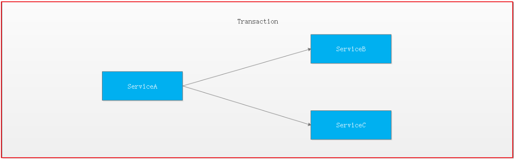
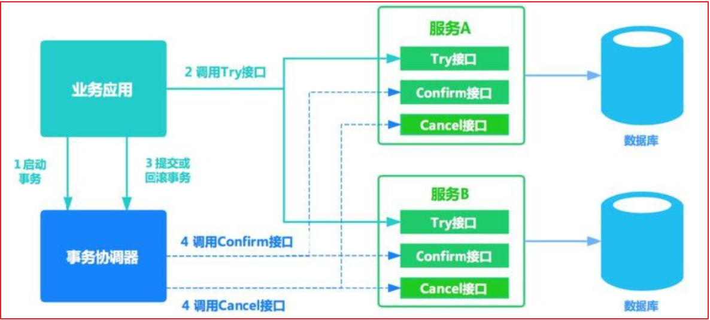

# 第四章 自媒体素材管理

## 目标

- 能够理解什么是分布式事务

- 能够理解CAP定理和BASE理论

- 能够掌握seata要解决的问题
- 能够完成seata集成到项目中使用
- 能够掌握分布式文件系统fastdfs的基本使用
- 能够完成素材管理功能
- 能够完成自媒体文章列表查询功能

##  1 分布式事务解决方案    

​        我们昨天编写的用户认证审核的代码服务中存在的，如果审核完用户后出了异常是不会回滚的，这样就会造成数据不一致的情况，这其实就是我们所说的分布式事务的问题，接下来我们来学习分布式事务的解决方案。

### 1.1 本地事务与分布式事务   

#### 1.1.1 事务

数据库事务(简称：事务，Transaction)是指数据库执行过程中的一个逻辑单位，由一个有限的数据库操作序列构成。

事务拥有以下四个特性，习惯上被称为ACID特性：

**原子性(Atomicity)**：事务作为一个整体被执行，包含在其中的对数据库的操作要么全部被执行，要么都不执行。

**一致性(Consistency)**：事务应确保数据库的状态从一个一致状态转变为另一个一致状态。一致状态是指数据库中的数据应满足完整性约束。除此之外，一致性还有另外一层语义，就是事务的中间状态不能被观察到(这层语义也有说应该属于原子性)。

**隔离性(Isolation)**：多个事务并发执行时，一个事务的执行不应影响其他事务的执行，如同只有这一个操作在被数据库所执行一样。

**持久性(Durability)**：已被提交的事务对数据库的修改应该永久保存在数据库中。在事务结束时，此操作将不可逆转。

#### 1.1.2 本地事务

起初，事务仅限于对单一数据库资源的访问控制,架构服务化以后，事务的概念延伸到了服务中。倘若将一个单一的服务操作作为一个事务，那么整个服务操作只能涉及一个单一的数据库资源,这类基于单个服务单一数据库资源访问的事务，被称为本地事务(Local Transaction)。 


#### 1.1.3 分布式事务

​        分布式事务指事务的参与者、支持事务的服务器、资源服务器以及事务管理器分别位于不同的分布式系统的不同节点之上,且属于不同的应用，分布式事务需要保证这些操作要么全部成功，要么全部失败。本质上来说，分布式事务就是为了保证不同数据库的数据一致性。 

​       最早的分布式事务应用架构很简单，不涉及服务间的访问调用，仅仅是服务内操作涉及到对多个数据库资源的访问。 


​        当一个服务操作访问不同的数据库资源，又希望对它们的访问具有事务特性时，就需要采用分布式事务来协调所有的事务参与者。

​        对于上面介绍的分布式事务应用架构，尽管一个服务操作会访问多个数据库资源，但是毕竟整个事务还是控制在单一服务的内部。如果一个服务操作需要调用另外一个服务，这时的事务就需要跨越多个服务了。在这种情况下，起始于某个服务的事务在调用另外一个服务的时候，需要以某种机制流转到另外一个服务，从而使被调用的服务访问的资源也自动加入到该事务当中来。下图反映了这样一个跨越多个服务的分布式事务：



​        如果将上面这两种场景(一个服务可以调用多个数据库资源，也可以调用其他服务)结合在一起，对此进行延伸，整个分布式事务的参与者将会组成如下图所示的树形拓扑结构。在一个跨服务的分布式事务中，事务的发起者和提交均系同一个，它可以是整个调用的客户端，也可以是客户端最先调用的那个服务。 


​         较之基于单一数据库资源访问的本地事务，分布式事务的应用架构更为复杂。在不同的分布式应用架构下，实现一个分布式事务要考虑的问题并不完全一样，比如对多资源的协调、事务的跨服务传播等，实现机制也是复杂多变。

### 1.2 分布式事务相关理论

#### 1.2.1 CAP定理


CAP定理是在 1998年加州大学的计算机科学家 Eric Brewer （埃里克.布鲁尔）提出，**分布式**系统有三个指标

- Consistency   一致性
- Availability     可用性
- Partition tolerance   分区容错

它们的第一个字母分别是 C、A、P。Eric Brewer 说，这三个指标不可能同时做到。这个结论就叫做 CAP 定理。

##### 分区容错  Partition tolerance

大多数分布式系统都分布在多个子网络。每个子网络就叫做一个区（partition）。分区容错的意思是，区间通信可能失败。比如，一台服务器放在中国，另一台服务器放在美国，这就是两个区，它们之间可能无法通信。


上图中，G1 和 G2 是两台跨区的服务器。G1 向 G2 发送一条消息，G2 可能无法收到。系统设计的时候，必须考虑到这种情况。

一般来说，分区容错无法避免，因此可以认为 CAP 的 P 总是成立。CAP 定理告诉我们，剩下的 C 和 A 无法同时做到。

##### 可用性 Availability 

Availability 中文叫做"可用性"，意思是只要收到用户的请求，服务器就必须给出回应。

用户可以选择向 G1 或 G2 发起读操作。不管是哪台服务器，只要收到请求，就必须告诉用户，到底是 v0 还是 v1，否则就不满足可用性。


##### 一致性 Consistency 

Consistency 中文叫做"一致性"。意思是，写操作之后的读操作，必须返回该值。

- 强一致性，要求更新过的数据能被后续的访问都能看到
- 弱一致性，能容忍后续的部分或者全部访问不到
- 最终一致性，经过一段时间后要求能访问到更新后的数据

CAP中说的一致性指的是强一致性

举例来说，某条记录是 v0，用户向 G1 发起一个写操作，将其改为 v1。


问题是，用户有可能向 G2 发起读操作，由于 G2 的值没有发生变化，因此返回的是 v0。G1 和 G2 读操作的结果不一致，这就不满足一致性了。


为了让 G2 也能变为 v1，就要在 G1 写操作的时候，让 G1 向 G2 发送一条消息，要求 G2 也改成 v1。


##### 一致性和可用性的矛盾

一致性和可用性，为什么不可能同时成立？答案很简单，因为可能通信失败（即出现分区容错）。

- 如果保证 G2 的一致性，那么 G1 必须在写操作时，锁定 G2 的读操作和写操作。只有数据同步后，才能重新开放读写。锁定期间，G2 不能读写，没有可用性不。就是**CP**
  - 一个保证了CP而一个舍弃了A的分布式系统，一旦发生网络故障或者消息丢失等情况，就要牺牲用户的体验，等待所有数据全部一致了之后再让用户访问系统。
  - 设计成CP的系统其实也不少，其中最典型的就是很多分布式数据库，他们都是设计成CP的。在发生极端情况时，优先保证数据的强一致性，代价就是舍弃系统的可用性。分布式系统中常用的Zookeeper也是在CAP三者之中选择优先保证CP的。

- 如果保证 G2 的可用性，那么势必不能锁定 G2，所以一致性不成立。是**AP**
  - 要高可用并允许分区，则需放弃一致性。一旦网络问题发生，节点之间可能会失去联系。为了保证高可用，需要在用户访问时可以马上得到返回，则每个节点只能用本地数据提供服务，而这样会导致全局数据的不一致性。
  - 这种舍弃强一致性而保证系统的分区容错性和可用性的场景和案例非常多，12306买票等

综上所述，G2 无法同时做到一致性和可用性。系统设计时只能选择一个目标。如果追求一致性，那么无法保证所有节点的可用性；如果追求所有节点的可用性，那就没法做到一致性。

#### 1.2.2 BASE理论

BASE：全称：Basically Available(基本可用)，Soft state（软状态）,和 Eventually consistent（最终一致性）三个短语的缩写，来自 ebay 的架构师提出。BASE 理论是对 CAP 中一致性和可用性权衡的结果，其来源于对大型互联网分布式实践的总结，是基于 CAP 定理逐步演化而来的。其核心思想是：

> 既是无法做到强一致性（Strong consistency），但每个应用都可以根据自身的业务特点，采用适当的方式来使系统达到最终一致性（Eventual consistency）。

##### Basically Available(基本可用)

什么是基本可用呢？假设系统，出现了不可预知的故障，但还是能用，相比较正常的系统而言：

1. 响应时间上的损失：正常情况下的搜索引擎 0.5 秒即返回给用户结果，而**基本可用**的搜索引擎可以在 1 秒作用返回结果。
2. 功能上的损失：在一个电商网站上，正常情况下，用户可以顺利完成每一笔订单，但是到了大促期间，为了保护购物系统的稳定性，部分消费者可能会被引导到一个降级页面。

##### Soft state（软状态）

什么是软状态呢？相对于原子性而言，要求多个节点的数据副本都是一致的，这是一种 “硬状态”。

软状态指的是：允许系统中的数据存在中间状态，并认为该状态不影响系统的整体可用性，即允许系统在多个不同节点的数据副本存在数据延时。

##### Eventually consistent（最终一致性）

系统能够保证在没有其他新的更新操作的情况下，数据最终一定能够达到一致的状态，因此所有客户端对系统的数据访问最终都能够获取到最新的值。


### 1.3 分布式事务解决方案

#### 1.3.1 基于XA协议的两阶段提交 

首先我们来简要看下分布式事务处理的XA规范 ： 


可知XA规范中分布式事务有AP，RM，TM组成：

其中应用程序(Application Program ，简称AP)：AP定义事务边界（定义事务开始和结束）并访问事务边界内的资源。

资源管理器(Resource Manager，简称RM)：Rm管理计算机共享的资源，许多软件都可以去访问这些资源，资源包含比如数据库、文件系统、打印机服务器等。

事务管理器(Transaction Manager ，简称TM)：负责管理全局事务，分配事务唯一标识，监控事务的执行进度，并负责事务的提交、回滚、失败恢复等。

**二阶段协议:**

**第一阶段**TM要求所有的RM准备提交对应的事务分支，询问RM是否有能力保证成功的提交事务分支，RM根据自己的情况，如果判断自己进行的工作可以被提交，那就就对工作内容进行持久化，并给TM回执OK；否者给TM的回执NO。RM在发送了否定答复并回滚了已经的工作后，就可以丢弃这个事务分支信息了。

**第二阶段**TM根据阶段1各个RM prepare的结果，决定是提交还是回滚事务。如果所有的RM都prepare成功，那么TM通知所有的RM进行提交；如果有RM prepare回执NO的话，则TM通知所有RM回滚自己的事务分支。

也就是TM与RM之间是通过两阶段提交协议进行交互的.

**优点：** 尽量保证了数据的强一致，适合对数据强一致要求很高的关键领域。（其实也不能100%保证强一致）

**缺点：** 实现复杂，牺牲了可用性，对性能影响较大，不适合高并发高性能场景。

#### 1.3.2 TCC补偿机制 

TCC 其实就是采用的补偿机制，其核心思想是：针对每个操作，都要注册一个与其对应的确认和补偿（撤销）操作。它分为三个阶段：

- Try 阶段主要是对业务系统做检测及资源预留
- Confirm 阶段主要是对业务系统做确认提交，Try阶段执行成功并开始执行 Confirm阶段时，默认 Confirm阶段是不会出错的。即：只要Try成功，Confirm一定成功。
- Cancel 阶段主要是在业务执行错误，需要回滚的状态下执行的业务取消，预留资源释放。



例如： A要向 B 转账，思路大概是： 

我们有一个本地方法，里面依次调用 
1、首先在 Try 阶段，要先调用远程接口把 B和 A的钱给冻结起来。 
2、在 Confirm 阶段，执行远程调用的转账的操作，转账成功进行解冻。 
3、如果第2步执行成功，那么转账成功，如果第二步执行失败，则调用远程冻结接口对应的解冻方法 (Cancel)。 

**优点：** 相比两阶段提交，可用性比较强

**缺点：** 数据的一致性要差一些。TCC属于应用层的一种补偿方式，所以需要程序员在实现的时候多写很多补偿的代码，在一些场景中，一些业务流程可能用TCC不太好定义及处理。

#### 1.3.3 消息最终一致性 

消息最终一致性其核心思想是将分布式事务拆分成本地事务进行处理，这种思路是来源于ebay。我们可以从下面的流程图中看出其中的一些细节： 


基本思路就是：

消息生产方，需要额外建一个消息表，并记录消息发送状态。消息表和业务数据要在一个事务里提交，也就是说他们要在一个数据库里面。然后消息会经过MQ发送到消息的消费方。如果消息发送失败，会进行重试发送。

消息消费方，需要处理这个消息，并完成自己的业务逻辑。此时如果本地事务处理成功，表明已经处理成功了，如果处理失败，那么就会重试执行。如果是业务上面的失败，可以给生产方发送一个业务补偿消息，通知生产方进行回滚等操作。

生产方和消费方定时扫描本地消息表，把还没处理完成的消息或者失败的消息再发送一遍。如果有靠谱的自动对账补账逻辑，这种方案还是非常实用的。

**优点：** 一种非常经典的实现，避免了分布式事务，实现了最终一致性。

**缺点：** 消息表会耦合到业务系统中，如果没有封装好的解决方案，会有很多杂活需要处理。

## 2 基于Seata实现分布式事务

### 2.1 Seata简介

官网地址：http://seata.io/zh-cn/


- Seata用于解决分布式事务

- Seata非常适合解决微服务分布式事务【dubbo、SpringCloud....】

- Seata性能高

- Seata使用简单

### 2.2 Seata事务模式-AT模式


**Transaction Coordinator (TC)：** 事务协调器，维护全局事务的运行状态，负责协调并驱动全局事务的提交或回滚。

**Transaction Manager (TM)：** 控制全局事务的边界，负责开启一个全局事务，并最终发起全局提交或全局回滚的决议。

**Resource Manager (RM)：** 控制分支事务，负责分支注册、状态汇报，并接收事务协调器的指令，驱动分支（本地）事务的提交和回滚。

一个典型的分布式事务过程：

1. TM 向 TC 申请开启一个全局事务，全局事务创建成功并生成一个全局唯一的 XID。
2. XID 在微服务调用链路的上下文中传播。
3. RM 向 TC 注册分支事务，将其纳入 XID 对应全局事务的管辖。
4. TM 向 TC 发起针对 XID 的全局提交或回滚决议。
5. TC 调度 XID 下管辖的全部分支事务完成提交或回滚请求。

AT模式使用前提：

- 基于支持本地 ACID 事务的关系型数据库。

- Java 应用，通过 JDBC 访问数据库。

AT模式机制：

基于两阶段提交协议的演变。

一阶段：

​      业务数据和回滚日志记录在同一个本地事务中提交，释放本地锁和连接资源。

二阶段：

​      提交异步化，非常快速地完成。

​      回滚通过一阶段的回滚日志进行反向补偿。


**注意此处seata版本是0.7.0+ 增加字段 context**

```sql
CREATE TABLE `undo_log` (
  `id` bigint(20) NOT NULL AUTO_INCREMENT,
  `branch_id` bigint(20) NOT NULL,
  `xid` varchar(100) NOT NULL,
  `context` varchar(128) NOT NULL,
  `rollback_info` longblob NOT NULL,
  `log_status` int(11) NOT NULL,
  `log_created` datetime NOT NULL,
  `log_modified` datetime NOT NULL,
  PRIMARY KEY (`id`),
  UNIQUE KEY `ux_undo_log` (`xid`,`branch_id`)
) ENGINE=InnoDB AUTO_INCREMENT=1 DEFAULT CHARSET=utf8;
```

### 2.3 Seata Server端环境准备

（1）从官网上下载seata server端的程序包

下载地址：https://github.com/seata/seata/releases


(2)修改配置

我们是基于**file**的方式启动注册和承载配置的


打开**conf/file.conf**文件

修改service 节点目录内容如下：

```yaml
service {
  #vgroup->rgroup
  vgroup_mapping.my_test_tx_group = "default"
  #only support single node
  default.grouplist = "127.0.0.1:8091"
  #degrade current not support
  enableDegrade = false
  #disable
  disable = false
  #unit ms,s,m,h,d represents milliseconds, seconds, minutes, hours, days, default permanent
  max.commit.retry.timeout = "-1"
  max.rollback.retry.timeout = "-1"
}
```

说明：需要修改**default.grouplist** = "127.0.0.1:8091"，将该值设置为seata server向外提供服务ip及端口(或域名+端口)

（4）启动server

到bin目录下执行脚本启动seata server端，注：windows下执行`seata-server.bat`启动；linux下执行`seata-server.sh`启动

### 2.4 项目集成seata

#### 2.4.1 创建日志表undo_log            

分别在leadnews_article、leadnews_user、leadnews_wemedia三个库中都创建undo_log表

#### 2.4.2 导入依赖包      

因为有多个工程都需要引入seata，所以新建一个工程heima-leadnews-seata专门来处理分布式事务 

```xml
<dependencies>
        <dependency>
            <groupId>com.heima</groupId>
            <artifactId>heima-leadnews-common</artifactId>
        </dependency>
        <dependency>
            <groupId>com.alibaba.cloud</groupId>
            <artifactId>spring-cloud-starter-alibaba-seata</artifactId>
            <version>2.1.0.RELEASE</version>
            <!--排除-->
            <exclusions>
                <exclusion>
                    <groupId>io.seata</groupId>
                    <artifactId>seata-all</artifactId>
                </exclusion>
            </exclusions>
        </dependency>
        <dependency>
            <groupId>io.seata</groupId>
            <artifactId>seata-all</artifactId>
            <version>0.9.0</version>
            <exclusions>
                <exclusion>
                    <groupId>com.alibaba</groupId>
                    <artifactId>druid</artifactId>
                </exclusion>
            </exclusions>
        </dependency>
        <dependency>
            <groupId>com.alibaba</groupId>
            <artifactId>druid</artifactId>
            <version>1.1.21</version>
        </dependency>
    </dependencies>
```

#### 2.4.3 创建代理数据源 

(1)因为多个工程都需要依赖与seata，所以在heima-leadnews-seata模块下创建seata的配置类

```java
package com.heima.seata.config;

import com.alibaba.druid.pool.DruidDataSource;
import com.baomidou.mybatisplus.autoconfigure.MybatisPlusProperties;
import com.baomidou.mybatisplus.core.MybatisConfiguration;
import com.baomidou.mybatisplus.extension.spring.MybatisSqlSessionFactoryBean;
import io.seata.rm.datasource.DataSourceProxy;
import org.mybatis.spring.transaction.SpringManagedTransactionFactory;
import org.springframework.boot.context.properties.ConfigurationProperties;
import org.springframework.boot.context.properties.EnableConfigurationProperties;
import org.springframework.context.annotation.Bean;
import org.springframework.context.annotation.Configuration;
import org.springframework.context.annotation.Primary;
import org.springframework.core.io.support.PathMatchingResourcePatternResolver;

import javax.sql.DataSource;

@Configuration
@EnableConfigurationProperties({MybatisPlusProperties.class})
public class DataSourcesProxyConfig {

    @Bean
    @ConfigurationProperties(prefix = "spring.datasource")
    public DataSource druidDataSource() {
        return new DruidDataSource();
    }
    //创建代理数据源

    @Primary//@Primary标识必须配置在代码数据源上，否则本地事务失效
    @Bean
    public DataSourceProxy dataSourceProxy(DataSource druidDataSource) {
        return new DataSourceProxy(druidDataSource);
    }

    private MybatisPlusProperties properties;

    public DataSourcesProxyConfig(MybatisPlusProperties properties) {
        this.properties = properties;
    }

    //替换SqlSessionFactory的DataSource
    @Bean
    public MybatisSqlSessionFactoryBean sqlSessionFactory(DataSourceProxy dataSourceProxy, PaginationInterceptor paginationInterceptor) throws Exception {

        // 这里必须用 MybatisSqlSessionFactoryBean 代替了 SqlSessionFactoryBean，否则 MyBatisPlus 不会生效
        MybatisSqlSessionFactoryBean mybatisSqlSessionFactoryBean = new MybatisSqlSessionFactoryBean();
        mybatisSqlSessionFactoryBean.setDataSource(dataSourceProxy);
        mybatisSqlSessionFactoryBean.setTransactionFactory(new SpringManagedTransactionFactory());

        mybatisSqlSessionFactoryBean.setMapperLocations(new PathMatchingResourcePatternResolver()
                .getResources("classpath*:/mapper/*.xml"));

        MybatisConfiguration configuration = this.properties.getConfiguration();
        if(configuration == null){
            configuration = new MybatisConfiguration();
        }
        mybatisSqlSessionFactoryBean.setConfiguration(configuration);

        //设置分页
        Interceptor[] plugins = {paginationInterceptor};
        mybatisSqlSessionFactoryBean.setPlugins(plugins);


        return mybatisSqlSessionFactoryBean;
    }
}
```

(2)分别在heima-leadnews-article、heima-leadnews-user、heima-leadnews-wemedia引入heima-leadnews-seata工程，并且添加一下配置类：

```java
@Configuration
@ComponentScan("com.heima.seata.config")
public class SeataConfig {

}
```

#### 2.4.4 配置seata-server链接和注册中心信息

<font color='red'>修改注册中心配置，在每个项目中必须按照下方要求来</font>

将配置文件file.conf和配置文件register.conf放到每个需要参与分布式事务项目的resources中。

- file.conf中的service.default.grouplist修改成seata-server的IP地址file.conf中的

- service.vgroup_mapping.xxx改成vgroup_mapping.#{spring.application.name}_tx_group = "default"

  特别注意：`#{spring.application.name}`是一个变量，指的是该项目的名称

  如自媒体微服务名称的项目名称如下：


​		那么其配置就是`vgroup_mapping.leadnews-wemedia_tx_group = "default"`

​		其他项目也是这么依次配置

#### 2.4.5 指定事务分组

分别在heima-leadnews-article、heima-leadnews-user、heima-leadnews-wemedia微服务的application.yml文件中添加如下配置：

```yaml
spring:
  cloud:
    alibaba:
      seata:
        tx-service-group: ${spring.application.name}_tx_group
```

#### 2.4.6 在分布式事务控制方法上添加注解@GlobalTransactional

在ApUserRealnameServiceImpl类的updateStatusById方法上加上`@GlobalTransactional`注解

#### 2.4.7 启动seata-server    

运行：`/seata/bin/seata-server.bat`


#### 2.4.8 测试

（1）功能测试，看功能能否正常执行。

（2）异常测试，我们在方法中添加` int x=1/0`  ，看认证信息和自媒体用户是否能够回滚。


### ==2.5 优化docker部署集成seata==

注意：2.4步骤有可能控制不住事务，所以以下步骤专门为了解决本地的seata控制不住分布式事务的解决方案

#### 1、安装seata

```shell
#拉取镜像
docker pull seataio/seata-server:1.3.0
#创建容器
docker run --name=seata --restart=always -p 8091:8091 -e SEATA_IP=192.168.200.129 -e SEATA_PORT=8091 -d seataio/seata-server:1.3.0
```


#### 2、安装mysql

```shell
# 拉取MySQL 5.7镜像 
docker pull centos/mysql-57-centos7
# 创建mysql5.7容器 
docker run -di --name=mysql5.7 -p 3306:3306 -e MYSQL_ROOT_PASSWORD=root centos/mysql-57-centos7

#-p 3306:3306 第一个3306是映射给我宿主机(linux)的端口号,第二个3306是容器的端口号
#-e MYSQL_ROOT_PASSWORD=root表示设置远程连接容器的是用户名root和密码root

# 进入MySQL 5.7容器
docker exec -it mysql5.7 /bin/bash
#进入mysql数据库，本地连接密码可以为空
 mysql -u root -p   指定的是默认端口号，而是本地
 
 #-h表示指定ip  -P指定端口号
 mysql -h 192.168.200.129 -P3306 -u root -p

#查询数据库
show databases;
```

导入第一章资料中的sql脚本

#### 3、改变代码环境

第一步，wemedia,article,user，admin这几个微服务中的application.yml中改变数据库连接地址，改为Linux地址

```java
spring:
  datasource:
    driver-class-name: com.mysql.jdbc.Driver
    url: jdbc:mysql://192.168.200.129:3306/leadnews_article?useUnicode=true&characterEncoding=UTF-8&serverTimezone=Asia/Shanghai
    username: root
    password: root
```

第二步，在wemedia,article,user微服务中的file.config中连接seata地址改为linux地址

```java
default.grouplist = "192.168.200.129:8091"
```

第三步，开始测试，注意：在当前业务层的方法之上要加入两个注解


> 解析：
>
> ​	如果只加@GlobalTransactional注解的话，我们的测试结果是本地事务拦不住，但是远程事务可以拦住，原因是当前本地对应的seata控制的status状态是要求是boolean类型，要么true,要么是false,而我们数据库表中的status状态类型是tinyint类型
>
> ​	解决方案：
>
> ​		1、改变当前数据库表ap_user_realname表中status字段的类型为int类型(目前不建议)
>
> ​		2、在当前分布式事务的基础之上加入@Transactional，来控制事务


## 3 FastDFS

### 3.1 FastDFS体系结构

FastDFS是一个开源的轻量级[分布式文件系统](https://baike.baidu.com/item/分布式文件系统/1250388)，它对文件进行管理，功能包括：文件存储、文件同步、文件访问（文件上传、文件下载）等，解决了大容量存储和负载均衡的问题。特别适合以文件为载体的在线服务，如相册网站、视频网站等等。

FastDFS为互联网量身定制，充分考虑了冗余备份、负载均衡、线性扩容等机制，并注重高可用、高性能等指标，使用FastDFS很容易搭建一套高性能的文件服务器集群提供文件上传、下载等服务。

FastDFS 架构包括 Tracker server 和 Storage server。客户端请求 Tracker server 进行文件上传、下载，通过Tracker server 调度最终由 Storage server 完成文件上传和下载。

Tracker server 作用是负载均衡和调度，通过 Tracker server 在文件上传时可以根据一些策略找到Storage server 提供文件上传服务。可以将 tracker 称为追踪服务器或调度服务器。Storage server 作用是文件存储，客户端上传的文件最终存储在 Storage 服务器上，Storageserver 没有实现自己的文件系统而是利用操作系统的文件系统来管理文件。可以将storage称为存储服务器。


### 3.2 上传流程


客户端上传文件后存储服务器将文件 ID 返回给客户端，此文件 ID 用于以后访问该文件的索引信息。文件索引信息包括：组名，虚拟磁盘路径，数据两级目录，文件名。


**组名**：文件上传后所在的 storage 组名称，在文件上传成功后有storage 服务器返回，需要客户端自行保存。

**虚拟磁盘路径**：storage 配置的虚拟路径，与磁盘选项store_path*对应。如果配置了

store_path0 则是 M00，如果配置了 store_path1 则是 M01，以此类推。

**数据两级目录**：storage 服务器在每个虚拟磁盘路径下创建的两级目录，用于存储数据文件。

**文件名**：与文件上传时不同。是由存储服务器根据特定信息生成，文件名包含：源存储

服务器 IP 地址、文件创建时间戳、文件大小、随机数和文件拓展名等信息。

### 3.3 FastDFS搭建

参考资料文件夹下：fastdfs安装

### 3.4 文件上传与删除

#### 3.4.1 环境搭建

(1)新建项目：fastdfs-demo


(2)pom文件

```xml
<!-- 继承Spring boot工程 -->
<parent>
    <groupId>org.springframework.boot</groupId>
    <artifactId>spring-boot-starter-parent</artifactId>
    <version>2.1.5.RELEASE</version>
</parent>
<dependencies>
    <dependency>
        <groupId>org.springframework.boot</groupId>
        <artifactId>spring-boot-starter-web</artifactId>
    </dependency>
    <!--fastdfs-->
    <dependency>
        <groupId>com.github.tobato</groupId>
        <artifactId>fastdfs-client</artifactId>
        <version>1.26.5</version>
    </dependency>
</dependencies>
```

（3）fast_dfs.properties

```yaml
#socket连接超时时长
fdfs.soTimeout=1500
#连接tracker服务器超时时长
fdfs.connectTimeout=600
fdfs.trackerList=192.168.200.129:22122

fileServerUrl=http://192.168.200.129/
```

(4)引导类

```java
package com.itheima.fastdfs;

import org.springframework.boot.SpringApplication;
import org.springframework.boot.autoconfigure.SpringBootApplication;

@SpringBootApplication
public class FastDFSApplication {

    public static void main(String[] args) {
        SpringApplication.run(FastDFSApplication.class,args);
    }
}

```

(5)fastdfs封装配置类

新建配置类：com.itheima.fastdfs.config.FdfsConfiguration

```java
package com.itheima.fastdfs.config;

import com.github.tobato.fastdfs.FdfsClientConfig;
import org.springframework.context.annotation.Configuration;
import org.springframework.context.annotation.EnableMBeanExport;
import org.springframework.context.annotation.Import;
import org.springframework.jmx.support.RegistrationPolicy;

@Configuration
@PropertySource("fast_dfs.properties")
@Import(FdfsClientConfig.class) // 导入FastDFS-Client组件
public class FdfsConfiguration {
}
```

封装fastdfs客户端：com.itheima.fastdfs.config.FastDFSClientUtil

```java
package com.itheima.fastdfs.config;

import com.github.tobato.fastdfs.domain.fdfs.StorePath;
import com.github.tobato.fastdfs.domain.proto.storage.DownloadCallback;
import com.github.tobato.fastdfs.service.FastFileStorageClient;
import org.apache.commons.io.FilenameUtils;
import org.springframework.beans.factory.annotation.Autowired;
import org.springframework.stereotype.Component;
import org.springframework.web.multipart.MultipartFile;

import java.io.ByteArrayOutputStream;
import java.io.IOException;
import java.io.InputStream;

@Component
public class FastDFSClientUtil {

    @Autowired
    private FastFileStorageClient storageClient;

    /**
     * 上传
     * @param file
     * @return
     * @throws IOException
     */
    public String uploadFile(MultipartFile file) throws IOException {
        StorePath storePath = storageClient.uploadFile((InputStream) file.getInputStream(), file.getSize(), FilenameUtils.getExtension(file.getOriginalFilename()), null);
        return storePath.getFullPath();
    }

    /**
     * 删除
     * @param filePath
     */
    public void delFile(String filePath) {
        storageClient.deleteFile(filePath);

    }

    /**
     * 下载
     * @param groupName
     * @param path
     * @return
     */
    public byte[] download(String groupName, String path) throws IOException {
        InputStream ins = storageClient.downloadFile(groupName, path, new DownloadCallback<InputStream>() {
            @Override
            public InputStream recv(InputStream ins) throws IOException {
                // 将此ins返回给上面的ins
                return ins;
            }
        });

        ByteArrayOutputStream byteArrayOutputStream = new ByteArrayOutputStream();
        byte[] buff = new byte[100];
        int rc = 0;
        while ((rc = ins.read(buff, 0, 100)) > 0) {
            byteArrayOutputStream.write(buff, 0, rc);
        }
        return byteArrayOutputStream.toByteArray();
    }
}
```

#### 3.4.2 上传

新建controller测试上传：com.itheima.fastdfs.controller.FileController

```java
package com.itheima.fastdfs.controller;

import com.itheima.fastdfs.config.FastDFSClientUtil;
import org.apache.commons.lang3.StringUtils;
import org.springframework.beans.factory.annotation.Autowired;
import org.springframework.beans.factory.annotation.Value;
import org.springframework.web.bind.annotation.PostMapping;
import org.springframework.web.bind.annotation.RequestMapping;
import org.springframework.web.bind.annotation.RestController;
import org.springframework.web.multipart.MultipartFile;

@RestController
@RequestMapping("/file")
public class FileController {

    @Autowired
    private FastDFSClientUtil fastDFSClientUtil;

    @Value("${fileServerUrl}")
    private String fileServerUrl ;

    @PostMapping("/upload")
    public String uploadFile(MultipartFile file) {
        try {
            //判断文件是否存在
            if (file == null) {
                throw new RuntimeException("文件不存在");
            }
            //获取文件的完整名称
            String originalFilename = file.getOriginalFilename();
            if (StringUtils.isEmpty(originalFilename)) {
                throw new RuntimeException("文件不存在");
            }
            String url = fastDFSClientUtil.uploadFile(file);
            return fileServerUrl+url;

        } catch (Exception e) {
            e.printStackTrace();
        }
        return "文件上传失败";
    }
}
```

测试：


#### 3.4.3 删除

添加删除方法

```java
@GetMapping("/del")
public String delFile(String fileId){
    try {
        fastDFSClientUtil.delFile(fileId);
        return "删除成功";
    }catch (Exception e){
        e.printStackTrace();
    }
    return "删除失败";
}
```

测试：


在浏览器上查看http://192.168.200.129/group1/M00/00/00/wKjIgV-5HDmAdQXiAACcbb_oqbQ357.jpg

但是有可能图片还存在，但是执行ctrl+F刷新之后就会显示404，说明已经删除了


## 4 素材管理

### 4.1 图片上传

#### 4.1.1 项目中集成fastdfs

关于fasfdfs图片服务器后面需要在项目中多个地方应用，所以把fastdfs封装到通用的模块中，方便后期各个模块引用。

（1）heima-leadnews-common模块中加入依赖

```xml
 <!--fastdfs-->
<dependency>
    <groupId>com.github.tobato</groupId>
    <artifactId>fastdfs-client</artifactId>
</dependency>
```

（2）heima-leadnews-common中的resources新建文件fast_dfs.properties

```properties
#socket连接超时时长
fdfs.soTimeout=1500
#连接tracker服务器超时时长
fdfs.connectTimeout=600
fdfs.trackerList=192.168.200.130:22122
```

（3）heima-leadnews-common中新建配置类:com.heima.common.fastdfs.FdfsConfiguration

```java
@Configuration
@Import(FdfsClientConfig.class) // 导入FastDFS-Client组件
@PropertySource("fast_dfs.properties")
public class FdfsConfiguration {
}
```

（4）新建fastdfs客户端：com.heima.common.fastdfs.FastDFSClient

```java
@Component
public class FastDFSClient {

    @Autowired
    private FastFileStorageClient storageClient;

    public String uploadFile(MultipartFile file) throws IOException {
        StorePath storePath = storageClient.uploadFile((InputStream) file.getInputStream(), file.getSize(), FilenameUtils.getExtension(file.getOriginalFilename()), null);
        return storePath.getFullPath();
    }

    public void delFile(String filePath) {
        storageClient.deleteFile(filePath);

    }

    /**
     * 下载
     * @param groupName
     * @param path
     * @return
     */
    public byte[] download(String groupName, String path) throws IOException {
        InputStream ins = storageClient.downloadFile(groupName, path, new DownloadCallback<InputStream>() {
            @Override
            public InputStream recv(InputStream ins) throws IOException {
                // 将此ins返回给上面的ins
                return ins;
            }
        });

        ByteArrayOutputStream byteArrayOutputStream = new ByteArrayOutputStream();
        byte[] buff = new byte[100];
        int rc = 0;
        while ((rc = ins.read(buff, 0, 100)) > 0) {
            byteArrayOutputStream.write(buff, 0, rc);
        }
        return byteArrayOutputStream.toByteArray();
    }
}
```

（5）在heima-leadnews-wemedia微服务中添加配置

①添加配置类，引用fastdfs

```java
package com.heima.wemedia.config;

import org.springframework.context.annotation.ComponentScan;
import org.springframework.context.annotation.Configuration;

@Configuration
@ComponentScan("com.heima.common.fastdfs")
public class FastDfsConfiguration {
}
```

②修改application.yml文件，添加自定义的图片访问ip

```yaml
#图片访问ip
fdfs.url: http://192.168.200.130/
```

#### 4.1.2 文件上传需求


上传图片到fastdfs，同时要保存一份数据到表中，方便后期管理

媒体图文素材信息表wm_material


对应实体类：

```java
package com.heima.model.media.pojos;

import com.baomidou.mybatisplus.annotation.IdType;
import com.baomidou.mybatisplus.annotation.TableField;
import com.baomidou.mybatisplus.annotation.TableId;
import com.baomidou.mybatisplus.annotation.TableName;
import lombok.Data;

import java.io.Serializable;
import java.util.Date;

/**
 * <p>
 * 自媒体图文素材信息表
 * </p>
 *
 * @author itheima
 */
@Data
@TableName("wm_material")
public class WmMaterial implements Serializable {

    private static final long serialVersionUID = 1L;

    /**
     * 主键
     */
    @TableId(value = "id", type = IdType.AUTO)
    private Integer id;

    /**
     * 自媒体用户ID
     */
    @TableField("user_id")
    private Integer userId;

    /**
     * 图片地址
     */
    @TableField("url")
    private String url;

    /**
     * 素材类型
            0 图片
            1 视频
     */
    @TableField("type")
    private Short type;

    /**
     * 是否收藏
     */
    @TableField("is_collection")
    private Short isCollection;

    /**
     * 创建时间
     */
    @TableField("created_time")
    private Date createdTime;

}
```

#### 4.1.3 自媒体用户登录

自媒体登录操作与admin端登录思路是一样的

（1）自媒体登录接口定义

```java
package com.heima.api.wemedia;

import com.heima.model.common.dtos.ResponseResult;
import com.heima.model.media.pojos.WmUser;
import org.springframework.web.bind.annotation.RequestBody;

public interface LoginControllerApi {

    /**
     * 自媒体登录
     * @param user
     * @return
     */
    public ResponseResult login(WmUserDto dto);
}
```

WmUserDto

```java
package com.heima.model.wemedia.dtos;

import lombok.Data;

@Data
public class WmUserDto {

    /**
     * 用户名
     */
    private String name;

    /**
     * 密码
     */
    private String password;
}
```

（1）业务层service

新增业务层接口

```java
package com.heima.wemedia.service;

import com.baomidou.mybatisplus.extension.service.IService;
import com.heima.model.common.dtos.ResponseResult;
import com.heima.model.media.pojos.WmUser;

public interface WmUserService extends IService<WmUser> {

    /**
     * 登录
     * @param wmUser
     * @return
     */
    public ResponseResult login(WmUserDto dto);
}
```


实现类：

```java
package com.heima.wemedia.service.impl;

import com.baomidou.mybatisplus.core.conditions.Wrapper;
import com.baomidou.mybatisplus.core.conditions.query.QueryWrapper;
import com.baomidou.mybatisplus.extension.service.impl.ServiceImpl;
import com.google.common.collect.Maps;
import com.heima.model.common.dtos.ResponseResult;
import com.heima.model.common.enums.AppHttpCodeEnum;
import com.heima.model.media.pojos.WmUser;
import com.heima.utils.common.AppJwtUtil;
import com.heima.utils.common.MD5Utils;
import com.heima.wemedia.mapper.WmUserMapper;
import com.heima.wemedia.service.WmUserService;
import org.apache.commons.lang3.StringUtils;
import org.springframework.stereotype.Service;
import org.springframework.util.DigestUtils;

import java.util.List;
import java.util.Map;

@Service
public class WmUserServiceImpl extends ServiceImpl<WmUserMapper, WmUser> implements WmUserService {

    @Override
    public ResponseResult login(WmUserDto dto) {
        //1.检查参数
        if (StringUtils.isEmpty(dto.getName()) || StringUtils.isEmpty(dto.getPassword())) {
            return ResponseResult.errorResult(AppHttpCodeEnum.PARAM_INVALID, "用户名或密码错误");
        }
        //2.查询数据库中的用户信息
        List<WmUser> list = list(Wrappers.<WmUser>lambdaQuery().eq(WmUser::getName, dto.getName()));
        if(list != null && list.size() ==1){
            WmUser wmUser = list.get(0);
            //3.比对密码
            String pswd = DigestUtils.md5DigestAsHex((dto.getPassword()+wmUser.getSalt()).getBytes());
            if(wmUser.getPassword().equals(pswd)){
                //4.返回数据jwt
                Map<String,Object>  map = new HashMap<>();
                map.put("token",AppJwtUtil.getToken(wmUser.getId().longValue()));
                wmUser.setPassword("");
                wmUser.setSalt("");
                map.put("user",wmUser);
                return ResponseResult.okResult(map);
            }else {
                return ResponseResult.errorResult(AppHttpCodeEnum.LOGIN_PASSWORD_ERROR);
            }
        }else {
            return ResponseResult.errorResult(AppHttpCodeEnum.DATA_NOT_EXIST,"用户不存在");
        }
    }
}
```

（2）控制器controller

新增控制器

```java
package com.heima.wemedia.controller.v1;

import com.heima.api.wemedia.LoginControllerApi;
import com.heima.model.common.dtos.ResponseResult;
import com.heima.model.media.pojos.WmUser;
import com.heima.wemedia.service.WmUserService;
import org.springframework.beans.factory.annotation.Autowired;
import org.springframework.web.bind.annotation.PostMapping;
import org.springframework.web.bind.annotation.RequestBody;
import org.springframework.web.bind.annotation.RequestMapping;
import org.springframework.web.bind.annotation.RestController;

@RestController
@RequestMapping("/login")
public class LoginController implements LoginControllerApi {

    @Autowired
    private WmUserService wmUserService;

    @PostMapping("/in")
    @Override
    public ResponseResult login(@RequestBody WmUserDto dto){
        return wmUserService.login(user);
    }
}
```

（3）无网关测试


#### 4.1.4 自媒体网关和获取登录用户

##### （1）自媒体网关

上一次创建的admin平台管理的网关，自媒体端也有自己的网关，后边还需要创建app端的网关

自媒体网关与admin端网关几乎是一样的，可以参考admin端网关

①创建子模块：pom文件如下

```xml
<parent>
    <artifactId>heima-leadnews</artifactId>
    <groupId>com.heima</groupId>
    <version>1.0-SNAPSHOT</version>
</parent>
<modelVersion>4.0.0</modelVersion>

<artifactId>heima-leadnews-wemedia-gateway</artifactId>

<dependencies>
    <dependency>
        <groupId>org.springframework.cloud</groupId>
        <artifactId>spring-cloud-starter-gateway</artifactId>
    </dependency>
    <dependency>
        <groupId>com.alibaba.cloud</groupId>
        <artifactId>spring-cloud-starter-alibaba-nacos-discovery</artifactId>
    </dependency>
    <dependency>
        <groupId>io.jsonwebtoken</groupId>
        <artifactId>jjwt</artifactId>
    </dependency>
</dependencies>
```

②从admin网关中把必要的类拷贝过来


③新增application.yml

```yaml
server:
  port: 6002
spring:
  application:
    name: leadnews-wemedia-gateway
  cloud:
    nacos:
      discovery:
        server-addr: 192.168.200.130:8848
    gateway:
      globalcors:
        cors-configurations:
          '[/**]': # 匹配所有请求
            allowedOrigins: "*" #跨域处理 允许所有的域
            allowedMethods: # 支持的方法
            - GET
            - POST
            - PUT
            - DELETE
      routes:
      # 平台管理
      - id: wemedia
        uri: lb://leadnews-wemedia
        predicates:
        - Path=/wemedia/**
        filters:
        - StripPrefix= 1
```

##### （2）获取登录用户思路分析

在去保存图片之前，需要先知道是哪一位自媒体人登录了当前系统，也就是需要确定哪个自媒体人上传了图片


操作步骤：

1，上传图片需要携带token

2，首先请求到网关服务，解析token是否有效，如果有效，解析后把用户数据设置到下一级请求的header中

3，在自媒体微服务中使用过滤器解析header中的数据，拿到用户数据，设置到当前线程中

4，在具体业务代码中可以从当前线程中获取用户

##### （3）获取登录用户

前面两步都已经实现，主要是在代码中实现后两步即可

###### 1)添加工具类

在使用过滤器解析后的用户需要放在当前线程中，可以使用工具类来实现，在heima-leadnews-utils中添加如下类

```java
package com.heima.utils.threadlocal;

import com.heima.model.admin.pojos.AdUser;
import com.heima.model.media.pojos.WmUser;

public class WmThreadLocalUtils {

    private final  static ThreadLocal<WmUser> userThreadLocal = new ThreadLocal<>();

    /**
     * 设置当前线程中的用户
     * @param user
     */
    public static void setUser(WmUser user){
        userThreadLocal.set(user);
    }

    /**
     * 获取线程中的用户
     * @return
     */
    public static WmUser getUser( ){
        return userThreadLocal.get();
    }
}
```


###### 2)在自媒体微服务中使用过滤器解析header数据并设置到当前线程中

```java
package com.heima.wemedia.filter;

import com.heima.model.wemedia.pojos.WmUser;
import com.heima.utils.threadlocal.WmThreadLocalUtils;
import lombok.extern.log4j.Log4j2;
import org.springframework.core.annotation.Order;
import org.springframework.web.filter.GenericFilterBean;

import javax.servlet.FilterChain;
import javax.servlet.ServletException;
import javax.servlet.ServletRequest;
import javax.servlet.ServletResponse;
import javax.servlet.annotation.WebFilter;
import javax.servlet.http.HttpServletRequest;
import javax.servlet.http.HttpServletResponse;
import java.io.IOException;
@Order(1)
@WebFilter(filterName = "wmTokenFilter",urlPatterns = "/*")
@Log4j2
public class WmTokenFilter extends GenericFilterBean {
    @Override
    public void doFilter(ServletRequest servletRequest, ServletResponse servletResponse, FilterChain filterChain) throws IOException, ServletException {
        HttpServletRequest request = (HttpServletRequest) servletRequest;
        HttpServletResponse response = (HttpServletResponse) servletResponse;
        //得到header中的信息
        String userId = request.getHeader("userId");
        if(userId != null){
            WmUser wmUser = new WmUser();
            wmUser.setId(Integer.valueOf(userId));
            WmThreadLocalUtils.setUser(wmUser);
        }
        filterChain.doFilter(request,response);
    }
}
```

如果想要`@Order(1)`和`@WebFilter`两个注解生效，需要在引导类中添加扫描`@ServletComponentScan`


==注意：==

```
关于@ServletComponentScan注解的解析
	在SpringBootApplication上使用@ServletComponentScan注解后，Servlet、Filter、Listener可以直接通过@WebServlet、@WebFilter、@WebListener注解自动注册，无需其他代码。
```

###### 3)、在heima-leadnews-wemedia服务中编写配置类

==注意：==

不加这个类有可能连接不到fastdfs的tracker

```java
package com.heima.wemedia.config;

import org.springframework.context.annotation.ComponentScan;
import org.springframework.context.annotation.Configuration;

@Configuration
@ComponentScan(basePackages = "com.heima.common.fastdfs")
public class FastDfsConfiguration {
}

```


#### 4.1.5 图片上传-接口定义

在heima-leadnews-apis中定义接口：com.heima.api.wemedia.MaterialManageControllerApi

```java
package com.heima.api.wemedia;

import com.heima.model.common.dtos.ResponseResult;
import org.springframework.web.multipart.MultipartFile;

public interface WmMaterialControllerApi {

    /**
     * 上传图片
     * @param multipartFile
     * @return
     */
    ResponseResult uploadPicture(MultipartFile multipartFile);

}
```

#### 4.1.6 图片上传-定义mapper

新建接口：com.heima.wemedia.mapper.WmMaterialMapper

```java
package com.heima.wemedia.mapper;

import com.baomidou.mybatisplus.core.mapper.BaseMapper;
import com.heima.model.media.pojos.WmMaterial;
import org.apache.ibatis.annotations.Mapper;

@Mapper
public interface WmMaterialMapper extends BaseMapper<WmMaterial> {
}
```

#### 4.1.7 图片上传-定义service

新建接口：com.heima.wemedia.service.MaterialService

```java
package com.heima.wemedia.service;

import com.baomidou.mybatisplus.extension.service.IService;
import com.heima.model.common.dtos.ResponseResult;
import com.heima.model.media.pojos.WmMaterial;
import org.springframework.web.multipart.MultipartFile;

public interface WmMaterialService extends IService<WmMaterial> {

    /**
     * 上传图片接口
     * @param multipartFile
     * @return
     */
    ResponseResult uploadPicture(MultipartFile multipartFile);

}
```

实现类：

```java
package com.heima.wemedia.service.impl;

import com.baomidou.mybatisplus.extension.service.impl.ServiceImpl;
import com.heima.common.fastdfs.FastDFSClient;
import com.heima.model.common.dtos.ResponseResult;
import com.heima.model.common.enums.AppHttpCodeEnum;
import com.heima.model.wemedia.pojos.WmMaterial;
import com.heima.model.wemedia.pojos.WmUser;
import com.heima.utils.threadlocal.WmThreadLocalUtils;
import com.heima.wemedia.mapper.WmMaterialMapper;
import com.heima.wemedia.service.WmMaterialService;
import lombok.extern.log4j.Log4j2;
import org.springframework.beans.factory.annotation.Autowired;
import org.springframework.beans.factory.annotation.Value;
import org.springframework.stereotype.Service;
import org.springframework.web.multipart.MultipartFile;

import java.io.IOException;
import java.util.Date;

@Service
@Log4j2
public class WmMaterialServiceImpl extends ServiceImpl<WmMaterialMapper, WmMaterial> implements WmMaterialService {

    @Autowired
    FastDFSClient fastDFSClient;

    @Value("${fdfs.url}")
    private String fileServerUrl;

    @Override
    public ResponseResult uploadPicture(MultipartFile multipartFile) {
        //1.检查参数
        if(multipartFile == null){
            return ResponseResult.errorResult(AppHttpCodeEnum.PARAM_INVALID);
        }

        //2.上传图片到fasfdfs
        String fileId = null;
        try {
            fileId = fastDFSClient.uploadFile(multipartFile);
        } catch (IOException e) {
            e.printStackTrace();
            return ResponseResult.errorResult(AppHttpCodeEnum.SERVER_ERROR);
        }

        //3.保存素材数据到表中 wm_material

        WmUser user = WmThreadLocalUtils.getUser();

        WmMaterial wmMaterial = new WmMaterial();
        wmMaterial.setUrl(fileId);
        wmMaterial.setIsCollection((short)0);
        wmMaterial.setUserId(user.getId());
        wmMaterial.setType((short)0);
        wmMaterial.setCreatedTime(new Date());
        save(wmMaterial);
        //拼接图片路径
        wmMaterial.setUrl(fileServerUrl+fileId);
        return ResponseResult.okResult(wmMaterial);
    }
}
```

#### 4.1.8 图片上传-控制层

```java
package com.heima.wemedia.controller.v1;

import com.heima.api.wemedia.MaterialManageControllerApi;
import com.heima.model.common.dtos.ResponseResult;
import com.heima.wemedia.service.MaterialService;
import org.springframework.beans.factory.annotation.Autowired;
import org.springframework.web.bind.annotation.PostMapping;
import org.springframework.web.bind.annotation.RequestMapping;
import org.springframework.web.bind.annotation.RestController;
import org.springframework.web.multipart.MultipartFile;

@RestController
@RequestMapping("/api/v1/material")
public class WmMaterialController implements WmMaterialControllerApi {
    @Autowired
    private MaterialService materialService;

    @PostMapping("/upload_picture")
    @Override
    public ResponseResult uploadPicture(MultipartFile file) {
        return materialService.uploadPicture(file);
    }

}
```

#### 4.1.9 测试

使用postman测试，需要先登录设置token后再操作，然后查询wm_material表


### 4.2素材列表加载


素材列表查询，前台有可能给传一个条件 是否收藏  0 不收藏  1 收藏

==就是根据是否收藏条件进行分页查询==

#### 4.2.1接口定义

在com.heima.api.wemedia.MaterialManageControllerApi中新增方法

```java
/**
     * 素材列表
     * @param dto
     * @return
     */
ResponseResult findList(WmMaterialDto dto);
```

WmMaterialDto

```java
package com.heima.model.media.dtos;

import com.heima.model.common.dtos.PageRequestDto;
import lombok.Data;

@Data
public class WmMaterialDto extends PageRequestDto {
    Short isCollected; //1 查询收藏的
}
```

#### 4.2.2 定义service

在com.heima.wemedia.service.MaterialService类中新增方法

```java
/**
     * 素材列表查询
     * @param dto
     * @return
     */
ResponseResult findList(WmMaterialDto dto);
```

实现类：

```java
@Override
public ResponseResult findList(WmMaterialDto dto) {
    //1.检查参数
    dto.checkParam();

    //2.带条件分页查询
    LambdaQueryWrapper<WmMaterial> lambdaQueryWrapper = new LambdaQueryWrapper<>();
    //获取当前登录的用户
    Integer uid = WmThreadLocalUtils.getUser().getId();
    lambdaQueryWrapper.eq(WmMaterial::getUserId,uid);
    //是否收藏
    if(dto.getIsCollection() != null && dto.getIsCollection().shortValue()==1){
        lambdaQueryWrapper.eq(WmMaterial::getIsCollection,dto.getIsCollection());
    }
    //按照日期倒序排序
    lambdaQueryWrapper.orderByDesc(WmMaterial::getCreatedTime);
    IPage pageParam = new Page(dto.getPage(),dto.getSize());
    IPage resultPage = page(pageParam, lambdaQueryWrapper);
    //3.结果返回
    PageResponseResult responseResult = new PageResponseResult(dto.getPage(),dto.getSize(),(int)resultPage.getTotal());
    List<WmMaterial> datas = resultPage.getRecords();
    //为每个图片加上前缀
    datas = datas.stream().map(item->{
        item.setUrl(fileServerUrl+item.getUrl());
        return item;
    }).collect(Collectors.toList());
    responseResult.setData(datas);

    return responseResult;
}
```

#### 4.2.3 控制层

在com.heima.wemedia.controller.v1.MaterialManageController新增方法

```java
@RequestMapping("/list")
@Override
public ResponseResult findList(@RequestBody WmMaterialDto dto) {
    return materialService.findList(dto);
}
```

#### 4.2.4 测试

使用postman测试，需要先登录设置token后再操作


也可打开前端工程进行测试

### 4.3 图片删除

#### 4.3.1 接口定义

> 1 根据素材id删除图片
>
> 2 如果当前图片被引用，则不能删除
>
> 3 在fastdfs删除中不需要带访问图片的url，只需要文件名，如下
>
>    ~~http://192.168.200.130/~~group1/M00/00/00/wKjIgl5rYzyAb55kAAANyzMmUz0834.png

一旦该图片被引用会在这个表中插入数据，用作素材与文章的关联

==表关系分析==


wm_news_material （自媒体图文引用素材信息表）


对应实体类：

```java
package com.heima.model.wemedia.pojos;

import com.baomidou.mybatisplus.annotation.IdType;
import com.baomidou.mybatisplus.annotation.TableField;
import com.baomidou.mybatisplus.annotation.TableId;
import com.baomidou.mybatisplus.annotation.TableName;
import lombok.Data;

import java.io.Serializable;

/**
 * <p>
 * 自媒体图文引用素材信息表
 * </p>
 *
 * @author itheima
 */
@Data
@TableName("wm_news_material")
public class WmNewsMaterial implements Serializable {

    private static final long serialVersionUID = 1L;

    /**
     * 主键
     */
    @TableId(value = "id", type = IdType.AUTO)
    private Integer id;

    /**
     * 素材ID
     */
    @TableField("material_id")
    private Integer materialId;

    /**
     * 图文ID
     */
    @TableField("news_id")
    private Integer newsId;

    /**
     * 引用类型
            0 内容引用
            1 主图引用
     */
    @TableField("type")
    private Short type;

    /**
     * 引用排序
     */
    @TableField("ord")
    private Short ord;

}
```


在com.heima.api.wemedia.WmMaterialControllerApi中新增方法

```java
/**
     * 删除图片
     * @param wmMaterial
     * @return
     */
ResponseResult delPicture(Integer id);
```


#### 4.3.2 持久层mapper

新建mapper接口：com.heima.wemedia.mapper.WmNewsMaterialMapper

```java
package com.heima.wemedia.mapper;

import com.baomidou.mybatisplus.core.mapper.BaseMapper;
import com.heima.model.media.pojos.WmNewsMaterial;
import org.apache.ibatis.annotations.Mapper;

@Mapper
public interface WmNewsMaterialMapper extends BaseMapper<WmNewsMaterial> {
}
```

#### 4.3.3 业务层代码

在com.heima.wemedia.service.MaterialService类中新增方法

```java
/**
     * 删除图片
     * @param dto
     * @return
     */
ResponseResult delPicture(Integer id);
```

实现类：

```java
@Autowired
private WmNewsMaterialMapper wmNewsMaterialMapper;

@Override
public ResponseResult delPicture(Integer id) {
    //1.检查参数
    if(id == null){
        return ResponseResult.errorResult(AppHttpCodeEnum.PARAM_INVALID);
    }

    //2.判断当前图片是否问引用
    WmMaterial wmMaterial = getById(id);
    if(wmMaterial == null){
        return ResponseResult.errorResult(AppHttpCodeEnum.PARAM_INVALID);
    }
    LambdaQueryWrapper<WmNewsMaterial> lambdaQueryWrapper = new LambdaQueryWrapper();
    lambdaQueryWrapper.eq(WmNewsMaterial::getMaterialId,id);
    Integer count = wmNewsMaterialMapper.selectCount(lambdaQueryWrapper);
    if(count > 0){
        return ResponseResult.errorResult(AppHttpCodeEnum.PARAM_INVALID,"当前图片被引用");
    }
    //3.删除fastdfs中的图片
    String fileId = wmMaterial.getUrl().replace(fileServerUrl, "");
    try {
        fastDFSClient.delFile(fileId);
    }catch (Exception e){
        e.printStackTrace();
        return ResponseResult.errorResult(AppHttpCodeEnum.SERVER_ERROR);
    }

    //4.删除数据库中的图片
    removeById(id);
    return ResponseResult.okResult(AppHttpCodeEnum.SUCCESS);
}
```

#### 4.3.4 控制层

在com.heima.wemedia.controller.v1.WmMaterialController中新增方法

```java
@GetMapping("/del_picture/{id}")
@Override
public ResponseResult delPicture(@PathVariable("id") Integer id) {
    return wmMaterialService.delPicture(id);
}
```

#### 4.3.5 测试

使用postman测试，需要先登录设置token后再操作


### 4.4 收藏与取消图片

#### 4.4.1 接口定义

根据当前用户和id设置is_collection的值 0 为不收藏  1为收藏

在com.heima.api.wemedia.WmMaterialControllerApi中新增方法

```java
/**
     * 取消收藏
     * @param dto
     * @return
     */
ResponseResult cancleCollectionMaterial(Integer id);

/**
     * 收藏图片
     * @param dto
     * @return
     */
ResponseResult collectionMaterial(Integer id);
```

#### 4.4.2 业务层代码

在com.heima.wemedia.service.MaterialService新增方法

```java
/**
     * 收藏与取消收藏
     * @param dto
     * @param type
     * @return
     */
ResponseResult updateStatus(Integer id, Short type);
```

实现类

```java
@Override
public ResponseResult updateStatus(Integer id, Short type) {
    //1.检查参数
    if(id == null){
        return ResponseResult.errorResult(AppHttpCodeEnum.PARAM_INVALID);
    }
    //2.更新状态
    //获取当前用户信息
    Integer uid = WmThreadLocalUtils.getUser().getId();
    update(Wrappers.<WmMaterial>lambdaUpdate().set(WmMaterial::getIsCollection,type)
           .eq(WmMaterial::getId,id).eq(WmMaterial::getUserId,uid));

    return ResponseResult.okResult(AppHttpCodeEnum.SUCCESS);
}
```

#### 4.4.3 控制层

在MaterialManageController类中新增方法

```java
@GetMapping("/cancel_collect/{id}")
@Override
public ResponseResult cancelCollectionMaterial(@PathVariable("id") Integer id) {
    return wmMaterialService.updateStatus(id, WemediaContans.CANCEL_COLLECT_MATERIAL);
}

@GetMapping("/collect/{id}")
@Override
public ResponseResult collectionMaterial(@PathVariable("id") Integer id) {
    return wmMaterialService.updateStatus(id, WemediaContans.COLLECT_MATERIAL);
}
```

需要在heima-leadnews-common中定义常量:ccom.heima.common.constans.wemedia.WemediaContans

```java
package com.heima.common.constans.wemedia;

public class WemediaContans {

    public static final Short COLLECT_MATERIAL = 1;//收藏

    public static final Short CANCEL_COLLECT_MATERIAL = 0;//收藏
}

```

#### 4.4.4 测试

使用postman测试，需要先登录设置token后再操作


### 4.5 接口联调测试

使用webStorm打开资料中的前端项目


解压后一个不包含空格和中文的目录下面，使用webStorm打开

在项目的根目录下执行命令`npm install`安装所依赖的js文件


启动项目

方式一：在项目根目录直接使用命令启动：`npm run dev`

方式二：在项目中右键package.json-->Show npm Scripts--->dev   启动项目


启动完成可以打开浏览器测试已经开发的接口功能

素材管理中的分页效果不好使，需要在之前seata的配置类中加入分页的插件，即可解决


### ==错误==


