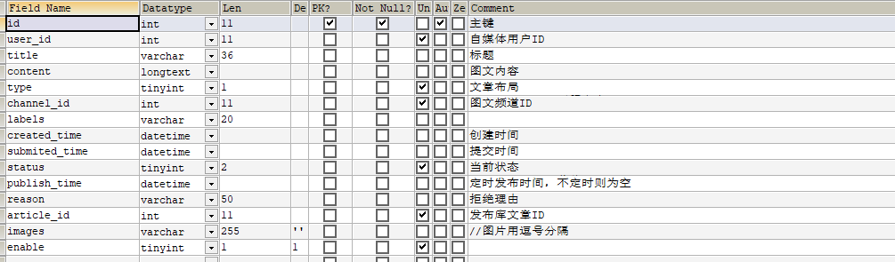
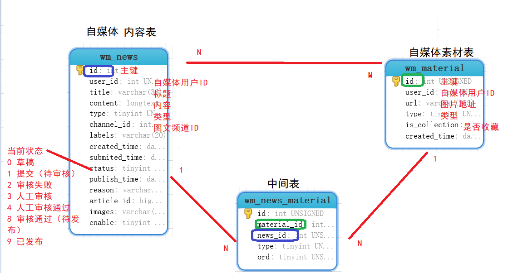
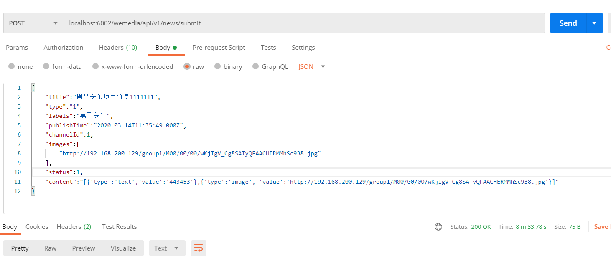
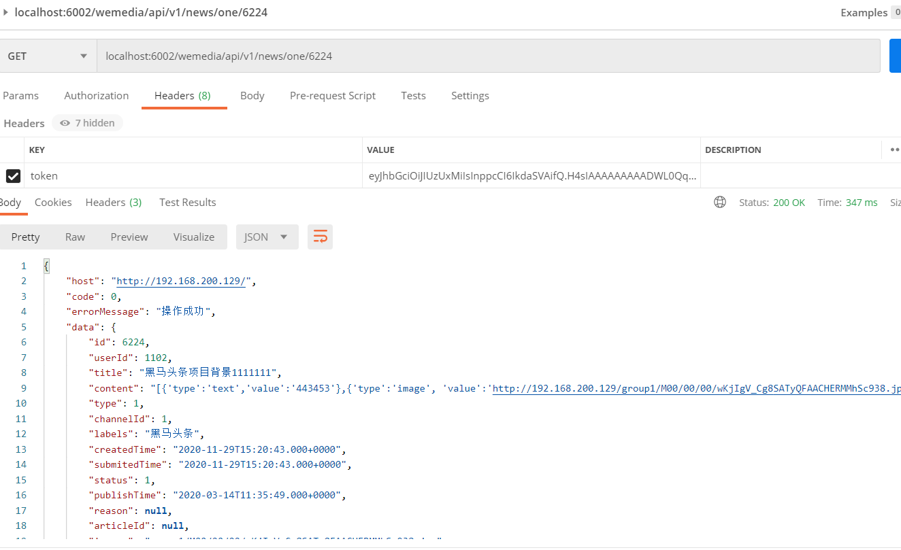

# 第五章 自媒体文章发布

## 目标

- 完成自媒体文章列表查询功能
- 完成自媒体文章的发布功能
- 完成自媒体文章的查询
- 完成自媒体文章的删除功能
- 完成自媒体文章的上下架功能功能

## 1 自媒体文章列表查询

### 1.1 需求分析

```
首先知道查的是哪张表？
	wm_news
入参:
	文章状态
            0 草稿
            1 提交（待审核）
            2 审核失败
            3 人工审核
            4 人工审核通过
            8 审核通过（待发布）
            9 已发布
	关键字(title)
	频道列表(id)
	发布日期
业务逻辑的时候也要从线程中获取UserId,加入逻辑判断中，因为当前wm_news张表是存储所有自媒体人发布的文章

```


### 1.2 表结构和实体类

wm_news  自媒体文章表



自媒体文章实体类

```java
package com.heima.model.media.pojos;

import com.baomidou.mybatisplus.annotation.IdType;
import com.baomidou.mybatisplus.annotation.TableField;
import com.baomidou.mybatisplus.annotation.TableId;
import com.baomidou.mybatisplus.annotation.TableName;
import lombok.Data;
import org.apache.ibatis.type.Alias;

import java.io.Serializable;
import java.util.Date;

/**
 * <p>
 * 自媒体图文内容信息表
 * </p>
 *
 * @author itheima
 */
@Data
@TableName("wm_news")
public class WmNews implements Serializable {

    private static final long serialVersionUID = 1L;

    /**
     * 主键
     */
    @TableId(value = "id", type = IdType.AUTO)
    private Integer id;

    /**
     * 自媒体用户ID
     */
    @TableField("user_id")
    private Integer userId;

    /**
     * 标题
     */
    @TableField("title")
    private String title;

    /**
     * 图文内容
     */
    @TableField("content")
    private String content;

    /**
     * 文章布局
            0 无图文章
            1 单图文章
            3 多图文章
     */
    @TableField("type")
    private Short type;

    /**
     * 图文频道ID
     */
    @TableField("channel_id")
    private Integer channelId;

    @TableField("labels")
    private String labels;

    /**
     * 创建时间
     */
    @TableField("created_time")
    private Date createdTime;

    /**
     * 提交时间
     */
    @TableField("submited_time")
    private Date submitedTime;

    /**
     * 当前状态
            0 草稿
            1 提交（待审核）
            2 审核失败
            3 人工审核
            4 人工审核通过
            8 审核通过（待发布）
            9 已发布
     */
    @TableField("status")
    private Short status;

    /**
     * 定时发布时间，不定时则为空
     */
    @TableField("publish_time")
    private Date publishTime;

    /**
     * 拒绝理由
     */
    @TableField("reason")
    private String reason;

    /**
     * 发布库文章ID
     */
    @TableField("article_id")
    private Long articleId;

    /**
     * //图片用逗号分隔
     */
    @TableField("images")
    private String images;

    @TableField("enable")
    private Short enable;
    
     //状态枚举类
    @Alias("WmNewsStatus")
    public enum Status{
        NORMAL((short)0),SUBMIT((short)1),FAIL((short)2),ADMIN_AUTH((short)3),ADMIN_SUCCESS((short)4),SUCCESS((short)8),PUBLISHED((short)9);
        short code;
        Status(short code){
            this.code = code;
        }
        public short getCode(){
            return this.code;
        }
    }

}
```

==注意：articleId属性的类型改为Long类型，因为数据库中是bigint类型的==

### 1.3 接口定义

在接口工程heima-leadnews-apis中定义接口

com.heima.api.wemedia.WmNewsControllerApi

```java
package com.heima.api.wemedia;

import com.heima.model.common.dtos.ResponseResult;

/**
 * 自媒体文章接口
 */
public interface WmNewsControllerApi {

    /**
     * 分页带条件查询自媒体文章列表
     * @param wmNewsPageReqDto
     * @return
     */
    public ResponseResult findAll(WmNewsPageReqDto wmNewsPageReqDto);
}
```

WmNewsPageReqDto

```java
package com.heima.model.media.dtos;

import com.heima.model.common.dtos.PageRequestDto;
import lombok.Data;

import java.util.Date;

@Data
public class WmNewsPageReqDto extends PageRequestDto {

    private Short status;//状态
    private Date beginPubdate;//开始时间
    private Date endPubdate;//结束时间
    private Integer channelId;//所属频道ID
    private String keyWord;//关键字
}
```

### 1.4 mapper实现

创建com.heima.wemedia.mapper.WmNewsMapper

```java
package com.heima.wemedia.mapper;

import com.baomidou.mybatisplus.core.mapper.BaseMapper;
import com.heima.model.media.pojos.WmNews;
import org.apache.ibatis.annotations.Mapper;

@Mapper
public interface WmNewsMapper extends BaseMapper<WmNews> {
}
```

### 1.5 service代码实现

定义WmNewsService接口：com.heima.wemedia.service.WmNewsService

```java
package com.heima.wemedia.service;

import com.baomidou.mybatisplus.extension.service.IService;
import com.heima.model.common.dtos.ResponseResult;
import com.heima.model.media.dtos.WmNewsPageReqDto;
import com.heima.model.media.pojos.WmNews;

public interface WmNewsService extends IService<WmNews> {

    /**
     * 查询所有自媒体文章
     * @return
     */
    public ResponseResult findAll(WmNewsPageReqDto wmNewsPageReqDto);
}
```

定义实现类 com.heima.wemedia.service.impl.WmNewsServiceImpl

```java
package com.heima.wemedia.service.impl;

import com.baomidou.mybatisplus.core.conditions.query.LambdaQueryWrapper;
import com.baomidou.mybatisplus.core.metadata.IPage;
import com.baomidou.mybatisplus.extension.plugins.pagination.Page;
import com.baomidou.mybatisplus.extension.service.impl.ServiceImpl;
import com.heima.model.common.dtos.PageResponseResult;
import com.heima.model.common.dtos.ResponseResult;
import com.heima.model.common.enums.AppHttpCodeEnum;
import com.heima.model.wemedia.dtos.WmNewsPageReqDto;
import com.heima.model.wemedia.pojos.WmNews;
import com.heima.model.wemedia.pojos.WmUser;
import com.heima.utils.threadlocal.WmThreadLocalUtils;
import com.heima.wemedia.mapper.WmNewsMapper;
import com.heima.wemedia.service.WmNewsService;
import org.springframework.beans.factory.annotation.Value;
import org.springframework.stereotype.Service;
import org.springframework.transaction.annotation.Transactional;

@Service
@Transactional
public class WmNewsServiceImpl extends ServiceImpl<WmNewsMapper, WmNews> implements WmNewsService {

    @Value("${fdfs.url}")
    private String fileServerUrl;

    @Override
    public ResponseResult findAll(WmNewsPageReqDto dto) {
        //1.参数检查
        if(dto == null){
            return ResponseResult.errorResult(AppHttpCodeEnum.PARAM_INVALID);
        }
        //分页参数检查
        dto.checkParam();

        //2.分页条件查询
        IPage pageParam = new Page(dto.getPage(),dto.getSize());

        LambdaQueryWrapper<WmNews> lambdaQueryWrapper = new LambdaQueryWrapper();
        //状态精确查询
        if(dto.getStatus() != null){
            lambdaQueryWrapper.eq(WmNews::getStatus,dto.getStatus());
        }
        //频道精确查询
        if(null != dto.getChannelId()){
            lambdaQueryWrapper.eq(WmNews::getChannelId,dto.getChannelId());
        }

        //时间范围查询
        if(dto.getBeginPubdate()!=null && dto.getEndPubdate()!=null){
            lambdaQueryWrapper.between(WmNews::getPublishTime,dto.getBeginPubdate(),dto.getEndPubdate());
        }

        //关键字模糊查询
        if(null != dto.getKeyword()){
            lambdaQueryWrapper.like(WmNews::getTitle,dto.getKeyword());
        }

        //查询当前登录用户的信息
        WmUser user = WmThreadLocalUtils.getUser();
        if(user==null){
            return ResponseResult.errorResult(AppHttpCodeEnum.NEED_LOGIN);
        }
        lambdaQueryWrapper.eq(WmNews::getUserId,user.getId());

        //按照创建日期倒序
        lambdaQueryWrapper.orderByDesc(WmNews::getCreatedTime);

        IPage pageResult = page(pageParam, lambdaQueryWrapper);

        //3.结果封装返回
        PageResponseResult responseResult = new PageResponseResult(dto.getPage(),dto.getSize(),(int)pageResult.getTotal());
        responseResult.setData(pageResult.getRecords());
        responseResult.setHost(fileServerUrl);
        return responseResult;
    }
}
```

### 1.6 controller代码实现

在自媒体微服务中定义controller：com.heima.wemedia.controller.WmNewsController

```java
package com.heima.wemedia.controller.v1;

import com.heima.apis.wemedia.WmNewsControllerApi;
import com.heima.model.common.dtos.ResponseResult;
import com.heima.model.wemedia.dtos.WmNewsPageReqDto;
import com.heima.wemedia.service.WmNewsService;
import org.springframework.beans.factory.annotation.Autowired;
import org.springframework.web.bind.annotation.PostMapping;
import org.springframework.web.bind.annotation.RequestBody;
import org.springframework.web.bind.annotation.RequestMapping;
import org.springframework.web.bind.annotation.RestController;

@RestController
@RequestMapping("/api/v1/news")
public class WmNewsController implements WmNewsControllerApi {

    @Autowired
    private WmNewsService wmNewsService;

    @PostMapping("/list")
    @Override
    public ResponseResult findAll(@RequestBody WmNewsPageReqDto wmNewsPageReqDto){
        return wmNewsService.findAll(wmNewsPageReqDto);
    }
}
```

### 1.7 测试

使用postman测试需要先登录，获取token后访问


或打开页面进行测试

## 2 频道列表展示

### 2.1需求分析


文章展示列表页面打开的时候，默认自动加载频道列表数据进行展示，就是查询所有频道数据

### 2.2 接口定义

在AdChannelControllerApi接口中新增方法，查询所有频道的数据

```java
/**
     * 查询所有频道
     * @return
     */
public ResponseResult findAll();
```

### 2.3 功能实现

在heima-leadnews-admin端，修改AdChannelController类，添加如下方法，mapper和service在之前已经定义

```java
@GetMapping("/channels")
@Override
public ResponseResult findAll() {
    List<AdChannel> list = adChannelService.list();
    return ResponseResult.okResult(list);
}
```

### 2.4 修改自媒体网关

在heima-leadnews-wemedia-gateway自媒体网关的yml配置文件中添加如下配置

```yaml
- id: admin
  uri: lb://leadnews-admin
  predicates:
   - Path=/admin/**
  filters:
   - StripPrefix= 1
```

### 2.5 测试

使用postman测试或者直接打开页面测试即可

## 3 自媒体文章-发布、修改，保存草稿

### 3.1 需求分析


保存文章，除了需要wm_news表以外，还需要另外两张表

wm_material  素材表


wm_news_material  文章素材关系表





### 3.2 思路分析

```
保存文章 wm_news
文章要和素材表关联
	1、文章内容中提取出来的图片id和文章id插入到中间表中(批量插入)
	2、封面图也要和文章id插入到中间表中（批量插入）
```

- 该功能为保存、修改（是否有id）、保存草稿的共有方法

-  如果有id修改文章，先删除所有素材关联关系

- 如果没有id，保存文章

- 关联内容中的图片与素材的关系

- 关联封面中的图片与素材的关系

  - 封面图片如果选择是自动需要从内容中截图图片做为封面图片

    截取规则为：内容图片的个数小于等于2  则为单图截图一张图，内容图片大于等于3，则为多图，截图三张图，内容中没有图片，则为无图
    
    前台传参规则：

```json
{
    "title":"黑马头条项目背景",
    "type":"1",//这个 0 是无图  1 是单图  3 是多图  -1 是自动
    "labels":"黑马头条",
    "publishTime":"2020-03-14T11:35:49.000Z",
    "channelId":1,
    "images":[
        "http://192.168.200.130/group1/M00/00/00/wKjIgl5swbGATaSAAAEPfZfx6Iw790.png"
    ],
    "status":1,
    "content":"[
    {
        "type":"text",
        "value":"随着智能手机的普及，人们更加习惯于通过手机来看新闻。由于生活节奏的加快，很多人只能利用碎片时间来获取信息，因此，对于移动资讯客户端的需求也越来越高。黑马头条项目正是在这样背景下开发出来。黑马头条项目采用当下火热的微服务+大数据技术架构实现。本项目主要着手于获取最新最热新闻资讯，通过大数据分析用户喜好精确推送咨询新闻"
    },
    {
        "type":"image",
        "value":"http://192.168.200.130/group1/M00/00/00/wKjIgl5swbGATaSAAAEPfZfx6Iw790.png"
    }
]"
}
```

### 3.3 接口定义

在接口中新增提交文章的方法：com.heima.api.wemedia.WmNewsControllerApi

```java
/**
     * 提交文章
     * @param wmNews
     * @return
     */
ResponseResult summitNews(WmNewsDto wmNews);
```

WmNewsDto

```java
package com.heima.model.media.dtos;

import lombok.Data;

import java.util.Date;
import java.util.List;

@Data
public class WmNewsDto {
    
    private Integer id;
     /**
     * 标题
     */
    private String title;
     /**
     * 频道id
     */
    private Integer channelId;
     /**
     * 标签
     */
    private String labels;
     /**
     * 发布时间
     */
    private Date publishTime;
     /**
     * 文章内容
     */
    private String content;
     /**
     * 文章封面类型  0 无图 1 单图 3 多图 -1 自动
     */
    private Short type;
     /**
     * 是否上架  0 下架  1 上架
     */
    private Short enable;
     /**
     * 提交时间
     */
    private Date submitedTime; 
     /**
     * 状态 提交为1  草稿为0
     */
    private Short status;
     /**
     * 拒绝理由
     */
    private String reason; 
     /**
     * 封面图片列表 多张图以逗号隔开
     */
    private List<String> images;
}
```

### 3.4 mapper定义

修改WmNewsMaterialMapper，添加一个方法，用来批量添加数据，用于素材与文章关系做关联

```java

void saveRelationsByContent(@Param("materials") List<String> materials, @Param("newsId") Integer newId, @Param("type") int type);

```

新建resources\mapper\WmNewsMaterialMapper.xml文件

```xml
<?xml version="1.0" encoding="UTF-8"?>
<!DOCTYPE mapper PUBLIC "-//mybatis.org//DTD Mapper 3.0//EN" "http://mybatis.org/dtd/mybatis-3-mapper.dtd">
<mapper namespace="com.heima.wemedia.mapper.WmNewsMaterialMapper">
    <insert id="saveRelationsByContent">
        insert into wm_news_material (material_id, news_id, type, ord)
        values
        <foreach item="mid" index="ord" collection="materials"  separator="," >
            (#{mid}, #{newsId}, #{type}, #{ord})
        </foreach>
    </insert>
</mapper>
```

### 3.5 业务层代码

常量类准备：com.heima.common.constants.wemedia.WmMediaConstans

```java
package com.heima.common.constans.wemedia;

public class WemediaContans {

    public static final Short COLLECT_MATERIAL = 1;//收藏

    public static final Short CANCEL_COLLECT_MATERIAL = 0;//收藏

    public static final String WM_NEWS_TYPE_IMAGE = "image";

    public static final Short WM_NEWS_NONE_IMAGE = 0;
    public static final Short WM_NEWS_SINGLE_IMAGE = 1;
    public static final Short WM_NEWS_MANY_IMAGE = 3;
    public static final Short WM_NEWS_TYPE_AUTO = -1;

    public static final Short WM_CONTENT_REFERENCE = 0;
    public static final Short WM_COVER_REFERENCE = 1;
}

```


在WmNewsService类中新增方法

```java
/**
   * 自媒体文章发布
   * @param wmNews
   * @param isSubmit  是否为提交 1 为提交 0为草稿
   * @return
  */
ResponseResult saveNews(WmNewsDto wmNews, Short isSubmit);
```

实现类：

```java
 @Override
public ResponseResult saveNews(WmNewsDto dto, Short isSubmit) {
    //1.检查参数
    if (dto == null || StringUtils.isBlank(dto.getContent())) {
        return ResponseResult.errorResult(AppHttpCodeEnum.PARAM_INVALID);
    }

    //2.保存或修改文章
    WmNews wmNews = new WmNews();
    BeanUtils.copyProperties(dto, wmNews);
    if (WemediaContans.WM_NEWS_AUTO_TYPE.equals(dto.getType())) {
        wmNews.setType(null);
    }
    if (dto.getImages() != null && dto.getImages().size() > 0) {
        //[dfjksdjfdfj.jpg,sdlkjfskld.jpg]
        wmNews.setImages(dto.getImages().toString().replace("[", "")
                         .replace("]", "").replace(fileServerUrl, "")
                         .replace(" ", ""));
    }
    //保存或修改文章
    saveWmNews(wmNews, isSubmit);


    //3.关联文章与素材的关系
    String content = dto.getContent();
    List<Map> list = JSON.parseArray(content, Map.class);
    List<String> materials = ectractUrlInfo(list);

    //3.1 关联内容中的图片与素材的关系
    if (isSubmit == WmNews.Status.SUBMIT.getCode() && materials.size() != 0) {
        ResponseResult responseResult = saveRelativeInfoForContent(materials, wmNews.getId());
        if (responseResult != null) {
            return responseResult;
        }
    }

    //3.2 关联封面中的图片与素材的关系,设置wm_news的type,自动
    if (isSubmit == WmNews.Status.SUBMIT.getCode()) {
        ResponseResult responseResult = saveRelativeInfoForCover(dto, materials, wmNews);
        if (responseResult != null) {
            return responseResult;
        }
    }


    return null;
}

/**
     * 设置封面图片与素材的关系
     *
     * @param dto
     * @param materials
     * @param wmNews
     * @return
     */
private ResponseResult saveRelativeInfoForCover(WmNewsDto dto, List<String> materials, WmNews wmNews) {
    List<String> images = dto.getImages();
    //自动匹配封面
    if (dto.getType().equals(WemediaContans.WM_NEWS_AUTO_TYPE)) {
        //内容中的图片数量小于等于2  设置为单图
        if (materials.size() > 0 && materials.size() <= 2) {
            wmNews.setType(WemediaContans.WM_NEWS_SINGLE_TYPE);
            images = materials.stream().limit(1).collect(Collectors.toList());
        } else if (materials.size() > 2) {
            //如果内容中的图片大于2 则设置为多图
            wmNews.setType(WemediaContans.WM_NEWS_MANY_TYPE);
            images = materials.stream().limit(3).collect(Collectors.toList());
        } else {
            //内容中没有图片，则是无图
            wmNews.setType(WemediaContans.WM_NEWS_NONE_TYPE);
        }
        //修改文章信息
        if (images != null && images.size() > 0) {
            wmNews.setImages(images.toString().replace("[", "")
                             .replace("]", "").replace(fileServerUrl, "")
                             .replace(" ", ""));

        }
        updateById(wmNews);
    }
    //保存封面图片与素材的关系
    if (images != null && images.size() > 0) {
        ResponseResult responseResult = saveRelativeInfoForImage(images, wmNews.getId());
        if (responseResult != null) {
            return responseResult;
        }
    }
    return null;
}

/**
     * @param images
     * @param newsId
     * @return
     */
private ResponseResult saveRelativeInfoForImage(List<String> images, Integer newsId) {
    List<String> materials = new ArrayList<>();
    for (String image : images) {
        materials.add(image.replace(fileServerUrl,""));
    }

    return saveRelativeInfo(materials,newsId,WemediaContans.WM_NEWS_COVER_REFERENCE);
}

/**
     * 保存素材与文章内容的关系
     *
     * @param materials
     * @param newsId
     * @return
     */
private ResponseResult saveRelativeInfoForContent(List<String> materials, Integer newsId) {
    return saveRelativeInfo(materials, newsId, WemediaContans.WM_NEWS_CONTENT_REFERENCE);
}

@Autowired
private WmMaterialMapper wmMaterialMapper;

/**
     * 保存关系
     *
     * @param materials
     * @param newsId
     * @param type
     * @return
     */
private ResponseResult saveRelativeInfo(List<String> materials, Integer newsId, Short type) {
    //1.获取数据库中的素材信息
    LambdaQueryWrapper<WmMaterial> lambdaQueryWrapper = new LambdaQueryWrapper<>();
    lambdaQueryWrapper.in(WmMaterial::getUrl, materials);
    lambdaQueryWrapper.eq(WmMaterial::getUserId, WmThreadLocalUtils.getUser().getId());
    List<WmMaterial> dbMaterials = wmMaterialMapper.selectList(lambdaQueryWrapper);
    //2.通过图片的路径获取素材的id
    List<String> materialsIds = new ArrayList<>();
    if (dbMaterials != null && dbMaterials.size() > 0) {
        //<kdjfksdjkfljdsf.jps,2>
        Map<String, Integer> uriIdMap = dbMaterials.stream().collect(Collectors.toMap(WmMaterial::getUrl, WmMaterial::getId));
        for (String val : materials) {
            String materialId = String.valueOf(uriIdMap.get(val));
            //没找到
            if ("null".equals(materialId)) {
                return ResponseResult.errorResult(AppHttpCodeEnum.PARAM_INVALID, "应用图片失效");
            }
            //找到了
            materialsIds.add(materialId);
        }
    }

    //3.批量保存数据
    wmNewsMaterialMapper.saveRelations(materialsIds, newsId, type);
    return null;
}

/**
     * 提取图片信息
     *
     * @param list
     * @return
     */
private List<String> ectractUrlInfo(List<Map> list) {
    List<String> materials = new ArrayList<>();
    for (Map map : list) {
        if (map.get("type").equals(WemediaContans.WM_NEWS_TYPE_IMAGE)) {
            String imgUrl = (String) map.get("value");
            imgUrl = imgUrl.replace(fileServerUrl, "");
            materials.add(imgUrl);
        }
    }
    return materials;
}

@Autowired
private WmNewsMaterialMapper wmNewsMaterialMapper;

/**
     * 保存或修改文章
     *
     * @param wmNews
     * @param isSubmit
     */
private void saveWmNews(WmNews wmNews, Short isSubmit) {
    wmNews.setStatus(isSubmit);
    wmNews.setUserId(WmThreadLocalUtils.getUser().getId());
    wmNews.setCreatedTime(new Date());
    wmNews.setSubmitedTime(new Date());
    wmNews.setEnable((short) 1);
    if (wmNews.getId() == null) {
        save(wmNews);
    } else {
        //如果是修改，则先删除素材与文章的关系
        LambdaQueryWrapper<WmNewsMaterial> queryWrapper = new LambdaQueryWrapper();
        queryWrapper.eq(WmNewsMaterial::getNewsId, wmNews.getId());
        wmNewsMaterialMapper.delete(queryWrapper);
        updateById(wmNews);
    }
}
```

### 3.6 控制层

在WmNewsController类中新增方法

```java
@PostMapping("/submit")
@Override
public ResponseResult summitNews(@RequestBody WmNewsDto wmNews) {
    if(wmNews.getStatus()== WmNews.Status.SUBMIT.getCode()){
        //提交文章
        return wmNewsService.saveNews(wmNews, WmNews.Status.SUBMIT.getCode());
    }else{
        //保存草稿
        return wmNewsService.saveNews(wmNews, WmNews.Status.NORMAL.getCode());
    }
}
```

### 3.7 测试

```json
{
    "title":"黑马头条项目背景1111111",
    "type":"1",
    "labels":"黑马头条",
    "publishTime":"2020-03-14T11:35:49.000Z",
    "channelId":1,
    "images":[
        "http://192.168.200.129/group1/M00/00/00/wKjIgV_VSVeACCAtAABYXg2FGeY352.jpg"
    ],
    "status":1,
    "content":"[{'type':'text','value':'443453'},{'type':'image', 'value':'http://192.168.200.129/group1/M00/00/00/wKjIgV_VSVeACCAtAABYXg2FGeY352.jpg'}]"
}
```

postman工具测试

必须先登录获取token



打开前端工程联调

## 4 自媒体文章-根据id查询

### 4.1 需求分析


点击修改的时候，就是根据文章id查询，跳转至编辑页面进行展示


### 4.2 接口定义

在WmNewsControllerApi接口中新增方法：

```java
/**
     * 根据id获取文章信息
     * @return
     */
ResponseResult findWmNewsById(Integer id);
```

### 4.3 业务层代码编写

在WmNewsService接口中新增方法 根据id查询文章的方法

```java
/**
     * 根据文章id查询文章
     * @return
     */
ResponseResult findWmNewsById(Integer id);
```

实现类：

```java
@Override
public ResponseResult findWmNewsById(Integer id) {
    //1.参数检查
    if(id == null){
        return ResponseResult.errorResult(AppHttpCodeEnum.PARAM_INVALID,"文章Id不可缺少");
    }
    //2.查询数据
    WmNews wmNews = getById(id);
    if(wmNews == null){
        return ResponseResult.errorResult(AppHttpCodeEnum.DATA_NOT_EXIST,"文章不存在");
    }

    //3.结果返回
    ResponseResult responseResult = ResponseResult.okResult(wmNews);
    responseResult.setHost(fileServerUrl);
    return responseResult;
}
```

### 4.4 控制层

在WmNewsController新增方法 查询文章

```java
@GetMapping("/one/{id}")
@Override
public ResponseResult findWmNewsById(@PathVariable("id") Integer id) {
    return wmNewsService.findWmNewsById(id);
}
```

### 4.5 测试



打开页面进行测试

## 5 自媒体文章-删除

### 5.1 需求分析


- 当文章状态为9(已发布)且已上架则不能删除文章，下架状态可以删除，如果是其他状态可以删除
- 删除文章之前需要先把素材与文章的关系删除掉

### 5.2 接口定义

WmNewsControllerApi中添加删除方法

```java
/**
     * 删除文章
     * @return
     */
ResponseResult delNews(Integer id);
```

### 5.3 业务层

WmNewsService添加删除方法

```java
/**
     * 删除文章
     * @return
     */
ResponseResult delNews(Integer id);
```

实现类：

```java
@Override
public ResponseResult delNews(Integer id) {
    //1.检查参数
    if(id == null){
        return ResponseResult.errorResult(AppHttpCodeEnum.PARAM_INVALID,"文章Id不可缺少");
    }
    //2.获取数据
    WmNews wmNews = getById(id);
    if(wmNews == null){
        return ResponseResult.errorResult(AppHttpCodeEnum.DATA_NOT_EXIST,"文章不存在");
    }

    //3.判断当前文章的状态  status==9  enable == 1
    if(wmNews.getStatus().equals(WmNews.Status.PUBLISHED.getCode()) && wmNews.getEnable().equals(WemediaContans.WM_NEWS_ENABLE_UP)){
        return ResponseResult.errorResult(AppHttpCodeEnum.DATA_NOT_EXIST,"文章已发布，不能删除");
    }

    //4.去除素材与文章的关系
    wmNewsMaterialMapper.delete(Wrappers.<WmNewsMaterial>lambdaQuery().eq(WmNewsMaterial::getNewsId,wmNews.getId()));

    //5.删除文章
    removeById(wmNews.getId());
    return ResponseResult.okResult(AppHttpCodeEnum.SUCCESS);
}
```

### 5.4 控制层

在WmNewsController中添加删除方法

```java
@GetMapping("/del_news/{id}")
@Override
public ResponseResult delNews(@PathVariable("id") Integer id) {
    return wmNewsService.delNews(id);
}
```

## 6 自媒体文章-上架、下架

### 6.1 需求分析


- 当前已经发布（状态为9）的文章可以上架（enable = 1），也可以下架（enable = 0）

- 在上架和下架操作的同时，需要同步app端的文章配置信息，暂时不做，后期讲到审核文章的时候再优化

### 6.2 接口定义

在WmNewsControllerApi中新增方法

```java
 /**
     * 上下架
     * @param dto
     * @return
     */
ResponseResult downOrUp(WmNewsDto dto);
```


### 6.3 业务层

在WmNewsService新增方法

```java
/**
     * 上下架
     * @param dto
     * @return
     */
ResponseResult downOrUp(WmNewsDto dto);
```

实现类：

```java
@Override
public ResponseResult downOrUp(WmNewsDto dto) {
    //1.检查参数
    if(dto == null || dto.getId() == null){
        return ResponseResult.errorResult(AppHttpCodeEnum.PARAM_INVALID);
    }

    //2.查询文章
    WmNews wmNews = getById(dto.getId());
    if(wmNews == null){
        return ResponseResult.errorResult(AppHttpCodeEnum.DATA_NOT_EXIST,"文章不存在");
    }

    //3.判断文章是否发布
    if(!wmNews.getStatus().equals(WmNews.Status.PUBLISHED.getCode())){
        return ResponseResult.errorResult(AppHttpCodeEnum.DATA_NOT_EXIST,"当前文章不是发布状态，不能上下架");
    }

    //4.修改文章状态，同步到app端（后期做）TODO
    if(dto.getEnable() != null && dto.getEnable() > -1 && dto.getEnable() < 2){
        update(Wrappers.<WmNews>lambdaUpdate().eq(WmNews::getId,dto.getId()).set(WmNews::getEnable,dto.getEnable()));
    }
    return ResponseResult.okResult(AppHttpCodeEnum.SUCCESS);
}
```

### 6.4 控制层

```java
@PostMapping("/down_or_up")
@Override
public ResponseResult downOrUp(@RequestBody WmNewsDto dto) {
    return wmNewsService.downOrUp(dto);
}
```

### 6.5测试


