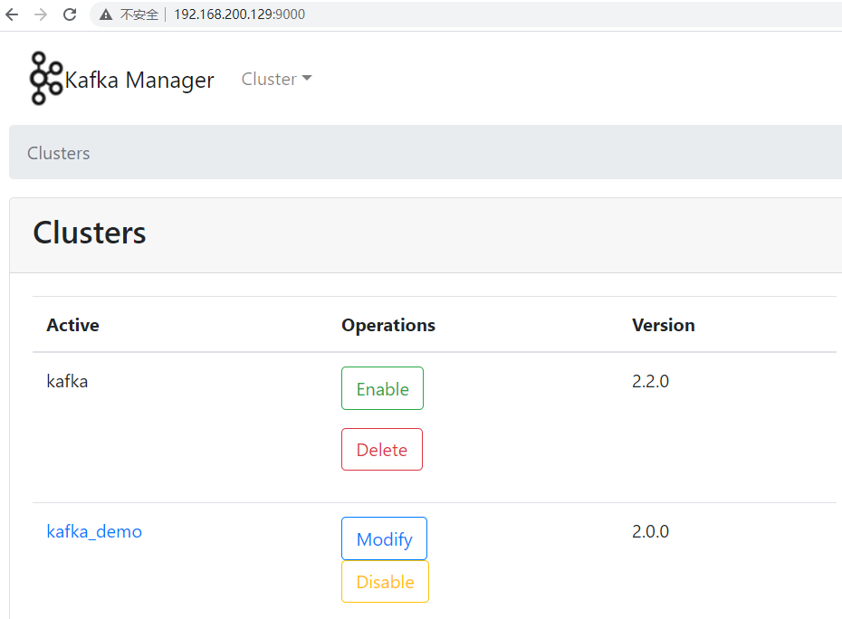
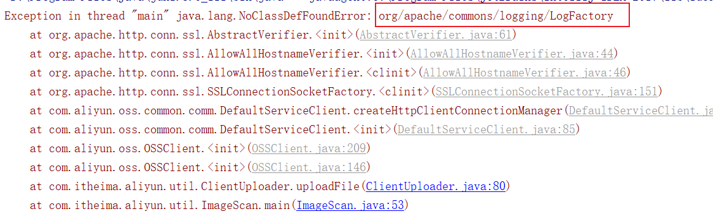
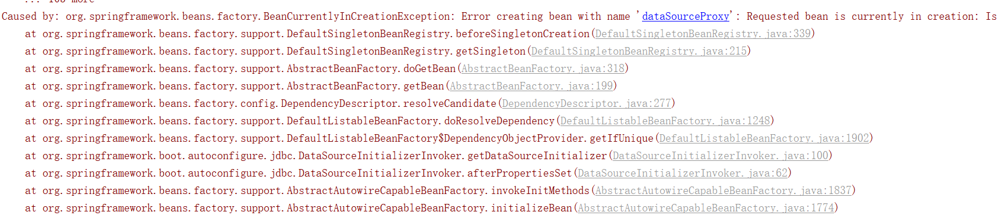

# 第6章 kafka&第三方接口对接

## 目标

- 能够了解kafka基本信息
- 能够运用kafka进行消息的收发
- 能能理解kafka生产者的原理和机制
- 能能理解kafka消费者的原理和机制
- 能够完成阿里云安全第三方接口文档的使用
- 能够把阿里云安全对接到项目中
- 能够理解敏感词过滤算法dfa

## 1 kafka

### ==注意：消息中间件对比==

| ** **          | **RabbitMQ**                                                 | **ActiveMQ**                            | **RocketMQ**             | **Kafka**                                      |
| -------------- | ------------------------------------------------------------ | --------------------------------------- | ------------------------ | ---------------------------------------------- |
| 公司/社区      | Rabbit                                                       | Apache                                  | 阿里                     | Apache                                         |
| 开发语言       | Erlang                                                       | Java                                    | Java                     | Scala&Java                                     |
| 协议支持       | AMQP，XMPP，SMTP，STOMP                                      | OpenWire,STOMP，REST,XMPP,AMQP          | 自定义                   | 自定义协议，社区封装了http协议支持             |
| 客户端支持语言 | 官方支持Erlang，Java，Ruby等,社区产出多种API，几乎支持所有语言 | Java，C，C++，Python，PHP，Perl，.net等 | Java，C++（不成熟）      | 官方支持Java,社区产出多种API，如PHP，Python等  |
| 单机吞吐量     | 万级（其次）                                                 | 万级（最差）                            | 十万级（最好）           | 十万级（次之）                                 |
| 消息延迟       | 微秒级                                                       | 毫秒级                                  | 毫秒级                   | 毫秒以内                                       |
| 功能特性       | 并发能力强，性能极其好，延时低，社区活跃，管理界面丰富       | 老牌产品，成熟度高，文档较多            | MQ功能比较完备，扩展性佳 | 只支持主要的MQ功能，毕竟是为大数据领域准备的。 |

### 1.1 kafka介绍

Kafka 是一个分布式流媒体平台

kafka官网：http://kafka.apache.org/

（1）流媒体平台有三个关键功能：

-  **发布和订阅记录流**，类似于消息队列或企业消息传递系统。
-  以**容错的持久方式存储记录流**。
-  记录发生时处理流。

（2）Kafka通常用于两大类应用：

-  构建可在**系统或应用程序之间**可靠获取数据的实时流数据管道
-  构建转换或响应数据流的实时流应用程序


（3）kafka名词解释

- topic：Kafka将消息分门别类，每一类的消息称之为一个主题（Topic）
- producer：发布消息的对象称之为主题生产者（Kafka topic producer）
- consumer：订阅消息并处理发布的消息的对象称之为主题消费者（consumers）
- broker：已发布的消息保存在一组服务器中，称之为Kafka集群。集群中的每一个服务器都是一个代理（Broker）。 消费者可以订阅一个或多个主题（topic），并从Broker拉数据，从而消费这些已发布的消息。

### 1.2 kafka安装和配置

#### 1.2.1 jdk环境

首先需要安装Java环境，同时配置环境变量

#### 1.2.2 zookeeper安装

Zookeeper是安装Kafka集群的必要组件，Kafka通过Zookeeper来实施对元数据信息的管理，包括集
群、主题、分区等内容。
同样在官网下载安装包到指定目录解压缩

ZooKeeper 官网： http://zookeeper.apache.org/

在今天提供的资料中，有一个zookeeper-3.4.14.tar.gz包，上传到服务器，也可以到官网上下载

（1）解压压缩包

```shell
tar zxvf zookeeper-3.4.14.tar.gz
```

（2）修改配置文件，进入安装路径conf目录，并将zoo_sample.cfg文件修改为zoo.cfg

```shell
cd zookeeper-3.4.14  #进入安装目录
cd conf   #进入配置目录
mv zoo_sample.cfg zoo.cfg  # 把文件改名
```


（3）创建存放数据的目录 data

在zookeeper安装的根目录创建目录 data

```shell
mkdir data 
```

创建完的效果如下：


（4）配置数据存储目录

进入conf目录下，编辑zoo.cfg

```shell
vi conf/zoo.cfg
```

修改内容，如下图


（5）启动zookeeper

进入bin目录

```shell
./zkServer.sh start # 启动
./zkServer.sh status # 查看状态
./zkServer.sh restart # 重启
./zkServer.sh stop # 关闭
```

启动后可以查看进行

```shell
jps
```


#### 1.2.3 kafka安装

（1）官网下载

下载地址：http://kafka.apache.org/downloads


也可以在今天的资源文件夹中找到这个安装，直接上传到服务器即可

（2）解压

```shell
tar zxvf kafka_2.12-2.2.1.tgz
```

（3）修改参数

修改config目录下的server.properties文件,效果如下

- 修改listeners=PLAINTEXT://host:9092
- log.dirs=/root/kafka_2.12-2.2.1/logs       <font color='gree'>需要在kafka安装目录新建logs目录</font>


（4）启动kafka

在kafka的根目录

```shell
#前台启动
bin/kafka-server-start.sh config/server.properties  #启动kafka

#后台启动
bin/kafka-server-start.sh config/server.properties & #启动kafka
```

查看进程


<font color='red'>注意：启动kafka之前，必须先启动zookeeper</font>

### ==优化docker安装kafka==

```shell
#zookeeper镜像
docker pull wurstmeister/zookeeper
#kafka镜像
docker pull wurstmeister/kafka

#安装zookeeper容器
docker run -di --name=zookeeper -p 2181:2181 -v /etc/localtime:/etc/localtime --restart=always wurstmeister/zookeeper

#安装kafka容器
docker run  -di --name=kafka -p 9092:9092 --restart=always -e KAFKA_BROKER_ID=0 -e KAFKA_ZOOKEEPER_CONNECT=192.168.200.129:2181 -e KAFKA_ADVERTISED_LISTENERS=PLAINTEXT://192.168.200.129:9092 -e KAFKA_LISTENERS=PLAINTEXT://0.0.0.0:9092 -t wurstmeister/kafka
```

> 解析：
>
> -e KAFKA_BROKER_ID=0 在kafka集群中，每个kafka都有一个BROKER_ID来区分自己
>
> -e KAFKA_ZOOKEEPER_CONNECT=192.168.200.129:2181/kafka 配置zookeeper管理kafka的路径192.168.200.129:2181/kafka
>
> -e KAFKA_ADVERTISED_LISTENERS=PLAINTEXT://192.168.200.129:9092 把kafka的地址端口注册给zookeeper
>
> -e KAFKA_LISTENERS=PLAINTEXT://0.0.0.0:9092 配置kafka的监听端口
>
> -v /etc/localtime:/etc/localtime 容器时间同步虚拟机的时间

### ==关于kafka的可视化管理界面==

```shell
#拉取镜像
docker pull solsson/kafka-manager
#创建容器
docker run -di --name=kafka-manager  -p 9001:9000 --restart=always --e ZK_HOSTS=192.168.200.129:2181 solsson/kafka-manager
```

> 在浏览器上访问 http://ip:9000可以访问到图形化界面



### 1.3 kafka入门案例

#### 1.3.1 创建工程kafka-demo

创建kafka-demo工程，引入依赖信息

```xml
<properties>
    <kafka.client.version>2.0.1</kafka.client.version>
</properties>
<dependencies>
    <dependency>
        <groupId>org.apache.kafka</groupId>
        <artifactId>kafka-clients</artifactId>
        <version>${kafka.client.version}</version>
    </dependency>
</dependencies>
```

做一个java普通的生产者和消费者只需要依赖`kafka-clients`即可

#### 1.3.2 消息生产者

创建类：

```java
package com.itheima.kafka.simple;

import org.apache.kafka.clients.producer.KafkaProducer;
import org.apache.kafka.clients.producer.ProducerConfig;
import org.apache.kafka.clients.producer.ProducerRecord;
import org.apache.kafka.common.protocol.types.Field;

import java.util.Properties;

/**
 * 消息生产者
 */
public class ProducerFastStart {

    private static final String TOPIC = "itcast-heima";

    public static void main(String[] args) {

        //添加kafka的配置信息
        Properties properties = new Properties();
        //配置broker信息
        properties.put("bootstrap.servers","192.168.200.130:9092");
        properties.put(ProducerConfig.KEY_SERIALIZER_CLASS_CONFIG,"org.apache.kafka.common.serialization.StringSerializer");
        properties.put(ProducerConfig.VALUE_SERIALIZER_CLASS_CONFIG,"org.apache.kafka.common.serialization.StringSerializer");
        properties.put(ProducerConfig.RETRIES_CONFIG,10);

        //生产者对象
        KafkaProducer<String,String> producer = new KafkaProducer<String, String>(properties);

        //封装消息
        ProducerRecord<String,String> record = new ProducerRecord<String, String>(TOPIC,"00001","hello kafka !");
        //发送消息
        try {
            producer.send(record);
        }catch (Exception e){
            e.printStackTrace();
        }

        //关系消息通道
        producer.close();
    }
}
```

#### 1.3.3 消息消费者

创建消费者类：

```java
package com.itheima.kafka.simple;

import org.apache.kafka.clients.consumer.ConsumerConfig;
import org.apache.kafka.clients.consumer.ConsumerRecord;
import org.apache.kafka.clients.consumer.ConsumerRecords;
import org.apache.kafka.clients.consumer.KafkaConsumer;

import java.time.Duration;
import java.util.Collections;
import java.util.Properties;

/**
 * 消息消费者
 */
public class ConsumerFastStart {

    private static final String TOPIC = "itcast-heima";

    public static void main(String[] args) {

        //添加配置信息
        Properties properties = new Properties();
        properties.put(ConsumerConfig.BOOTSTRAP_SERVERS_CONFIG,"192.168.200.130:9092");
        properties.put(ConsumerConfig.KEY_DESERIALIZER_CLASS_CONFIG,"org.apache.kafka.common.serialization.StringDeserializer");
        properties.put(ConsumerConfig.VALUE_DESERIALIZER_CLASS_CONFIG,"org.apache.kafka.common.serialization.StringDeserializer");
        //设置分组
        properties.put(ConsumerConfig.GROUP_ID_CONFIG,"group2");

        //创建消费者
        KafkaConsumer<String, String> consumer = new KafkaConsumer<String, String>(properties);
        //订阅主题
        consumer.subscribe(Collections.singletonList(TOPIC));

        while (true){
            ConsumerRecords<String, String> records = consumer.poll(Duration.ofMillis(1000));
            for (ConsumerRecord<String, String> record : records) {
                System.out.println(record.value());
                System.out.println(record.key());
            }
        }

    }
}
```

#### 1.3.4 测试及结论

- 生产者发送消息，同一个组中的多个消费者只能有一个消费者接收消息
- 生产者发送消息，如果有多个组，每个组中只能有一个消费者接收消息,如果想要实现广播的效果，可以让每个消费者单独有一个组即可，这样每个消费者都可以接收到消息

#### 1.3.5 相关概念再介绍


在kafka概述里介绍了概念包括：topic、producer、consumer、broker，这些是最基本的一些概念，想要更深入理解kafka还要知道它的一些其他概念定义：

- 消息Message

  Kafka 中的数据单元被称为消息message，也被称为记录，可以把它看作数据库表中某一行的记录。

- topic

  Kafka将消息分门别类，每一类的消息称之为一个主题（Topic）

- 批次

  为了提高效率， 消息会分批次写入 Kafka，批次就代指的是一组消息。

- 分区Partition

  主题可以被分为若干个分区（partition），同一个主题中的分区可以不在一个机器上，有可能会部署在多个机器上，由此来实现 kafka 的伸缩性。topic中的数据分割为一个或多个partition。每个topic至少有一个partition。每个partition中的数据使用多个文件进行存储。partition中的数据是有序的，partition之间的数据是没有顺序的。如果topic有多个partition，消费数据时就不能保证数据的顺序。在需要严格保证消息的消费顺序的场景下，需要将partition数目设为1。

- broker

  一个独立的 Kafka 服务器就被称为 broker，broker 接收来自生产者的消息，为消息设置偏移量，并提交消息到磁盘保存。

- Broker 集群

  broker 是集群 的组成部分，broker 集群由一个或多个 broker 组成，每个集群都有一个 broker同时充当了集群控制器的角色（自动从集群的活跃成员中选举出来）。

- 副本Replica

  Kafka 中消息的备份又叫做 副本（Replica），副本的数量是可以配置的，Kafka 定义了两类副本：领导者副本（Leader Replica） 和 追随者副本（Follower Replica）；所有写请求都通过Leader路由，数据变更会广播给所有Follower，Follower与Leader保持数据同步。如果Leader失效，则从Follower中选举出一个新的Leader。当Follower与Leader挂掉、卡住或者同步太慢，leader会把这个follower从ISR列表（保持同步的副本列表）中删除，重新创建一个Follower。

- Zookeeper

  kafka对与zookeeper是强依赖的，是以zookeeper作为基础的，即使不做集群，也需要zk的支持。Kafka通过Zookeeper管理集群配置，选举leader，以及在Consumer Group发生变化时进行重平衡。

- 消费者群组Consumer Group

  生产者与消费者的关系就如同餐厅中的厨师和顾客之间的关系一样，一个厨师对应多个顾客，也就是一个生产者对应多个消费者，消费者群组（Consumer Group）指的就是由一个或多个消费者组成的群体。

- 偏移量Consumer Offset

  偏移量（Consumer Offset）是一种元数据，它是一个不断递增的整数值，用来记录消费者发生重平衡时的位置，以便用来恢复数据。

- 重平衡Rebalance

  消费者组内某个消费者实例挂掉后，其他消费者实例自动重新分配订阅主题分区的过程。Rebalance 是 Kafka 消费者端实现高可用的重要手段。

#### 1.3.5 生产者详解

（1）发送消息的工作原理


```
工作原理：
	kafka-cluster模块中的kafka是主从关系
	1、让生产者知道集群中哪个kafka是主服务器
	2、生产者要把消息发送给主服务器（我们需要做的）
	3、主服务器要把收到的消息写入到本地文件中
	4、从服务器要从主服务器中获取消息(主从同步)
	5、从服务器也要把消息写入本地文件，然后要给予主服务器一个应答 ack
	6、此时集群中的所有的服务器均已收到消息并保存，主服务器要向生产者响应的一个消息，就是确认收到消息的通知ack
```

（2）发送类型

- 发送并忘记（fire-and-forget）

  把消息发送给服务器，并不关心它是否正常到达，大多数情况下，消息会正常到达，因为kafka是高可用的，而且生产者会自动尝试重发，使用这种方式有时候会丢失一些信息

- 同步发送

  使用send()方法发送，它会返回一个Future对象，调用get()方法进行等待，就可以知道消息是否发送成功

  ```java
  //发送消息
  try {
      RecordMetadata recordMetadata = producer.send(record).get();
      System.out.println(recordMetadata.offset());//获取偏移量
  }catch (Exception e){
      e.printStackTrace();
  }
  ```

  如果服务器返回错误，get()方法会抛出异常，如果没有发生错误，我们就会得到一个RecordMetadata对象，可以用它来获取消息的偏移量

- 异步发送

  调用send()方法，并指定一个回调函数，服务器在返回响应时调用函数。如下代码

  ```java
  //发送消息
  try {
      producer.send(record, new Callback() {
          @Override
          public void onCompletion(RecordMetadata recordMetadata, Exception e) {
              if(e!=null){
                  e.printStackTrace();
              }
              System.out.println(recordMetadata.offset());
          }
      });
  }catch (Exception e){
      e.printStackTrace();
  }
  ```

  如果kafka返回一个错误，onCompletion()方法会抛出一个非空（non null）异常，可以根据实际情况处理，比如记录错误日志，或者把消息写入“错误消息”文件中，方便后期进行分析。

（3）参数详解

到目前为止，我们只介绍了生产者的几个必要参数（bootstrap.servers、序列化器等）

生产者还有很多可配置的参数，在kafka官方文档中都有说明，大部分都有合理的默认值，所以没有必要去修改它们，不过有几个参数在内存使用，性能和可靠性方法对生产者有影响

- acks 

  指的是producer的消息发送确认机制

  - acks=0

    生产者在成功写入消息之前不会等待任何来自服务器的响应，也就是说，如果当中出现了问题，导致服务器没有收到消息，那么生产者就无从得知，消息也就丢失了。不过，因为生产者不需要等待服务器的响应，所以它可以以网络能够支持的最大速度发送消息，从而达到很高的吞吐量。

  - acks=1

    只要集群首领节点收到消息，生产者就会收到一个来自服务器的成功响应，如果消息无法到达首领节点，生产者会收到一个错误响应，为了避免数据丢失，生产者会重发消息。

  - acks=all

    只有当所有参与赋值的节点全部收到消息时，生产者才会收到一个来自服务器的成功响应，这种模式是最安全的，它可以保证不止一个服务器收到消息，就算有服务器发生崩溃，整个集群仍然可以运行。不过他的延迟比acks=1时更高。

- retries

  生产者从服务器收到的错误有可能是临时性错误，在这种情况下，retries参数的值决定了生产者可以重发消息的次数，如果达到这个次数，生产者会放弃重试返回错误，默认情况下，生产者会在每次重试之间等待100ms

  

#### 1.3.6 消费者详解

（1）消费者工作原理


（2）其他参数详解

- enable.auto.commit

  该属性指定了消费者是否自动提交偏移量，默认值是true。为了尽量避免出现重复数据和数据丢失，可以把它设置为false，由自己控制何时提交偏移量。如果把它设置为true,还可以通过配置`auto.commit.interval.ms`属性来控制提交的频率。																																			

- auto.offset.reset

  - earliest

    当各分区下有已提交的offset时，从提交的offset开始消费；无提交的offset时，从头开始消费

  - latest

    当各分区下有已提交的offset时，从提交的offset开始消费；无提交的offset时，消费新产生的该分区下的数据

  - none

    topic各分区都存在已提交的offset时，从offset后开始消费；只要有一个分区不存在已提交的offset，则抛出异常

  - anything  else

    向consumer抛出异常

（3）提交和偏移量

每次调用poll()方法，它会返回由生产者写入kafka但还没有被消费者读取过来的记录，我们由此可以追踪到哪些记录是被群组里的哪个消费者读取的，kafka不会像其他JMS队列那样需要得到消费者的确认，这是kafka的一个独特之处，相反，消费者可以使用kafka来追踪消息在分区的位置（偏移量）

消费者会往一个叫做`_consumer_offset`的特殊主题发送消息，消息里包含了每个分区的偏移量。如果消费者一直处于运行状态，那么偏移量就没有什么用处。不过，如果消费者发生崩溃或有新的消费者加入群组，就会触发再均衡，完成再均衡之后，每个消费者可能分配到新的分区，消费者需要读取每个分区最后一次提交的偏移量，然后从偏移量指定的地方继续处理。


如果提交偏移量小于客户端处理的最后一个消息的偏移量，那么处于两个偏移量之间的消息就会被重复处理。

如下图：


如果提交的偏移量大于客户端的最后一个消息的偏移量，那么处于两个偏移量之间的消息将会丢失。

如下图：


（4）自动提交偏移量

当`enable.auto.commit`被设置为true，提交方式就是让消费者自动提交偏移量，每隔5秒消费者会自动把从poll()方法接收的最大偏移量提交上去。提交时间间隔有`auto.commot.interval.ms`控制，默认值是5秒。

需要注意到，这种方式可能会导致消息重复消费。假如，某个消费者poll消息后，应用正在处理消息，在3秒后Kafka进行了重平衡，那么由于没有更新位移导致重平衡后这部分消息重复消费。


（5）提交当前偏移量（同步提交）

把`enable.auto.commit`设置为false,让应用程序决定何时提交偏移量。使用commitSync()提交偏移量，commitSync()将会提交poll返回的最新的偏移量，所以在处理完所有记录后要确保调用了commitSync()方法。否则还是会有消息丢失的风险。

只要没有发生不可恢复的错误，commitSync()方法会一直尝试直至提交成功，如果提交失败也可以记录到错误日志里。

```java
while (true){
    ConsumerRecords<String, String> records = consumer.poll(Duration.ofMillis(1000));
    for (ConsumerRecord<String, String> record : records) {
        System.out.println(record.value());
        System.out.println(record.key());
        try {
            consumer.commitSync();//同步提交当前最新的偏移量
        }catch (CommitFailedException e){
            System.out.println("记录提交失败的异常："+e);
        }

    }
}
```

（6）异步提交

手动提交有一个缺点，那就是当发起提交调用时应用会阻塞。当然我们可以减少手动提交的频率，但这个会增加消息重复的概率（和自动提交一样）。另外一个解决办法是，使用异步提交的API。

```java
while (true){
    ConsumerRecords<String, String> records = consumer.poll(Duration.ofMillis(1000));
    for (ConsumerRecord<String, String> record : records) {
        System.out.println(record.value());
        System.out.println(record.key());
    }
    consumer.commitAsync(new OffsetCommitCallback() {
        @Override
        public void onComplete(Map<TopicPartition, OffsetAndMetadata> map, Exception e) {
            if(e!=null){
                System.out.println("记录错误的提交偏移量："+ map+",异常信息"+e);
            }
        }
    });
}
```

(7）同步和异步组合提交

异步提交也有个缺点，那就是如果服务器返回提交失败，异步提交不会进行重试。相比较起来，同步提交会进行重试直到成功或者最后抛出异常给应用。异步提交没有实现重试是因为，如果同时存在多个异步提交，进行重试可能会导致位移覆盖。

举个例子，假如我们发起了一个异步提交commitA，此时的提交位移为2000，随后又发起了一个异步提交commitB且位移为3000；commitA提交失败但commitB提交成功，此时commitA进行重试并成功的话，会将实际上将已经提交的位移从3000回滚到2000，导致消息重复消费。

```java
try {
    while (true){
        ConsumerRecords<String, String> records = consumer.poll(Duration.ofMillis(1000));
        for (ConsumerRecord<String, String> record : records) {
            System.out.println(record.value());
            System.out.println(record.key());
        }
        consumer.commitAsync();
    }
}catch (Exception e){
    e.printStackTrace();
    System.out.println("记录错误信息："+e);
}finally {
    try {
        consumer.commitSync();
    }finally {
        consumer.close();
    }
}
```

小结：

```
我们把提交方式由自动改为手动提交，(包含同步提交和异步提交)，为了记录偏移量，目的是为了解决消息的不丢失
```


### 1.4 spring boot集成kafka收发消息

#### 1.4.1 环境搭建

（1）还是在kafka-demo工程中加入pom依赖，最终的依赖信息

```xml
<!-- 继承Spring boot工程 -->
<parent>
    <groupId>org.springframework.boot</groupId>
    <artifactId>spring-boot-starter-parent</artifactId>
    <version>2.1.5.RELEASE</version>
</parent>
<properties>
    <kafka.version>2.2.7.RELEASE</kafka.version>
    <kafka.client.version>2.0.1</kafka.client.version>
    <fastjson.version>1.2.58</fastjson.version>
</properties>
<dependencies>
    <dependency>
        <groupId>org.springframework.boot</groupId>
        <artifactId>spring-boot-starter-web</artifactId>
    </dependency>
    <!-- kafkfa -->
    <dependency>
        <groupId>org.springframework.kafka</groupId>
        <artifactId>spring-kafka</artifactId>
        <version>${kafka.version}</version>
        <exclusions>
            <exclusion>
                <groupId>org.apache.kafka</groupId>
                <artifactId>kafka-clients</artifactId>
            </exclusion>
        </exclusions>
    </dependency>
    <dependency>
        <groupId>org.apache.kafka</groupId>
        <artifactId>kafka-streams</artifactId>
        <version>${kafka.client.version}</version>
        <exclusions>
            <exclusion>
                <artifactId>connect-json</artifactId>
                <groupId>org.apache.kafka</groupId>
            </exclusion>
            <exclusion>
                <groupId>org.apache.kafka</groupId>
                <artifactId>kafka-clients</artifactId>
            </exclusion>
        </exclusions>
    </dependency>
    <dependency>
        <groupId>org.apache.kafka</groupId>
        <artifactId>kafka-clients</artifactId>
        <version>${kafka.client.version}</version>
    </dependency>
    <dependency>
        <groupId>com.alibaba</groupId>
        <artifactId>fastjson</artifactId>
        <version>${fastjson.version}</version>
    </dependency>
</dependencies>
```

（2）在resources下创建文件application.yml

```yaml
server:
  port: 9991
spring:
  application:
    name: kafka-demo
  kafka:
    bootstrap-servers: 192.168.200.130:9092
    producer:
      retries: 10
      key-serializer: org.apache.kafka.common.serialization.StringSerializer
      value-serializer: org.apache.kafka.common.serialization.StringSerializer
    consumer:
      group-id: test-hello-group
      key-deserializer: org.apache.kafka.common.serialization.StringDeserializer
      value-deserializer: org.apache.kafka.common.serialization.StringDeserializer
```

（3）引导类

```java
package com.itheima.kafka;

import org.springframework.boot.SpringApplication;
import org.springframework.boot.autoconfigure.SpringBootApplication;

@SpringBootApplication
public class KafkaApplication {

    public static void main(String[] args) {
        SpringApplication.run(KafkaApplication.class,args);
    }
}
```

#### 1.4.2 消息生产者

新建controller

```java
package com.itheima.kafka.controller;

import org.springframework.beans.factory.annotation.Autowired;
import org.springframework.kafka.core.KafkaTemplate;
import org.springframework.web.bind.annotation.GetMapping;
import org.springframework.web.bind.annotation.RestController;

@RestController
public class HelloController {

    @Autowired
    private KafkaTemplate<String,String> kafkaTemplate;

    @GetMapping("/hello")
    public String hello(){
        //第一个参数：topics  
        //第二个参数：消息内容
        kafkaTemplate.send("kafka-hello","黑马程序员");
        return "ok";
    }
}
```

#### 1.4.3 消息消费者

新建监听类：

```java
package com.itheima.kafka.listener;

import org.apache.kafka.clients.consumer.ConsumerRecord;
import org.springframework.kafka.annotation.KafkaListener;
import org.springframework.stereotype.Component;

import java.util.Optional;

@Component
public class HelloListener {

    @KafkaListener(topics = {"hello-itcast"})
    public void receiverMessage(ConsumerRecord<?,?> record){
        Optional<? extends ConsumerRecord<?, ?>> optional = Optional.ofNullable(record);
        if(optional.isPresent()){
            Object value = record.value();
            System.out.println(value);
        }
    }
}
```

#### 1.4.4 测试

启动项目访问：http://localhost:9991/hello

控制台打印，效果如下


### 1.5 传递消息为对象

目前springboot整合后的kafka，因为序列化器是StringSerializer，这个时候如果需要传递对象可以有两种方式

方式一：可以自定义序列化器，对象类型众多，这种方式通用性不强，本章节不介绍

方式二：可以把要传递的对象进行转json字符串，接收消息后再转为对象即可，本项目采用这种方式

（1）新建类User

```java
package com.itheima.kafka.pojo;

public class User {

    private String username;
    private Integer age;

    //setter  getter
}

```

（2）修改消息发送

```java
@RestController
public class HelloController {

    @Autowired
    private KafkaTemplate<String,Object> kafkaTemplate;

    @GetMapping("/hello")
    public String hello(){
        //发送消息
        User user = new User();
        user.setUsername("zhangsan");
        user.setAge(18);
        kafkaTemplate.send("kafka-hello", JSON.toJSONString(user));
        return "ok";
    }
}
```

（4）修改消费者

```java
@Component
public class HelloListener {

    @KafkaListener(topics = {"hello-itcast"})
    public void receiverMessage(ConsumerRecord<?,?> record){
        Optional<? extends ConsumerRecord<?, ?>> optional = Optional.ofNullable(record);
        if(optional.isPresent()){
            Object value = record.value();
            User user = JSON.parseObject((String) value, User.class);
            System.out.println(user);
        }
    }
}
```

测试效果如下：


## 2 内容安全第三方接口对接

### 2.1 内容安全接口选型

内容安全是识别服务，支持对图片、视频、文本、语音等对象进行多样化场景检测，有效降低内容违规风险。

黑马头条发布文章中有内容可能违规，如何有效避免风险，可以使用第三方接口进行内容检测。

目前很多平台都支持内容检测，如阿里云、腾讯云、百度AI、网易云等国内大型互联网公司都对外提供了API。

按照性能和收费来看，黑马头条项目使用的就是阿里云的内容安全接口，使用到了图片和文本的审核。

阿里云收费标准：https://www.aliyun.com/price/product/?spm=a2c4g.11186623.2.10.4146401eg5oeu8#/lvwang/detail

### 2.2 阿里云服务介绍

#### 2.2.1 准备工作

您在使用内容检测API之前，需要先注册阿里云账号，添加Access Key并签约云盾内容安全。

**操作步骤**

1. 前往[阿里云官网](https://www.aliyun.com/)注册账号。如果已有注册账号，请跳过此步骤。

   进入阿里云首页后，如果没有阿里云的账户需要先进行注册，才可以进行登录。由于注册较为简单，课程和讲义不在进行体现（注册可以使用多种方式，如淘宝账号、支付宝账号、微博账号等...）。

   需要实名认证和活体认证。

2. 打开[云盾内容安全产品试用页面](https://promotion.aliyun.com/ntms/act/lvwangdemo.html)，单击**立即开通**，正式开通服务。

   

   内容安全控制台

   

3. 在[AccessKey管理页面](https://ak-console.aliyun.com/#/accesskey)管理您的AccessKeyID和AccessKeySecret。

   

   管理自己的AccessKey,可以新建和删除AccessKey

   

   查看自己的AccessKey，

   AccessKey默认是隐藏的，第一次申请的时候可以保存AccessKey，点击显示，通过验证手机号后也可以查看

   

#### 2.2.2 阿里云安全-文本内容垃圾检测

[文本垃圾内容检测接口说明](https://help.aliyun.com/document_detail/70439.html?spm=a2c4g.11186623.6.659.35ac3db3l0wV5k)

示例代码地址：https://help.aliyun.com/document_detail/53427.html?spm=a2c4g.11186623.6.717.466d7544QbU8Lr

创建项目aliyun-sdk-demo

安装sdk

```xml
<dependencies>
    <!-- 阿里云内容安全sdk -->
    <dependency>
        <groupId>com.aliyun</groupId>
        <artifactId>aliyun-java-sdk-core</artifactId>
        <version>4.1.1</version>
    </dependency>
    <dependency>
        <groupId>com.aliyun</groupId>
        <artifactId>aliyun-java-sdk-green</artifactId>
        <version>3.5.1</version>
    </dependency>
    <dependency>
        <groupId>com.alibaba</groupId>
        <artifactId>fastjson</artifactId>
        <version>1.2.51</version>
    </dependency>
    <dependency>
        <groupId>com.aliyun.oss</groupId>
        <artifactId>aliyun-sdk-oss</artifactId>
        <version>2.8.3</version>
    </dependency>

    <dependency>
        <groupId>commons-io</groupId>
        <artifactId>commons-io</artifactId>
        <version>2.4</version>
    </dependency>

    <dependency>
        <groupId>commons-codec</groupId>
        <artifactId>commons-codec</artifactId>
        <version>1.10</version>
    </dependency>
</dependencies>
```

示例代码

```java
package com.itheima.aliyun.util;

import com.alibaba.fastjson.JSON;
import com.alibaba.fastjson.JSONArray;
import com.alibaba.fastjson.JSONObject;
import com.aliyun.oss.ClientException;
import com.aliyuncs.DefaultAcsClient;
import com.aliyuncs.IAcsClient;
import com.aliyuncs.exceptions.ServerException;
import com.aliyuncs.green.model.v20180509.TextScanRequest;
import com.aliyuncs.http.FormatType;
import com.aliyuncs.http.HttpResponse;
import com.aliyuncs.profile.DefaultProfile;
import com.aliyuncs.profile.IClientProfile;

import java.util.*;

public class Main {

    public static void main(String[] args) throws Exception {
        IClientProfile profile = DefaultProfile
            .getProfile("cn-shanghai", "LTAI4FmKL2EKYCGgN2az5M57", "XjgvRoAGzM3rWQxKWDJx98VWOmO0Hz");
        DefaultProfile
            .addEndpoint("cn-shanghai", "cn-shanghai", "Green", "green.cn-shanghai.aliyuncs.com");        
        IAcsClient client = new DefaultAcsClient(profile);
        TextScanRequest textScanRequest = new TextScanRequest();
        textScanRequest.setAcceptFormat(FormatType.JSON); // 指定API返回格式。
        textScanRequest.setHttpContentType(FormatType.JSON);
        textScanRequest.setMethod(com.aliyuncs.http.MethodType.POST); // 指定请求方法。
        textScanRequest.setEncoding("UTF-8");
        textScanRequest.setRegionId("cn-shanghai");
        List<Map<String, Object>> tasks = new ArrayList<Map<String, Object>>();
        Map<String, Object> task1 = new LinkedHashMap<String, Object>();
        task1.put("dataId", UUID.randomUUID().toString());
        /**
         * 待检测的文本，长度不超过10000个字符。
         */
        task1.put("content", "我是一个文本,买卖冰毒是违法的");
        tasks.add(task1);
        JSONObject data = new JSONObject();

        /**
         * 检测场景。文本垃圾检测请传递antispam。
         **/
        data.put("scenes", Arrays.asList("antispam"));
        data.put("tasks", tasks);
        System.out.println(JSON.toJSONString(data, true));
        textScanRequest.setHttpContent(data.toJSONString().getBytes("UTF-8"), "UTF-8", FormatType.JSON);
        // 请务必设置超时时间。
        textScanRequest.setConnectTimeout(3000);
        textScanRequest.setReadTimeout(6000);
        try {
            HttpResponse httpResponse = client.doAction(textScanRequest);
            if(httpResponse.isSuccess()){
                JSONObject scrResponse = JSON.parseObject(new String(httpResponse.getHttpContent(), "UTF-8"));
                System.out.println(JSON.toJSONString(scrResponse, true));
                if (200 == scrResponse.getInteger("code")) {
                    JSONArray taskResults = scrResponse.getJSONArray("data");
                    for (Object taskResult : taskResults) {
                        if(200 == ((JSONObject)taskResult).getInteger("code")){
                            JSONArray sceneResults = ((JSONObject)taskResult).getJSONArray("results");
                            for (Object sceneResult : sceneResults) {
                                String scene = ((JSONObject)sceneResult).getString("scene");
                                String suggestion = ((JSONObject)sceneResult).getString("suggestion");
                                //根据scene和suggetion做相关处理。
                                //suggestion == pass表示未命中垃圾。suggestion == block表示命中了垃圾，可以通过label字段查看命中的垃圾分类。
                                System.out.println("args = [" + scene + "]");
                                System.out.println("args = [" + suggestion + "]");
                            }
                        }else{
                            System.out.println("task process fail:" + ((JSONObject)taskResult).getInteger("code"));
                        }
                    }
                } else {
                    System.out.println("detect not success. code:" + scrResponse.getInteger("code"));
                }
            }else{
                System.out.println("response not success. status:" + httpResponse.getStatus());
            }
        } catch (ServerException e) {
            e.printStackTrace();
        } catch (ClientException e) {
            e.printStackTrace();
        } catch (Exception e) {
            e.printStackTrace();
        }
    }

}
```

测试一：输入以上的内容，检测通过


测试二：如果在上述文本内容中添加“冰毒买卖”，就会未通过


#### 2.2.3 阿里云安全-图片审核

参考阿里云提供的接口文档说明[文档地址](https://help.aliyun.com/document_detail/70292.html?spm=a2c4g.11186623.6.616.5d7d1e7f9vDRz4)

[示例代码地址](https://help.aliyun.com/document_detail/53424.html?spm=a2c4g.11186623.6.715.c8f69b12ey35j4)

注意事项：如果使用本地文件或者二进制文件检测，请下载并在项目工程中引入[Extension.Uploader工具类](https://aligreen-shanghai-share.oss-cn-shanghai.aliyuncs.com/com.aliyuncs.green.extension.uploader.zip)。

修改后的示例代码

```java
package com.itheima.aliyun.util;

import com.alibaba.fastjson.JSON;
import com.alibaba.fastjson.JSONArray;
import com.alibaba.fastjson.JSONObject;
import com.aliyuncs.DefaultAcsClient;
import com.aliyuncs.IAcsClient;
import com.aliyuncs.green.model.v20180509.ImageSyncScanRequest;
import com.aliyuncs.http.FormatType;
import com.aliyuncs.http.HttpResponse;
import com.aliyuncs.http.MethodType;
import com.aliyuncs.http.ProtocolType;
import com.aliyuncs.profile.DefaultProfile;
import com.aliyuncs.profile.IClientProfile;

import java.util.*;

public class ImageScan {

    public static void main(String[] args) throws Exception {
        IClientProfile profile = DefaultProfile
            .getProfile("cn-shanghai", "LTAI4FmKL2EKYCGgN2az5M57", "XjgvRoAGzM3rWQxKWDJx98VWOmO0Hz");
        DefaultProfile
            .addEndpoint("cn-shanghai", "cn-shanghai", "Green", "green.cn-shanghai.aliyuncs.com");
        IAcsClient client = new DefaultAcsClient(profile);

        ImageSyncScanRequest imageSyncScanRequest = new ImageSyncScanRequest();
        // 指定API返回格式。
        imageSyncScanRequest.setAcceptFormat(FormatType.JSON);
        // 指定请求方法。
        imageSyncScanRequest.setMethod(MethodType.POST);
        imageSyncScanRequest.setEncoding("utf-8");
        //支持HTTP和HTTPS。
        imageSyncScanRequest.setProtocol(ProtocolType.HTTP);


        JSONObject httpBody = new JSONObject();
        /**
         * 设置要检测的场景。计费依据此处传递的场景计算。
         * 一次请求中可以同时检测多张图片，每张图片可以同时检测多个风险场景，计费按照场景计算。
         * 例如：检测2张图片，场景传递porn和terrorism，计费会按照2张图片鉴黄，2张图片暴恐检测计算。
         * porn：表示色情场景检测。
         */
        httpBody.put("scenes", Arrays.asList("terrorism"));

        /**
         * 如果您要检测的文件存于本地服务器上，可以通过下述代码片生成URL。
         * 再将返回的URL作为图片地址传递到服务端进行检测。
         */
        String url = null;
        ClientUploader clientUploader = ClientUploader.getImageClientUploader(profile, false);
        try{
            url = clientUploader.uploadFile("E:\\heima-leadnews\\黑马头条2.0\\黑马头条课件\\day06\\资料\\图片\\ak47.jpg");
        }catch (Exception e){
            e.printStackTrace();
        }

        /**
         * 设置待检测图片。一张图片对应一个task。
         * 多张图片同时检测时，处理的时间由最后一个处理完的图片决定。
         * 通常情况下批量检测的平均响应时间比单张检测的要长，一次批量提交的图片数越多，响应时间被拉长的概率越高。
         * 这里以单张图片检测作为示例。如果是批量图片检测，请自行构建多个task。
         */
        JSONObject task = new JSONObject();
        task.put("dataId", UUID.randomUUID().toString());

        //设置图片链接为上传后的URL。
        task.put("url", url);
        task.put("time", new Date());
        httpBody.put("tasks", Arrays.asList(task));

        imageSyncScanRequest.setHttpContent(org.apache.commons.codec.binary.StringUtils.getBytesUtf8(httpBody.toJSONString()),
            "UTF-8", FormatType.JSON);

        /**
         * 请设置超时时间。服务端全链路处理超时时间为10秒，请做相应设置。
         * 如果您设置的ReadTimeout小于服务端处理的时间，程序中会获得一个read timeout异常。
         */
        imageSyncScanRequest.setConnectTimeout(3000);
        imageSyncScanRequest.setReadTimeout(10000);
        HttpResponse httpResponse = null;
        try {
            httpResponse = client.doAction(imageSyncScanRequest);
        } catch (Exception e) {
            e.printStackTrace();
        }

        //服务端接收到请求，并完成处理后返回的结果。
        if (httpResponse != null && httpResponse.isSuccess()) {
            JSONObject scrResponse = JSON.parseObject(org.apache.commons.codec.binary.StringUtils.newStringUtf8(httpResponse.getHttpContent()));
            System.out.println(JSON.toJSONString(scrResponse, true));
            int requestCode = scrResponse.getIntValue("code");
            //每一张图片的检测结果。
            JSONArray taskResults = scrResponse.getJSONArray("data");
            if (200 == requestCode) {
                for (Object taskResult : taskResults) {
                    //单张图片的处理结果。
                    int taskCode = ((JSONObject) taskResult).getIntValue("code");
                    //图片对应检测场景的处理结果。如果是多个场景，则会有每个场景的结果。
                    JSONArray sceneResults = ((JSONObject) taskResult).getJSONArray("results");
                    if (200 == taskCode) {
                        for (Object sceneResult : sceneResults) {
                            String scene = ((JSONObject) sceneResult).getString("scene");
                            String suggestion = ((JSONObject) sceneResult).getString("suggestion");
                            //根据scene和suggetion做相关处理。
                            //do something
                            System.out.println("scene = [" + scene + "]");
                            System.out.println("suggestion = [" + suggestion + "]");
                        }
                    } else {
                        //单张图片处理失败，原因视具体的情况详细分析。
                        System.out.println("task process fail. task response:" + JSON.toJSONString(taskResult));
                    }
                }
            } else {
                /**
                 * 表明请求整体处理失败，原因视具体的情况详细分析。
                 */
                System.out.println("the whole image scan request failed. response:" + JSON.toJSONString(scrResponse));
            }
        }
    }

}
```

测试：

测试结果，ak47.jpg涉及兵器，审核不通过，itheima.jpg审核通过，如果文章中有任何一张图片审核不通过，则文章审核就不通过。

image1测试结果：不通过


image2测试结果：通过


测试可能会报一个异常，因为少了一个包



解决方案：在pom.xml中加入依赖

```
 <dependency>
            <groupId>commons-logging</groupId>
            <artifactId>commons-logging-api</artifactId>
            <version>1.1</version>
 </dependency>
```


## 	3 阿里云安全集成到项目

### 3.1 依赖引入

在leadnews-common中引入阿里云sdk依赖

```xml
<dependency>
    <groupId>com.aliyun</groupId>
    <artifactId>aliyun-java-sdk-core</artifactId>
</dependency>
<dependency>
    <groupId>com.aliyun</groupId>
    <artifactId>aliyun-java-sdk-green</artifactId>
</dependency>
```

### 3.2 引入图片上传工具类

从之前测试阿里云服务的工程拷贝到leadnews-common中，结构如下：


### 3.3 新建配置文件


在leadnews-common中的resources中新建aliyun.properties

```properties
aliyun.accessKeyId=LTAI4FmKL2EKYCGgN2az5M57
aliyun.secret=XjgvRoAGzM3rWQxKWDJx98VWOmO0Hz
aliyun.scenes=porn,terrorism,ad,qrcode,live,logo
```

scenes，当前的这个场景设置，只有在图片审核的时候会用到，可以根据实际情况自由组合

### 3.4 改造后的文本内容审核

```java
package com.heima.common.aliyun;

import com.alibaba.fastjson.JSON;
import com.alibaba.fastjson.JSONArray;
import com.alibaba.fastjson.JSONObject;
import com.aliyuncs.DefaultAcsClient;
import com.aliyuncs.IAcsClient;
import com.aliyuncs.exceptions.ClientException;
import com.aliyuncs.exceptions.ServerException;
import com.aliyuncs.green.model.v20180509.TextScanRequest;
import com.aliyuncs.http.FormatType;
import com.aliyuncs.http.HttpResponse;
import com.aliyuncs.profile.DefaultProfile;
import com.aliyuncs.profile.IClientProfile;
import lombok.Getter;
import lombok.Setter;
import org.jcodings.util.Hash;
import org.springframework.boot.context.properties.ConfigurationProperties;
import org.springframework.context.annotation.PropertySource;
import org.springframework.stereotype.Component;

import java.util.*;

@Getter
@Setter
@Component
@PropertySource("classpath:aliyun.properties")
@ConfigurationProperties(prefix = "aliyun")
public class GreeTextScan {

    private String accessKeyId;
    private String secret;

    public Map greeTextScan(String content) throws Exception {
        IClientProfile profile = DefaultProfile
                .getProfile("cn-shanghai", accessKeyId, secret);
        DefaultProfile
                .addEndpoint("cn-shanghai", "cn-shanghai", "Green", "green.cn-shanghai.aliyuncs.com");
        IAcsClient client = new DefaultAcsClient(profile);
        TextScanRequest textScanRequest = new TextScanRequest();
        textScanRequest.setAcceptFormat(FormatType.JSON); // 指定api返回格式
        textScanRequest.setHttpContentType(FormatType.JSON);
        textScanRequest.setMethod(com.aliyuncs.http.MethodType.POST); // 指定请求方法
        textScanRequest.setEncoding("UTF-8");
        textScanRequest.setRegionId("cn-shanghai");
        List<Map<String, Object>> tasks = new ArrayList<Map<String, Object>>();
        Map<String, Object> task1 = new LinkedHashMap<String, Object>();
        task1.put("dataId", UUID.randomUUID().toString());
        /**
         * 待检测的文本，长度不超过10000个字符
         */
        task1.put("content", content);
        tasks.add(task1);
        JSONObject data = new JSONObject();

        /**
         * 检测场景，文本垃圾检测传递：antispam
         **/
        data.put("scenes", Arrays.asList("antispam"));
        data.put("tasks", tasks);
        System.out.println(JSON.toJSONString(data, true));
        textScanRequest.setHttpContent(data.toJSONString().getBytes("UTF-8"), "UTF-8", FormatType.JSON);
        // 请务必设置超时时间
        textScanRequest.setConnectTimeout(3000);
        textScanRequest.setReadTimeout(6000);

        Map<String, String> resultMap = new HashMap<>();
        try {
            HttpResponse httpResponse = client.doAction(textScanRequest);
            if (httpResponse.isSuccess()) {
                JSONObject scrResponse = JSON.parseObject(new String(httpResponse.getHttpContent(), "UTF-8"));
                System.out.println(JSON.toJSONString(scrResponse, true));
                if (200 == scrResponse.getInteger("code")) {
                    JSONArray taskResults = scrResponse.getJSONArray("data");
                    for (Object taskResult : taskResults) {
                        if (200 == ((JSONObject) taskResult).getInteger("code")) {
                            JSONArray sceneResults = ((JSONObject) taskResult).getJSONArray("results");
                            for (Object sceneResult : sceneResults) {
                                String scene = ((JSONObject) sceneResult).getString("scene");
                                String label = ((JSONObject) sceneResult).getString("label");
                                String suggestion = ((JSONObject) sceneResult).getString("suggestion");
                                System.out.println("suggestion = [" + label + "]");
                                if (!suggestion.equals("pass")) {
                                    resultMap.put("suggestion", suggestion);
                                    resultMap.put("label", label);
                                    return resultMap;
                                }

                            }
                        } else {
                            return null;
                        }
                    }
                    resultMap.put("suggestion", "pass");
                    return resultMap;
                } else {
                    return null;
                }
            } else {
                return null;
            }
        } catch (ServerException e) {
            e.printStackTrace();
        } catch (ClientException e) {
            e.printStackTrace();
        } catch (Exception e) {
            e.printStackTrace();
        }
        return null;
    }

}
```

### 3.5 改造后的图片审核

```java
package com.heima.common.aliyun;

import com.alibaba.fastjson.JSON;
import com.alibaba.fastjson.JSONArray;
import com.alibaba.fastjson.JSONObject;
import com.aliyuncs.DefaultAcsClient;
import com.aliyuncs.IAcsClient;
import com.aliyuncs.green.model.v20180509.ImageSyncScanRequest;
import com.aliyuncs.http.FormatType;
import com.aliyuncs.http.HttpResponse;
import com.aliyuncs.http.MethodType;
import com.aliyuncs.http.ProtocolType;
import com.aliyuncs.profile.DefaultProfile;
import com.aliyuncs.profile.IClientProfile;
import com.heima.common.aliyun.util.ClientUploader;
import lombok.Getter;
import lombok.Setter;
import org.springframework.boot.context.properties.ConfigurationProperties;
import org.springframework.context.annotation.PropertySource;
import org.springframework.stereotype.Component;

import java.util.*;

@Getter
@Setter
@Component
@PropertySource("classpath:aliyun.properties")
@ConfigurationProperties(prefix = "aliyun")
public class GreenImageScan {

    private String accessKeyId;
    private String secret;
    private String scenes;

    public Map imageScan(List<byte[]> imageList) throws Exception {
        IClientProfile profile = DefaultProfile
            .getProfile("cn-shanghai", accessKeyId, secret);
        DefaultProfile
            .addEndpoint("cn-shanghai", "cn-shanghai", "Green", "green.cn-shanghai.aliyuncs.com");
        IAcsClient client = new DefaultAcsClient(profile);
        ImageSyncScanRequest imageSyncScanRequest = new ImageSyncScanRequest();
        // 指定api返回格式
        imageSyncScanRequest.setAcceptFormat(FormatType.JSON);
        // 指定请求方法
        imageSyncScanRequest.setMethod(MethodType.POST);
        imageSyncScanRequest.setEncoding("utf-8");
        //支持http和https
        imageSyncScanRequest.setProtocol(ProtocolType.HTTP);
        JSONObject httpBody = new JSONObject();
        /**
         * 设置要检测的场景, 计费是按照该处传递的场景进行
         * 一次请求中可以同时检测多张图片，每张图片可以同时检测多个风险场景，计费按照场景计算
         * 例如：检测2张图片，场景传递porn、terrorism，计费会按照2张图片鉴黄，2张图片暴恐检测计算
         * porn: porn表示色情场景检测
         */
        
        httpBody.put("scenes", Arrays.asList(scenes.split(",")));

        /**
         * 如果您要检测的文件存于本地服务器上，可以通过下述代码片生成url
         * 再将返回的url作为图片地址传递到服务端进行检测
         */
        /**
         * 设置待检测图片， 一张图片一个task
         * 多张图片同时检测时，处理的时间由最后一个处理完的图片决定
         * 通常情况下批量检测的平均rt比单张检测的要长, 一次批量提交的图片数越多，rt被拉长的概率越高
         * 这里以单张图片检测作为示例, 如果是批量图片检测，请自行构建多个task
         */
        ClientUploader clientUploader = ClientUploader.getImageClientUploader(profile, false);
        String url = null;
        List<JSONObject> urlList = new ArrayList<JSONObject>();
        for (byte[] bytes : imageList) {
            url = clientUploader.uploadBytes(bytes);
            JSONObject task = new JSONObject();
            task.put("dataId", UUID.randomUUID().toString());
            //设置图片链接为上传后的url
            task.put("url", url);
            task.put("time", new Date());
            urlList.add(task);
        }
        httpBody.put("tasks", urlList);
        imageSyncScanRequest.setHttpContent(org.apache.commons.codec.binary.StringUtils.getBytesUtf8(httpBody.toJSONString()),
            "UTF-8", FormatType.JSON);
        /**
         * 请设置超时时间, 服务端全链路处理超时时间为10秒，请做相应设置
         * 如果您设置的ReadTimeout小于服务端处理的时间，程序中会获得一个read timeout异常
         */
        imageSyncScanRequest.setConnectTimeout(3000);
        imageSyncScanRequest.setReadTimeout(10000);
        HttpResponse httpResponse = null;
        try {
            httpResponse = client.doAction(imageSyncScanRequest);
        } catch (Exception e) {
            e.printStackTrace();
        }

        Map<String, String> resultMap = new HashMap<>();

        //服务端接收到请求，并完成处理返回的结果
        if (httpResponse != null && httpResponse.isSuccess()) {
            JSONObject scrResponse = JSON.parseObject(org.apache.commons.codec.binary.StringUtils.newStringUtf8(httpResponse.getHttpContent()));
            System.out.println(JSON.toJSONString(scrResponse, true));
            int requestCode = scrResponse.getIntValue("code");
            //每一张图片的检测结果
            JSONArray taskResults = scrResponse.getJSONArray("data");
            if (200 == requestCode) {
                for (Object taskResult : taskResults) {
                    //单张图片的处理结果
                    int taskCode = ((JSONObject) taskResult).getIntValue("code");
                    //图片要检测的场景的处理结果, 如果是多个场景，则会有每个场景的结果
                    JSONArray sceneResults = ((JSONObject) taskResult).getJSONArray("results");
                    if (200 == taskCode) {
                        for (Object sceneResult : sceneResults) {
                            String scene = ((JSONObject) sceneResult).getString("scene");
                            String label = ((JSONObject) sceneResult).getString("label");
                            String suggestion = ((JSONObject) sceneResult).getString("suggestion");
                            //根据scene和suggetion做相关处理
                            //do something
                            System.out.println("scene = [" + scene + "]");
                            System.out.println("suggestion = [" + suggestion + "]");
                            System.out.println("suggestion = [" + label + "]");
                            if (!suggestion.equals("pass")) {
                                resultMap.put("suggestion", suggestion);
                                resultMap.put("label", label);
                                return resultMap;
                            }
                        }

                    } else {
                        //单张图片处理失败, 原因视具体的情况详细分析
                        System.out.println("task process fail. task response:" + JSON.toJSONString(taskResult));
                        return null;
                    }
                }
                resultMap.put("suggestion","pass");
                return resultMap;
            } else {
                /**
                 * 表明请求整体处理失败，原因视具体的情况详细分析
                 */
                System.out.println("the whole image scan request failed. response:" + JSON.toJSONString(scrResponse));
                return null;
            }
        }
        return null;
    }
}
```

### 3.6 测试

后期需要在admin微服务中使用，可以在admin微服中引用

在heima-leadnews-admin微服务中添加配置类，支持阿里云接口服务

```java
package com.heima.admin.config;

import org.springframework.context.annotation.ComponentScan;
import org.springframework.context.annotation.Configuration;

@Configuration
@ComponentScan("com.heima.common.aliyun")
public class AliyunConfig {
}
```

添加fastdfs的支持，方便测试图片检测

```java
package com.heima.admin.config;

import org.springframework.context.annotation.ComponentScan;
import org.springframework.context.annotation.Configuration;

@ComponentScan("com.heima.common.fastdfs")
@Configuration
public class FastDfsConfig {
}
```

创建测试类：

分别测试文本垃圾检测接口和图片审核接口

```java
package com.heima.admin.test;

import com.heima.admin.AdminApplication;
import com.heima.common.aliyun.GreeTextScan;
import com.heima.common.aliyun.GreenImageScan;
import com.heima.common.fastdfs.FastDFSClient;
import org.junit.Test;
import org.junit.runner.RunWith;
import org.springframework.beans.factory.annotation.Autowired;
import org.springframework.boot.test.context.SpringBootTest;
import org.springframework.test.context.junit4.SpringRunner;

import java.util.ArrayList;
import java.util.List;
import java.util.Map;

@SpringBootTest(classes = AdminApplication.class)
@RunWith(SpringRunner.class)
public class AliyunTest {

    @Autowired
    private GreeTextScan greeTextScan;

    @Autowired
    private GreenImageScan greenImageScan;

    @Autowired
    private FastDFSClient fastDFSClient;

    @Test
    public void testText() throws Exception{
        Map map = greeTextScan.greeTextScan("我是一个文本,冰毒买卖是违法的");
        System.out.println(map);
    }

    @Test
    public void testImage() throws Exception {
        byte[] image1 = fastDFSClient.download("group1", "M00/00/00/wKjIgl892suAAHHxAACr_szTy3c449.jpg");
        List<byte[]> images = new ArrayList<>();
        images.add(image1);
        Map map = greenImageScan.imageScan(images);
        System.out.println(map);
    }
}
```

==注意：==

错误1：

​	如果报以下错误，是因为spring boot会默认加载org.springframework.boot.autoconfigure.jdbc.DataSourceAutoConfiguration类使用了@Configuration注解向spring注入了dataSource bean,因为工程中没有关于dataSource相关的配置信息，当spring创建dataSource bean因缺少相关的信息就会报错



解决办法：

在入口类@SpringBootApplication注解之上排除datasource即可

```java
@SpringBootApplication(exclude={DataSourceAutoConfiguration.class})
```

错误2：

​		是因为注入bean中的名称重复了。

```java
Caused by: org.springframework.context.annotation.ConflictingBeanDefinitionException: Annotation-specified bean name 'fdfsConfiguration' for bean class [com.heima.common.fastdfs.config.FdfsConfiguration] conflicts with existing, non-compatible bean definition of same name and class [com.heima.common.fastdfs.FdfsConfiguration]
```

解决方案：

​		第一种，重启一下。

​		第二种方案：在application.yml中加入一个bean名称允许重复并覆盖的配置

```yml
spring:  
  main:
    allow-bean-definition-overriding: true
```

错误3：

​	是因为在IOC容器中找不到bean的名称FastDFSClientUtil

```java
Caused by: org.springframework.beans.factory.NoSuchBeanDefinitionException: No qualifying bean of type 'com.heima.common.fastdfs.config.FastDFSClientUtil' available: expected at least 1 bean which qualifies as autowire candidate. Dependency annotations: {@org.springframework.beans.factory.annotation.Autowired(required=true)}
```

原因是没有注入到IOC容器中，要把当前配置包要扫描在当前工程中


​	

## 4 敏感词过滤算法DFA

敏感词过滤方案

> 1 使用数据库模糊查询，效率太低
>
> 2 使用String.indexOf("")查找，数据库量大的话也是比较慢
>
> 3 把敏感词和内容使用全文检索（solr,ElasticSearche）技术进行分词再匹配，也是可以的，但是这种方案比较麻烦。
>
> 4 DFA算法，确定有穷自动机。本项目采用这种方案

DFA全称为：Deterministic Finite Automaton,即确定有穷自动机。其特征为：有一个有限状态集合和一些从一个状态通向另一个状态的边，每条边上标记有一个符号，其中一个状态是初态，某些状态是终态。但不同于不确定的有限自动机，DFA中不会有从同一状态出发的两条边标志有相同的符号。

- 一次性的把所有的敏感词存储到了多个map中，就是下图表示这种结构

敏感词：冰毒、大麻、大坏蛋


- 检索的过程，就是hashMap的get实现

> 1、第一个字“冰”，我们在hashMap中可以找到。得到一个新的map = hashMap.get("")。
>
> 2、如果map == null，则不是敏感词。否则跳至3
>
> 3、获取map中的isEnd，通过isEnd是否等于1来判断该词是否为最后一个。如果isEnd == 1表示该词为敏感词，否则跳至1。
>
> 通过这个步骤我们可以判断“冰毒”为敏感词，但是如果我们输入“冰箱”则不是敏感词了。

工具类：

```java
package com.heima.utils.common;


import java.util.*;

public class SensitiveWordUtil {

    public static Map<String, Object> dictionaryMap = new HashMap<>();


    /**
     * 生成关键词字典库
     * @param words
     * @return
     */
    public static void initMap(Collection<String> words) {
        if (words == null) {
            System.out.println("敏感词列表不能为空");
            return ;
        }

        // map初始长度words.size()，整个字典库的入口字数(小于words.size()，因为不同的词可能会有相同的首字)
        Map<String, Object> map = new HashMap<>(words.size());
        // 遍历过程中当前层次的数据
        Map<String, Object> curMap = null;
        Iterator<String> iterator = words.iterator();

        while (iterator.hasNext()) {
            String word = iterator.next();
            curMap = map;
            int len = word.length();
            for (int i =0; i < len; i++) {
                // 遍历每个词的字
                String key = String.valueOf(word.charAt(i));
                // 当前字在当前层是否存在, 不存在则新建, 当前层数据指向下一个节点, 继续判断是否存在数据
                Map<String, Object> wordMap = (Map<String, Object>) curMap.get(key);
                if (wordMap == null) {
                    // 每个节点存在两个数据: 下一个节点和isEnd(是否结束标志)
                    wordMap = new HashMap<>(2);
                    wordMap.put("isEnd", "0");
                    curMap.put(key, wordMap);
                }
                curMap = wordMap;
                // 如果当前字是词的最后一个字，则将isEnd标志置1
                if (i == len -1) {
                    curMap.put("isEnd", "1");
                }
            }
        }

        dictionaryMap = map;
    }

    /**
     * 搜索文本中某个文字是否匹配关键词
     * @param text
     * @param beginIndex
     * @return
     */
    private static int checkWord(String text, int beginIndex) {
        if (dictionaryMap == null) {
            throw new RuntimeException("字典不能为空");
        }
        boolean isEnd = false;
        int wordLength = 0;
        Map<String, Object> curMap = dictionaryMap;
        int len = text.length();
        // 从文本的第beginIndex开始匹配
        for (int i = beginIndex; i < len; i++) {
            String key = String.valueOf(text.charAt(i));
            // 获取当前key的下一个节点
            curMap = (Map<String, Object>) curMap.get(key);
            if (curMap == null) {
                break;
            } else {
                wordLength ++;
                if ("1".equals(curMap.get("isEnd"))) {
                    isEnd = true;
                }
            }
        }
        if (!isEnd) {
            wordLength = 0;
        }
        return wordLength;
    }

    /**
     * 获取匹配的关键词和命中次数
     * @param text
     * @return
     */
    public static Map<String, Integer> matchWords(String text) {
        Map<String, Integer> wordMap = new HashMap<>();
        int len = text.length();
        for (int i = 0; i < len; i++) {
            int wordLength = checkWord(text, i);
            if (wordLength > 0) {
                String word = text.substring(i, i + wordLength);
                // 添加关键词匹配次数
                if (wordMap.containsKey(word)) {
                    wordMap.put(word, wordMap.get(word) + 1);
                } else {
                    wordMap.put(word, 1);
                }

                i += wordLength - 1;
            }
        }
        return wordMap;
    }

    public static void main(String[] args) {
        List<String> list = new ArrayList<>();
        list.add("冰毒");
        initMap(list);
        String content="我是一个好人，买卖冰毒是违法的";
        Map<String, Integer> map = matchWords(content);
        System.out.println(map);
    }
}
```

