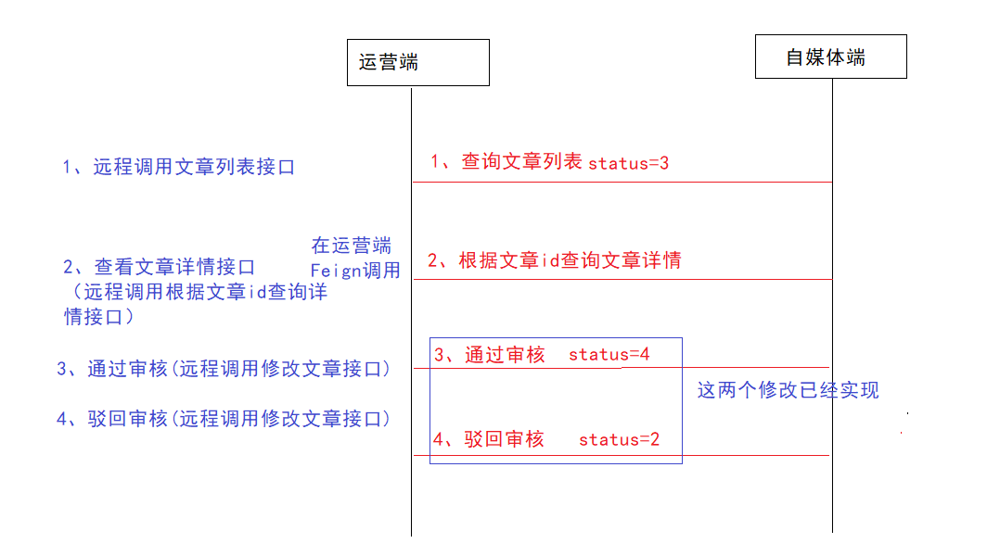
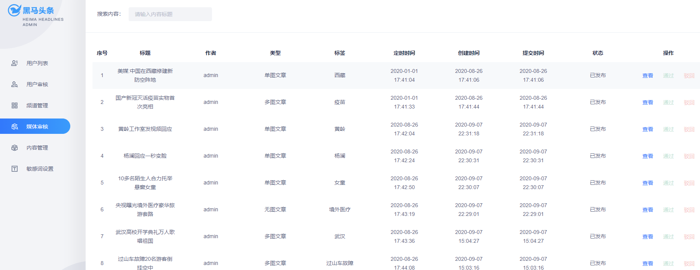

# 第八章 分布式任务调度&人工审核

## 目标

- 能够理解什么是分布式任务调度
- 能够掌握xxl-job的基本使用
- 能够使用xxl-job解决黑马头条项目中定时任务的功能
- 能够完成自媒体文章人工审核功能
- 能够完成自媒体端文章上下架同步的问题

## 1 分布式任务调度

详细查看资料文件夹中的xxl-job相关文档。

## 2 自媒体文章审核-定时任务扫描待发布文章

### 2.1 需求分析

- 前期回顾：在自媒体文章自动审核的时候，审核通过后，判断了文章的发布时间大于当前时间，这个时候并没有真正的发布文章，而是把文章的状态设置为了8（审核通过待发布）

- 定时任务的作用就是每分钟去扫描这些待发布的文章，如果当前文章的状态为8，并且发布时间小于当前时间的，立刻发布当前文章

  ```
  分析的结果：
  	首先我们要定义一个接口去查询文章(状态=8，而且发布时间小于当前系统时间)
  	然后去修改当前这些文章的状态为9
  	还要对app端的，app_article,app_article_config,app_article_content,app_author这四张表进行保存操作
  ```

  

### 2.2 自媒体文章数据准备

自动审核的代码都是通过自媒体文章的id进行审核的，这个时候需要在admin端远程调用自媒体端查询文章状态为8且发布时间小于当前时间的文章id列表

自媒体端

（1）修改WmNewsControllerApi接口，新增方法

```java
/**
     * 查询需要发布的文章id列表
     * @return
     */
List<Integer> findRelease();
```

(2)业务层

在自媒体微服务中的WmNewsService新增方法

```java
/**
     * 查询需要发布的文章id列表
     * @return
     */
List<Integer> findRelease();
```

实现方法：

```java
/**
     * 查询需要发布的文章id列表
     * @return
     */
@Override
public List<Integer> findRelease(){
        List<WmNews> list = list(Wrappers.<WmNews>lambdaQuery().eq(WmNews::getStatus, 8).lt(WmNews::getPublishTime,new Date()));
        List<Integer> resultList = list.stream().map(WmNews::getId).collect(Collectors.toList());
        return resultList;
    }
```

(3)控制器

WmNewsController中新增方法

```java
@GetMapping("/findRelease")
@Override
public List<Integer> findRelease() {
    return wmNewsService.findRelease();
}
```

（4）在admin端添加远程调用feign接口

修改WemediaFeign接口添加方法

```java
@GetMapping("/api/v1/news/findRelease")
List<Integer> findRelease();
```

### 2.3 xxl-job调度中心创建调度任务

（1）新建执行器，原则上一个项目一个执行器，方便管理


（2）新建任务

如下图：


执行器：选择自己新建的执行器

路由策略：轮询

Cron: 0 1 * * * ?`每分钟执行一次

### 2.4 xxl-job集成到项目中

（1）引入依赖信息

在leadnews-common中引入依赖

```xml
<dependency>
    <groupId>com.xuxueli</groupId>
    <artifactId>xxl-job-core</artifactId>
</dependency>
```

（2）在admin端的application.yml中加入以下配置：

```yaml
xxljob:
  admin:
    addresses: http://localhost:8888/xxl-job-admin
  executor:
    appname: leadnews-admin-executor
    port: 9999
```

（3）创建配置类

```java
package com.heima.admin.config;

import com.xxl.job.core.executor.impl.XxlJobSpringExecutor;
import lombok.extern.log4j.Log4j2;
import org.springframework.beans.factory.annotation.Value;
import org.springframework.context.annotation.Bean;
import org.springframework.context.annotation.Configuration;

@Log4j2
@Configuration
public class XxlJobConfig {

    @Value("${xxljob.admin.addresses}")
    private String adminAddresses;

    @Value("${xxljob.executor.appname}")
    private String appName;

    @Value("${xxljob.executor.port}")
    private int port;

    @Bean
    public XxlJobSpringExecutor xxlJobExecutor() {
        log.info(">>>>>>>>>>> xxl-job config init.");
        XxlJobSpringExecutor xxlJobSpringExecutor = new XxlJobSpringExecutor();
        xxlJobSpringExecutor.setAdminAddresses(adminAddresses);
        xxlJobSpringExecutor.setAppname(appName);
        xxlJobSpringExecutor.setPort(port);
        xxlJobSpringExecutor.setLogRetentionDays(30);

        return xxlJobSpringExecutor;
    }
}
```


### 2.5 创建调度任务，定时审核

创建任务,查询自媒体文章后进行审核

```java
package com.heima.admin.job;

import com.heima.admin.feign.WemediaFeign;
import com.heima.admin.service.WeMediaNewsAutoScanService;
import com.xxl.job.core.biz.model.ReturnT;
import com.xxl.job.core.handler.annotation.XxlJob;
import lombok.extern.log4j.Log4j2;
import org.springframework.beans.factory.annotation.Autowired;
import org.springframework.stereotype.Component;

import java.util.List;

@Component
@Log4j2
public class WeMediaNewsAutoScanJob {

    @Autowired
    private WeMediaNewsAutoScanService weMediaNewsAutoScanService;

    @Autowired
    private WemediaFeign wemediaFeign;

    /**
     * 每天0点执行一次
     * @param param
     * @return
     * @throws Exception
     */
    @XxlJob("wemediaAutoScanJob")
    public ReturnT<String> hello(String param) throws Exception {
        log.info("自媒体文章审核调度任务开始执行....");
        List<Integer> releaseIdList = wemediaFeign.findRelease();
        if(null!=releaseIdList && !releaseIdList.isEmpty()){
            for (Integer id : releaseIdList) {
                weMediaNewsAutoScanService.autoScanByMediaNewsId(id);
            }
        }
        log.info("自媒体文章审核调度任务执行结束....");
        return ReturnT.SUCCESS;
    }

}
```

### 2.6 测试

在数据库中准备好数据，数据状态为8且发布时间小于当前时间

==注意：==

在测试的时候，要注意项目中xxl-job-core的依赖版本改为2.2.0-SNAPSHOT


## 3 admin端-人工审核文章

### 3.1 需求分析

自媒体文章如果没有自动审核成功，而是到了人工审核（自媒体文章状态为3），需要在admin端人工处理文章的审核


平台管理员可以查看待人工审核的文章信息，可以**通过（状态改为4）**或**驳回（状态改为2）**

也可以通过点击**查看**按钮，查看文章详细信息，查看详情后可以根据内容判断是否需要通过审核




### 3.2 自媒体端实现

（1）自媒体端-接口定义

>1 需要分页查询自媒体文章信息，可以根据标题模糊查询
>
>2 需要根据文章id查看文章的详情
>
>3 修改文章的状态，已实现

修改WmNewsControllerApi接口，添加如下方法

```java
/**
     * 查询文章列表
     * @param dto
     * @return
     */
public PageResponseResult findList(NewsAuthDto dto);

/**
     * 查询文章详情
     * @param id
     * @return
     */
public WmNewsVo findWmNewsVo(Integer id) ;
```

NewsAuthDto

```java
package com.heima.model.admin.dtos;

import com.heima.model.common.dtos.PageRequestDto;
import lombok.Data;

@Data
public class NewsAuthDto extends PageRequestDto {

    /**
     * 文章标题
     */
    private String title;
}
```


从原型图中可以看出，返回的文章信心中包含了作者信息，但是作者名称并不能在文章表中体现，只有一个用户id，目前需要通过用户id关联查询用户表或许完整数据

**vo:value object 值对象 / view object 表现层对象，主要对应页面显示（web页面）的数据对象**、

需要先封装一个vo类，来存储文章信息和作者名称

```java
package com.heima.model.wemedia.vo;

import com.heima.model.wemedia.pojos.WmNews;
import lombok.Data;

@Data
public class WmNewsVo  extends WmNews {
    /**
     * 作者名称
     */
    private String authorName;
}
```

（2）自媒体端-mapper定义

通过刚才分析，不管是查看文章列表或者是查询文章详情，都需要返回带作者的文章信息，需要关联查询获取数据，而mybatis-plus暂时不支持多表查询，需要手动定义mapper文件实现

修改WmNewsMapper接口添加两个方法

```java
@Mapper
public interface WmNewsMapper extends BaseMapper<WmNews> {
    List<WmNewsVo> findListAndPage(@Param("dto") NewsAuthDto dto);
    int findListCount(@Param("dto") NewsAuthDto dto);
}
```

在src\main\resources\mapper目录下新建WmNewsMapper.xml文件

```xml
<?xml version="1.0" encoding="UTF-8"?>
<!DOCTYPE mapper PUBLIC "-//mybatis.org//DTD Mapper 3.0//EN" "http://mybatis.org/dtd/mybatis-3-mapper.dtd">
<mapper namespace="com.heima.wemedia.mapper.WmNewsMapper">
    <select id="findListAndPage" resultType="com.heima.model.wemedia.vo.WmNewsVo" parameterType="com.heima.model.admin.dtos.NewsAuthDto">
        SELECT
            wn.*, wu.`name` authorName
        FROM
            wm_news wn
        LEFT JOIN wm_user wu ON wn.user_id = wu.id
        <where>
            <if test="dto.title != null and dto.title != ''">
                and wn.title like #{dto.title}
            </if>

        </where>
        LIMIT #{dto.page},#{dto.size}
    </select>

    <select id="findListCount" resultType="int" parameterType="com.heima.model.admin.dtos.NewsAuthDto">
        SELECT
            count(1)
        FROM
            wm_news wn
        LEFT JOIN wm_user wu ON wn.user_id = wu.id
        <where>
            <if test="dto.title != null and dto.title != ''">
                and wn.title like #{dto.title}
            </if>
        </where>
    </select>
</mapper>
```

（3）自媒体端-业务层

修改WmNewsService接口，新增以下方法

```java
/**
     * 分页查询文章信息
     * @param dto
     * @return
     */
public PageResponseResult findListAndPage(NewsAuthDto dto);

/**
     * 查询文章详情
     * @param id
     * @return
     */
WmNewsVo findWmNewsVo(Integer id);
```

实现类方法：

```java
@Autowired
private WmNewsMapper wmNewsMapper;

public PageResponseResult findListAndPage(NewsAuthDto dto){
    //1.检查参数
    dto.checkParam();
    //设置起始页
    dto.setPage((dto.getPage()-1)*dto.getSize());
    dto.setTitle("%"+dto.getTitle()+"%");
    
    //2.分页查询
    List<WmNewsVo> list = wmNewsMapper.findListAndPage(dto);
    //统计多少条数据
    int count = wmNewsMapper.findListCount(dto);
    
    //3.结果返回
    PageResponseResult responseResult = new PageResponseResult(dto.getPage(),dto.getSize(),count);
    responseResult.setData(list);
    return responseResult;
}

@Autowired
private WmUserMapper wmUserMapper;

@Override
public WmNewsVo findWmNewsVo(Integer id) {
    //1.查询文章信息
    WmNews wmNews = getById(id);
    //2.查询作者
    WmUser wmUser = null;
    if(wmNews!=null && wmNews.getUserId() != null){
        wmUser = wmUserMapper.selectById(wmNews.getUserId());
    }

    //3.封装vo信息返回
    WmNewsVo wmNewsVo = new WmNewsVo();
    BeanUtils.copyProperties(wmNews,wmNewsVo);
    if(wmUser != null){
        wmNewsVo.setAuthorName(wmUser.getName());
    }
    return wmNewsVo;
}
```

（4）自媒体端-控制层

修改WmNewsController类，添加以下方法

```java
@PostMapping("/findList")
@Override
public PageResponseResult findList(@RequestBody NewsAuthDto dto){
    return wmNewsService.findListAndPage(dto);
}

@GetMapping("/find_news_vo/{id}")
@Override
public WmNewsVo findWmNewsVo(@PathVariable("id") Integer id) {
    return wmNewsService.findWmNewsVo(id);
}
```

### 3.3 admin端实现

（1）admin端-api接口定义

> 1 需要分页查询自媒体文章信息，可以根据标题模糊查询
>
> 2 当审核通过后，修改文章状态为4
>
> 3 当审核驳回后，修改文章状态为3，并且需要说明原因
>
> 4 需要根据文章id查看文章的详情

```java
package com.heima.apis.admin;

import com.heima.model.admin.dtos.NewsAuthDto;
import com.heima.model.common.dtos.ResponseResult;

public interface NewsAuthControllerApi {

    /**
     * 查询自媒体文章列表
     * @param dto
     * @return
     */
    public ResponseResult findNews(NewsAuthDto dto);

    /**
     * 查询文章详情
     * @param id
     * @return
     */
    public ResponseResult findOne(Integer id);

    /**
     * 文章审核成功
     * @param dto
     * @return
     */
    public ResponseResult authPass(NewsAuthDto dto);

    /**
     * 文章审核失败
     * @param dto
     * @return
     */
    public ResponseResult authFail(NewsAuthDto dto);
}
```

在NewsAuthDto补充两个属性id和msg

```java
package com.heima.model.admin.dtos;

import com.heima.model.common.dtos.PageRequestDto;
import lombok.Data;

@Data
public class NewsAuthDto extends PageRequestDto {

    /**
     * 文章标题
     */
    private String title;

    private Integer id;
    
    pri
    
    /**
     * 失败原因
     */
    private String msg;
}
```

（2）admin端-mapper定义

无

（3）admin端-远程调用接口

在admin端远程接口WemediaFeign中新增如下方法

查看文章列表和查询文章详情，其中审核成功或失败可以调用之前定义好的修改方法`updateWmNews()`

在查询列表的方法需要通过远程接口进行分页查看，返回值是`PageResponseResult`对象

```java
@PostMapping("/api/v1/news/findList/")
public PageResponseResult findList(NewsAuthDto dto);

@GetMapping("/api/v1/news/find_news_vo/{id}")
public WmNewsVo findWmNewsVo(@PathVariable("id") Integer id);
```

（4）admin端-业务层

修改WemediaNewsAutoScanService业务层接口，新增以下方法

```java
/**
     * 根据文章标题分页查询自媒体文章列表
     * @param dto
     * @return
     */
public PageResponseResult findNews(NewsAuthDto dto);

/**
     * 根据文章id文章信息
     * @param id
     * @return
     */
public ResponseResult findOne(Integer id);

/**
     * 审核通过或驳回
     * @param type  0 为驳回  1位通过
     * @param dto
     * @return
     */
public ResponseResult updateStatus(Integer type,NewsAuthDto dto);
```

实现类方法：

```java
@Override
public PageResponseResult findNews(NewsAuthDto dto) {
    //分页查询
    PageResponseResult responseResult =  wemediaFeign.findList(dto);
    //有图片需要显示，需要fasfdfs服务器地址
    responseResult.setHost(fileServerUrl);
    return responseResult;
}

@Override
public ResponseResult findOne(Integer id) {
    //1参数检查
    if(id == null){
        return ResponseResult.errorResult(AppHttpCodeEnum.PARAM_INVALID);
    }
    //2查询数据
    WmNewsVo wmNewsVo = wemediaFeign.findWmNewsVo(id);
    //结构封装
    ResponseResult responseResult = ResponseResult.okResult(wmNewsVo);
    responseResult.setHost(fileServerUrl);
    return responseResult;
}

@Override
public ResponseResult updateStatus(Integer type, NewsAuthDto dto) {
    //1.参数检查
    if(dto == null || dto.getId() == null){
        return ResponseResult.errorResult(AppHttpCodeEnum.PARAM_INVALID);
    }
    //2.查询文章
    WmNews wmNews = wemediaFeign.findById(dto.getId());
    if(wmNews == null){
        return ResponseResult.errorResult(AppHttpCodeEnum.DATA_NOT_EXIST);
    }
    //3.审核没有通过
    if(type.equals(0)){
        updateWmNews(wmNews,(short)2,dto.getMsg());
    }else if(type.equals(1)){
        //4.人工审核通过
        updateWmNews(wmNews,(short)4,"人工审核通过");
    }
    return ResponseResult.okResult(AppHttpCodeEnum.SUCCESS);
}
```

（5）admin端-控制层

```java
package com.heima.admin.controller.v1;

import com.heima.admin.service.WemediaNewsAutoScanService;
import com.heima.apis.admin.NewsAuthControllerApi;
import com.heima.model.admin.dtos.NewsAuthDto;
import com.heima.model.common.dtos.ResponseResult;
import org.springframework.beans.factory.annotation.Autowired;
import org.springframework.core.annotation.Order;
import org.springframework.web.bind.annotation.*;

@RestController
@RequestMapping("/api/v1/news_auth")
public class NewsAuthController implements NewsAuthControllerApi {

    @Autowired
    private WemediaNewsAutoScanService wemediaNewsAutoScanService;

    @PostMapping("/list")
    @Override
    public ResponseResult findNews(@RequestBody NewsAuthDto dto){
        return wemediaNewsAutoScanService.findNews(dto);
    }

    @GetMapping("/one/{id}")
    @Override
    public ResponseResult findOne(@PathVariable("id") Integer id){
        return wemediaNewsAutoScanService.findOne(id);
    }

    @PostMapping("/auth_pass")
    @Override
    public ResponseResult authPass(@RequestBody NewsAuthDto dto){
        return wemediaNewsAutoScanService.updateStatus(1,dto);
    }

    @PostMapping("/auth_fail")
    @Override
    public ResponseResult authFail(@RequestBody NewsAuthDto dto){
        return wemediaNewsAutoScanService.updateStatus(0,dto);
    }
}
```

### 3.4 测试

可打开页面直接测试



## 4 自媒体端-文章上下架

### 4.1 思路分析

需求分析：

```
我们在第五天的时候我们其实已经完成了上下架的功能，这个功能仅仅只是操作了wm_news表中的enable字段(上架为1，下架为0)
我们的目的是为了让该文章在app端展示
	那么我们ap_article_config这个表中的is_down字段必须和wm_news表中的enable字段的上下架保持同步
	如果说wm_news中的文章处于上架状态，那么ap_article_config表中的相应的数据也必须处于上架状态
	
注意:ap_article_config表中的is_down(是否下架，0表示否(上架状态)，1表示是(下架状态))

操作方式：
	当我们在自媒体端点击上下架按钮的时候，我们要异步操作ap_article_config表
```

在自媒体文章管理中有文章上下架的操作，上下架是文章已经审核通过发布之后的文章，目前自动审核文章和人工审核文章都已完成，可以把之前代码补充，使用异步的方式，修改app端文章的**配置信息**即可。


### 4.2 自媒体文章发消息通知下架

修改WmNewsServiceImpl中的downOrUp方法，发送消息

```java
@Override
public ResponseResult downOrUp(WmNewsDto dto) {
    //1.检查参数
    if(dto == null || dto.getId() == null){
        return ResponseResult.errorResult(AppHttpCodeEnum.PARAM_INVALID);
    }

    //2.查询文章
    WmNews wmNews = getById(dto.getId());
    if(wmNews == null){
        return ResponseResult.errorResult(AppHttpCodeEnum.DATA_NOT_EXIST,"文章不存在");
    }

    //3.判断文章是否发布
    if(!wmNews.getStatus().equals(WmNews.Status.PUBLISHED.getCode())){
        return ResponseResult.errorResult(AppHttpCodeEnum.DATA_NOT_EXIST,"当前文章不是发布状态，不能上下架");
    }

    //4.修改文章状态，同步到app端（后期做）TODO
    if(dto.getEnable() != null && dto.getEnable() > -1 && dto.getEnable() < 2){

        if(wmNews.getArticleId()!=null){
            Map<String,Object> mesMap = new HashMap<>();
            mesMap.put("enable",dto.getEnable());
            mesMap.put("articleId",wmNews.getArticleId());
            kafkaTemplate.send(WmNewsMessageConstants.WM_NEWS_UP_OR_DOWN_TOPIC,JSON.toJSONString(mesMap));
        }

        update(Wrappers.<WmNews>lambdaUpdate().eq(WmNews::getId,dto.getId()).set(WmNews::getEnable,dto.getEnable()));
    }
    return ResponseResult.okResult(AppHttpCodeEnum.SUCCESS);
}
```

常量类中定义topic

```java
package com.heima.common.constans.message;

public class WmNewsMessageConstants {

    public static final String WM_NEWS_UP_OR_DOWN_TOPIC="wm.news.up.or.down.topic";
}
```

### 4.3 文章微服务

文章微服务需要接收消息leadnews-article-service

在application.yml文件中添加kafka消费者的配置

```yaml
kafka:
    bootstrap-servers: 192.168.200.130:9092
    consumer:
      group-id: ${spring.application.name}-kafka-group
      key-deserializer: org.apache.kafka.common.serialization.StringDeserializer
      value-deserializer: org.apache.kafka.common.serialization.StringDeserializer
```

编写listener，如下：

```java
package com.heima.article.kafka.listener;

import com.alibaba.fastjson.JSON;
import com.baomidou.mybatisplus.core.toolkit.Wrappers;
import com.heima.article.service.ApArticleConfigService;
import com.heima.common.constans.message.NewsAutoScanConstants;
import com.heima.common.constans.message.WmNewsMessageConstants;
import com.heima.model.article.pojos.ApArticleConfig;
import org.apache.kafka.clients.consumer.ConsumerRecord;
import org.springframework.beans.factory.annotation.Autowired;
import org.springframework.kafka.annotation.KafkaListener;
import org.springframework.stereotype.Component;

import java.util.Map;
import java.util.Optional;

/**
 * app端的文章是否下架的状态监听
 */
@Component
public class ArticleIsDownListener {

    @Autowired
    private ApArticleConfigService apArticleConfigService;

    //监听方法
    @KafkaListener(topics = WmNewsMessageConstants.WM_NEWS_UP_OR_DOWN_TOPIC)
    public void getMessage(ConsumerRecord record){
        Optional<ConsumerRecord> optional = Optional.ofNullable(record);
        if(optional.isPresent()){
            String value = (String) record.value();
            Map map = JSON.parseObject(value, Map.class);
            Long articleId = (Long) map.get("articleId");
            Integer enable = (Integer) map.get("enable");

            LambdaUpdateWrapper<ApArticleConfig> updateWrapper= Wrappers.lambdaUpdate();
            updateWrapper.eq(ApArticleConfig::getArticleId,articleId);
            //如果enable=1表示wm_news表上架状态
            if(enable==1){
                updateWrapper.set(ApArticleConfig::getIsDown,0);//修改isdown=0表示上架状态
            }else{ //如果enable=0表示wm_news表下架状态
                updateWrapper.set(ApArticleConfig::getIsDown,1);//修改isdown=1表示下架架状态
            }
            apArticleConfigService.update(updateWrapper);

        }
    }
}

```

