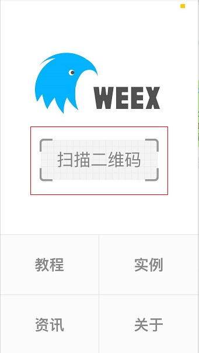

# 第九章 app端基本功能展示

## 目标

- 能够完成app端文章列表展示功能开发
- 能够完成app端文章详情的功能开发
- 能够掌握解决long类型丢失精度的问题
- 能够完成app端登录的功能
- 能够掌握关注作者功能

## 1 app端-文章列表

### 1.1 app端文章列表-需求分析

前置需求分析:

```
我们文章列表展示查询的是哪张表
	查询的是ap_article,ap_article_config
只有当前ap_article_config表中的is_down=0和is_delete=0的时候才可以展示当前ap_article

入参:
	size
	频道ID/标记tag
	最大时间 (来判断最新数据   下拉)
	最小时间 （来判断最多数据   上拉）	
```

在手机端可以查看文章信息


> 1,在默认频道展示10条文章信息
>
> 2,可以切换频道查看不同种类文章
>
> 3,当用户下拉可以加载最新的文章信息（按照发布时间）
>
> ​	本页文章列表中发布时间最大的时间为依据
>
> 4,当用户上拉可以加载更多的文章（分页）
>
> ​	本页文章列表中发布时间为最小的时间为依据


### 1.2 app端文章列表-接口定义

#### 1.2.1 api接口

在apis模块中新增接口

```java
package com.heima.apis.article;

import com.heima.model.article.dtos.ArticleHomeDto;
import com.heima.model.common.dtos.ResponseResult;

public interface ArticleHomeControllerApi {


    /**
     * 加载首页文章
     * @return
     */
    public ResponseResult load(ArticleHomeDto dto);

    /**
     * 加载更多
     * @return
     */
    public ResponseResult loadMore(ArticleHomeDto dto);

    /**
     * 加载最新
     * @return
     */
    public ResponseResult loadNew(ArticleHomeDto dto);
}
```

ArticleHomeDto

```java
package com.heima.model.article.dtos;

import lombok.Data;

import java.util.Date;

@Data
public class ArticleHomeDto {

    // 最大时间
    Date maxBehotTime;
    // 最小时间
    Date minBehotTime;
    // 分页size
    Integer size;
    // 数据范围，比如频道ID
    String tag;
}
```

#### 1.2.2 mapper

文章展示并不是直接查询ap_article文章表数据，需要关联查询文章的配置表信息，如果是已下架或者标明已删除的文章则不被查询出来

在之前定义好的ApArticleMapper接口中新增方法

```java
package com.heima.article.mapper;

import com.baomidou.mybatisplus.core.mapper.BaseMapper;
import com.heima.model.article.dtos.ArticleHomeDto;
import com.heima.model.article.pojos.ApArticle;
import org.apache.ibatis.annotations.Mapper;
import org.apache.ibatis.annotations.Param;

import java.util.List;

@Mapper
public interface ApArticleMapper extends BaseMapper<ApArticle> {

    public List<ApArticle> loadArticleList(@Param("dto") ArticleHomeDto dto,@Param("type") Short type);

}
```

在resources\mapper目录下新建ApArticleMapper.xml文件

```xml
<?xml version="1.0" encoding="UTF-8"?>
<!DOCTYPE mapper PUBLIC "-//mybatis.org//DTD Mapper 3.0//EN" "http://mybatis.org/dtd/mybatis-3-mapper.dtd">
<mapper namespace="com.heima.article.mapper.ApArticleMapper">

    <resultMap id="resultMap" type="com.heima.model.article.pojos.ApArticle">
        <id column="id" property="id"/>
        <result column="title" property="title"/>
        <result column="author_id" property="authorId"/>
        <result column="author_name" property="authorName"/>
        <result column="channel_id" property="channelId"/>
        <result column="channel_name" property="channelName"/>
        <result column="layout" property="layout"/>
        <result column="flag" property="flag"/>
        <result column="images" property="images"/>
        <result column="labels" property="labels"/>
        <result column="likes" property="likes"/>
        <result column="collection" property="collection"/>
        <result column="comment" property="comment"/>
        <result column="views" property="views"/>
        <result column="province_id" property="provinceId"/>
        <result column="city_id" property="cityId"/>
        <result column="county_id" property="countyId"/>
        <result column="created_time" property="createdTime"/>
        <result column="publish_time" property="publishTime"/>
        <result column="sync_status" property="syncStatus"/>
    </resultMap>
    <select id="loadArticleList" resultMap="resultMap">
        SELECT
        aa.*
        FROM
        `ap_article` aa
        LEFT JOIN ap_article_config aac ON aa.id = aac.article_id
        <where>
            and aac.is_delete != 1
            and aac.is_down != 1
            <!-- loadmore -->
            <if test="type != null and type == 1">
                and aa.publish_time <![CDATA[<]]> #{dto.minBehotTime}
            </if>
            <if test="type != null and type == 2">
                and aa.publish_time <![CDATA[>]]> #{dto.maxBehotTime}
            </if>
            <if test="dto.tag != '__all__'">
                and aa.channel_id = #{dto.tag}
            </if>
        </where>
        order by aa.publish_time desc
        limit #{dto.size}
    </select>

</mapper>
```

#### 1.2.3 业务层

在ApArticleService中新增一个方法

```java
/**
     * 根据参数加载文章列表
     * @param loadtype 1为加载更多  2为加载最新   
     * @param dto
     * @return
     */
ResponseResult load(Short loadtype, ArticleHomeDto dto);
```

实现类方法

```java
package com.heima.article.service.impl;

import com.baomidou.mybatisplus.extension.service.impl.ServiceImpl;
import com.heima.article.mapper.ApArticleMapper;
import com.heima.article.service.ApArticleService;
import com.heima.common.constans.article.ArticleConstans;
import com.heima.model.article.dtos.ArticleHomeDto;
import com.heima.model.article.pojos.ApArticle;

import com.heima.model.common.dtos.ResponseResult;
import org.apache.commons.lang3.StringUtils;
import org.springframework.beans.factory.annotation.Autowired;
import org.springframework.beans.factory.annotation.Value;
import org.springframework.stereotype.Service;

import java.util.Date;
import java.util.List;


@Service
public class ApArticleServiceImpl extends ServiceImpl<ApArticleMapper, ApArticle> implements ApArticleService {

    // 单页最大加载的数字
    private final static short MAX_PAGE_SIZE = 50;

    @Autowired
    private ApArticleMapper apArticleMapper;

    @Value("${fdfs.url}")
    private String fileServerUrl;

    @Override
    public ResponseResult load(ArticleHomeDto dto, Short loadType) {
        //1.校验参数
        Integer size = dto.getSize();
        if(size == null || size == 0){
            size = 10;
        }
        size = Math.min(size,MAX_PAGE_SIZE);
        dto.setSize(size);

        //类型参数检验
        if(!loadType.equals(ArticleConstans.LOADTYPE_LOAD_MORE)&&!loadType.equals(ArticleConstans.LOADTYPE_LOAD_NEW)){
            loadType = ArticleConstans.LOADTYPE_LOAD_MORE;
        }
        //文章频道校验
        if(StringUtils.isEmpty(dto.getTag())){
            dto.setTag(ArticleConstans.DEFAULT_TAG);
        }

        //时间校验
        if(dto.getMaxBehotTime() == null) dto.setMaxBehotTime(new Date());
        if(dto.getMinBehotTime() == null) dto.setMinBehotTime(new Date());
        //2.查询数据
        List<ApArticle> apArticles = apArticleMapper.loadArticleList(dto, loadType);

        //3.结果封装
        ResponseResult responseResult = ResponseResult.okResult(apArticles);
        responseResult.setHost(fileServerUrl);
        return responseResult;
    }
}
```

定义常量类

```java
package com.heima.common.constants.article;

public class ArticleConstans{
    public static final Short LOADTYPE_LOAD_MORE = 1;
    public static final Short LOADTYPE_LOAD_NEW = 2;
    public static final String DEFAULT_TAG = "__all__";

}
```

#### 1.3.4 控制器

```java
package com.heima.article.controller.v1;

import com.heima.apis.article.ArticleHomeControllerApi;
import com.heima.article.service.ApArticleService;
import com.heima.common.constans.article.ArticleConstans;
import com.heima.model.article.dtos.ArticleHomeDto;
import com.heima.model.common.dtos.ResponseResult;
import org.springframework.beans.factory.annotation.Autowired;
import org.springframework.web.bind.annotation.PostMapping;
import org.springframework.web.bind.annotation.RequestBody;
import org.springframework.web.bind.annotation.RequestMapping;
import org.springframework.web.bind.annotation.RestController;

@RestController
@RequestMapping("/api/v1/article")
public class ArticleHomeController implements ArticleHomeControllerApi {

    @Autowired
    private ApArticleService articleService;

    @PostMapping("/load")
    @Override
    public ResponseResult load(@RequestBody ArticleHomeDto dto) {
        return articleService.load(ArticleConstans.LOADTYPE_LOAD_MORE,dto );
    }

    @PostMapping("/loadmore")
    @Override
    public ResponseResult loadMore(@RequestBody ArticleHomeDto dto) {
          return articleService.load(ArticleConstans.LOADTYPE_LOAD_MORE,dto );
    }

    @PostMapping("/loadnew")
    @Override
    public ResponseResult loadNew(@RequestBody ArticleHomeDto dto) {
        return articleService.load(ArticleConstans.LOADTYPE_LOAD_NEW,dto);
    }
}
```

### 1.3 app端文章列表-测试

可以使用postman进行测试

## 2 app端网关搭建

（1）新建模块，名称：heima-leadnews-app-gateway

（2）pom文件：

```xml
<dependencies>
    <dependency>
        <groupId>org.springframework.cloud</groupId>
        <artifactId>spring-cloud-starter-gateway</artifactId>
    </dependency>
    <dependency>
        <groupId>com.alibaba.cloud</groupId>
        <artifactId>spring-cloud-starter-alibaba-nacos-discovery</artifactId>
    </dependency>
    <dependency>
        <groupId>io.jsonwebtoken</groupId>
        <artifactId>jjwt</artifactId>
    </dependency>
</dependencies>
```

（3）application.yml

```yaml
server:
  port: 5001
spring:
  application:
    name: leadnews-app-gateway
  cloud:
    nacos:
      discovery:
        server-addr: 192.168.200.130:8848
    gateway:
      globalcors:
        cors-configurations:
          '[/**]': # 匹配所有请求
            allowedOrigins: "*" #跨域处理 允许所有的域
            allowedMethods: # 支持的方法
            - GET
            - POST
            - PUT
            - DELETE
      routes:
      #文章微服务
      - id: leadnews-article
        uri: lb://leadnews-article
        predicates:
        - Path=/article/**
        filters:
        - StripPrefix= 1
```

（4）引导类：

```java
package com.heima.app.gateway;

import org.springframework.boot.SpringApplication;
import org.springframework.boot.autoconfigure.SpringBootApplication;
import org.springframework.cloud.client.discovery.EnableDiscoveryClient;

@SpringBootApplication
@EnableDiscoveryClient
public class AppGatewayApplication {

    public static void main(String[] args) {
        SpringApplication.run(AppGatewayApplication.class,args);
    }
}
```

## 3 app端-前端文章列表展示

### 3.1 weex

app端的前端项目使用的阿里的前端框架weex开发的。

Weex 致力于使开发者能基于通用跨平台的 Web 开发语言和开发经验，来构建 Android、iOS 和 Web 应用。简单来说，在集成了 WeexSDK 之后，你可以使用 JavaScript 语言和前端开发经验来开发移动应用。

官网：https://weex.apache.org/zh/

### 3.2 前后端文章列表联调测试

使用webstorm打开当天资料文件夹中的heima-leadnews-app.zip

#### 3.2.1 环境准备

（1）安装依赖

在项目的根目录使用命令`npm install`命令安装项目所依赖的js文件


（2）修改为本地ip

在confis目录下有两个文件需要修改内容，`config.js和webpack.dev.conf.js`修改ip为本机ip地址


#### 3.2.2 启动项目

右键在项目中的package.json-->Show npm Script，然后点击start即可启动项目


启动项目后：


如果当前电脑和手机在一个局域网下下载weex的app，就可以扫码在手机端查看效果

app下载地址：https://weex.apache.org/guide/playground.html

效果如下：

扫描二维码查看效果




#### 3.2.3 测试

app前端项目启动完成后，直接点击**不登录，先看看**即可，就可以直接跳转到文章列表首页

==注意：可能刚开始进不去，因为在src/pages/login目录下的index.vue中的noLogin函数中有登录拦截，我们要把他改成下图方式方可调到文章列表首页==


## 4 app文章详情展示

### 4.1 app文章详情-需求分析


在文章列表中点击文章进入到文章详情查看页面，页面显示内容包括：标题、作者、作者头像、发布时间、是否关注、喜欢、不喜欢、分享、评论、收藏、转发、猜你喜欢、打赏等内容。除此之外还需收集用户打开页面时间、阅读次数、阅读百分比等信息。

### 4.2 app文章详情-思路分析

文章详情所展示的主要是文章的内容，这个时候无须再次加重ap_article表中的数据，只需要通过前端传递过来的文章id去查询文章的内容即可，同时需要判断当前文章是否已上架和是否已经删除。

由分析得出，主要是通过文章id查询ap_article_content和ap_article_config表的数据即可。

ap_article_content  app文章内容表


ap_article_config  app文章配置表


分析结果：

```
入参:
	文章id
根据文章id(articleId)去查询ap_artiacle_content表和ap_article_config表
```


### 4.3 app文章详情-功能实现

#### 4.3.1 api接口定义

```java
package com.heima.apis.article;

import com.heima.model.article.dtos.ArticleInfoDto;
import com.heima.model.common.dtos.ResponseResult;

public interface ArticleInfoControllerApi {

    /**
     * 加载文章详情
     * @param dto
     * @return
     */
    public ResponseResult loadArticleInfo(ArticleInfoDto dto);
}
```

ArticleInfoDto

```java
package com.heima.model.article.dtos;

import com.heima.model.common.annotation.IdEncrypt;
import lombok.Data;

@Data
public class ArticleInfoDto {
    // 文章ID
    Long articleId;
}
```


#### 4.3.2 mapper

在之前的课程中已经定义好了文章配置和文章内容的mapper接口

#### 4.3.3 业务层

新建业务层接口：AppArticleInfoService

```java
package com.heima.article.service;

import com.heima.model.article.dtos.ArticleInfoDto;
import com.heima.model.common.dtos.ResponseResult;

public interface ArticleInfoService {

    /**
     * 加载文章详情
     * @param dto
     * @return
     */
    public ResponseResult loadArticleInfo(ArticleInfoDto dto);
}
```

实现类：

```java
package com.heima.article.service.impl;

import com.baomidou.mybatisplus.core.toolkit.Wrappers;
import com.heima.article.mapper.ApArticleConfigMapper;
import com.heima.article.mapper.ApArticleContentMapper;
import com.heima.article.service.ArticleInfoService;
import com.heima.model.article.dtos.ArticleInfoDto;
import com.heima.model.article.pojos.ApArticleConfig;
import com.heima.model.article.pojos.ApArticleContent;
import com.heima.model.common.dtos.ResponseResult;
import com.heima.model.common.enums.AppHttpCodeEnum;
import org.springframework.beans.factory.annotation.Autowired;
import org.springframework.stereotype.Service;

import java.util.HashMap;
import java.util.Map;

@Service
public class ArticleInfoServiceImpl implements ArticleInfoService {

    @Autowired
    private ApArticleConfigMapper apArticleConfigMapper;

    @Autowired
    private ApArticleContentMapper apArticleContentMapper;

    @Override
    public ResponseResult loadArticleInfo(ArticleInfoDto dto) {

        Map<String, Object> resultMap = new HashMap<>();

        //1.检查参数
        if(dto == null || dto.getArticleId() == null){
            return ResponseResult.errorResult(AppHttpCodeEnum.PARAM_INVALID);
        }

        //2.查询文章的配置
        ApArticleConfig apArticleConfig = apArticleConfigMapper.selectOne(Wrappers.<ApArticleConfig>lambdaQuery().eq(ApArticleConfig::getArticleId, dto.getArticleId()));
        if(apArticleConfig == null){
            return ResponseResult.errorResult(AppHttpCodeEnum.PARAM_INVALID);
        }

        //3.查询文章的内容
        if(!apArticleConfig.getIsDelete()&& !apArticleConfig.getIsDown()){
            ApArticleContent apArticleContent = apArticleContentMapper.selectOne(Wrappers.<ApArticleContent>lambdaQuery().eq(ApArticleContent::getArticleId, dto.getArticleId()));
            resultMap.put("content",apArticleContent);
        }
        resultMap.put("config",apArticleConfig);
        //4.结果返回
        return ResponseResult.okResult(resultMap);
    }
}
```

#### 4.3.4 控制层

控制层：

```java
package com.heima.article.controller.v1;

import com.heima.apis.article.ArticleInfoControllerApi;
import com.heima.article.service.ArticleInfoService;
import com.heima.model.article.dtos.ArticleInfoDto;
import com.heima.model.common.dtos.ResponseResult;
import org.springframework.beans.factory.annotation.Autowired;
import org.springframework.web.bind.annotation.PostMapping;
import org.springframework.web.bind.annotation.RequestBody;
import org.springframework.web.bind.annotation.RequestMapping;
import org.springframework.web.bind.annotation.RestController;

@RestController
@RequestMapping("/api/v1/article")
public class ArticleInfoController implements ArticleInfoControllerApi {

    @Autowired
    ArticleInfoService articleInfoService;

    @PostMapping("/load_article_info")
    @Override
    public ResponseResult loadArticleInfo(@RequestBody ArticleInfoDto dto) {
        return articleInfoService.loadArticleInfo(dto);
    }
}
```

#### 4.3.5 测试

测试一：使用postmen进行测试，测试结果没有问题。

测试二：启动前端项目：heima-leadnews-app

在文章列表点击一篇文章进入详情


并不能查询出文章信息。

原因：目前文章id为long类型，在转换json传递到前端以后精度丢失，所以查询详情的文章id也是丢失精度的id,不能查询数据。

### 4.4 Long类型转换精度丢失问题解决

#### 4.4.1 解决方案分析：

方案一：将文章的id的由long类型手动改为String类型，可以解决此问题。（需要修改表结构）

方案二：可以使用jackson进行序列化和反序列化解决（本项目采用这种方案）

#### 4.4.2 jackson序列化和反序列化原理说明


- 当后端响应给前端的数据中包含了id或者特殊标识（可自定义）的时候，把当前数据进行转换为String类型

- 当前端传递后后端的dto中有id或者特殊标识（可自定义）的时候，把当前数据转为Integer或Long类型。

特殊标识类说明：

IdEncrypt 自定义注解  作用在需要转换类型的字段属性上，用于非id的属性上   在model包下


```java
package com.heima.model.common.annotation;

import com.fasterxml.jackson.annotation.JacksonAnnotation;

import java.lang.annotation.ElementType;
import java.lang.annotation.Retention;
import java.lang.annotation.RetentionPolicy;
import java.lang.annotation.Target;

@JacksonAnnotation
@Retention(RetentionPolicy.RUNTIME)
@Target({ElementType.FIELD, ElementType.METHOD, ElementType.PARAMETER})
public @interface IdEncrypt {
}
```


序列化和反序列化类说明：以下类理解为主，可直接在资料文件夹下拷贝到leadnews-common模块中使用。


- ConfusionSerializer    用于序列化自增数字的混淆

  ```java
  public class ConfusionSerializer extends JsonSerializer<Object> {
  
      @Override
      public  void serialize(Object value, JsonGenerator jsonGenerator, SerializerProvider serializers) throws IOException {
          try {
              if (value != null) {
                  jsonGenerator.writeString(value.toString());
                  return;
              }
          }catch (Exception e){
              e.printStackTrace();
          }
          serializers.defaultSerializeValue(value, jsonGenerator);
      }
  }
  ```

- ConfusionDeserializer   用于反序列化自增数字的混淆解密

  ```java
  public class ConfusionDeserializer extends JsonDeserializer<Object> {
  
      JsonDeserializer<Object>  deserializer = null;
      JavaType type =null;
  
      public  ConfusionDeserializer(JsonDeserializer<Object> deserializer, JavaType type){
          this.deserializer = deserializer;
          this.type = type;
      }
  
      @Override
      public  Object deserialize(JsonParser p, DeserializationContext ctxt)
              throws IOException{
          try {
              if(type!=null){
                  if(type.getTypeName().contains("Long")){
                      return Long.valueOf(p.getValueAsString());
                  }
                  if(type.getTypeName().contains("Integer")){
                      return Integer.valueOf(p.getValueAsString());
                  }
              }
              return IdsUtils.decryptLong(p.getValueAsString());
          }catch (Exception e){
              if(deserializer!=null){
                  return deserializer.deserialize(p,ctxt);
              }else {
                  return p.getCurrentValue();
              }
          }
      }
  }
  ```

- ConfusionSerializerModifier   用于过滤序列化时处理的字段

  ```java
  public class ConfusionSerializerModifier extends BeanSerializerModifier {
  
      @Override
      public List<BeanPropertyWriter> changeProperties(SerializationConfig config,
                                                       BeanDescription beanDesc, List<BeanPropertyWriter> beanProperties) {
          List<BeanPropertyWriter> newWriter = new ArrayList<>();
          for(BeanPropertyWriter writer : beanProperties){
              String name = writer.getType().getTypeName();
              if(null == writer.getAnnotation(IdEncrypt.class) && !writer.getName().equalsIgnoreCase("id")){
                  newWriter.add(writer);
              } else {
                  writer.assignSerializer(new ConfusionSerializer());
                  newWriter.add(writer);
              }
          }
          return newWriter;
      }
  }
  ```

- ConfusionDeserializerModifier    用于过滤反序列化时处理的字段

  ```java
  public class ConfusionDeserializerModifier extends BeanDeserializerModifier {
  
      @Override
      public BeanDeserializerBuilder updateBuilder(final DeserializationConfig config, final BeanDescription beanDescription, final BeanDeserializerBuilder builder) {
          Iterator it = builder.getProperties();
  
          while (it.hasNext()) {
              SettableBeanProperty p = (SettableBeanProperty) it.next();
              if ((null != p.getAnnotation(IdEncrypt.class)||p.getName().equalsIgnoreCase("id"))) {
                  JsonDeserializer<Object> current = p.getValueDeserializer();
                  builder.addOrReplaceProperty(p.withValueDeserializer(new ConfusionDeserializer(p.getValueDeserializer(),p.getType())), true);
              }
          }
          return builder;
      }
  }
  ```

- ConfusionModule  用于注册模块和修改器

  ```java
  public class ConfusionModule extends Module {
  
      public final static String MODULE_NAME = "jackson-confusion-encryption";
      public final static Version VERSION = new Version(1,0,0,null,"heima",MODULE_NAME);
  
      @Override
      public String getModuleName() {
          return MODULE_NAME;
      }
  
      @Override
      public Version version() {
          return VERSION;
      }
  
      @Override
      public void setupModule(SetupContext context) {
          context.addBeanSerializerModifier(new ConfusionSerializerModifier());
          context.addBeanDeserializerModifier(new ConfusionDeserializerModifier());
      }
  
      /**
       * 注册当前模块
       * @return
       */
      public static ObjectMapper registerModule(ObjectMapper objectMapper){
          //CamelCase策略，Java对象属性：personId，序列化后属性：persionId
          //PascalCase策略，Java对象属性：personId，序列化后属性：PersonId
          //SnakeCase策略，Java对象属性：personId，序列化后属性：person_id
          //KebabCase策略，Java对象属性：personId，序列化后属性：person-id
          // 忽略多余字段，抛错
          objectMapper.configure(DeserializationFeature.FAIL_ON_UNKNOWN_PROPERTIES, false);
  //        objectMapper.setPropertyNamingStrategy(PropertyNamingStrategy.SNAKE_CASE);
          return objectMapper.registerModule(new ConfusionModule());
      }
  
  }
  ```

- InitJacksonConfig   提供自动化配置默认ObjectMapper，让整个框架自动处理id混淆

  ```java
  @Configuration
  public class InitJacksonConfig {
  
      @Bean
      public ObjectMapper objectMapper() {
          ObjectMapper objectMapper = new ObjectMapper();
          objectMapper = ConfusionModule.registerModule(objectMapper);
          return objectMapper;
      }
  
  }
  ```

#### 4.4.3 解决文章详情展示问题

在leadnews-article微服务中引入jackson的配置即可

在config包下新建类

```java
package com.heima.article.config;

import org.springframework.context.annotation.ComponentScan;
import org.springframework.context.annotation.Configuration;

@Configuration
@ComponentScan("com.heima.common.jackson")
public class InitConfig {
}
```

在dto中传递参数的时候如果想要把数值类型转为json，可以使用`@IdEncrypt`标识字段进行转换，如下：

```java
@Data
public class ArticleInfoDto {
    
    // 文章ID
    @IdEncrypt
    Long articleId;
}
```


重启项目，使用app前端再次访问文章详情，问题解决。


小结：

```
序列化和反序列化的实施步骤：
	1、在model工程中写一个自定义的注解 IdEncrypt
	2、在common工程中复制粘贴jackson的包
	3、在article工程中引入这个jackson包的扫描
	4、在dto中的id之上加入 @IdEncrypt
```


## 5 app端登录功能

### 5.1 app端登录-需求分析

- 点击**登录**可以根据app端的手机号和密码进行登录
- 点击**不登录，先看看**可以在无登录状态下进入app

### 5.2 app端登录-思路分析

概念介绍：**用户设备**，即当前用户所使用的终端设备。

1，用户点击**登录**

- 用户输入手机号和密码到后端进行校验，校验成功生成token返给前端
- 其他请求需要带着token到app网关去校验jwt,校验成功，放行

2，用户点击**不登录，先看看**

- 获取用户的设备id到后端根据设备id生成token,设置jwt存储的id为0
- 其他请求需要带着token到app网关去校验jwt,校验成功，放行


### 5.3 app端登录-功能实现

此功能在leadnews-user模块中实现

#### 5.3.1 接口定义

```java
package com.heima.apis.user;

import com.heima.model.common.dtos.ResponseResult;
import com.heima.model.user.dtos.LoginDto;

public interface ApUserLoginControllerApi {

    /**
     * app端登录
     * @param dto
     * @return
     */
    public ResponseResult login(LoginDto dto);
}
```

LoginDto

```java
package com.heima.model.user.dtos;

import lombok.Data;

@Data
public class LoginDto {

    //设备id
    private Integer equipmentId;

    //手机号
    private String phone;

    //密码
    private String password;
}
```

#### 5.3.2 mapper

校验用户登录的时候需要查询appUser表，此mapper之前课程已经定义完成

#### 5.3.3 业务层

新建接口：

```java
package com.heima.user.service;

import com.heima.model.common.dtos.ResponseResult;
import com.heima.model.user.dtos.LoginDto;

public interface ApUserLoginService {

    /**
     * app端登录
     * @param dto
     * @return
     */
    public ResponseResult login(LoginDto dto);
}
```

实现类：

```java
package com.heima.user.service.impl;

import com.baomidou.mybatisplus.core.toolkit.Wrappers;
import com.heima.model.common.dtos.ResponseResult;
import com.heima.model.common.enums.AppHttpCodeEnum;
import com.heima.model.user.dtos.LoginDto;
import com.heima.model.user.pojos.ApUser;
import com.heima.user.mapper.ApUserMapper;
import com.heima.user.service.ApUserLoginService;
import com.heima.utils.common.AppJwtUtil;
import org.apache.commons.lang3.StringUtils;
import org.springframework.beans.factory.annotation.Autowired;
import org.springframework.stereotype.Service;
import org.springframework.util.DigestUtils;

import java.util.HashMap;
import java.util.Map;

@Service
public class ApUserLoginServiceImpl implements ApUserLoginService {

    @Autowired
    ApUserMapper apUserMapper;

    @Override
    public ResponseResult login(LoginDto dto) {
        //1.校验参数
        if(dto.getEquipmentId() == null && (StringUtils.isEmpty(dto.getPhone())&&StringUtils.isEmpty(dto.getPassword()))){
            return ResponseResult.errorResult(AppHttpCodeEnum.PARAM_INVALID);
        }

        //2.手机号+密码登录
        if(!StringUtils.isEmpty(dto.getPassword())&&!StringUtils.isEmpty(dto.getPassword())){
            //用户登录
            ApUser dbUser = apUserMapper.selectOne(Wrappers.<ApUser>lambdaQuery().eq(ApUser::getPhone, dto.getPhone()));
            if (dbUser!=null) {
                String pswd = DigestUtils.md5DigestAsHex((dto.getPassword()+dbUser.getSalt()).getBytes());
                if (dbUser.getPassword().equals(pswd)) {
                    Map<String, Object> map = new HashMap<>();
                    dbUser.setPassword("");
                    dbUser.setSalt("");
                    map.put("token", AppJwtUtil.getToken(dbUser.getId().longValue()));
                    map.put("user", dbUser);
                    return ResponseResult.okResult(map);
                } else {
                    return ResponseResult.errorResult(AppHttpCodeEnum.LOGIN_PASSWORD_ERROR);
                }
            } else {
                return ResponseResult.errorResult(AppHttpCodeEnum.DATA_NOT_EXIST, "用户不存在");
            }
        }else {
            //3.设备登录
            if(dto.getEquipmentId() == null){
                return ResponseResult.errorResult(AppHttpCodeEnum.PARAM_INVALID);
            }
            Map<String,Object> map = new HashMap<>();
            map.put("token",AppJwtUtil.getToken(0l));
            return ResponseResult.okResult(map);

        }

    }
}
```

#### 5.3.4 控制器

新建app用户登录控制器

```java
package com.heima.user.controller.v1;

import com.heima.apis.user.ApUserLoginControllerApi;
import com.heima.model.common.dtos.ResponseResult;
import com.heima.model.user.dtos.LoginDto;
import com.heima.user.service.ApUserLoginService;
import org.springframework.beans.factory.annotation.Autowired;
import org.springframework.web.bind.annotation.PostMapping;
import org.springframework.web.bind.annotation.RequestBody;
import org.springframework.web.bind.annotation.RequestMapping;
import org.springframework.web.bind.annotation.RestController;

@RestController
@RequestMapping("/api/v1/login")
public class ApUserLoginController implements ApUserLoginControllerApi {

    @Autowired
    private ApUserLoginService apUserLoginService;

    @PostMapping("/login_auth")
    @Override
    public ResponseResult login(@RequestBody LoginDto dto) {
        return apUserLoginService.login(dto);
    }
}
```

#### 5.3.5 网关校验

网关校验流程：

参考其他网关设置，在heima-leadnews-app-gateway模块中新建过滤器，如下：

- 需要修改登录拦截uri的设置，需要把之前jwt的工具类拷贝过来
- 参考其他网关把全局过滤器拷贝过来

#### 5.3.6 网关路由配置

(1)修改全局过滤器，根据user的实际登录地址修改网关中登录放行的uri


(2)在application.yml文件中添加leadnews-user拦截路由

```yaml
server:
  port: 5001
spring:
  application:
    name: leadnews-app-gateway
  cloud:
    nacos:
      discovery:
        server-addr: 192.168.200.130:8848
    gateway:
      globalcors:
        cors-configurations:
          '[/**]': # 匹配所有请求
            allowedOrigins: "*" #跨域处理 允许所有的域
            allowedMethods: # 支持的方法
            - GET
            - POST
            - PUT
            - DELETE
      routes:
      #自媒体
      - id: leadnews-article
        uri: lb://leadnews-article
        predicates:
        - Path=/article/**
        filters:
        - StripPrefix= 1
      - id: leadnews-user
        uri: lb://leadnews-user
        predicates:
        - Path=/user/**
        filters:
        - StripPrefix= 1
```

#### 5.3.7 测试

可以在网关中打断点，分别查看登录与非登录下的jwt校验，最终都可以进入文章列表页面

使用手机号 13511223456和密码 admin进行登录测试：


## 6 app端-关注作者或取消关注

### 6.1 需求分析


如上效果：

当前登录后的用户可以关注作者，也可以取消关注作者

### 6.2 思路分析

一个用户关注了作者，作者是由用户实名认证以后开通的作者权限，才有了作者信息，作者肯定是app中的一个用户。

从用户的角度出发：一个用户可以关注其他多个作者

从作者的角度出发：一个用户（同是作者）也可以拥有很多个粉丝

实现步骤：

> 1 前端传递作者id获取作者信息，最终获取中作者在当前app端的账号id
>
> 2 如果是关注操作，需要保存数据，用户保存关注的作者，作者保存当前的粉丝
>
> 2.1 异步记录关注行为（后面开发，为了推荐做准备）
>
> 3 如果是取消关注，删除用户关注的作者，删除作者当前的粉丝

流程分析：


- app端关注信息表

  记录了当前登录用户和关注人（作者）的关系，方便当前用户查看关注的作者

- app端用户粉丝表

  记录了作者与粉丝的关系，方便作者查看自己的粉丝，同时当前作者也是app中的一个用户


- app用户表与app作者表是一对一关系，只有在用户认证以后才会有作者出现
- app用户表与app用户关注表是一对多的关系，一个用户可以关注多个作者
- app用户表与app用户粉丝表是一对多的关系，一个用户可以拥有多个粉丝


ap_user_follow APP用户关注信息表


对应实体：

```java
package com.heima.model.user.pojos;

import com.baomidou.mybatisplus.annotation.IdType;
import com.baomidou.mybatisplus.annotation.TableField;
import com.baomidou.mybatisplus.annotation.TableId;
import com.baomidou.mybatisplus.annotation.TableName;
import lombok.Data;

import java.io.Serializable;
import java.util.Date;

/**
 * <p>
 * APP用户关注信息表
 * </p>
 *
 * @author itheima
 */
@Data
@TableName("ap_user_follow")
public class ApUserFollow implements Serializable {

    private static final long serialVersionUID = 1L;

    /**
     * 主键
     */
    @TableId(value = "id", type = IdType.AUTO)
    private Integer id;

    /**
     * 用户ID
     */
    @TableField("user_id")
    private Integer userId;

    /**
     * 关注作者ID
     */
    @TableField("follow_id")
    private Integer followId;

    /**
     * 粉丝昵称
     */
    @TableField("follow_name")
    private String followName;

    /**
     * 关注度
     0 偶尔感兴趣
     1 一般
     2 经常
     3 高度
     */
    @TableField("level")
    private Short level;

    /**
     * 是否动态通知
     */
    @TableField("is_notice")
    private Boolean isNotice;

    /**
     * 创建时间
     */
    @TableField("created_time")
    private Date createdTime;

}
```

ap_user_fan  APP用户粉丝信息表


对应实体：

```java
package com.heima.model.user.pojos;

import com.baomidou.mybatisplus.annotation.IdType;
import com.baomidou.mybatisplus.annotation.TableField;
import com.baomidou.mybatisplus.annotation.TableId;
import com.baomidou.mybatisplus.annotation.TableName;
import lombok.Data;

import java.io.Serializable;
import java.util.Date;

/**
 * <p>
 * APP用户粉丝信息表
 * </p>
 *
 * @author itheima
 */
@Data
@TableName("ap_user_fan")
public class ApUserFan implements Serializable {

    private static final long serialVersionUID = 1L;

    /**
     * 主键
     */
    @TableId(value = "id", type = IdType.AUTO)
    private Integer id;

    /**
     * 用户ID
     */
    @TableField("user_id")
    private Integer userId;

    /**
     * 粉丝ID
     */
    @TableField("fans_id")
    private Long fansId;

    /**
     * 粉丝昵称
     */
    @TableField("fans_name")
    private String fansName;

    /**
     * 粉丝忠实度
            0 正常
            1 潜力股
            2 勇士
            3 铁杆
            4 老铁
     */
    @TableField("level")
    private Short level;

    /**
     * 创建时间
     */
    @TableField("created_time")
    private Date createdTime;

    /**
     * 是否可见我动态
     */
    @TableField("is_display")
    private Boolean isDisplay;

    /**
     * 是否屏蔽私信
     */
    @TableField("is_shield_letter")
    private Boolean isShieldLetter;

    /**
     * 是否屏蔽评论
     */
    @TableField("is_shield_comment")
    private Boolean isShieldComment;

}
```

### 6.3 功能实现

#### 6.3.1 接口定义

新建api接口

```java
package com.heima.apis.user;

import com.heima.model.common.dtos.ResponseResult;
import com.heima.model.user.dtos.UserRelationDto;

public interface UserRelationControllerApi {

    /**
     * 关注或取消关注
     * @param dto
     * @return
     */
    ResponseResult follow(UserRelationDto dto);
}
```

UserRelationDto

```java
package com.heima.model.user.dtos;

import com.heima.model.common.annotation.IdEncrypt;
import lombok.Data;

@Data
public class UserRelationDto {

    // 文章作者ID
    @IdEncrypt
    Integer authorId;

    // 文章id
    @IdEncrypt
    Long articleId;
    /**
     * 操作方式
     * 0  关注
     * 1  取消
     */
    Short operation;
}
```

#### 6.3.2 feign接口-文章微服务中获取作者数据

(1)文章微服务中的AuthorControllerApi新增根据id查询作者

```java
/**
     * 根据Id查询作者
     * @param id
     * @return
     */
public ApAuthor findById(@PathVariable("id") Integer id);
```

(2)修改AuthorController中实现这个方法

```java
@GetMapping("/one/{id}")
@Override
public ApAuthor findById(@PathVariable("id") Integer id) {
    return authorService.getById(id);
}
```

(3) 在用户微服务中的ArticleFeign接口中新增方法

```java
@GetMapping("/api/v1/author/one/{id}")
ApAuthor selectById(@PathVariable("id") Integer id);
```

#### 6.3.3 mapper

用户关注信息mapper接口

```java
package com.heima.user.mapper;

import com.baomidou.mybatisplus.core.mapper.BaseMapper;
import com.heima.model.user.pojos.ApUserFollow;
import org.apache.ibatis.annotations.Mapper;

/**
 * <p>
 * APP用户关注信息表 Mapper 接口
 * </p>
 *
 * @author itheima
 */
@Mapper
public interface ApUserFollowMapper extends BaseMapper<ApUserFollow> {

}
```

用户粉丝信息mapper

```java
package com.heima.user.mapper;

import com.baomidou.mybatisplus.core.mapper.BaseMapper;
import com.heima.model.user.pojos.ApUserFan;
import org.apache.ibatis.annotations.Mapper;

/**
 * <p>
 * APP用户粉丝信息表 Mapper 接口
 * </p>
 *
 * @author itheima
 */
@Mapper
public interface ApUserFanMapper extends BaseMapper<ApUserFan> {
}
```

#### 6.3.4 业务层

业务层中需要使用到当前用户信息，所以需要设置filter来获取用户id，参考文章微服务

新建过滤器

```java
package com.heima.user.filter;

import com.heima.model.user.pojos.ApUser;
import com.heima.utils.threadlocal.AppThreadLocalUtils;
import org.slf4j.Logger;
import org.slf4j.LoggerFactory;
import org.springframework.core.annotation.Order;
import org.springframework.web.filter.GenericFilterBean;

import javax.servlet.FilterChain;
import javax.servlet.ServletException;
import javax.servlet.ServletRequest;
import javax.servlet.ServletResponse;
import javax.servlet.annotation.WebFilter;
import javax.servlet.http.HttpServletRequest;
import javax.servlet.http.HttpServletResponse;
import java.io.IOException;

@Order(1)
@WebFilter(filterName = "appTokenFilter", urlPatterns = "/*")
public class AppTokenFilter extends GenericFilterBean {

    Logger logger = LoggerFactory.getLogger(AppTokenFilter.class);
    @Override
    public void doFilter(ServletRequest req, ServletResponse res, FilterChain chain) throws IOException, ServletException {
        HttpServletRequest request = (HttpServletRequest) req;
        HttpServletResponse response = (HttpServletResponse) res;
        // 测试和开发环境不过滤
        String userId = request.getHeader("userId");
        //如果userId为0，说明当前设备没有登录
        if(userId!=null && Integer.valueOf(userId).intValue()!=0){
            ApUser apUser = new ApUser();
            apUser.setId(Integer.valueOf(userId));
            AppThreadLocalUtils.setUser(apUser);
        }
        chain.doFilter(req,res);
    }
}
```

**AppThreadLocalUtils工具类参考其他工具类编写**

在引导类中扫描生效


新建业务层接口

```java
package com.heima.user.service;

import com.heima.model.common.dtos.ResponseResult;
import com.heima.model.user.dtos.UserRelationDto;

public interface ApUserRelationService {

    /**
     * 用户关注/取消关注
     * @param dto
     * @return
     */
    public ResponseResult follow(UserRelationDto dto);
}
```

实现类：

```java
package com.heima.user.service.impl;

import com.baomidou.mybatisplus.core.toolkit.Wrappers;
import com.heima.model.article.pojos.ApAuthor;
import com.heima.model.common.dtos.ResponseResult;
import com.heima.model.common.enums.AppHttpCodeEnum;
import com.heima.model.user.dtos.UserRelationDto;
import com.heima.model.user.pojos.ApUser;
import com.heima.model.user.pojos.ApUserFan;
import com.heima.model.user.pojos.ApUserFollow;
import com.heima.user.feign.ArticleFeign;
import com.heima.user.mapper.ApUserFanMapper;
import com.heima.user.mapper.ApUserFollowMapper;
import com.heima.user.mapper.ApUserMapper;
import com.heima.user.service.UserRelationService;
import com.heima.utils.threadlocal.AppThreadLocalUtils;
import lombok.extern.log4j.Log4j2;
import org.springframework.beans.factory.annotation.Autowired;
import org.springframework.stereotype.Service;
import org.springframework.transaction.annotation.Transactional;

import java.util.Date;

@Service
@Log4j2
@Transactional
public class UserRelationServiceImpl implements UserRelationService {
    
    @Autowired
    private ArticleFeign articleFeign;

    @Override
    public ResponseResult follow(UserRelationDto dto) {
        //1.参数检查
        if(dto.getOperation() == null || dto.getOperation()<0 || dto.getOperation() > 1){
            return ResponseResult.errorResult(AppHttpCodeEnum.PARAM_INVALID);
        }
        if(dto.getAuthorId() == null){
            return ResponseResult.errorResult(AppHttpCodeEnum.PARAM_REQUIRE,"作者信息不能为空");
        }

        //2.获取作者
        Integer followId = null;
        ApAuthor apAuthor = articleFeign.selectById(dto.getAuthorId());
        if(apAuthor != null){
            followId = apAuthor.getUserId();
        }
        if(followId == null){
            return ResponseResult.errorResult(AppHttpCodeEnum.DATA_NOT_EXIST,"关注人不存在");
        }else{

            ApUser apUser = AppThreadLocalUtils.getUser();
            if(apUser!= null){

                if(dto.getOperation() == 0){
                    //3.如果当前操作是0 创建数据（app用户关注信息和app的用户粉丝信息）
                    return followByUserId(apUser,followId,dto.getArticleId());
                }else{
                    //4.如果当前操作是1 删除数据（app用户关注信息和app的用户粉丝信息）
                    return followCancelByUserId(apUser,followId);
                }


            }else{
                return ResponseResult.errorResult(AppHttpCodeEnum.NEED_LOGIN);
            }
        }

    }

    /**
     * 取消关注的处理逻辑
     * @param apUser
     * @param followId
     * @return
     */
    private ResponseResult followCancelByUserId(ApUser apUser, Integer followId) {
        //先查再删
        ApUserFollow apUserFollow = apUserFollowMapper.selectOne(Wrappers.<ApUserFollow>lambdaQuery().eq(ApUserFollow::getUserId, apUser.getId()).eq(ApUserFollow::getFollowId, followId));
        if(apUserFollow == null){
            return ResponseResult.errorResult(AppHttpCodeEnum.DATA_NOT_EXIST,"未关注");
        }else{
            ApUserFan apUserFan = apUserFanMapper.selectOne(Wrappers.<ApUserFan>lambdaQuery().eq(ApUserFan::getUserId, followId).eq(ApUserFan::getFansId, apUser.getId()));
            //删除用户粉丝信息
            if(apUser != null){
                apUserFanMapper.delete(Wrappers.<ApUserFan>lambdaQuery().eq(ApUserFan::getUserId, followId).eq(ApUserFan::getFansId, apUser.getId()));
            }
            //删除用户关注信息
            apUserFollowMapper.delete(Wrappers.<ApUserFollow>lambdaQuery().eq(ApUserFollow::getUserId, apUser.getId()).eq(ApUserFollow::getFollowId, followId));
            return ResponseResult.okResult(AppHttpCodeEnum.SUCCESS);
        }
    }

    @Autowired
    private ApUserMapper apUserMapper;

    @Autowired
    private ApUserFollowMapper apUserFollowMapper;

    @Autowired
    private ApUserFanMapper apUserFanMapper;

    /**
     * 处理关注的操作
     * @param apUser
     * @param followId
     * @param articleId
     * @return
     */
    private ResponseResult followByUserId(ApUser apUser, Integer followId, Long articleId) {
        //判断当前关注人是否存在
        ApUser followUser = apUserMapper.selectById(followId);
        if(followUser == null){
            return ResponseResult.errorResult(AppHttpCodeEnum.DATA_NOT_EXIST,"关注用户不存在");
        }


        ApUserFollow apUserFollow = apUserFollowMapper.selectOne(Wrappers.<ApUserFollow>lambdaQuery().eq(ApUserFollow::getUserId, apUser.getId()).eq(ApUserFollow::getFollowId, followId));
        if(apUserFollow == null){
            //保存数据  ap_user_follow   ap_user_fan
            ApUserFan apUserFan = apUserFanMapper.selectOne(Wrappers.<ApUserFan>lambdaQuery().eq(ApUserFan::getUserId, followId).eq(ApUserFan::getFansId, apUser.getId()));
            //保存app用户粉丝信息
            if(apUserFan == null){
                apUserFan = new ApUserFan();
                apUserFan.setUserId(followId);
                apUserFan.setFansId(apUser.getId().longValue());
                apUserFan.setFansName(followUser.getName());
                apUserFan.setLevel((short)0);
                apUserFan.setIsDisplay(true);
                apUserFan.setIsShieldLetter(false);
                apUserFan.setIsShieldComment(false);
                apUserFan.setCreatedTime(new Date());
                apUserFanMapper.insert(apUserFan);
            }
            //保存app用户关注信息
            apUserFollow = new ApUserFollow();
            apUserFollow.setUserId(apUser.getId());
            apUserFollow.setFollowId(followId);
            apUserFollow.setCreatedTime(new Date());
            apUserFollow.setIsNotice(true);
            apUserFollow.setLevel((short)1);
            apUserFollowMapper.insert(apUserFollow);
            //TODO 记录关注文章的行为
            return ResponseResult.okResult(AppHttpCodeEnum.SUCCESS);
        }else{
            //已关注
            return ResponseResult.errorResult(AppHttpCodeEnum.DATA_EXIST,"已关注");
        }
    }
}
```

#### 6.3.5 控制层

新建控制器

```java
package com.heima.user.controller.v1;

import com.heima.apis.user.UserRelationControllerApi;
import com.heima.model.common.dtos.ResponseResult;
import com.heima.model.user.dtos.UserRelationDto;
import com.heima.user.service.ApUserRelationService;
import org.springframework.beans.factory.annotation.Autowired;
import org.springframework.web.bind.annotation.PostMapping;
import org.springframework.web.bind.annotation.RequestBody;
import org.springframework.web.bind.annotation.RequestMapping;
import org.springframework.web.bind.annotation.RestController;

@RestController
@RequestMapping("/api/v1/user")
public class UserRelationController implements UserRelationControllerApi {
    
    @Autowired
    private ApUserRelationService apUserRelationService;
    
    @Override
    @PostMapping("/user_follow")
    public ResponseResult follow(@RequestBody UserRelationDto dto){
        return apUserRelationService.follow(dto);
    }
}
```

#### 6.3.6 测试

打开前端项目进行联调测试。

## 小结:

```
四个功能:
	第一个功能:上下架
	说明:
		当点击自媒体端内容列表上的上架或者下架的按钮，采用异步(kafka)的方式操作ap_article_config表中的is_down字段值
因为只有我们is_down=0的时候才会在app端展示当前文章。
	生产者要传的参数是articleId和enable
	消费者操作，如果enable=1,则把is_down改为0，否则相反
	第二个功能:展示文章列表
	说明:
		我们要在leadnews-article工程中操作ap_article和ap_article_config表
	核心:sql语句
	SELECT
        aa.*
        FROM
        `ap_article` aa
        LEFT JOIN ap_article_config aac ON aa.id = aac.article_id
        <where>
            and aac.is_delete != 1
            and aac.is_down != 1
            <!-- loadmore  上拉-->
            <if test="type != null and type == 1">
                and aa.publish_time <![CDATA[<]]> #{dto.minBehotTime}
            </if>
        order by aa.publish_time desc
        limit #{dto.size}
		
	第三个功能:文章详情展示
	说明:
		我们操作的是ap_article_content和ap_article_config这两张表
	核心:
		1、要先判断ap_article_config表的is_down和is_delete字段不等于1
		2、如果处于上架和不删除的状态，那么根据文章id(articleId)查询ap_article_conten表
		3、把查询到ap_article_config和ap_article_content的实体封装到map中传递给前台使用
	注意:
		文章id丢失精度问题，解决的手段改数据库表的字段类型，
			1、由Long类型改为String类型
			2、利用jackson的序列化和反序列化进行操作
	第四个功能:关注作者和取消关注
	说明:
		我们操作的是ap_author,ap_user,ap_user_fan,ap_user_follow表，并且在leadnews_user服务中实现
	核心:
		0、必须登录之后才可以关注作者和取消关注
		1、关注作者
			1)、我们根据user_id和follow_id去查询ap_user_follow表，如果存在，则表示已经关注，返回即可
				如果不存在，则可以进行保存ap_user_follow表
			2)、在保存完ap_user_follow表之后，我们根据user_id和fan_id去查询ap_user_fan表，如果存在，则表示已经成为粉丝了，返回即可，如果不存在，则可以进行保存ap_user_fan表
        2、取消关注
        	1)、我们首先根据user_id和follow_id去查询ap_user-follow表，如果存在，则直接根据user_id和follow_id去删除当前ap_user_follow表中的数据，否则返回即可
        	2)、当删除完ap_user_follow表数据之后，我们根据user_id和fan_id去查询ap_user_fan表，如果存在，则直接根据user_id和follow_id去删除当前ap_user_fan表中的数据，否则返回即可
```


