# 第十章 app端用户行为处理

## 目标

- 能够理解app端的行为记录
- 能够完成作者关注行为的功能
- 能够完成文章点赞行为的功能
- 能够完成文章阅读行为的功能
- 能够掌握不喜欢和收藏功能的实现思路
- 能够完成app文章关系展示功能


## 1 app-用户操作行为记录

用户行为数据的记录包括了关注、点赞、不喜欢、收藏、阅读等行为

这些行为与当前app端的功能实现没有任何关系，即使没有行为数据，功能也不耽误实现，那为什么要做行为数据的保存呢？

黑马头条项目整个项目开发涉及web展示和大数据分析来给用户推荐文章，如何找出哪些文章是热点文章进行针对性的推荐呢？这个时候需要进行大数据分析的准备工作，埋点。

所谓“埋点”，是数据采集领域（尤其是用户行为数据采集领域）的术语，指的是针对特定用户行为或事件进行捕获、处理和发送的相关技术及其实施过程。比如用户某个icon点击次数、阅读文章的时长，观看视频的时长等等。

黑马头条课程里主要涉及到了关注行为，点赞行为，阅读行为的保存。其他类似于不喜欢、收藏功能可根据这些实现的功能自行实现。

### 1.1 行为微服务搭建

#### 1.1.1 新建heima-leadnews-behavior微服务

处理行为是一个量比较大的操作，所以专门创建一个微服务来处理行为相关操作

新建模块heima-leadnews-behavior，pom依赖和引导类参考heima-leadnews-article

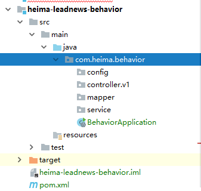

#### 1.1.2 application.yml

```java
server:
  port: 9005
spring:
  application:
    name: leadnews-behavior
  cloud:
    nacos:
      discovery:
        server-addr: 192.168.200.130:8848
  datasource:
    driver-class-name: com.mysql.jdbc.Driver
    url: jdbc:mysql://localhost:3306/leadnews_behavior?useUnicode=true&characterEncoding=UTF-8&serverTimezone=UTC
    username: root
    password: root
# 设置Mapper接口所对应的XML文件位置，如果你在Mapper接口中有自定义方法，需要进行该配置
mybatis-plus:
  mapper-locations: classpath*:mapper/*.xml
  #设置别名包扫描路径，通过该属性可以给包中的类注册别名
  type-aliases-package: com.heima.model.behavior.pojos
```

**其他配置项请参考其他微服务：通用异常，Jackson配置**

### 1.2 关注行为

#### 1.2.1 需求分析

在文章详情中，当用户点击了关注作者按钮，需要记录当前行为到表中，目前只需要存储数据即可，后期会做实时的流式处理，根据这些基础数据做热点文章的计算。

- 服务需求分析：

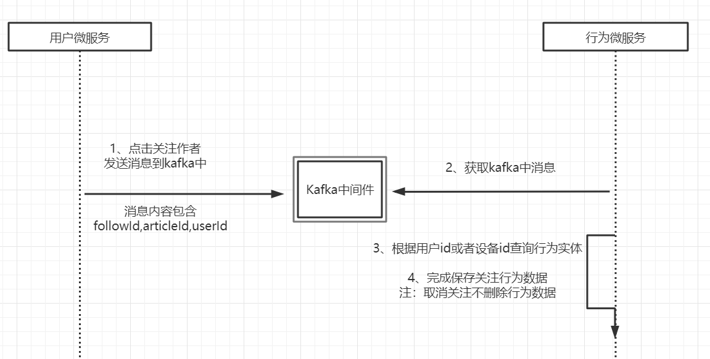

- 数据库表关系分析：

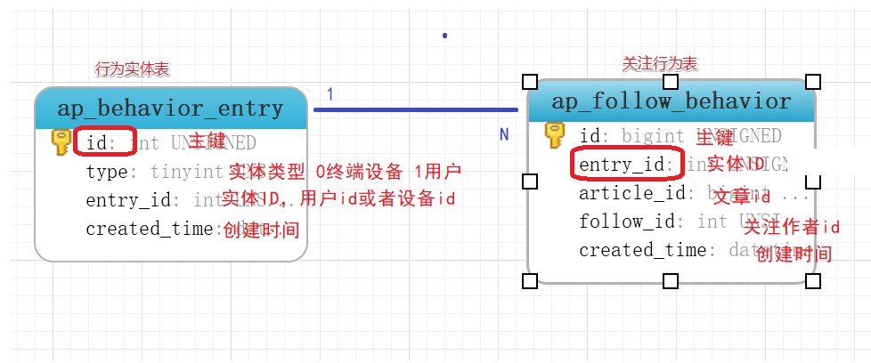

#### 1.2.2 思路分析

ap_follow_behavior  APP关注行为表


对应实体

```java
package com.heima.model.behavior.pojos;

import com.baomidou.mybatisplus.annotation.IdType;
import com.baomidou.mybatisplus.annotation.TableField;
import com.baomidou.mybatisplus.annotation.TableId;
import com.baomidou.mybatisplus.annotation.TableName;
import lombok.Data;

import java.io.Serializable;
import java.util.Date;

/**
 * <p>
 * APP关注行为表
 * </p>
 *
 * @author itheima
 */
@Data
@TableName("ap_follow_behavior")
public class ApFollowBehavior implements Serializable {

    private static final long serialVersionUID = 1L;

    @TableId(value = "id", type = IdType.ID_WORKER)
    private Long id;

    /**
     * 实体ID
     */
    @TableField("entry_id")
    private Integer entryId;

    /**
     * 文章ID
     */
    @TableField("article_id")
    private Long articleId;

    /**
     * 关注用户ID
     */
    @TableField("follow_id")
    private Integer followId;

    /**
     * 登录时间
     */
    @TableField("created_time")
    private Date createdTime;

}
```

ap_behavior_entry 行为实体

行为实体指的是使用的终端设备或者是登录的用户，统称为**行为实体**。

`type :0终端设备  1用户  `

行为实体与APP关注行为表是一对多的关系，关注行为需要知道是谁（设备或用户）关注了该文章信息


对应实体

```java
package com.heima.model.behavior.pojos;

import com.baomidou.mybatisplus.annotation.IdType;
import com.baomidou.mybatisplus.annotation.TableField;
import com.baomidou.mybatisplus.annotation.TableId;
import com.baomidou.mybatisplus.annotation.TableName;
import lombok.Data;
import lombok.Getter;
import org.apache.ibatis.type.Alias;

import java.io.Serializable;
import java.util.Date;

/**
 * <p>
 * APP行为实体表,一个行为实体可能是用户或者设备，或者其它
 * </p>
 *
 * @author itheima
 */
@Data
@TableName("ap_behavior_entry")
public class ApBehaviorEntry implements Serializable {
    private static final long serialVersionUID = 1L;

    /**
     * 主键
     */
    @TableId(value = "id", type = IdType.AUTO)
    private Integer id;

    /**
     * 实体类型
     0终端设备
     1用户
     */
    @TableField("type")
    private Short type;

    /**
     * 实体ID
     */
    @TableField("entry_id")
    private Integer entryId;

    /**
     * 创建时间
     */
    @TableField("created_time")
    private Date createdTime;

    @Alias("ApBehaviorEntryEnumType")
    public enum  Type{
        USER((short)1),EQUIPMENT((short)0);
        @Getter
        short code;
        Type(short code){
            this.code = code;
        }
    }

    public boolean isUser(){
        if(this.getType()!=null&&this.getType()== Type.USER.getCode()){
            return true;
        }
        return false;
    }
}
```

==关注与取消关注的功能已经实现，当用户点击了关注操作，则保存关注行为，取消关注操作则不保存行为数据同时也不删除原来的行为数据。==

因为只做保存操作，只需要在关注操作的时候发送消息在行为微服务保存数据即可。


实现步骤：

> 1 用户微服务中关注操作发送消息，保存用户行为
>
> 2 行为微服务接收消息
>
> 2.1 获取行为实体
>
> 2.2 保存数据

#### 1.2.3 功能实现

##### （1）在用户微服务中搭建kafka的环境，并且修改用户关注代码

kafka环境，在application.yml添加配置

```yaml
spring:
  application:
    name: leadnews-user
  kafka:
    bootstrap-servers: 192.168.200.130:9092
    producer:
      key-serializer: org.apache.kafka.common.serialization.StringSerializer
      value-serializer: org.apache.kafka.common.serialization.StringSerializer
```

发送消息需要准备一个FollowBehaviorDto,进行数据的传递

```java
package com.heima.model.behavior.dtos;

import lombok.Data;

@Data
public class FollowBehaviorDto {
    //文章id
    Long articleId;
    //关注的id
    Integer followId;
    //用户id
    Integer userId;
}
```

新建常量，固定当前消息的topic

```java
package com.heima.common.constants.message;

public class FollowBehaviorConstants {

    public static final String FOLLOW_BEHAVIOR_TOPIC="follow.behavior.topic";
}
```


修改UserRelationServiceImpl中的followByUserId方法，添加发送消息的代码

需要在当前类中注入`KafkaTemplate`

```java
// 记录关注行为
FollowBehaviorDto dto = new FollowBehaviorDto();
dto.setFollowId(followId);
dto.setArticleId(articleId);
dto.setUserId(apUser.getId());
//异步发送消息，保存关注行为
kafkaTemplate.send(FollowBehaviorConstants.FOLLOW_BEHAVIOR_TOPIC, JSON.toJSONString(dto));
```

##### （2）在行为微服务中查询行为实体

行为实体mapper

```java
package com.heima.behavior.mapper;

import com.baomidou.mybatisplus.core.mapper.BaseMapper;
import com.heima.model.behavior.pojos.ApBehaviorEntry;
import org.apache.ibatis.annotations.Mapper;

@Mapper
public interface ApBehaviorEntryMapper extends BaseMapper<ApBehaviorEntry> {
}
```


行为实体业务层接口：

```java
package com.heima.behavior.service;

import com.baomidou.mybatisplus.extension.service.IService;
import com.heima.model.behavior.pojos.ApBehaviorEntry;

public interface ApBehaviorEntryService extends IService<ApBehaviorEntry> {

    /**
     * 根据用户或设备查询行为实体
     * @param userId
     * @param equipmentId
     * @return
     */
    public ApBehaviorEntry findByUserIdOrEquipmentId(Integer userId, Integer equipmentId);
}
```

行为实体业务实现类：

```java
package com.heima.behavior.service.impl;

import com.baomidou.mybatisplus.core.toolkit.Wrappers;
import com.baomidou.mybatisplus.extension.service.impl.ServiceImpl;
import com.heima.behavior.mapper.ApBehaviorEntryMapper;
import com.heima.behavior.service.ApBehaviorEntryService;
import com.heima.model.behavior.pojos.ApBehaviorEntry;
import org.springframework.stereotype.Service;

@Service
public class ApBehaviorEntryServiceImpl extends ServiceImpl<ApBehaviorEntryMapper, ApBehaviorEntry> implements ApBehaviorEntryService {

    @Override
    public ApBehaviorEntry findByUserIdOrEquipmentId(Integer userId, Integer equipmentId){

        //根据用户查询行为实体
        if(userId != null){
          return getOne(Wrappers.<ApBehaviorEntry>lambdaQuery().eq(ApBehaviorEntry::getEntryId,userId).eq(ApBehaviorEntry::getType,1));
        }
        //根据设备id查询行为实体
        if(userId == null && equipmentId != null && equipmentId != 0){
            return getOne(Wrappers.<ApBehaviorEntry>lambdaQuery().eq(ApBehaviorEntry::getEntryId,equipmentId).eq(ApBehaviorEntry::getType,0));
        }
        return null;
    }
}
```

（3）在行为微服务中保存关注行为

关注行为mapper

```java
package com.heima.behavior.mapper;

import com.baomidou.mybatisplus.core.mapper.BaseMapper;
import com.heima.model.behavior.pojos.ApFollowBehavior;
import org.apache.ibatis.annotations.Mapper;

/**
 * <p>
 * APP关注行为表 Mapper 接口
 * </p>
 *
 * @author itheima
 */
@Mapper
public interface ApFollowBehaviorMapper extends BaseMapper<ApFollowBehavior> {

}
```

关注行为业务层接口

```java
package com.heima.behavior.service;

import com.baomidou.mybatisplus.extension.service.IService;
import com.heima.model.behavior.dtos.FollowBehaviorDto;
import com.heima.model.behavior.pojos.ApFollowBehavior;
import com.heima.model.common.dtos.ResponseResult;

/**
 * <p>
 * APP关注行为表 服务类
 * </p>
 *
 * @author itheima
 */
public interface ApFollowBehaviorService extends IService<ApFollowBehavior> {

    /**
     * 存储关注数据
     * @param dto
     * @return
     */
    public ResponseResult saveFollowBehavior(FollowBehaviorDto dto);
}
```

实现类：

```java
package com.heima.behavior.service.impl;

import com.baomidou.mybatisplus.extension.service.impl.ServiceImpl;
import com.heima.behavior.mapper.ApFollowBehaviorMapper;
import com.heima.behavior.service.ApBehaviorEntryService;
import com.heima.behavior.service.ApFollowBehaviorService;
import com.heima.model.behavior.dtos.FollowBehaviorDto;
import com.heima.model.behavior.pojos.ApBehaviorEntry;
import com.heima.model.behavior.pojos.ApFollowBehavior;
import com.heima.model.common.dtos.ResponseResult;
import com.heima.model.common.enums.AppHttpCodeEnum;
import lombok.extern.slf4j.Slf4j;
import org.springframework.beans.factory.annotation.Autowired;
import org.springframework.stereotype.Service;

import java.util.Date;

/**
 * <p>
 * APP关注行为表 服务实现类
 * </p>
 *
 * @author itheima
 */
@Slf4j
@Service
public class ApFollowBehaviorServiceImpl extends ServiceImpl<ApFollowBehaviorMapper, ApFollowBehavior> implements ApFollowBehaviorService {

    @Autowired
    private ApBehaviorEntryService apBehaviorEntryService;

    @Override
    public ResponseResult saveFollowBehavior(FollowBehaviorDto dto) {
        //查询行为实体
        ApBehaviorEntry apBehaviorEntry = apBehaviorEntryService.findByUserIdOrEquipmentId(dto.getUserId(),null);
        if(apBehaviorEntry==null){
            return ResponseResult.errorResult(AppHttpCodeEnum.PARAM_INVALID);
        }
        //保存关注行为
        ApFollowBehavior alb = new ApFollowBehavior();
        alb.setEntryId(apBehaviorEntry.getId());
        alb.setCreatedTime(new Date());
        alb.setArticleId(dto.getArticleId());
        alb.setFollowId(dto.getFollowId());
        return ResponseResult.okResult(save(alb));
    }
}
```

(4)在行为微服务中集成kafka，并且创建监听

```yaml
spring:
  application:
    name: leadnews-behavior
  kafka:
    bootstrap-servers: 192.168.200.130:9092
    consumer:
      group-id: ${spring.application.name}-kafka-group
      key-deserializer: org.apache.kafka.common.serialization.StringDeserializer
      value-deserializer: org.apache.kafka.common.serialization.StringDeserializer
```

消息监听类：

```java
package com.heima.behavior.kafka.listener;

import com.alibaba.fastjson.JSON;
import com.heima.behavior.service.ApFollowBehaviorService;
import com.heima.common.constans.message.FollowBehaviorConstants;
import com.heima.model.behavior.dtos.FollowBehaviorDto;
import org.apache.kafka.clients.consumer.ConsumerRecord;
import org.springframework.beans.factory.annotation.Autowired;
import org.springframework.kafka.annotation.KafkaListener;
import org.springframework.stereotype.Component;

import java.util.Optional;

@Component
public class FollowBehaviorListener {

    @Autowired
    private ApFollowBehaviorService apFollowBehaviorService;

    @KafkaListener(topics = FollowBehaviorConstants.FOLLOW_BEHAVIOR_TOPIC)
    public void receiverMessage(ConsumerRecord<?,?> record){
        //接收关注行为数据，保存
        Optional<? extends ConsumerRecord<?, ?>> optional = Optional.ofNullable(record);
        if(optional.isPresent()){
            FollowBehaviorDto dto = JSON.parseObject(record.value().toString(), FollowBehaviorDto.class);
            apFollowBehaviorService.saveFollowBehavior(dto);
        }
    }
}
```

(4) 测试

在app端文章详情中，当点击关注按钮的时候，会往ap_follow_behavior表中插入数据。

取消关注，再次关注后会追加数据。

------


### 1.3 点赞行为

#### 1.3.1 需求分析


当前登录的用户点击了”赞“,就要保存当前行为数据

- 需求分析流程

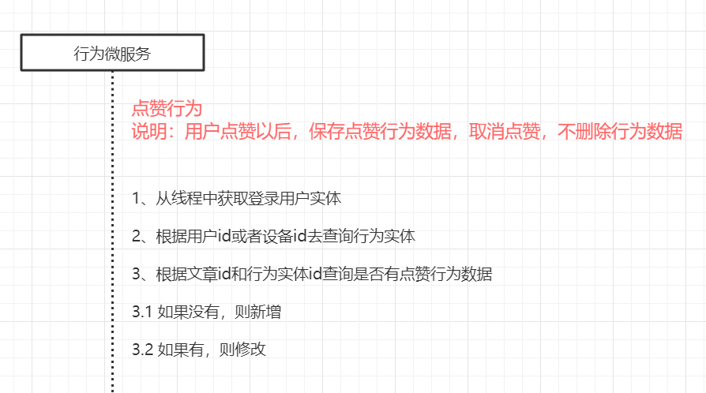

- 数据表分析

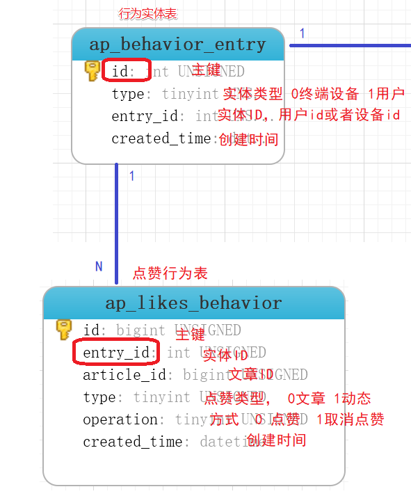

#### 1.3.2 思路分析

ap_likes_behavior表


实体类：

```java
package com.heima.model.behavior.pojos;

import com.baomidou.mybatisplus.annotation.IdType;
import com.baomidou.mybatisplus.annotation.TableField;
import com.baomidou.mybatisplus.annotation.TableId;
import com.baomidou.mybatisplus.annotation.TableName;
import lombok.Data;
import org.apache.ibatis.type.Alias;

import java.io.Serializable;
import java.util.Date;

/**
 * <p>
 * APP点赞行为表
 * </p>
 *
 * @author itheima
 */
@Data
@TableName("ap_likes_behavior")
public class ApLikesBehavior implements Serializable {

    private static final long serialVersionUID = 1L;

    @TableId(value = "id", type = IdType.ID_WORKER)
    private Long id;

    /**
     * 实体ID
     */
    @TableField("entry_id")
    private Integer entryId;

    /**
     * 文章ID
     */
    @TableField("article_id")
    private Long articleId;

    /**
     * 点赞内容类型
     * 0文章
     * 1动态
     */
    @TableField("type")
    private Short type;

    /**
     * 0 点赞
     * 1 取消点赞
     */
    @TableField("operation")
    private Short operation;

    /**
     * 登录时间
     */
    @TableField("created_time")
    private Date createdTime;

    // 定义点赞内容的类型
    @Alias("ApLikesBehaviorEnumType")
    public enum Type {
        ARTICLE((short) 0), DYNAMIC((short) 1), COMMENT((short) 2);
        short code;

        Type(short code) {
            this.code = code;
        }

        public short getCode() {
            return this.code;
        }
    }

    //定义点赞操作的方式，点赞还是取消点赞
    @Alias("ApLikesBehaviorEnumOperation")
    public enum Operation {
        LIKE((short) 0), CANCEL((short) 1);
        short code;

        Operation(short code) {
            this.code = code;
        }

        public short getCode() {
            return this.code;
        }
    }

}
```


当前用户点赞以后保存数据，取消点赞则不删除数据

保存也是根据当前**行为实体和文章id**进行保存

#### 1.3.3 功能实现

（1）接口定义

新增ApLikesBehaviorControllerApi接口，添加保存的方法

```java
package com.heima.apis.behavior;

import com.heima.model.behavior.dtos.LikesBehaviorDto;
import com.heima.model.behavior.pojos.ApLikesBehavior;
import com.heima.model.common.dtos.ResponseResult;

public interface ApLikesBehaviorControllerApi {


   /**
     * 保存点赞行为
     * @param dto
     * @return
     */
	ResponseResult like(LikesBehaviorDto dto);

}
```

LikesBehaviorDto

```java
package com.heima.model.behavior.dtos;

import com.heima.model.common.annotation.IdEncrypt;
import lombok.Data;

@Data
public class LikesBehaviorDto {
    // 设备ID
    @IdEncrypt
    Integer equipmentId;
    // 文章、动态、评论等ID
    @IdEncrypt
    Long articleId;
    /**
     * 喜欢内容类型
     * 0文章
     * 1动态
     * 2评论
     */
    Short type;

    /**
     * 喜欢操作方式
     * 0 点赞
     * 1 取消点赞
     */
    Short operation;
}
```

（2）mapper

```java
package com.heima.behavior.mapper;

import com.baomidou.mybatisplus.core.mapper.BaseMapper;
import com.heima.model.behavior.pojos.ApLikesBehavior;
import org.apache.ibatis.annotations.Mapper;

/**
 * <p>
 * APP点赞行为表 Mapper 接口
 * </p>
 *
 * @author itheima
 */
@Mapper
public interface ApLikesBehaviorMapper extends BaseMapper<ApLikesBehavior> {

}
```

（3）业务层

在功能实现的时候需要得到行为实体，所以需要得到当前登录的用户信息，参考文章微服务，添加filter，获取用户信息放到当前线程中

```java
package com.heima.behavior.filter;

import com.heima.model.user.pojos.ApUser;
import com.heima.utils.threadlocal.AppThreadLocalUtils;
import org.springframework.core.annotation.Order;
import org.springframework.web.filter.GenericFilterBean;

import javax.servlet.FilterChain;
import javax.servlet.ServletException;
import javax.servlet.ServletRequest;
import javax.servlet.ServletResponse;
import javax.servlet.annotation.WebFilter;
import javax.servlet.http.HttpServletRequest;
import javax.servlet.http.HttpServletResponse;
import java.io.IOException;

@Order(1)
@WebFilter(filterName = "appTokenFilter", urlPatterns = "/*")
public class AppTokenFilter extends GenericFilterBean {

    @Override
    public void doFilter(ServletRequest req, ServletResponse res, FilterChain chain) throws IOException, ServletException {
        HttpServletRequest request = (HttpServletRequest) req;
        HttpServletResponse response = (HttpServletResponse) res;
        String userId = request.getHeader("userId");
        //如果userId为0，说明当前设备没有登录
        if(userId!=null && Integer.valueOf(userId).intValue()!=0){
            ApUser apUser = new ApUser();
            apUser.setId(Integer.valueOf(userId));
            AppThreadLocalUtils.setUser(apUser);
        }
        chain.doFilter(req,res);
    }

}
```

在引导类中添加注解`@ServletComponentScan`,启动当前过滤器


点赞业务层接口

```java
package com.heima.behavior.service;

import com.baomidou.mybatisplus.extension.service.IService;
import com.heima.model.behavior.dtos.LikesBehaviorDto;
import com.heima.model.behavior.pojos.ApLikesBehavior;
import com.heima.model.common.dtos.ResponseResult;

/**
 * <p>
 * APP点赞行为表 服务类
 * </p>
 *
 * @author itheima
 */
public interface ApLikesBehaviorService extends IService<ApLikesBehavior> {
    /**
     * 存储喜欢数据
     * @param dto
     * @return
     */
	public ResponseResult like(LikesBehaviorDto dto);

}
```

实现类：

```java
package com.heima.behavior.service.impl;

import com.baomidou.mybatisplus.core.toolkit.Wrappers;
import com.baomidou.mybatisplus.extension.service.impl.ServiceImpl;
import com.heima.behavior.mapper.ApLikesBehaviorMapper;
import com.heima.behavior.service.ApBehaviorEntryService;
import com.heima.behavior.service.ApLikesBehaviorService;
import com.heima.model.behavior.dtos.LikesBehaviorDto;
import com.heima.model.behavior.pojos.ApBehaviorEntry;
import com.heima.model.behavior.pojos.ApLikesBehavior;
import com.heima.model.common.dtos.ResponseResult;

import com.heima.model.common.enums.AppHttpCodeEnum;
import com.heima.model.user.pojos.ApUser;
import com.heima.utils.threadlocal.AppThreadLocalUtils;
import org.springframework.beans.factory.annotation.Autowired;
import org.springframework.stereotype.Service;

import java.util.Date;


@Service
public class ApLikesBehaviorServiceImpl extends ServiceImpl<ApLikesBehaviorMapper, ApLikesBehavior> implements ApLikesBehaviorService {

    @Autowired
    private ApBehaviorEntryService apBehaviorEntryService;

    @Override
    public ResponseResult like(LikesBehaviorDto dto) {
        //1.检查参数
        if(dto == null || dto.getArticleId() == null || (dto.getType() < 0 && dto.getType() > 2) || (dto.getOperation() < 0 && dto.getOperation() > 1)){
            return ResponseResult.errorResult(AppHttpCodeEnum.PARAM_INVALID);
        }
        //2.查询行为实体
        ApUser user = AppThreadLocalUtils.getUser();
        ApBehaviorEntry apBehaviorEntry = apBehaviorEntryService.findByUserIdOrEquipmentId(user.getId(), dto.getEquipmentId());
        if(apBehaviorEntry == null){
            return ResponseResult.errorResult(AppHttpCodeEnum.PARAM_INVALID);
        }

        //3.点赞或取消点赞
        ApLikesBehavior apLikesBehavior = getOne(Wrappers.<ApLikesBehavior>lambdaQuery().eq(ApLikesBehavior::getArticleId, dto.getArticleId()).eq(ApLikesBehavior::getEntryId, apBehaviorEntry.getId()));
        if(apLikesBehavior == null && dto.getOperation() == 0){
            apLikesBehavior = new ApLikesBehavior();
            apLikesBehavior.setOperation(dto.getOperation());
            apLikesBehavior.setArticleId(dto.getArticleId());
            apLikesBehavior.setEntryId(apBehaviorEntry.getId());
            apLikesBehavior.setType(dto.getType());
            apLikesBehavior.setCreatedTime(new Date());
            save(apLikesBehavior);
            return ResponseResult.okResult(AppHttpCodeEnum.SUCCESS);
        }else{
            apLikesBehavior.setOperation(dto.getOperation());
            updateById(apLikesBehavior);
            return ResponseResult.okResult(AppHttpCodeEnum.SUCCESS);
        }
    }
}
```

（4）控制层

新增ApLikesBehaviorController中新增方法

```java
package com.heima.behavior.controller.v1;

import com.baomidou.mybatisplus.core.toolkit.Wrappers;
import com.heima.apis.behavior.ApLikesBehaviorControllerApi;
import com.heima.behavior.service.ApLikesBehaviorService;
import com.heima.model.behavior.dtos.LikesBehaviorDto;
import com.heima.model.behavior.pojos.ApLikesBehavior;
import com.heima.model.common.dtos.ResponseResult;
import org.springframework.beans.factory.annotation.Autowired;
import org.springframework.web.bind.annotation.*;

@RestController
@RequestMapping("/api/v1/likes_behavior")
public class ApLikesBehaviorController implements ApLikesBehaviorControllerApi {

    @Autowired
    private ApLikesBehaviorService apLikesBehaviorService;

    @PostMapping
    @Override
    public ResponseResult like(@RequestBody LikesBehaviorDto dto) {
        return apLikesBehaviorService.like(dto);
    }
}
```

（5）在app网关中配置行为微服务的路由

```yaml
#行为微服务
- id: leadnews-behavior
uri: lb://leadnews-behavior
predicates:
- Path=/behavior/**
filters:
- StripPrefix= 1
```

（6）测试

启动项目，当用户点赞文章好，可以在ap_likes_behavior表新增数据，文章取消赞，再次点赞后追加数据。

==注意：前台点赞操作传输过来的参数不对==

src/apis/article/api.js中点赞方法：

改变前：

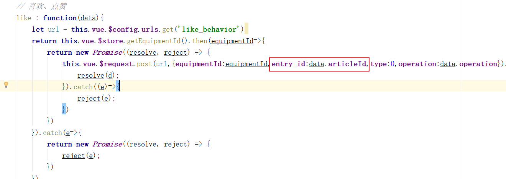

改变后：


### 1.4 阅读行为

#### 1.4.1 需求分析

当用户查看了某一篇文章，需要记录当前用户查看的次数，阅读时长，阅读文章的比例，加载的时长（非必要）

- 需求分析流程

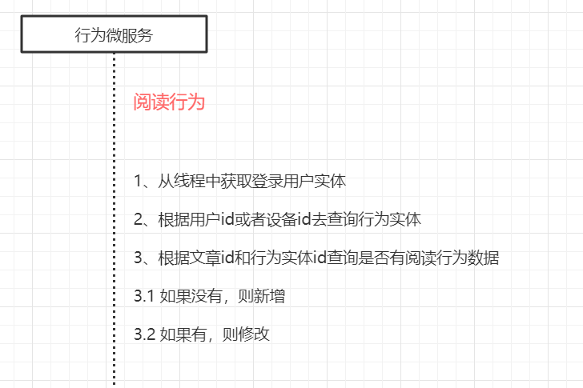

- 数据库表分析

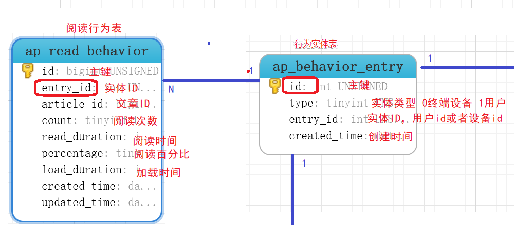

#### 1.4.2 思路分析

ap_read_behavior APP阅读行为表


对应实体：

```java
/**
 * <p>
 * APP阅读行为表
 * </p>
 *
 * @author itheima
 */
@Data
@TableName("ap_read_behavior")
public class ApReadBehavior implements Serializable {

    private static final long serialVersionUID = 1L;

    @TableId(value = "id",type = IdType.ID_WORKER)
    private Long id;

    /**
     * 用户ID
     */
    @TableField("entry_id")
    private Integer entryId;

    /**
     * 文章ID
     */
    @TableField("article_id")
    private Long articleId;

    /**
     * 阅读次数
     */
    @TableField("count")
    private Short count;

    /**
     * 阅读时间单位秒
     */
    @TableField("read_duration")
    private Integer readDuration;

    /**
     * 阅读百分比
     */
    @TableField("percentage")
    private Short percentage;

    /**
     * 文章加载时间
     */
    @TableField("load_duration")
    private Short loadDuration;

    /**
     * 登录时间
     */
    @TableField("created_time")
    private Date createdTime;

    /**
     * 更新时间
     */
    @TableField("updated_time")
    private Date updatedTime;

}
```

#### 1.4.3 功能实现

(1)接口定义

新建阅读行为的api接口

```java
package com.heima.apis.behavior;

import com.heima.model.behavior.dtos.ReadBehaviorDto;
import com.heima.model.common.dtos.ResponseResult;

public interface ApReadBehaviorControllerApi {

    /**
     * 保存或更新阅读行为
     * @return
     */
    public ResponseResult readBehavior(ReadBehaviorDto dto);
}
```

ReadBehaviorDto

```java
package com.heima.model.behavior.dtos;

import com.heima.model.common.annotation.IdEncrypt;
import lombok.Data;

@Data
public class ReadBehaviorDto {
    // 设备ID
    @IdEncrypt
    Integer equipmentId;
    // 文章、动态、评论等ID
    @IdEncrypt
    Long articleId;

    /**
     * 阅读次数
     */
    Short count;

    /**
     * 阅读时长（S)
     */
    Integer readDuration;

    /**
     * 阅读百分比
     */
    Short percentage;

    /**
     * 加载时间
     */
    Short loadDuration;

}
```

(2) mapper

新建阅读行为mapper

```java
package com.heima.behavior.mapper;

import com.baomidou.mybatisplus.core.mapper.BaseMapper;
import com.heima.model.behavior.pojos.ApReadBehavior;
import org.apache.ibatis.annotations.Mapper;

/**
 * <p>
 * APP阅读行为表 Mapper 接口
 * </p>
 *
 * @author itheima
 */
@Mapper
public interface ApReadBehaviorMapper extends BaseMapper<ApReadBehavior> {

}
```

(3) 业务层

新建阅读行为的业务层接口

```java
package com.heima.behavior.service;

import com.baomidou.mybatisplus.extension.service.IService;
import com.heima.model.behavior.dtos.ReadBehaviorDto;
import com.heima.model.behavior.pojos.ApReadBehavior;
import com.heima.model.common.dtos.ResponseResult;

public interface ApReadBehaviorService extends IService<ApReadBehavior> {

    /**
     * 保存阅读行为
     * @param dto
     * @return
     */
    ResponseResult readBehavior(ReadBehaviorDto dto);
}
```

实现类：

```java
package com.heima.behavior.service.impl;

import com.baomidou.mybatisplus.core.toolkit.Wrappers;
import com.baomidou.mybatisplus.extension.service.impl.ServiceImpl;
import com.heima.behavior.mapper.ApReadBehaviorMapper;
import com.heima.behavior.service.ApBehaviorEntryService;
import com.heima.behavior.service.ApReadBehaviorService;
import com.heima.model.behavior.dtos.ReadBehaviorDto;
import com.heima.model.behavior.pojos.ApBehaviorEntry;
import com.heima.model.behavior.pojos.ApReadBehavior;
import com.heima.model.common.dtos.ResponseResult;
import com.heima.model.common.enums.AppHttpCodeEnum;
import com.heima.model.user.pojos.ApUser;
import com.heima.utils.threadlocal.AppThreadLocalUtils;
import lombok.extern.log4j.Log4j2;
import org.springframework.beans.factory.annotation.Autowired;
import org.springframework.stereotype.Service;

import java.util.Date;

@Service
@Log4j2
public class ApReadBehaviorServiceImpl extends ServiceImpl<ApReadBehaviorMapper, ApReadBehavior> implements ApReadBehaviorService {

    @Autowired
    private ApBehaviorEntryService apBehaviorEntryService;

    @Override
    public ResponseResult readBehavior(ReadBehaviorDto dto) {
        //1.参数校验
        if(dto == null || dto.getArticleId() == null){
            return ResponseResult.errorResult(AppHttpCodeEnum.PARAM_INVALID);
        }
        //2.查询行为实体
        ApUser user = AppThreadLocalUtils.getUser();
        ApBehaviorEntry apBehaviorEntry = apBehaviorEntryService.findByUserIdOrEquipmentId(user.getId(), dto.getEquipmentId());
        if(apBehaviorEntry == null){
            return ResponseResult.errorResult(AppHttpCodeEnum.PARAM_INVALID);
        }

        //3.保存或更新阅读的行为
        ApReadBehavior apReadBehavior = getOne(Wrappers.<ApReadBehavior>lambdaQuery().eq(ApReadBehavior::getEntryId, apBehaviorEntry.getId()).eq(ApReadBehavior::getArticleId, dto.getArticleId()));
        if(apReadBehavior == null){
            apReadBehavior = new ApReadBehavior();
            apReadBehavior.setCount(dto.getCount());
            apReadBehavior.setArticleId(dto.getArticleId());
            apReadBehavior.setPercentage(dto.getPercentage());
            apReadBehavior.setEntryId(apBehaviorEntry.getId());
            apReadBehavior.setLoadDuration(dto.getLoadDuration());
            apReadBehavior.setReadDuration(dto.getReadDuration());
            apReadBehavior.setCreatedTime(new Date());
            save(apReadBehavior);
        }else{
            apReadBehavior.setUpdatedTime(new Date());
            apReadBehavior.setCount((short)(apReadBehavior.getCount()+1));
            updateById(apReadBehavior);
        }
        return ResponseResult.okResult(AppHttpCodeEnum.SUCCESS);
    }
}
```

(4)控制层

新建阅读行为控制器

```java
package com.heima.behavior.controller.v1;

import com.heima.apis.behavior.ApReadBehaviorControllerApi;
import com.heima.behavior.service.ApReadBehaviorService;
import com.heima.model.behavior.dtos.ReadBehaviorDto;
import com.heima.model.common.dtos.ResponseResult;
import org.springframework.beans.factory.annotation.Autowired;
import org.springframework.web.bind.annotation.PostMapping;
import org.springframework.web.bind.annotation.RequestBody;
import org.springframework.web.bind.annotation.RequestMapping;
import org.springframework.web.bind.annotation.RestController;

@RestController
@RequestMapping("/api/v1/read_behavior")
public class ApReadBehaviorController implements ApReadBehaviorControllerApi {

    @Autowired
    private ApReadBehaviorService apReadBehaviorService;

    @PostMapping
    @Override
    public ResponseResult readBehavior(@RequestBody ReadBehaviorDto dto) {
        return apReadBehaviorService.readBehavior(dto);
    }
}
```

(5)测试

当用户查看了一篇文章的详情，点击返回重新加入文章列表发送请求，记录当前用户阅读此文章的行为

### 1.5 不喜欢行为和收藏行为

目前的请求api已经设定好了，大家可以自行实现不喜欢和收藏行为。

#### 1.5.1 不喜欢行为记录实现思路

为什么会有不喜欢？

​	一旦用户点击了不喜欢，不再给当前用户推荐这一类型的文章信息

- 需求分析流程

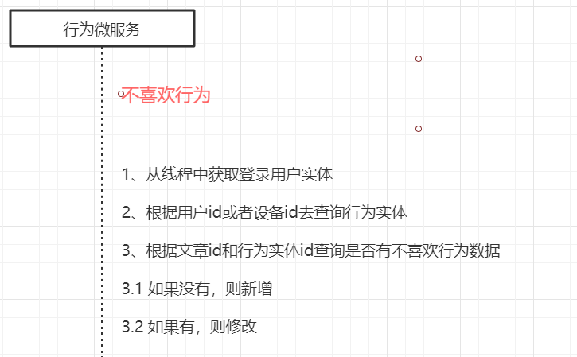

- 数据库表分析

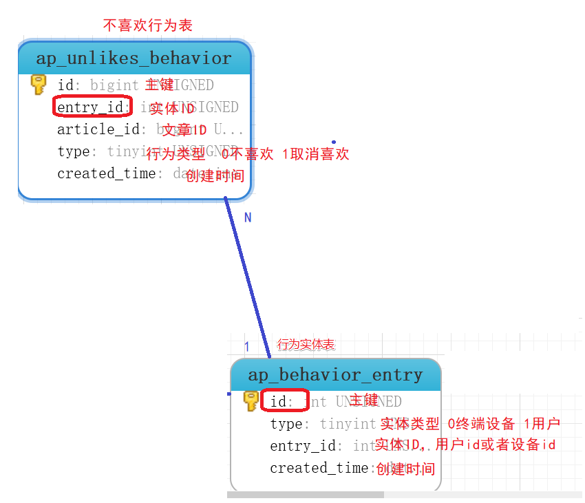

ap_unlikes_behavior APP不喜欢行为表


```java
package com.heima.model.behavior.pojos;

import com.baomidou.mybatisplus.annotation.IdType;
import com.baomidou.mybatisplus.annotation.TableField;
import com.baomidou.mybatisplus.annotation.TableId;
import com.baomidou.mybatisplus.annotation.TableName;
import lombok.Data;
import org.apache.ibatis.type.Alias;

import java.io.Serializable;
import java.util.Date;

/**
 * <p>
 * APP不喜欢行为表
 * </p>
 *
 * @author itheima
 */
@Data
@TableName("ap_unlikes_behavior")
public class ApUnlikesBehavior implements Serializable {

    private static final long serialVersionUID = 1L;

    @TableId(value = "id", type = IdType.ID_WORKER)
    private Long id;

    /**
     * 实体ID
     */
    @TableField("entry_id")
    private Integer entryId;

    /**
     * 文章ID
     */
    @TableField("article_id")
    private Long articleId;

    /**
     * 0 不喜欢
     1 取消不喜欢
     */
    @TableField("type")
    private Integer type;

    /**
     * 登录时间
     */
    @TableField("created_time")
    private Date createdTime;
    // 定义不喜欢操作的类型
    @Alias("ApUnlikesBehaviorEnumType")
    public enum Type{
        UNLIKE((short)0),CANCEL((short)1);
        short code;
        Type(short code){
            this.code = code;
        }
        public short getCode(){
            return this.code;
        }
    }
}
```

实现思路

1 获取行为实体

2 查询不喜欢对象，有则修改，无则新增

3 固定api接口地址：/api/v1/unlike_behavior    POST请求

如果想修改api接口地址，请打开前端的：heima-leadnews-app\src\common\conf.js文件进行修改


dto:

```java
@Data
public class UnLikesBehaviorDto {
    // 设备ID
    @IdEncrypt
    Integer equipmentId;
    // 文章ID
    @IdEncrypt
    Long articleId;

    /**
     * 不喜欢操作方式
     * 0 不喜欢
     * 1 取消不喜欢
     */
    Short type;

}
```

#### 1.5.2 收藏功能实现思路

收藏表在文章库中，为什么不设计在行为库？

因为app端用户可以个人中心找到自己收藏的文章列表，这样设计更方便

- 需求分析流程

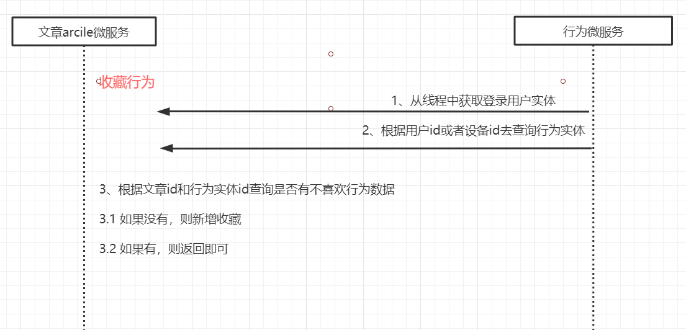

- 数据库表分析

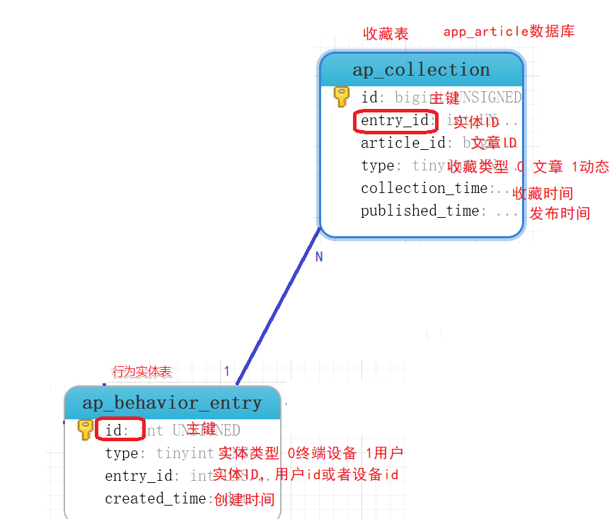

ap_collection APP收藏信息表


对应实体：

```java
package com.heima.model.article.pojos;

import com.baomidou.mybatisplus.annotation.IdType;
import com.baomidou.mybatisplus.annotation.TableField;
import com.baomidou.mybatisplus.annotation.TableId;
import com.baomidou.mybatisplus.annotation.TableName;
import lombok.Data;
import org.apache.ibatis.type.Alias;

import java.io.Serializable;
import java.util.Date;

/**
 * <p>
 * APP收藏信息表
 * </p>
 *
 * @author itheima
 */
@Data
@TableName("ap_collection")
public class ApCollection implements Serializable {

    private static final long serialVersionUID = 1L;

    @TableId(value = "id", type = IdType.ID_WORKER)
    private Long id;

    /**
     * 实体ID
     */
    @TableField("entry_id")
    private Integer entryId;

    /**
     * 文章ID
     */
    @TableField("article_id")
    private Long articleId;

    /**
     * 点赞内容类型
     0文章
     1动态
     */
    @TableField("type")
    private Short type;

    /**
     * 创建时间
     */
    @TableField("collection_time")
    private Date collectionTime;

    /**
     * 发布时间
     */
    @TableField("published_time")
    private Date publishedTime;

    // 定义收藏内容类型的枚举
    @Alias("ApCollectionEnumType")
    public enum Type{
        ARTICLE((short)0),DYNAMIC((short)1);
        short code;
        Type(short code){
            this.code = code;
        }
        public short getCode(){
            return this.code;
        }
    }

    public boolean isCollectionArticle(){
        return (this.getType()!=null&&this.getType().equals(Type.ARTICLE));
    }
}
```

实现思路

1 在文章微服务中获取远程接口拿到行为实体

2 保存收藏文章数据，如果当前文章已收藏，无须再次收藏

3 固定访问url


数据流程对象dto

```java
@Data
public class CollectionBehaviorDto {
    // 设备ID
    @IdEncrypt
    Integer equipmentId;
    // 文章、动态ID
    @IdEncrypt
    Long entryId;
    /**
     * 收藏内容类型
     * 0文章
     * 1动态
     */
    Short type;

    /**
     * 操作类型
     * 0收藏
     * 1取消收藏
     */
    Short operation;

    Date publishedTime;

}
```

## 2 app文章关系展示功能

### 2.1 app文章关系-需求分析

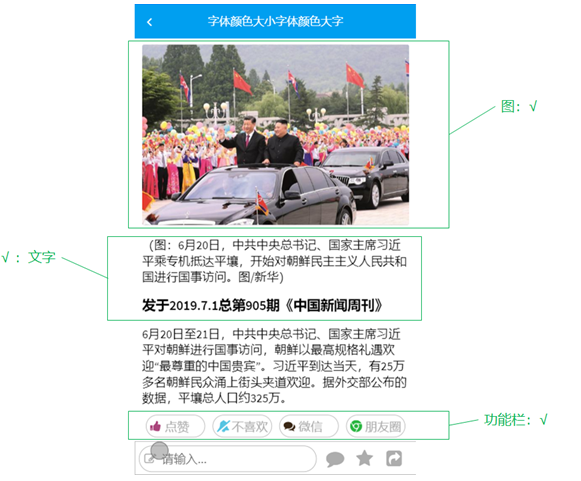

主要是用来展示文章的关系，app端用户必须登录，判断当前用户**是否已经关注该文章的作者、是否收藏了此文章、是否点赞了文章、是否不喜欢该文章等**

==例：如果当前用户点赞了该文章，点赞按钮进行高亮，其他功能类似。==

### 2.2 app文章关系-思路分析

#### 2.2.1 实现思路

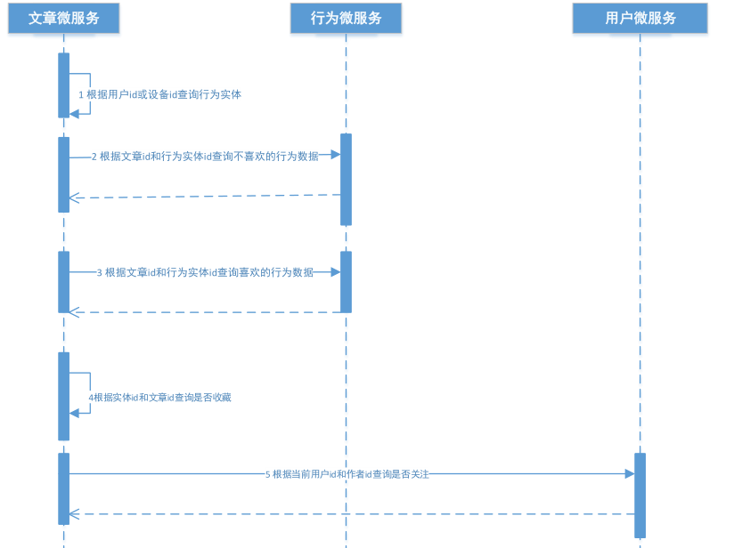


1 用户查看文章详情，展示文章信息（功能已实现），同时需要展示当前文章的行为（点赞，收藏等）

2 根据用户id(已登录)或设备id(未登录)去查询当前实体id

3 通过实体id和前端传递过来的文章id去查询收藏表、点赞表、不喜欢表；其中点赞和不喜欢需要远程调用behavior微服务获取数据。

4 在文章详情展示是否关注此作者，需要通过当前用户和作者关系表进行查询，有数据则关注，无数据则没有关注

返回的格式如下：

```json
{"isfollow":true,"islike":true,"isunlike":false,"iscollection":true}
```

#### 2.2.2 表关系说明


### 2.3 远程接口准备

#### 2.3.1 行为微服务

这些接口定义方便为了让feign远程接口内部调用，所以一般都正常返回想要的对象即可，非必要，无需返回ResponseResult对象

（1）行为实体远程接口

新建行为实体APIS

```java
package com.heima.apis.behavior;

import com.heima.model.behavior.pojos.ApBehaviorEntry;

public interface ApBehaviorEntryControllerApi {

    /**
     * 查询行为实体
     * @param userId
     * @param equipmentId
     * @return
     */
    public ApBehaviorEntry findByUserIdOrEquipmentId(Integer userId, Integer equipmentId);
}
```

其中的mapper和service已经完成

新建行为实体控制器

```java
package com.heima.behavior.controller.v1;

import com.heima.apis.behavior.ApBehaviorEntryControllerApi;
import com.heima.behavior.service.ApBehaviorEntryService;
import com.heima.model.behavior.pojos.ApBehaviorEntry;
import org.springframework.beans.factory.annotation.Autowired;
import org.springframework.web.bind.annotation.GetMapping;
import org.springframework.web.bind.annotation.RequestMapping;
import org.springframework.web.bind.annotation.RequestParam;
import org.springframework.web.bind.annotation.RestController;

@RestController
@RequestMapping("/api/v1/behavior_entry")
public class ApBehaviorEntryController implements ApBehaviorEntryControllerApi {

    @Autowired
    private ApBehaviorEntryService apBehaviorEntryService;

    @GetMapping("/one")
    @Override
    public ApBehaviorEntry findByUserIdOrEquipmentId(@RequestParam("userId") Integer userId,@RequestParam("equipmentId") Integer equipmentId) {
        return apBehaviorEntryService.findByUserIdOrEquipmentId(userId,equipmentId);
    }
}
```


（2）点赞远程接口

修改ApLikesBehaviorControllerApi接口，新增方法：

```java
 /**
     * 根据行为实体id和文章id查询点赞行为
     * @return
     */
public ApLikesBehavior findLikeByArticleIdAndEntryId(Long articleId, Integer entryId, Short type);
```

其中点赞的业务层和持久层已经定义

点赞控制器

```java
@GetMapping("/one")
@Override
public ApLikesBehavior findLikeByArticleIdAndEntryId(@RequestParam("articleId") Long articleId, @RequestParam("entryId")Integer entryId, @RequestParam("type")Short type) {
    ApLikesBehavior apLikesBehavior = apLikesBehaviorService.getOne(Wrappers.<ApLikesBehavior>lambdaQuery()
                                                                    .eq(ApLikesBehavior::getArticleId, articleId).eq(ApLikesBehavior::getEntryId, entryId)
                                                                    .eq(ApLikesBehavior::getType, type));
    return apLikesBehavior;
}
```

（3）不喜欢远程接口

前提：需要先把本讲义中的1.5章节中的不喜欢实体类导入到model中

新建apis接口

```java
package com.heima.apis.behavior;

import com.heima.model.behavior.pojos.ApUnlikesBehavior;

public interface ApUnlikesBehaviorControllerApi {

    /**
     * 根据行为实体id和文章id查询不喜欢行为
     * @param entryId
     * @param articleId
     * @return
     */
    public ApUnlikesBehavior findUnLikeByArticleIdAndEntryId(Integer entryId,Long articleId);
}
```

不喜欢mapper

```java
package com.heima.behavior.mapper;

import com.baomidou.mybatisplus.core.mapper.BaseMapper;
import com.heima.model.behavior.pojos.ApUnlikesBehavior;
import org.apache.ibatis.annotations.Mapper;

/**
 * <p>
 * APP不喜欢行为表 Mapper 接口
 * </p>
 *
 * @author itheima
 */
@Mapper
public interface ApUnlikesBehaviorMapper extends BaseMapper<ApUnlikesBehavior> {

}
```

不喜欢业务层接口

```java
package com.heima.behavior.service;

import com.baomidou.mybatisplus.extension.service.IService;
import com.heima.model.behavior.pojos.ApUnlikesBehavior;

/**
 * <p>
 * APP不喜欢行为表 服务类
 * </p>
 *
 * @author itheima
 */
public interface ApUnlikesBehaviorService extends IService<ApUnlikesBehavior> {

}
```

不喜欢业务层实现类

```java
package com.heima.behavior.service.impl;

import com.baomidou.mybatisplus.extension.service.impl.ServiceImpl;
import com.heima.behavior.mapper.ApUnlikesBehaviorMapper;
import com.heima.behavior.service.ApUnlikesBehaviorService;
import com.heima.model.behavior.pojos.ApUnlikesBehavior;
import lombok.extern.slf4j.Slf4j;
import org.springframework.stereotype.Service;

/**
 * <p>
 * APP不喜欢行为表 服务实现类
 * </p>
 *
 * @author itheima
 */
@Slf4j
@Service
public class ApUnlikesBehaviorServiceImpl extends ServiceImpl<ApUnlikesBehaviorMapper, ApUnlikesBehavior> implements ApUnlikesBehaviorService {

}
```

不喜欢控制器

```java
package com.heima.behavior.controller.v1;

import com.baomidou.mybatisplus.core.toolkit.Wrappers;
import com.heima.apis.behavior.ApUnlikesBehaviorControllerApi;
import com.heima.behavior.service.ApUnlikesBehaviorService;
import com.heima.model.behavior.pojos.ApUnlikesBehavior;
import org.springframework.beans.factory.annotation.Autowired;
import org.springframework.web.bind.annotation.GetMapping;
import org.springframework.web.bind.annotation.RequestMapping;
import org.springframework.web.bind.annotation.RequestParam;
import org.springframework.web.bind.annotation.RestController;

@RestController
@RequestMapping("/api/v1/un_likes_behavior")
public class ApUnlikesBehaviorController implements ApUnlikesBehaviorControllerApi {

    @Autowired
    private ApUnlikesBehaviorService apUnlikesBehaviorService;

    @GetMapping("/one")
    @Override
    public ApUnlikesBehavior findUnLikeByArticleIdAndEntryId(@RequestParam("entryId") Integer entryId, @RequestParam("articleId") Long articleId) {
        return apUnlikesBehaviorService.getOne(Wrappers.<ApUnlikesBehavior>lambdaQuery().eq(ApUnlikesBehavior::getArticleId, articleId)
                .eq(ApUnlikesBehavior::getEntryId, entryId));
    }
}
```

测试，自启动服务，不过网关，postman测试

#### 2.3.2 用户微服务

（1）用户关注接口定义

新建apis接口

```java
package com.heima.apis.user;

import com.heima.model.user.pojos.ApUserFollow;

public interface ApUserFollowControllerApi {

    /**
     * 根据用户id和关注作者的id查询
     * @param userId
     * @param followId
     * @return
     */
    public ApUserFollow findByUserIdAndFollowId(Integer userId,Integer followId);
}
```

（2）mapper

ApUserFollowMapper已定义

（3）业务层

新建业务层接口

```java
package com.heima.user.service;

import com.baomidou.mybatisplus.extension.service.IService;
import com.heima.model.user.pojos.ApUserFollow;

/**
 * <p>
 * APP用户关注信息表 服务类
 * </p>
 *
 * @author itheima
 */
public interface ApUserFollowService extends IService<ApUserFollow> {

}
```

实现类：

```java
package com.heima.user.service.impl;

import com.baomidou.mybatisplus.extension.service.impl.ServiceImpl;
import com.heima.model.user.pojos.ApUserFollow;
import com.heima.user.mapper.ApUserFollowMapper;
import com.heima.user.service.ApUserFollowService;
import lombok.extern.slf4j.Slf4j;
import org.springframework.stereotype.Service;

/**
 * <p>
 * APP用户关注信息表 服务实现类
 * </p>
 *
 * @author itheima
 */
@Slf4j
@Service
public class ApUserFollowServiceImpl extends ServiceImpl<ApUserFollowMapper, ApUserFollow> implements ApUserFollowService {

}
```

（4）控制层

新建用户关注信息控制器

```java
package com.heima.user.controller.v1;

import com.baomidou.mybatisplus.core.toolkit.Wrappers;
import com.heima.apis.user.ApUserFollowControllerApi;
import com.heima.model.user.pojos.ApUserFollow;
import com.heima.user.service.ApUserFollowService;
import org.springframework.beans.factory.annotation.Autowired;
import org.springframework.web.bind.annotation.GetMapping;
import org.springframework.web.bind.annotation.RequestMapping;
import org.springframework.web.bind.annotation.RequestParam;
import org.springframework.web.bind.annotation.RestController;

@RestController
@RequestMapping("/api/v1/user_follow")
public class ApUserFollowController implements ApUserFollowControllerApi {

    @Autowired
    private ApUserFollowService apUserFollowService;

    @GetMapping("/one")
    @Override
    public ApUserFollow findByUserIdAndFollowId(@RequestParam("userId") Integer userId, @RequestParam("followId") Integer followId) {
        return apUserFollowService.getOne(Wrappers.<ApUserFollow>lambdaQuery()
                .eq(ApUserFollow::getUserId,userId)
                .eq(ApUserFollow::getFollowId,followId));
    }
}
```

#### 2.3.2 文章微服务集成远程接口

因为最终都要在leadnews-article中去调用远程接口，所以在文章微服务定义远程接口

在leadnews-article中引入feign的依赖，添加pom

```xml
 <dependency>
     <groupId>org.springframework.cloud</groupId>
     <artifactId>spring-cloud-starter-openfeign</artifactId>
 </dependency>
```

（1）定义行为远程接口

新建行为远程feign接口

```java
package com.heima.article.feign;

import com.heima.model.behavior.pojos.ApBehaviorEntry;
import com.heima.model.behavior.pojos.ApLikesBehavior;
import com.heima.model.behavior.pojos.ApUnlikesBehavior;
import org.springframework.cloud.openfeign.FeignClient;
import org.springframework.web.bind.annotation.GetMapping;
import org.springframework.web.bind.annotation.RequestParam;


@FeignClient("leadnews-behavior")
public interface BehaviorFeign {
    
    @GetMapping("/api/v1/behavior_entry/one")
    public ApBehaviorEntry findByUserIdOrEntryId(@RequestParam("userId") Integer userId, @RequestParam("equipmentId") Integer equipmentId);

    @GetMapping("/api/v1/un_likes_behavior/one")
    ApUnlikesBehavior findUnLikeByArticleIdAndEntryId(@RequestParam("entryId") Integer entryId, @RequestParam("articleId") Long articleId);

    @GetMapping("/api/v1/likes_behavior/one")
    ApLikesBehavior findLikeByArticleIdAndEntryId(@RequestParam("entryId") Integer entryId,@RequestParam("articleId") Long articleId,@RequestParam("type") short type);
}
```

（2）定义用户接口

新建用户远程feign接口

```java
package com.heima.article.feign;

import com.heima.model.user.pojos.ApUserFollow;
import org.springframework.cloud.openfeign.FeignClient;
import org.springframework.web.bind.annotation.GetMapping;
import org.springframework.web.bind.annotation.RequestParam;

@FeignClient("leadnews-user")
public interface UserFeign {

    @GetMapping("/api/v1/user_follow/one")
    ApUserFollow findByUserIdAndFollowId(@RequestParam("userId") Integer userId, @RequestParam("followId") Integer followId);
}
```

需要在引导中添加`@EnableFeignClients`注解，开启feign调用

到此远程接口调用的准备工作就完成了，下面完成文章微服务相关的数据准备

### 2.4 app文章关系-功能实现

#### 2.4.1 接口定义

修改ArticleInfoControllerApi添加查询行为的方法

```java
 /**
     * 加载文章详情的行为内容
     * @param dto
     * @return
     */
ResponseResult loadArticleBehavior( ArticleInfoDto dto);
```

修改ArticleInfoDto，如下

```java
@Data
public class ArticleInfoDto {

    // 设备ID
    @IdEncrypt
    Integer equipmentId;
    // 文章ID
    @IdEncrypt
    Long articleId;
    // 作者ID
    @IdEncrypt
    Integer authorId;
}
```

#### 2.4.2 mapper定义

前提：找到1.5章节中收藏的实体类导入到对应的model中

从之前的思路分析得出，需要查询5张表的数据，远程feign接口已经准备完成，下面完成文章微服务中的mapper

收藏

```java
package com.heima.article.mapper;

import com.baomidou.mybatisplus.core.mapper.BaseMapper;
import com.heima.model.article.pojos.ApCollection;
import org.apache.ibatis.annotations.Mapper;

/**
 * <p>
 * APP收藏信息表 Mapper 接口
 * </p>
 *
 * @author itheima
 */
@Mapper
public interface ApCollectionMapper extends BaseMapper<ApCollection> {

}
```

#### 2.4.3 业务层

业务层中需要获取当前登录用户信息，所以参考用户微服务的filter，从线程中获取用户

新定义filter

```java
package com.heima.article.filter;

import com.heima.model.user.pojos.ApUser;
import com.heima.utils.threadlocal.AppThreadLocalUtils;
import org.slf4j.Logger;
import org.slf4j.LoggerFactory;
import org.springframework.core.annotation.Order;
import org.springframework.web.filter.GenericFilterBean;

import javax.servlet.FilterChain;
import javax.servlet.ServletException;
import javax.servlet.ServletRequest;
import javax.servlet.ServletResponse;
import javax.servlet.annotation.WebFilter;
import javax.servlet.http.HttpServletRequest;
import javax.servlet.http.HttpServletResponse;
import java.io.IOException;

@Order(1)
@WebFilter(filterName = "appTokenFilter", urlPatterns = "/*")
public class AppTokenFilter extends GenericFilterBean {

    Logger logger = LoggerFactory.getLogger(AppTokenFilter.class);
    @Override
    public void doFilter(ServletRequest req, ServletResponse res, FilterChain chain) throws IOException, ServletException {
        HttpServletRequest request = (HttpServletRequest) req;
        HttpServletResponse response = (HttpServletResponse) res;
        // 测试和开发环境不过滤
        String userId = request.getHeader("userId");
        //如果userId为0，说明当前设备没有登录
        if(userId!=null && Integer.valueOf(userId).intValue()!=0){
            ApUser apUser = new ApUser();
            apUser.setId(Long.valueOf(userId));
            AppThreadLocalUtils.setUser(apUser);
        }
        chain.doFilter(req,res);
    }
}
```

启用当前过滤器，需要修改引导类，添加注解：`@ServletComponentScan`

```java
package com.heima.article;

import com.baomidou.mybatisplus.extension.plugins.PaginationInterceptor;
import org.mybatis.spring.annotation.MapperScan;
import org.springframework.boot.SpringApplication;
import org.springframework.boot.autoconfigure.SpringBootApplication;
import org.springframework.boot.web.servlet.ServletComponentScan;
import org.springframework.cloud.client.discovery.EnableDiscoveryClient;
import org.springframework.cloud.openfeign.EnableFeignClients;
import org.springframework.context.annotation.Bean;

@SpringBootApplication
@EnableDiscoveryClient
@EnableFeignClients
@MapperScan("com.heima.article.mapper")
@ServletComponentScan
public class ArticleApplication {

    public static void main(String[] args) {
        SpringApplication.run(ArticleApplication.class,args);
    }

    /**
     * mybatis-plus分页插件
     */
    @Bean
    public PaginationInterceptor paginationInterceptor() {
        return new PaginationInterceptor();
    }
}

```

（2）行为展示业务层接口

在ArticleInfoService中添加方法

```java
/**
     * 加载文章详情的初始化配置信息，比如关注、喜欢、不喜欢等
     * @param dto
     * @return
     */
ResponseResult loadArticleBehavior(ArticleInfoDto dto);
```

实现方法

```java
@Autowired
private BehaviorFeign behaviorFeign;

@Autowired
private ApCollectionMapper apCollectionMapper;

@Autowired
private UserFeign userFeign;

@Autowired
private AuthorMapper authorMapper;

@Override
public ResponseResult loadArticleBehavior(ArticleInfoDto dto) {
    //1.检查参数
    if(dto == null || dto.getArticleId() == null){
        return ResponseResult.errorResult(AppHttpCodeEnum.PARAM_INVALID);
    }
    //2.查询行为实体
    ApUser user = AppThreadLocalUtils.getUser();
    ApBehaviorEntry apBehaviorEntry = behaviorFeign.findByUserIdOrEntryId(user.getId(), dto.getEquipmentId());
    if(apBehaviorEntry == null){
        return ResponseResult.errorResult(AppHttpCodeEnum.PARAM_INVALID);
    }

    boolean isUnlike=false,isLike = false,isCollection = false,isFollow = false;

    //3.查询不喜欢行为
    ApUnlikesBehavior apUnlikesBehavior = behaviorFeign.findUnLikeByArticleIdAndEntryId(apBehaviorEntry.getId(), dto.getArticleId());
    if(apUnlikesBehavior != null && apUnlikesBehavior.getType() == ApUnlikesBehavior.Type.UNLIKE.getCode()){
        isUnlike = true;
    }

    //4.查询点赞行为
    ApLikesBehavior apLikesBehavior = behaviorFeign.findLikeByArticleIdAndEntryId(apBehaviorEntry.getId(),dto.getArticleId(), ApLikesBehavior.Type.ARTICLE.getCode());
    if(apLikesBehavior != null && apLikesBehavior.getOperation() == ApLikesBehavior.Operation.LIKE.getCode()){
        isLike = true;
    }

    //5.查询收藏行为
    ApCollection apCollection = apCollectionMapper.selectOne(Wrappers.<ApCollection>lambdaQuery().eq(ApCollection::getEntryId, apBehaviorEntry.getId())
                                                             .eq(ApCollection::getArticleId, dto.getArticleId()).eq(ApCollection::getType, ApCollection.Type.ARTICLE.getCode()));
    if(apCollection != null){
        isCollection = true;
    }

    //6.查询是否关注
    ApAuthor apAuthor = authorMapper.selectById(dto.getAuthorId());
    if(apAuthor != null){
        ApUserFollow apUserFollow = userFeign.findByUserIdAndFollowId(user.getId(), apAuthor.getUserId());
        if(apUserFollow != null){
            isFollow = true;
        }
    }


    //7.结果返回  {"isfollow":true,"islike":true,"isunlike":false,"iscollection":true}
    Map<String,Object> resultMap = new HashMap<>();
    resultMap.put("isfollow",isFollow);
    resultMap.put("islike",isLike);
    resultMap.put("isunlike",isUnlike);
    resultMap.put("iscollection",isCollection);
    return ResponseResult.okResult(resultMap);
}
```

#### 2.4.4 控制层

修改ArticleInfoController，添加方法

```java
@PostMapping("/load_article_behavior")
@Override
public ResponseResult loadArticleBehavior(@RequestBody ArticleInfoDto dto) {
    return articleInfoService.loadArticleBehavior(dto);
}
```

#### 2.4.5 测试

启动后台项目： 行为微服务，用户微服务，文章微服务

启动前台项目： heima-leadnews-app

数据准备，分别在ap_collection表和ap_unlikes_behavior表中手动添加数据。

在登录之后打开文章详情页面，测试效果如下：当前作者被关注&&当前文章被收藏

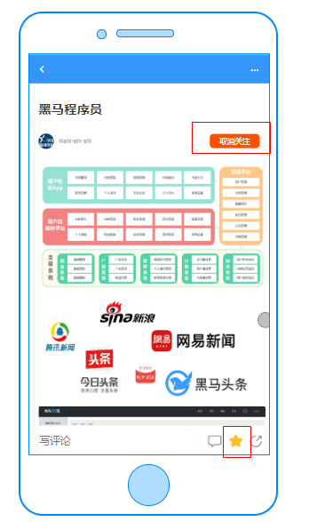

## 小结：

```
今天功能:
	前提:必须登录操作，这个用户行为是作为将来大数据分析的基础，根据用户的行为来分析用户的需求
	记录用户行为
		1、关注行为
			说明:当在文章详情中点击关注按钮的时候，我们要记录当前关注的行为数据信息到ap_follow_behavior表中
			核心:
				1)、在article服务中的关注的逻辑业务中执行发送kafka信息(采用异步的方式进行添加关注行为数据)
				2）、消息内容包含articleId,userId,followId
				3)、在行为微服务中监听当前消息，
					我们根据用户id或者设备id去查询ap_behavior_entity这张表，如果有数据，则新增ap_follow_behavior这张表
			总结:利用了kafka实现异步的操作article服务和behavior微服务
		2、点赞行为
			说明:
				就是在当前行为微服务中展示
				当点击文章详情中的点赞按钮的时候，我们会记录点赞行为到ap_like_behavior表中
				我们要从线程中获取登录用户。
				我们根据用户id或者设备id去查询ap_behavior_entity这张表，如果有数据，
				则根据文章id和行为实体id去查询ap_like_behavior这表数据，如果有数据表示已经点赞过，则修改当前点赞行为的operation的值，0表示点赞，1表示取消点赞 ，反之如果没有数据，新增ap_like_behavior表数据
			核心:	
				点赞行为是在行为微服务中，但是要在app-gateway网关中配置路由行为微服务。
		3、阅读行为
			执行流程和点赞行为一致，注意：封装数据的时候一定要和数据库表字段匹配  ap_read_behavior
		4、不喜欢行为
			执行流程和点赞行为一致,注意：封装数据的时候一定要和数据库表字段匹配  ap_unlike_behavior
		5、收藏行为
			执行流程和点赞行为一致,注意：封装数据的时候一定要和数据库表字段匹配  ap_collection表在article数据库中
			因为当前收藏行为，在article服务中的个人中心中也可以获取到收藏的文章信息。
	文章关系展示
		说明:我们通过去查询记录的一些用户行为来对当前文章详情中的一些按钮进行高亮展示
		核心:
			行为微服务中
			1、根据用户id或者设备id去查询行为实体
			2、根据文章id和行为实体id查询不喜欢的行为数据
			3、根据文章id和行为实体id查询点赞的行为数据
			注:三个接口写完之后，要在article微服务中以feign的形式进行暴露
			用户微服务中
			1、根据当前用户id和作者id查询当前文章是否被关注
			注:这个接口写完之后，也要在article微服务中以feign的形式进行暴露
			文章微服务中
				1、根据行为实体id和文章id去查询当前文章是否被收藏(注:可以只写业务层)的接口
				2、要把当前以上的五个接口在一个统一的主方法中调用
					2.1 输出给前台的信息是{“isfollow”:true,"iscollection":true,"islike",true,"isunlike",true}
					2.2 判断这五个接口返回的实体类，如果不等于null，则把返回的布尔类型的值改为true即可，如果等于null，则返回false即可
```


