# 第十一章 app端评论系统开发

## 目标

- 能够完成对mongodb的环境搭建
- 能够掌握mongodb的基本使用
- 能够完成app端评论的查询、发表、点赞等功能
- 能够完成app端评论回复的查询，发表、点赞功能

## 1 Mongodb

### 1.1Mongodb简介

MongoDB是一个开源、高性能、无模式的文档型数据库

**应用场景：**

- 支持文本查询

- 不需要支持事务，不存在复杂的多表查询

- 存储数据可持久化

- 需要TB甚至 PB 级别数据存储

- 需求变化较快，数据模型无法确认，预计使用快速迭代开发形式

- 需要至少2000以上的读写QPS【高性能】

- 能支持快速水平扩展【高扩展】

- 99.999%高可用【高可用】

### 1.2 Mongodb安装

#### 1.2.1 拉取镜像

```shell
docker pull mongo
```

#### 1.2.2 创建容器

```shell
docker run -di --name=mongo-service -p 27017:27017 -v ~/data/mongodata:/data  --restart=always mongo
```


#### 1.2.3 可视化工具

studio3t是mongodb优秀的客户端工具。官方地址在https://studio3t.com/

下载studio3t

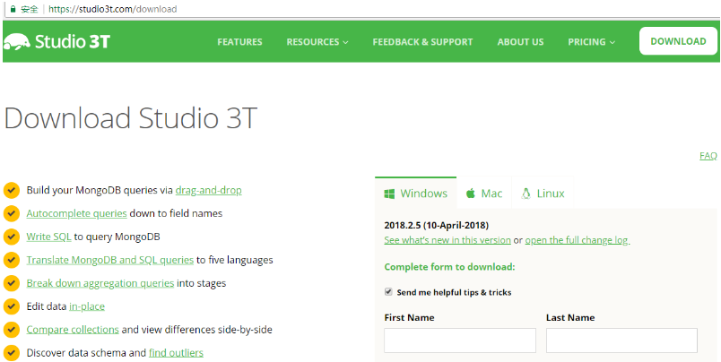

同学不用下载，可以使用资料文件夹中提供好的软件安装即可。

安装并启动

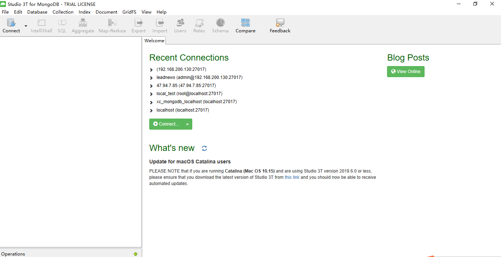

创建连接

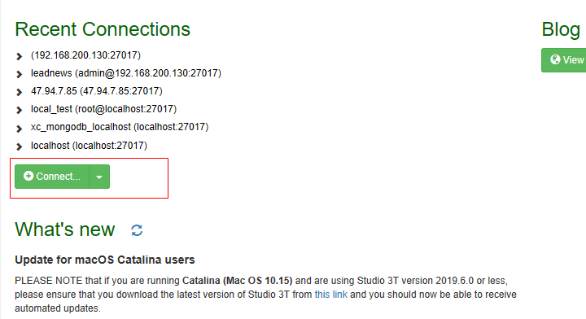

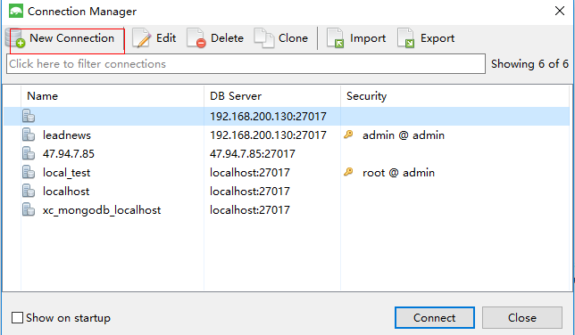

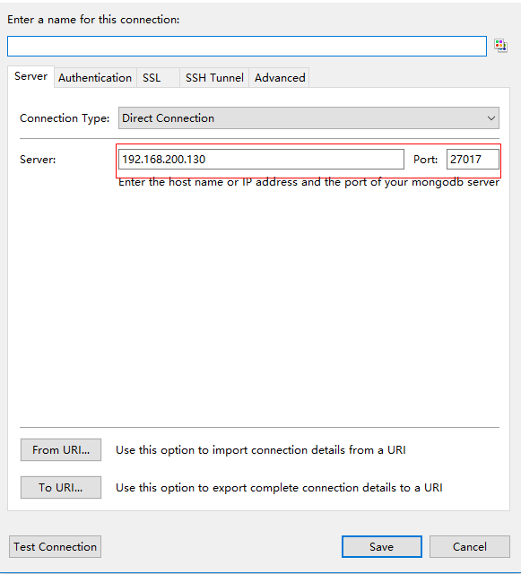

连接成功：

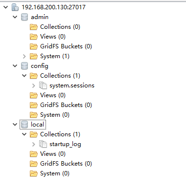

### 1.3 Mongodb快速入门案例

#### 1.3.1 创建项目

创建项目：mongodb-demo

pom文件：

```xml
<groupId>com.itheima</groupId>
<artifactId>mongodb-demo</artifactId>
<version>1.0-SNAPSHOT</version>

<!-- 继承Spring boot -->
<parent>
    <groupId>org.springframework.boot</groupId>
    <artifactId>spring-boot-starter-parent</artifactId>
    <version>2.1.5.RELEASE</version>
</parent>

<dependencies>
    <dependency>
        <groupId>org.springframework.boot</groupId>
        <artifactId>spring-boot-starter-web</artifactId>
    </dependency>
    <dependency>
        <groupId>org.springframework.boot</groupId>
        <artifactId>spring-boot-starter-test</artifactId>
    </dependency>
    <dependency>
        <groupId>org.springframework.boot</groupId>
        <artifactId>spring-boot-starter-data-mongodb</artifactId>
    </dependency>
    <!-- lombok -->
    <dependency>
        <groupId>org.projectlombok</groupId>
        <artifactId>lombok</artifactId>
        <version>1.18.8</version>
    </dependency>
</dependencies>
```

applicaton.yml

```yaml
server:
  port: 9001
spring:
  application:
    name: mongo-demo
```

引导类：

```java
package com.itheima.mongo;

import org.springframework.boot.SpringApplication;
import org.springframework.boot.autoconfigure.SpringBootApplication;

@SpringBootApplication
public class MongoAppliction {

    public static void main(String[] args) {
        SpringApplication.run(MongoAppliction.class,args);
    }
}
```


#### 1.3.2 集成mongodb

创建配置文件mongo.properties

```properties
#主机地址
mongo.host=192.168.200.130
#端口号
mongo.port=27017
#数据库
mongo.dbname=leadnews-comment
```

添加配置，创建类MongoDBconfigure

```java
package com.itheima.mongo.config;

import com.mongodb.MongoClient;
import lombok.Data;
import org.springframework.boot.context.properties.ConfigurationProperties;
import org.springframework.context.annotation.Bean;
import org.springframework.context.annotation.Configuration;
import org.springframework.context.annotation.PropertySource;
import org.springframework.data.mongodb.core.MongoTemplate;
import org.springframework.data.mongodb.core.SimpleMongoDbFactory;

@Data
@Configuration
@PropertySource("classpath:mongo.properties")
@ConfigurationProperties(prefix="mongo")
public class MongoDBconfigure {

    private String host;
    private Integer port;
    private String dbname;

    /**
     * 自己构建MongoTemplate
     * @return
     */
    @Bean
    public MongoTemplate getMongoTemplate() {
        return new MongoTemplate(getSimpleMongoDbFactory());
    }

    /**
     * 如果有用户名和密码也可以通过MongoClient其他构造函数传参
     * @return
     */
    public SimpleMongoDbFactory getSimpleMongoDbFactory() {
        return new SimpleMongoDbFactory(new MongoClient(host, port), dbname);
    }

}
```

#### 1.3.3  实体类准备

实体类准备，添加注解`@Document`与mongodb中的集合对应上

```java
package com.itheima.mongo.pojo;

import lombok.Data;
import org.springframework.data.annotation.Id;
import org.springframework.data.mongodb.core.mapping.Document;

import java.math.BigDecimal;
import java.util.Date;

/**
 * APP评论信息
 */
@Data
@Document("ap_comment")
public class ApComment {

    /**
     * id
     */
    private String id;

    /**
     * 用户ID
     */
    private Integer authorId;

    /**
     * 用户昵称
     */
    private String authorName;

    /**
     * 文章id或动态id
     */
    private Long entryId;

    /**
     * 频道ID
     */
    private Integer channelId;

    /**
     * 评论内容类型
     * 0 文章
     * 1 动态
     */
    private Short type;

    /**
     * 评论内容
     */
    private String content;

    /**
     * 作者头像
     */
    private String image;

    /**
     * 点赞数
     */
    private Integer likes;

    /**
     * 回复数
     */
    private Integer reply;

    /**
     * 文章标记
     * 0 普通评论
     * 1 热点评论
     * 2 推荐评论
     * 3 置顶评论
     * 4 精品评论
     * 5 大V 评论
     */
    private Short flag;

    /**
     * 经度
     */
    private BigDecimal longitude;

    /**
     * 维度
     */
    private BigDecimal latitude;

    /**
     * 地理位置
     */
    private String address;

    /**
     * 评论排列序号
     */
    private Integer ord;

    /**
     * 创建时间
     */
    private Date createdTime;

    /**
     * 更新时间
     */
    private Date updatedTime;

}
```

#### 1.3.4 基本增删改查

创建测试类：

```java
package com.itheima.mongo.test;

import com.itheima.mongo.MongoApplication;
import com.itheima.mongo.pojos.ApComment;
import org.junit.Test;
import org.junit.runner.RunWith;
import org.springframework.beans.factory.annotation.Autowired;
import org.springframework.boot.test.context.SpringBootTest;
import org.springframework.data.domain.PageRequest;
import org.springframework.data.domain.Pageable;
import org.springframework.data.domain.Sort;
import org.springframework.data.mongodb.core.MongoTemplate;
import org.springframework.data.mongodb.core.query.Criteria;
import org.springframework.data.mongodb.core.query.Query;
import org.springframework.data.mongodb.core.query.Update;
import org.springframework.test.context.junit4.SpringRunner;

import java.util.List;

@SpringBootTest(classes = MongoApplication.class)
@RunWith(SpringRunner.class)
public class MongoTest {

    @Autowired
    private MongoTemplate mongoTemplate;

    //添加
    @Test
    public void testCreate() {
        for (int i = 0; i < 10; i++) {
            ApComment apComment = new ApComment();
            apComment.setContent("这是一个评论");
            apComment.setLikes(20+i);
            mongoTemplate.insert(apComment);
        }

    }

    //查询一个
    @Test
    public void testFindOne() {
        ApComment apComment = mongoTemplate.findById("5f7012e03ea2da5788227a6f", ApComment.class);
        System.out.println(apComment);
    }

    //条件查询
    @Test
    public void testQuery() {
//        Query query = Query.query(Criteria.where("_id").is("5f7012e03ea2da5788227a6f"));
        Query query = Query.query(Criteria.where("likes").lt(28));
        query.with(Sort.by(Sort.Direction.DESC,"likes"));
        Pageable pageable = PageRequest.of(1,3);
        query.with(pageable);
        List<ApComment> apComments = mongoTemplate.find(query, ApComment.class);
        System.out.println(apComments);
    }

    //删除
    @Test
    public void testDelete(){
        mongoTemplate.remove(Query.query(Criteria.where("_id").is("5f7012e03ea2da5788227a6f")),ApComment.class);
    }

    //修改
    @Test
    public void testUpdate(){
        Query query = Query.query(Criteria.where("_id").is("5f7015e63ea2da1618d173eb"));
        Update update = new Update().set("content","itcast");
        mongoTemplate.updateMulti(query,update,ApComment.class);
    }

}
```

## 2 app端评论-发表评论

### 2.1 需求分析

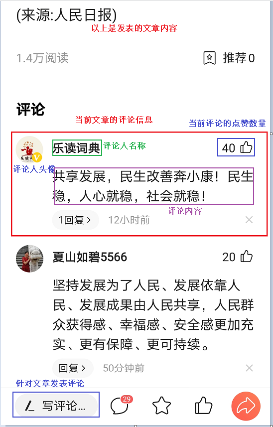


- 文章详情页下方可以查看评论信息，按照点赞数量倒序排列，展示**评论内容、评论的作者、点赞数、回复数、时间**，默认查看20条评论，如果想查看更多，可以点击加载更多进行分页
- 可以针对当前文章发布评论
- 可以针对于某一条评论进行点赞操作

### 2.2 思路分析

#### (1)数据映射

对应实体及注解配置

```java
package com.heima.model.comment.pojos;

import lombok.Data;
import org.springframework.data.mongodb.core.mapping.Document;

import java.math.BigDecimal;
import java.util.Date;

/**
 * APP评论信息
 */
@Data
@Document("ap_comment")
public class ApComment {

    /**
     * id
     */
    private String id;

    /**
     * 用户ID
     */
    private Integer authorId;

    /**
     * 用户昵称
     */
    private String authorName;

    /**
     * 文章id或动态id
     */
    private Long entryId;

    /**
     * 频道ID
     */
    private Integer channelId;

    /**
     * 评论内容类型
     * 0 文章
     * 1 动态
     */
    private Short type;

    /**
     * 评论内容
     */
    private String content;

    /**
     * 作者头像
     */
    private String image;

    /**
     * 点赞数
     */
    private Integer likes;

    /**
     * 回复数
     */
    private Integer reply;

    /**
     * 文章标记
     * 0 普通评论
     * 1 热点评论
     * 2 推荐评论
     * 3 置顶评论
     * 4 精品评论
     * 5 大V 评论
     */
    private Short flag;

    /**
     * 经度
     */
    private BigDecimal longitude;

    /**
     * 维度
     */
    private BigDecimal latitude;

    /**
     * 地理位置
     */
    private String address;

    /**
     * 评论排列序号
     */
    private Integer ord;

    /**
     * 创建时间
     */
    private Date createdTime;

    /**
     * 更新时间
     */
    private Date updatedTime;

}
```

APP评论信息点赞

```java
package com.heima.model.comment.pojos;

import lombok.Data;
import org.springframework.data.mongodb.core.mapping.Document;

/**
 * APP评论信息点赞
 */
@Data
@Document("ap_comment_like")
public class ApCommentLike {

    /**
     * id
     */
    private String id;

    /**
     * 用户ID
     */
    private Integer authorId;

    /**
     * 评论id
     */
    private String commentId;

    /**
     * 0：点赞
     * 1：取消点赞
     */
    private Short operation;
}
```

leadnews-common和leadnews-model中引入

```xml
<!--mongoDB-->
<dependency>
    <groupId>org.springframework.boot</groupId>
    <artifactId>spring-boot-starter-data-mongodb</artifactId>
</dependency>
```


#### (2)思路分析

==根据文章id发表评论，输入内容发表评论，评论内容不能超过140字，评论内容需要做文本垃圾检测==

#### (3)发表评论流程分析

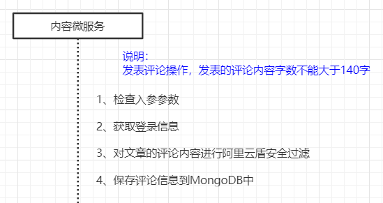

#### (4)评论文档分析

ap_comment文档

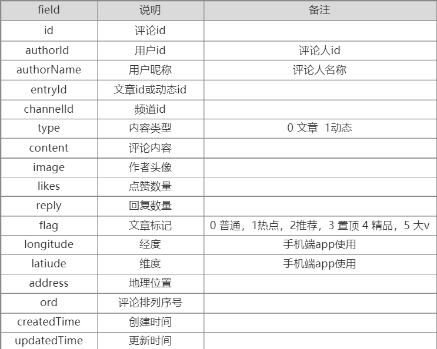

### 2.3 功能实现

#### 2.3.1 搭建评论微服务

（1）创建项目heima-leadnews-comment


（2）pom依赖

```xml
<dependencies>
    <!-- 引入依赖模块 -->
    <dependency>
        <groupId>com.heima</groupId>
        <artifactId>heima-leadnews-model</artifactId>
    </dependency>
    <dependency>
        <groupId>com.heima</groupId>
        <artifactId>heima-leadnews-common</artifactId>
    </dependency>
    <dependency>
        <groupId>com.heima</groupId>
        <artifactId>heima-leadnews-apis</artifactId>
    </dependency>
    <!-- Spring boot starter -->
    <dependency>
        <groupId>org.springframework.boot</groupId>
        <artifactId>spring-boot-starter-web</artifactId>
    </dependency>
    <dependency>
        <groupId>org.springframework.boot</groupId>
        <artifactId>spring-boot-starter-test</artifactId>
        <scope>test</scope>
    </dependency>
    <dependency>
        <groupId>com.alibaba.cloud</groupId>
        <artifactId>spring-cloud-starter-alibaba-nacos-discovery</artifactId>
    </dependency>

    <dependency>
        <groupId>org.springframework.cloud</groupId>
        <artifactId>spring-cloud-starter-openfeign</artifactId>
    </dependency>
</dependencies>
```

（3）application.yml

其中自动配置项去除了关于数据源的配置，因为这个项目不需要查询数据库，查询的mongodb

```yaml
server:
  port: 9006
spring:
  autoconfigure:
    exclude: org.springframework.boot.autoconfigure.jdbc.DataSourceAutoConfiguration,org.springframework.boot.autoconfigure.jdbc.DataSourceTransactionManagerAutoConfiguration
  application:
    name: leadnews-comment
  cloud:
    nacos:
      discovery:
        server-addr: 192.168.200.130:8848
```

（4）集成mongoodb

按照入门案例把mongodb集成到leadnews-common模块中，后面还有其他微服务也会用到

（5）config配置

leadnews-common中定义通用的配置

mongo.properties

```properties
mongo.host=192.168.200.130
mongo.port=27017
mongo.dbname=leadnews-comment
```

配置类：

```java
package com.heima.common.mongo;

import com.mongodb.MongoClient;
import com.mongodb.MongoClientURI;
import lombok.Data;
import org.springframework.boot.context.properties.ConfigurationProperties;
import org.springframework.context.annotation.Bean;
import org.springframework.context.annotation.Configuration;
import org.springframework.context.annotation.PropertySource;
import org.springframework.data.mongodb.core.MongoTemplate;
import org.springframework.data.mongodb.core.SimpleMongoDbFactory;

@Data
@Configuration
@PropertySource("classpath:mongo.properties")
@ConfigurationProperties(prefix="mongo")
public class MongoDBconfigure {

    private String host;
    private Integer port;
    private String dbname;

    @Bean
    public MongoTemplate getMongoTemplate() {
        return new MongoTemplate(getSimpleMongoDbFactory());
    }

    public SimpleMongoDbFactory getSimpleMongoDbFactory() {
        return new SimpleMongoDbFactory(new MongoClient(host, port), dbname);
    }

}
```

（6）引入类

在新创建的leadnews-comment中引入mongo的配置

```java
package com.heima.comment.config;

import org.springframework.context.annotation.ComponentScan;
import org.springframework.context.annotation.Configuration;

@Configuration
@ComponentScan("com.heima.common.mongo")
public class MongoDBConfig {
}
```

#### 2.3.2 其他配置准备

（1）需要使用的jackson的序列化、阿里云安全、接口knife4j、通用异常

如下配置：

```java
package com.heima.commnet.config;

import org.springframework.context.annotation.ComponentScan;
import org.springframework.context.annotation.Configuration;

@Configuration
@ComponentScan({"com.heima.common.jackson","com.heima.common.aliyun","com.heima.common.exception"})
public class InitConfig {
}
```

(2)获取当前登录用户信息

评论必须在登录的情况下才能发布，所以需要验证用户获取用户信息,添加过滤类：

```java
package com.heima.comment.filter;

import com.heima.model.user.pojos.ApUser;
import com.heima.utils.threadlocal.AppThreadLocalUtils;
import org.slf4j.Logger;
import org.slf4j.LoggerFactory;
import org.springframework.core.annotation.Order;
import org.springframework.web.filter.GenericFilterBean;

import javax.servlet.FilterChain;
import javax.servlet.ServletException;
import javax.servlet.ServletRequest;
import javax.servlet.ServletResponse;
import javax.servlet.annotation.WebFilter;
import javax.servlet.http.HttpServletRequest;
import javax.servlet.http.HttpServletResponse;
import java.io.IOException;

@Order(1)
@WebFilter(filterName = "appTokenFilter", urlPatterns = "/*")
public class AppTokenFilter extends GenericFilterBean {

    Logger logger = LoggerFactory.getLogger(AppTokenFilter.class);
    @Override
    public void doFilter(ServletRequest req, ServletResponse res, FilterChain chain) throws IOException, ServletException {
        HttpServletRequest request = (HttpServletRequest) req;
        HttpServletResponse response = (HttpServletResponse) res;
        // 测试和开发环境不过滤
        String userId = request.getHeader("userId");
        //如果userId为0，说明当前设备没有登录
        if(userId!=null && Integer.valueOf(userId).intValue()!=0){
            ApUser apUser = new ApUser();
            apUser.setId(Integer.valueOf(userId));
            AppThreadLocalUtils.setUser(apUser);
        }
        chain.doFilter(req,res);
    }

}
```

需要在引导类中添加注解`@ServletComponentScan`生效

#### 2.3.3 接口定义

```java
package com.heima.apis.comment;

import com.heima.model.comment.dtos.CommentSaveDto;
import com.heima.model.common.dtos.ResponseResult;

public interface CommentControllerApi {

    /**
     * 保存评论
     * @param dto
     * @return
     */
    public ResponseResult saveComment(CommentSaveDto dto);
}
```

发表评论:CommentSaveDto

```java
package com.heima.model.comment.dtos;

import com.heima.model.common.annotation.IdEncrypt;
import lombok.Data;

@Data
public class CommentSaveDto {

    /**
     * 文章id
     */
    @IdEncrypt
    private Long articleId;

    /**
     * 评论内容
     */
    private String content;
}
```

#### 2.3.4 用户微服务远程接口准备

评论中需要查询登录的用户信息，所以需要定义远程feign接口根据用户id获取用户信息

定义apis接口

```java
package com.heima.apis.user;

import com.heima.model.user.pojos.ApUser;

public interface ApUserControllerApi {

    /**
     * 根据id查询app端用户信息
     * @param id
     * @return
     */
    ApUser findUserById(Integer id);
}
```

在user的微服务中新增业务层层接口，mapper在之前已经定义完成

```java
package com.heima.user.service;

import com.baomidou.mybatisplus.extension.service.IService;
import com.heima.model.user.pojos.ApUser;

public interface ApUserService extends IService<ApUser>{
    
}
```

实现类：

```java
package com.heima.user.service.impl;

import com.baomidou.mybatisplus.extension.service.impl.ServiceImpl;
import com.heima.model.user.pojos.ApUser;
import com.heima.user.mapper.ApUserMapper;
import com.heima.user.service.ApUserService;
import org.springframework.stereotype.Service;


@Service
public class ApUserServiceImpl extends ServiceImpl<ApUserMapper, ApUser> implements ApUserService {
    
}
```

控制层：

```java
package com.heima.user.controller.v1;

import com.heima.apis.user.ApUserControllerApi;
import com.heima.model.user.pojos.ApUser;
import com.heima.user.service.ApUserService;
import org.springframework.beans.factory.annotation.Autowired;
import org.springframework.web.bind.annotation.*;

@RestController
@RequestMapping("/api/v1/user")
public class ApUserController implements ApUserControllerApi {

    @Autowired
    private ApUserService apUserService;

    @GetMapping("/{id}")
    @Override
    public ApUser findUserById(@PathVariable("id") Integer id) {
        return apUserService.getById(id);
    }
}
```

在评论微服务中增加feign远程接口

```java
package com.heima.comment.feign;

import com.heima.model.user.pojos.ApUser;
import org.springframework.cloud.openfeign.FeignClient;
import org.springframework.web.bind.annotation.GetMapping;
import org.springframework.web.bind.annotation.PathVariable;

@FeignClient("leadnews-user")
public interface UserFeign {

    @GetMapping("/api/v1/user/{id}")
    ApUser findUserById(@PathVariable("id") Long id);
}
```

#### 2.3.5 业务层

业务层接口：

```java
package com.heima.comment.service;

import com.heima.model.comment.dtos.CommentSaveDto;
import com.heima.model.common.dtos.ResponseResult;

public interface CommentService {

    /**
     * 保存评论
     * @return
     */
    public ResponseResult saveComment(CommentSaveDto dto);

}
```

实现类：

```java
package com.heima.comment.service.impl;

import com.heima.comment.feign.UserFeign;
import com.heima.comment.service.CommentService;
import com.heima.model.comment.dtos.CommentSaveDto;
import com.heima.model.comment.pojos.ApComment;
import com.heima.model.common.dtos.ResponseResult;
import com.heima.model.common.enums.AppHttpCodeEnum;
import com.heima.model.user.pojos.ApUser;
import com.heima.utils.threadlocal.AppThreadLocalUtils;
import org.springframework.beans.factory.annotation.Autowired;
import org.springframework.data.mongodb.core.MongoTemplate;
import org.springframework.stereotype.Service;

import java.util.*;

@Service
public class CommentServiceImpl implements CommentService {

    @Autowired
    private MongoTemplate mongoTemplate;

    @Autowired
    private UserFeign userFeign;

    @Override
    public ResponseResult saveComment(CommentSaveDto dto) {
        //1.检查参数
        if (dto.getArticleId() == null) {
            return ResponseResult.errorResult(AppHttpCodeEnum.PARAM_REQUIRE);
        }
        if (dto.getContent() != null && dto.getContent().length() > 140) {
            return ResponseResult.errorResult(AppHttpCodeEnum.PARAM_REQUIRE, "评论内容不能超过140字");
        }

        //2.判断是否登录
        ApUser user = AppThreadLocalUtils.getUser();
        if (user == null) {
            return ResponseResult.errorResult(AppHttpCodeEnum.NEED_LOGIN);
        }

        //3.安全过滤,自行实现

        //4.保存评论
        ApUser apUser = userFeign.findUserById(user.getId().longValue());
        if (apUser == null) {
            return ResponseResult.errorResult(AppHttpCodeEnum.PARAM_REQUIRE, "当前登录信息有误");
        }
        ApComment apComment = new ApComment();
        apComment.setAuthorId(apUser.getId());
        apComment.setAuthorName(apUser.getName());
        apComment.setContent(dto.getContent());
        apComment.setEntryId(dto.getArticleId());
        apComment.setCreatedTime(new Date());
        apComment.setUpdatedTime(new Date());
        apComment.setImage(apUser.getImage());
        apComment.setLikes(0);
        apComment.setReply(0);
        apComment.setType((short) 0);
        apComment.setFlag((short) 0);
        mongoTemplate.insert(apComment);

        return ResponseResult.okResult(AppHttpCodeEnum.SUCCESS);
    }
}
```

#### 2.3.6 控制层

评论控制器

```java
package com.heima.comment.controller.v1;

import com.heima.apis.comment.CommentControllerApi;
import com.heima.comment.service.CommentService;
import com.heima.model.comment.dtos.CommentSaveDto;
import com.heima.model.common.dtos.ResponseResult;
import org.springframework.beans.factory.annotation.Autowired;
import org.springframework.web.bind.annotation.PostMapping;
import org.springframework.web.bind.annotation.RequestBody;
import org.springframework.web.bind.annotation.RequestMapping;
import org.springframework.web.bind.annotation.RestController;

@RestController
@RequestMapping("/api/v1/comment")
public class CommentController implements CommentControllerApi {

    @Autowired
    private CommentService commentService;

    @PostMapping("/save")
    @Override
    public ResponseResult saveComment(@RequestBody CommentSaveDto dto){
        return commentService.saveComment(dto);
    }

}
```

#### 2.3.7 配置网关

修改heima-leadnews-app-gateway网关微服务中的application.yml，新增评论微服务路由配置

```yaml
#行为微服务
- id: leadnews-comment
uri: lb://leadnews-comment
predicates:
- Path=/comment/**
filters:
- StripPrefix= 1
```

#### 2.3.8 测试

使用postman来测试

## 3 app端评论-点赞评论

### 3.1 需求分析


用户点赞，可以增加点赞数量，点赞后不仅仅要增加点赞数，需要记录当前用户对于当前评论的数据记录

​	用户取消点赞，点赞减一，更新点赞数据


#### 点赞评论文档分析：

ap_comment_like文档

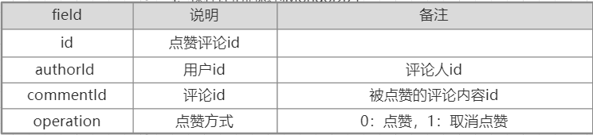

#### 点赞评论流程分析：

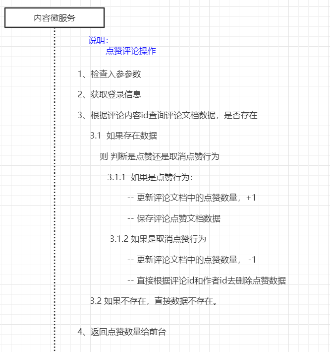

### 3.2 功能实现

#### 3.2.1 接口定义

CommentControllerApi添加方法

```java
/**
     * 点赞某一条评论
     * @param dto
     * @return
     */
public ResponseResult like(CommentLikeDto dto);
```

用户点赞:CommentLikeDto

```java
package com.heima.model.comment.dtos;

import lombok.Data;

@Data
public class CommentLikeDto {

    /**
     * 评论id
     */
    private String commentId;

    /**
     * 0：点赞
     * 1：取消点赞
     */
    private Short operation;
}
```

#### 3.2.2 业务层

业务层接口：CommentService

```java
/**
     * 点赞评论
     * @param dto
     * @return
     */
public ResponseResult like(CommentLikeDto dto);
```

实现类：

```java
@Override
public ResponseResult like(CommentLikeDto dto) {
    //1.检查参数
    if (dto.getCommentId() == null) {
        return ResponseResult.errorResult(AppHttpCodeEnum.PARAM_REQUIRE);
    }

    //2.判断是否登录
    ApUser user = AppThreadLocalUtils.getUser();
    if (user == null) {
        return ResponseResult.errorResult(AppHttpCodeEnum.NEED_LOGIN);
    }

    //3.点赞操作
    ApComment apComment = mongoTemplate.findById(dto.getCommentId(), ApComment.class);
    if (apComment != null && dto.getOperation() == 0) {
        //更新评论的点赞数量
        apComment.setLikes(apComment.getLikes() + 1);
        mongoTemplate.save(apComment);

        //保存 APP评论信息点赞
        ApCommentLike apCommentLike = new ApCommentLike();
        apCommentLike.setAuthorId(user.getId());
        apCommentLike.setCommentId(apComment.getId());
        //            apCommentLike.setOperation(dto.getOperation());
        mongoTemplate.save(apCommentLike);
    } else if (apComment != null && dto.getOperation() == 1) {
        //4.取消点赞
        //更新评论的点赞数量
        apComment.setLikes(apComment.getLikes() < 0 ? 0 : apComment.getLikes() - 1);
        mongoTemplate.save(apComment);
        //更新 APP评论信息点赞
        mongoTemplate.remove(Query.query(Criteria.where("authorId").is(user.getId()).and("commentId").is(apComment.getId())),ApCommentLike.class);
        /*Query query = Query.query(Criteria.where("authorId").is(user.getId()).and("commentId").is(apComment.getId()));
            ApCommentLike apCommentLike = mongoTemplate.findOne(query, ApCommentLike.class);
            if(apCommentLike != null){
                apCommentLike.setOperation(dto.getOperation());
            }
            mongoTemplate.save(apCommentLike);*/
    }

    //5.数据返回
    Map<String, Object> resultMap = new HashMap<>();
    resultMap.put("likes",apComment.getLikes());
    return ResponseResult.okResult(resultMap);
}
```

#### 3.2.3 控制层

评论控制器CommentController

```java
@PostMapping("/like")
@Override
public ResponseResult like(@RequestBody CommentLikeDto dto){
    return commentService.like(dto);
}
```

#### 3.2.4 测试

使用postmen来测试

## 4 app端评论-评论列表

### 4.1 需求分析

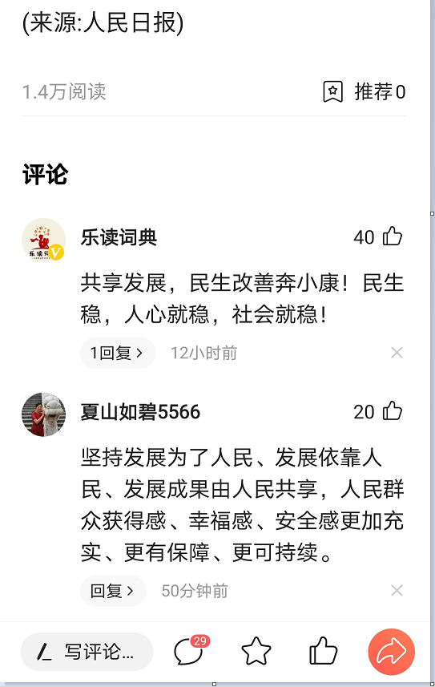

查询评论列表，根据当前文章id进行检索，按照点赞数量倒序，分页查询（默认20条数据）

####  评论列表展示流程分析

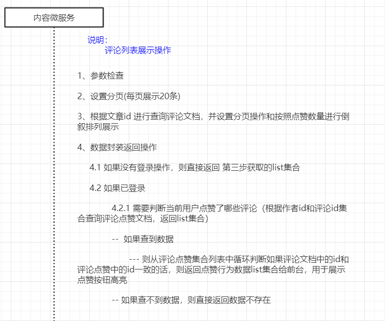

### 4.2 功能实现

#### 4.2.1 接口定义

在CommentControllerApi接口中新增查询评论的方法

```java
/**
     * 查询评论
     * @param dto
     * @return
     */
public ResponseResult findByArticleId(CommentDto dto);
```

查询评论列表:CommentDto

```java
package com.heima.model.comment.dtos;

import com.heima.model.common.annotation.IdEncrypt;
import lombok.Data;

import java.util.Date;

@Data
public class CommentDto {

    /**
     * 文章id
     */
    @IdEncrypt
    private Long articleId;

    /**
     * 显示条数
     */
    private Integer size;

    // 最小点赞数
    private Long minLikes;

}
```

#### 4.2.2 业务层

业务层接口：

修改CommentService业务层接口，添加方法

```java
/**
     * 根据文章id查询评论列表
     * @return
     */
public ResponseResult findByArticleId(CommentDto dto);
```


登录后封装数据的vo

```java
package com.heima.model.comment.vo;

import com.heima.model.comment.pojos.ApComment;
import lombok.Data;

@Data
public class ApCommentVo extends ApComment {

    /**
     * 0：点赞
     * 1：取消点赞
     */
    private Short operation;
}
```


实现类：

```java
@Override
public ResponseResult findByArticleId(CommentDto dto) {
    //1.检查参数
    if(dto.getArticleId() == null){
        return ResponseResult.errorResult(AppHttpCodeEnum.PARAM_REQUIRE);
    }
    if(dto.getSize() == null || dto.getSize() == 0){
        dto.setSize(20);
    }

    //2.按照文章id过滤，设置分页和排序
    Query query = Query.query(Criteria.where("entryId").is(dto.getArticleId()).and("likes").lt(dto.getMinLikes()));
    query.limit(dto.getSize()).with(Sort.by(Sort.Direction.DESC,"likes"));
    List<ApComment> list = mongoTemplate.find(query, ApComment.class);

    //3.数据封装返回
    //3.1 用户未登录 加载数据
    ApUser user = AppThreadLocalUtils.getUser();
    if(user== null){
        return ResponseResult.okResult(list);
    }

    //3.2 用户已登录，加载数据，需要判断当前用户点赞了哪些评论
    List<String> idList = list.stream().map(x -> x.getId()).collect(Collectors.toList());
    Query query1 = Query.query(Criteria.where("commentId").in(idList).and("authorId").is(user.getId()));
    List<ApCommentLike> apCommentLikes = mongoTemplate.find(query1, ApCommentLike.class);

    List<ApCommentVo> resultList = new ArrayList<>();

    if(apCommentLikes != null){

        list.stream().forEach(x->{
            ApCommentVo apCommentVo = new ApCommentVo();
            BeanUtils.copyProperties(x,apCommentVo);
            for (ApCommentLike apCommentLike : apCommentLikes) {
                if(x.getId().equals(apCommentLike.getCommentId())){
                    apCommentVo.setOperation((short)0);
                    break;
                }
            }
            resultList.add(apCommentVo);
        });
    }

    return ResponseResult.okResult(resultList);
}
```

#### 4.2.3 控制层

评论控制器，修改CommentController添加方法

```java
@PostMapping("/load")
@Override
public ResponseResult findByArticleId(@RequestBody CommentDto dto){
    return commentService.findByArticleId(dto);
}
```

#### 4.2.4 测试

使用postmen来测试

## 5 app端评论回复-发表回复、点赞回复、回复列表

### 5.1 需求分析

发表回复：

​	点击每个评论的下方的回复按钮即可进行发表回复信息

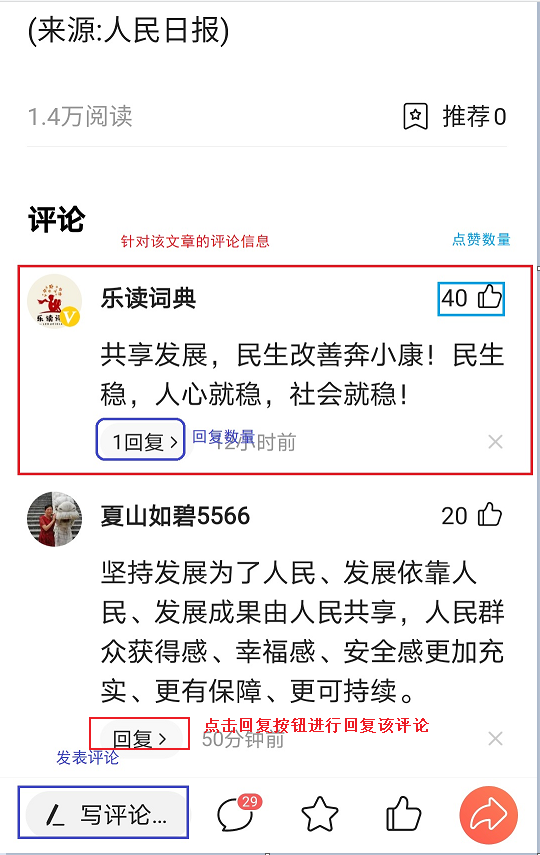

查看回复列表信息：

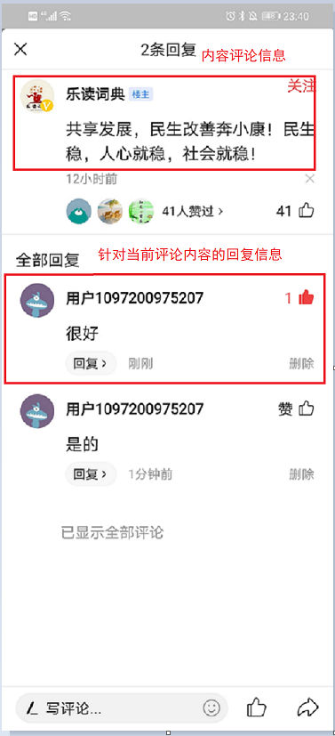

点赞回复：

​	在当前评论的回复列表中的每一个回复中都可以进行点赞行为的操作


- 当用户点击了评论中的**回复**就可以查看所有评论回复内容

- 可以针对当前评论进行回复，需要更新评论的回复数量

- 可以对当前评论回复列表进行点赞操作，同时记录当前回复评论点赞信息

### 5.2 思路分析

（1）数据实体

操作数据实体为mongodb中的集合，评论回复集合是ap_comment_repay，需要在studo3t中创建该集合

对应实体类为：

```java
package com.heima.model.comment.pojos;

import lombok.Data;
import org.springframework.data.annotation.Id;
import org.springframework.data.mongodb.core.mapping.Document;

import java.math.BigDecimal;
import java.util.Date;

/**
 * APP评论回复信息
 */
@Data
@Document("ap_comment_repay")
public class ApCommentRepay {
    /**
     * id
     */
    @Id
    private String id;

    /**
     * 用户ID
     */
    private Integer authorId;

    /**
     * 用户昵称
     */
    private String authorName;

    /**
     * 评论id
     */
    private String commentId;

    /**
     * 回复内容
     */
    private String content;

    /**
     * 点赞数
     */
    private Integer likes;

    /**
     * 经度
     */
    private BigDecimal longitude;

    /**
     * 维度
     */
    private BigDecimal latitude;

    /**
     * 地理位置
     */
    private String address;

    /**
     * 创建时间
     */
    private Date createdTime;

    /**
     * 更新时间
     */
    private Date updatedTime;

}
```

APP评论回复信息点赞信息

```java
package com.heima.model.comment.pojos;


import lombok.Data;
import org.springframework.data.mongodb.core.mapping.Document;

/**
 * APP评论回复信息点赞信息
 */
@Data
@Document("ap_comment_repay_like")
public class ApCommentRepayLike {

    /**
     * id
     */
    private String id;

    /**
     * 用户ID
     */
    private Integer authorId;

    /**
     * 评论id
     */
    private String commentRepayId;

    /**
     * 0：点赞
     * 1：取消点赞
     */
    private Short operation;
}
```


（2）思路分析：

1，用户点击**回复**，根据当前评论id查询对应的所有回复进行展示

2，用户针对于当前的评论进行了回复，需要保存数据，同时需要更新当前评论的回复数

3，可以对回复列表进行点赞操作

### 5.3 功能实现

(1)接口定义

```java
package com.heima.apis.comment;

import com.heima.model.comment.dtos.CommentRepayDto;
import com.heima.model.comment.dtos.CommentRepayLikeDto;
import com.heima.model.comment.dtos.CommentRepaySaveDto;
import com.heima.model.common.dtos.ResponseResult;
import org.springframework.web.bind.annotation.PostMapping;
import org.springframework.web.bind.annotation.RequestBody;

public interface CommentRepayControllerApi {

    /**
     * 加载评论回复列表
     * @param dto
     * @return
     */
    public ResponseResult loadCommentRepay(CommentRepayDto dto);

    /**
     * 保存回复内容
     * @param dto
     * @return
     */
    public ResponseResult saveCommentRepay(CommentRepaySaveDto dto);

    /**
     * 点赞回复内容
     * @param dto
     * @return
     */
    public ResponseResult saveCommentRepayLike(CommentRepayLikeDto dto);
}
```

加载评论回复列表参数：CommentRepayDto

```java
package com.heima.model.comment.dtos;

import lombok.Data;

import java.util.Date;

@Data
public class CommentRepayDto {

    /**
     * 评论id
     */
    private String commentId;

    private Integer size;

    // 最小时间
    private Long minLikes;
}
```

保存回复内容参数：CommentRepaySaveDto

```java
package com.heima.model.comment.dtos;

import lombok.Data;

@Data
public class CommentRepaySaveDto {

    /**
     * 评论id
     */
    private String commentId;

    /**
     * 回复内容
     */
    private String content;
}
```

点赞回复内容参数：CommentRepayLikeDto

```java
package com.heima.model.comment.dtos;

import lombok.Data;

@Data
public class CommentRepayLikeDto {

    /**
     * 回复id
     */
    private String commentRepayId;

    /**
     * 0：点赞
     * 1：取消点赞
     */
    private Short operation;
}
```

(2) 业务层

评论回复业务层接口

```java
package com.heima.comment.service;

import com.heima.model.comment.dtos.CommentRepayDto;
import com.heima.model.comment.dtos.CommentRepayLikeDto;
import com.heima.model.comment.dtos.CommentRepaySaveDto;
import com.heima.model.common.dtos.ResponseResult;

/**
 * 评论回复
 */
public interface CommentRepayService {

    /**
     * 查看更多回复内容
     * @param dto
     * @return
     */
    public ResponseResult loadCommentRepay(CommentRepayDto dto);

    /**
     * 保存回复
     * @return
     */
    public ResponseResult saveCommentRepay(CommentRepaySaveDto dto);

    /**
     * 点赞回复的评论
     * @param dto
     * @return
     */
    public ResponseResult saveCommentRepayLike(CommentRepayLikeDto dto);
}
```


加载评论回复列表数据封装类

```java
package com.heima.model.comment.vo;

import com.heima.model.comment.pojos.ApCommentRepay;
import lombok.Data;

@Data
public class ApCommentRepayVo extends ApCommentRepay {

    /**
     * 0：点赞
     * 1：取消点赞
     */
    private Short operation;
}
```


实现类

```java
package com.heima.comment.service.impl;

import com.heima.comment.feign.UserFeign;
import com.heima.comment.service.CommentRepayService;
import com.heima.model.comment.dtos.CommentRepayDto;
import com.heima.model.comment.dtos.CommentRepayLikeDto;
import com.heima.model.comment.dtos.CommentRepaySaveDto;
import com.heima.model.comment.pojos.ApComment;
import com.heima.model.comment.pojos.ApCommentLike;
import com.heima.model.comment.pojos.ApCommentRepay;
import com.heima.model.comment.pojos.ApCommentRepayLike;
import com.heima.model.comment.vo.ApCommentRepayVo;
import com.heima.model.common.dtos.ResponseResult;
import com.heima.model.common.enums.AppHttpCodeEnum;
import com.heima.model.user.pojos.ApUser;
import com.heima.utils.threadlocal.AppThreadLocalUtils;
import lombok.extern.log4j.Log4j2;
import org.springframework.beans.BeanUtils;
import org.springframework.beans.factory.annotation.Autowired;
import org.springframework.data.domain.Sort;
import org.springframework.data.mongodb.core.MongoTemplate;
import org.springframework.data.mongodb.core.query.Criteria;
import org.springframework.data.mongodb.core.query.Query;
import org.springframework.stereotype.Service;

import java.util.*;
import java.util.stream.Collectors;

@Service
@Log4j2
public class CommentRepayServiceImpl implements CommentRepayService {

    @Autowired
    private MongoTemplate mongoTemplate;

    @Autowired
    private UserFeign userFeign;

    @Override
    public ResponseResult loadCommentRepay(CommentRepayDto dto) {
        //1.检查参数
        if(dto.getCommentId() == null){
            return ResponseResult.errorResult(AppHttpCodeEnum.PARAM_REQUIRE);
        }
        if(dto.getSize() == null || dto.getSize() == 0){
            dto.setSize(20);
        }

        //2.按照文章id过滤，设置分页和排序
        Query query = Query.query(Criteria.where("commentId").is(dto.getCommentId()).and("likes").lt(dto.getMinLikes()));
        query.limit(dto.getSize()).with(Sort.by(Sort.Direction.DESC,"likes"));
        List<ApCommentRepay> list = mongoTemplate.find(query, ApCommentRepay.class);

        //3.数据封装返回
        //3.1 用户未登录 加载数据
        ApUser user = AppThreadLocalUtils.getUser();
        if(user== null){
            return ResponseResult.okResult(list);
        }

        //3.2 用户已登录，加载数据，需要判断当前用户点赞了哪些评论
        List<String> idList = list.stream().map(x -> x.getId()).collect(Collectors.toList());
        Query query1 = Query.query(Criteria.where("commentRepayId").in(idList).and("authorId").is(user.getId()));
        List<ApCommentRepayLike> apCommentRepayLikes = mongoTemplate.find(query1, ApCommentRepayLike.class);

        List<ApCommentRepayVo> resultList = new ArrayList<>();

        if(apCommentRepayLikes != null){

            list.stream().forEach(x->{
                ApCommentRepayVo apCommentRepayVo = new ApCommentRepayVo();
                BeanUtils.copyProperties(x,apCommentRepayVo);
                for (ApCommentRepayLike apCommentRepayLike  : apCommentRepayLikes) {
                    if(x.getId().equals(apCommentRepayLike.getCommentRepayId())){
                        apCommentRepayVo.setOperation((short)0);
                        break;
                    }
                }
                resultList.add(apCommentRepayVo);
            });
        }

        return ResponseResult.okResult(resultList);
    }

    @Override
    public ResponseResult saveCommentRepay(CommentRepaySaveDto dto) {
        //1.检查参数
        if (dto.getCommentId() == null) {
            return ResponseResult.errorResult(AppHttpCodeEnum.PARAM_REQUIRE);
        }
        if (dto.getContent() != null && dto.getContent().length() > 140) {
            return ResponseResult.errorResult(AppHttpCodeEnum.PARAM_REQUIRE, "评论内容不能超过140字");
        }

        //2.判断是否登录
        ApUser user = AppThreadLocalUtils.getUser();
        if (user == null) {
            return ResponseResult.errorResult(AppHttpCodeEnum.NEED_LOGIN);
        }

        //3.安全过滤,自行实现

        //4.保存评论
        ApUser apUser = userFeign.findUserById(user.getId().longValue());
        if (apUser == null) {
            return ResponseResult.errorResult(AppHttpCodeEnum.PARAM_REQUIRE, "当前登录信息有误");
        }
        ApCommentRepay apCommentRepay = new ApCommentRepay();
        apCommentRepay.setAuthorId(apUser.getId());
        apCommentRepay.setAuthorName(apUser.getName());
        apCommentRepay.setContent(dto.getContent());
        apCommentRepay.setCommentId(dto.getCommentId());
        apCommentRepay.setCreatedTime(new Date());
        apCommentRepay.setUpdatedTime(new Date());
        apCommentRepay.setLikes(0);
        mongoTemplate.insert(apCommentRepay);

        //更新评论的回复数量
        ApComment apComment = mongoTemplate.findById(dto.getCommentId(), ApComment.class);
        apComment.setReply(apComment.getReply() + 1);
        mongoTemplate.save(apComment);

        return ResponseResult.okResult(AppHttpCodeEnum.SUCCESS);
    }

    @Override
    public ResponseResult saveCommentRepayLike(CommentRepayLikeDto dto) {
        //1.检查参数
        if (dto.getCommentRepayId() == null) {
            return ResponseResult.errorResult(AppHttpCodeEnum.PARAM_REQUIRE);
        }

        //2.判断是否登录
        ApUser user = AppThreadLocalUtils.getUser();
        if (user == null) {
            return ResponseResult.errorResult(AppHttpCodeEnum.NEED_LOGIN);
        }

        //3.点赞操作
        ApCommentRepay apCommentRepay = mongoTemplate.findById(dto.getCommentRepayId(), ApCommentRepay.class);
        if (apCommentRepay != null && dto.getOperation() == 0) {
            //更新评论的点赞数量
            apCommentRepay.setLikes(apCommentRepay.getLikes() + 1);
            mongoTemplate.save(apCommentRepay);

            //保存 APP评论信息点赞
            ApCommentRepayLike apCommentLike = new ApCommentRepayLike();
            apCommentLike.setAuthorId(user.getId());
            apCommentLike.setCommentRepayId(apCommentRepay.getId());
            apCommentLike.setOperation(dto.getOperation());
            mongoTemplate.save(apCommentLike);
        } else if (apCommentRepay != null && dto.getOperation() == 1) {
            //4.取消点赞
            //更新评论的点赞数量
            apCommentRepay.setLikes(apCommentRepay.getLikes() < 0 ? 0 : apCommentRepay.getLikes() - 1);
            mongoTemplate.save(apCommentRepay);
            //更新 APP评论信息点赞
            mongoTemplate.remove(Query.query(Criteria.where("authorId").is(user.getId()).and("commentRepayId").is(apCommentRepay.getId())), ApCommentRepayLike.class);
            /*Query query = Query.query(Criteria.where("authorId").is(user.getId()).and("commentRepayId").is(apCommentRepay.getId()));
            ApCommentRepayLike apCommentLike = mongoTemplate.findOne(query, ApCommentRepayLike.class);
            apCommentLike.setOperation(dto.getOperation());
            mongoTemplate.save(apCommentLike);*/
        }

        //5.数据返回
        Map<String, Object> resultMap = new HashMap<>();
        resultMap.put("likes",apCommentRepay.getLikes());
        return ResponseResult.okResult(resultMap);
    }
}
```

(3)控制器

```java
package com.heima.comment.controller.v1;


import com.heima.apis.comment.CommentRepayControllerApi;
import com.heima.comment.service.CommentRepayService;
import com.heima.model.comment.dtos.CommentRepayDto;
import com.heima.model.comment.dtos.CommentRepayLikeDto;
import com.heima.model.comment.dtos.CommentRepaySaveDto;
import com.heima.model.common.dtos.ResponseResult;
import org.springframework.beans.factory.annotation.Autowired;
import org.springframework.web.bind.annotation.PostMapping;
import org.springframework.web.bind.annotation.RequestBody;
import org.springframework.web.bind.annotation.RequestMapping;
import org.springframework.web.bind.annotation.RestController;

@RestController
@RequestMapping("/api/v1/comment_repay")
public class CommentRepayController  implements CommentRepayControllerApi {

    @Autowired
    private CommentRepayService commentRepayService;

    @PostMapping("/load")
    @Override
    public ResponseResult loadCommentRepay(@RequestBody CommentRepayDto dto){
        return commentRepayService.loadCommentRepay(dto);
    }

    @PostMapping("/save")
    @Override
    public ResponseResult saveCommentRepay(@RequestBody CommentRepaySaveDto dto){
        return commentRepayService.saveCommentRepay(dto);
    }

    @PostMapping("/like")
    @Override
    public ResponseResult saveCommentRepayLike(@RequestBody CommentRepayLikeDto dto){
        return commentRepayService.saveCommentRepayLike(dto);
    }

}
```

