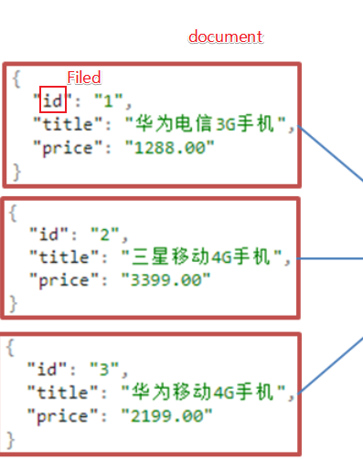
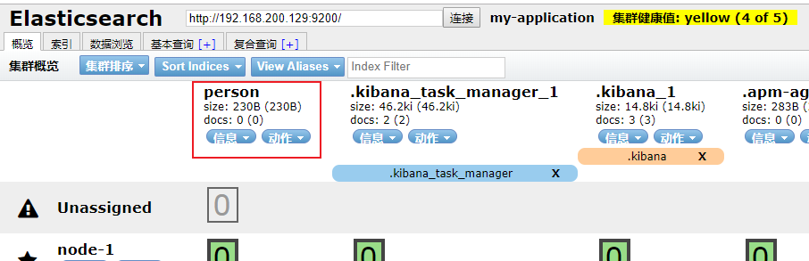

# ElasticSearch第一天课堂笔记

## 今日内容

- 认识和安装ES
- ES的使用
- Java操作ES

## 0、反馈


## 1、上节回顾

```properties
1、docker的内容
	1、镜像方面
		docker images;
		docker search 镜像名称
		docker pull 镜像名称
		docker rmi 镜像
	2、容器方面
		docker ps 查看正在运行的容器
		docker ps -a 查看所有的容器
		docker inspect 容器名称    查看容器信息
		docker rm 容器名称/容器ID
		docker stop|status|restart|start 容器名称（容器id）
		如果说当前docker是出于正在运行的状态，如果再次使用start命令的话，还是会执行，但是一般情况下要先查看docker容器的状态
		
		
		交互式容器
		docker run -it --name=容器名称 镜像名称 /bin/bash  进入容器内部，执行exit退出则停止容器
		守护式容器
		docker run -di --name=容器名称 镜像名称   不会进入容器内部
		#进入容器内部
		docker exec -it 容器名称 /bin/bash
		
		目录挂载（数据卷）  -v
		在创建容器的时候执行目录挂载
		docker run -di --name=容器名称 -v 宿主机的目录(/root/data):docker容器内部的目录 镜像名称 /bin/bash
目录挂载的好处：
	为什么要执行目录挂载：
		docker容器和window系统没有办法进行通信，而且docker容器中还是不能使用vim命令，就是没有办法在当前docker容器中去创建文件，添加文件内容。所以我们要通过linux系统进行关联文件
	好处：
		就是可以通过linux中关联docker容器中的目录，进行挂载，当linux中指定的目录中文件发生改变的时候，那么docker容器中相关的目录中的文件也会进行同步。
	
	
		端口映射
		tomcat应用部署
			docker pull tomcat
			docker run -di --name=tomcat -p 3307:3306 镜像名称  /bin/bash
	解析: -p表示端口号映射的关键字
		冒号之后的端口号是当前docker容器的默认端口号
		冒号之前的端口是当前docker容器映射到宿主机上的端口号
			
		
		dockerfile 文件
			容器转镜像
				docker  commit 容器id  新的镜像名称:版本号
			把新的镜像转成压塑包
				docker save -o 压缩文件名称 新的镜像名称:版本号
			把压缩文件转成镜像
				docker load -i 压缩文件名称
	3、docker方面
    	systemctl status docker 
    	systemctl start|stop|status|restart docker
    防火墙方面
    	systemctl status firewalld.service
    	systemctl stop|start firewalld.service
```

## 2、认识和安装ES(了解)

数据库查询问题

```
1、查询慢
2、查询范围比较小
3、造成数据库压力大
```

ElasticSearch搜索引擎

```properties
生活化的例子：
	正向索引:
		专业术语：由诗名--->诗句--->拆分出要的字或者词
		生活化:宋晓峰---->“啊，此时此刻我想吟诗一首”---->拆分出“诗”这个词
	倒排索引：
		专业术语:由具体的词或者字----->诗句----->所属的诗名
		生活化:诗这个词----->"啊，此时此刻我想吟诗一首"---->宋晓峰

搜索引擎这个技术中，不仅仅只包含了es,还包含solr，lucene
	搜索引擎的底层是lucene
	上层的是solr和es
	solr和es的区别：
		都可以完成搜索功能
		es是一个近实时的搜索引擎
		solr的延迟性比较高
		
全文检索别名叫索引库，还叫nosql的数据库


1、使用ES完全可以克服使用数据库产生的问题
2、搜索速度很快
	内部采用的是倒排索引(反向索引)
		正向索引:是根据被搜索的内容题，然后去找对应的词
		反向索引:直接根据对应的词去找搜索的内容
3、ES的存储
	可以认为ES也是一个数据库，是一个非关系型数据库
	ES内部的数据是以json格式存储
	ES的别名叫索引库
	ES的内部结构
		document(文档)---->mysql中每一行数据
		mapping(映射)----->可以好比喻mysql中的约束(外键，主键，等等)
		Field(字段) json中的document的k值-----> 数据库表中的字段名称
		type类型(Filed字段的类型)  ---->mysql中字段的类型
		index(索引)   ---->mysql数据库中的索引
```



## 3、ES的使用(掌握)

### 支持RestFul风格，特点：

```
支持HTTP协议
内置了请求方式
	PUT:用来更新资源document
	POST:新建资源document
	DELETE:用来删除资源document
	GET:用来获取资源document
可以在请求路径中加入参数
	http://192.168.200.129:9200/itheim/{id}
```

### 操作ES:

#### 方式一、使用PostMan工具

1、创建索引：

```SHELL
 #PUT http://ip地址:端口号/索引名称
 PUT http://192.168.200.129:9200/person
 #执行之后的结果
 {
    "acknowledged": true,
    "shards_acknowledged": true,
    "index": "person"
}
```

结果查看：head插件看




2、查询索引

```shell
GET http://192.168.200.129:9200/person
#语法：
GET http://ip:端口/索引名称  # 查询单个索引信息
GET http://ip:端口/索引名称1,索引名称2...  # 查询多个索引信息
GET http://ip:端口/_all  # 查询所有索引信息
```

3、删除索引

```SHELL
#语法:
DELETE http://ip:端口/索引名称

DELETE http://192.168.200.129:9200/person
```

#### 方式二、使用kibana工具

##### 1、操作索引

```shell
#创建索引
PUT person1

#查询索引
GET person  #person索引名称
GET person1

#删除索引
DELETE person1

#关闭person索引
POST person/_close

#开启person索引
POST person/_open
```

##### 2、映射操作

2-1 在已经创建好的索引的基础之上添加映射

```shell
GET person

#添加映射  _mapping是映射关键字
PUT person/_mapping
 {
   "properties":{
     "name":{
       "type":"text"
     },
     "age":{
       "type":"integer"
    }
   }
 }
```

2-2 在创建索引的同时添加映射

```shell
GET persion1

#创建索引并添加映射
PUT persion1
{
  "mappings": {
    "properties": {
      "name": {
        "type": "text"
      },
      "age": {
        "type": "integer"
      }
    }
  }
}
```

2-3 在映射中添加字段filed

```shell
GET persion1

#在索引person1中添加filed字段
#添加的字段会直接覆盖当前索引库中的字段filed
#如果说使用elasticsearch-head插件则会自动在原来的基础之上加入额外的filed,但是如果说添加的filed名称相同则不可以
PUT persion1/_mapping
{
  "properties": {
      
      "phone": {
        "type": "long"
      }
    }
}
```

##### 3、操作文档document

```shell
#根据id进行查询
GET person/_doc/GDCKTXQB4R58sjZ_Gvrk

#指定id去添加文档
POST person/_doc/1
{
  "name":"张三",
  "age":18
}

#不指定id去添加文档,会自动生成一个随机ID   _doc表示document
POST person/_doc
{
  "name":"李四",
  "age":20
}

#查询所有文档  _search搜索关键字
GET person/_search

#根据id删除文档
DELETE person/_doc/GDCKTXQB4R58sjZ_Gvrk
```

##### 4、分词器

说明：elasticsearch中内置的分词器对中文不友好，会一个字一个字的进行拆分，但是对英文比较友好，以空格进行拆分

默认

```shell
GET _analyze
{
  "analyzer": "standard",
  "text":"中华人民共和国"
}

GET _analyze
{
  "text":"I LIKE china,I hate jpa"
}


```


下载好IK分词器之后，安装完成之后，重启elasticsearch和kibana

IK分词器提供了两种分词器 ik_smart粗粒度，ik_max_word细粒度

```shell
GET _analyze
{
  "analyzer": "ik_smart",
  "text":"中华人民共和国"
}
#结果: 中华人民共和国

GET _analyze
{
  "analyzer": "ik_max_word",
  "text":"中华人民共和国"
}
#结果: 中华，华人，人民共和国，国
```


##### 5、使用IK分词器

```
1、IK分词器中查询文档有两种方式:
	term:对搜索的内容(词条)不进行拆分，然后进行匹配查询
		比如"中华人民"--->会根据当前搜索的内容进行搜索
	match:对搜索的内容(词条)先进行IK分词器的分词拆分，然后根据拆分之后的词进行搜索，搜索之后进行并集处理
		比如“中华人民”---->拆分成中华，华人，人民，然后分别根据中华去搜索，华人去搜索，人民去搜索，这三个进行并集处理就是最终的搜索结果。
		
步骤：
	1、创建一个索引，并且制定映射，映射中指定IK分词器， ik_smart还是ik_max_word
GET persion

#创建索引并添加映射
PUT persion1
{
  "mappings": {
    "properties": {
      "name": {
        "type": "keyword"
      },
      "address": {
        "type": "text",
        "analyzer":"ik_max_word"
      }
    }
  }
}
#添加文档
POST persion1/_doc/1
{
  "name":"张三",
  "address":"中华人民共和国"
}
POST persion1/_doc/2
{
  "name":"李四",
  "address":"中国人民警察"
}

#根据term去查询
GET persion1/_search
{
	"query":{
		"term":{
			"address":{
				"value":"中国"
			}
		}
	}
}
#根据match查询
GET persion1/_search
{
	"query":{
		"match":{
			"address":"中华"
		}
	}
}
```


## 4、Java操作ES(掌握)

采用的是springboot整合elasticsearch，采用的Spring Data ElasticSearch


