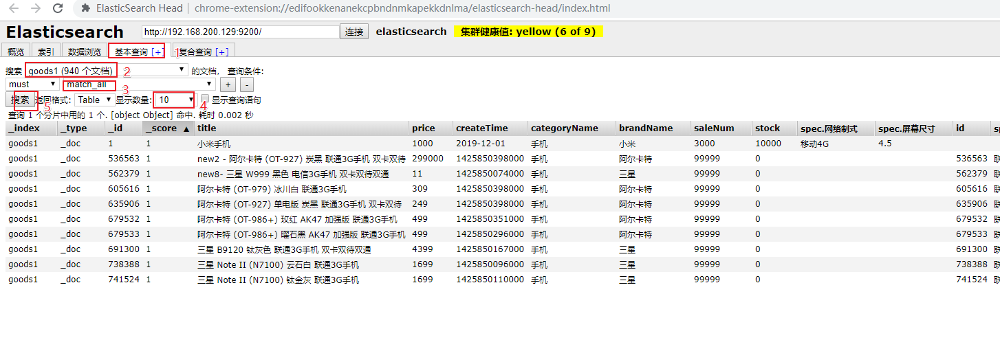
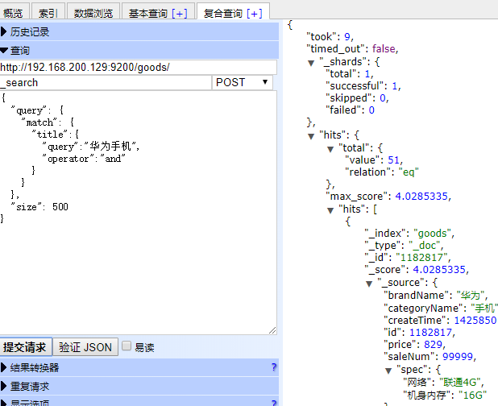
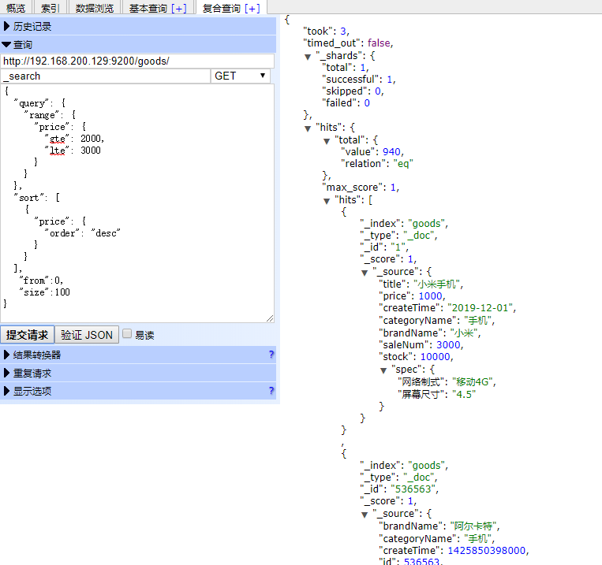
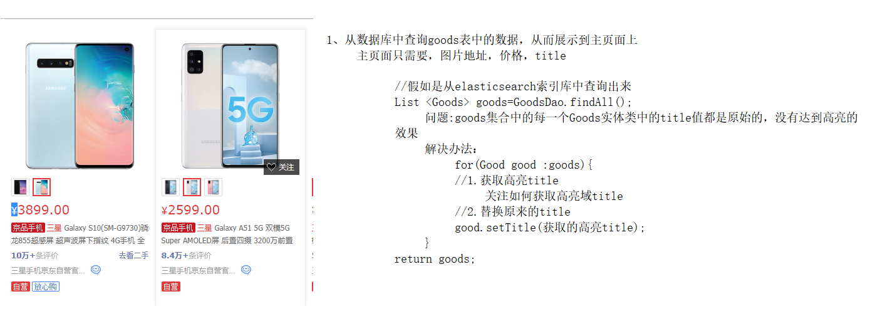

# ElasticSearch第二天课堂笔记

## 反馈


## 课程优化

参考《docker 安装elasticsearch笔记.md》

## ElasticSearch高级操作

bulk操作

```
#批量操作，增删改
#1.删除5号
#新增8号
#更新2号 name为2号
POST _bulk
{"delete":{"_index":"person1","_id":"5"}}
{"create":{"_index":"person1","_id":"8"}}
{"name":"八号","age":18,"address":"北京"}
{"update":{"_index":"person1","_id":"2"}}
{"doc":{"name":"2号"}}

#1、_bulk批量操作的关键字
```

**重点**批量导入数据到elasticsearch中

```java
步骤：
	1、要先有数据库表，并且表中有数据
	2、先提前创建好索引库(映射信息一定要和数据库表中的字段映射一致)
	3、通过mybatis去查询goods表中的全部数据
	4、如果是elasticsearch5，则使用saveAll方法进行批量插入
		如果是elasticsearch7,则使用bulk进行批量插入
		
elasticsearch7批量插入测试代码
	 @Test
    public void importData() throws IOException {
        //1.查询所有数据，mysql
        List<Goods> goodsList = goodsMapper.findAll();
       //2.bulk导入
        BulkRequest bulkRequest = new BulkRequest();
        //2.1 循环goodsList，创建IndexRequest添加数据
        for (Goods goods : goodsList) {
            //2.2 设置spec规格信息 Map的数据   specStr:{}
            String specStr = goods.getSpecStr();
            //将json格式字符串转为Map集合
            Map map = JSON.parseObject(specStr, Map.class);
            //设置spec map
            goods.setSpec(map);
            //将goods对象转换为json字符串
            String data = JSON.toJSONString(goods);//map --> {}
            IndexRequest indexRequest = new IndexRequest("goods1");
            indexRequest.id(goods.getId()+"").source(data, XContentType.JSON);
            bulkRequest.add(indexRequest);
        }
        BulkResponse response = client.bulk(bulkRequest, RequestOptions.DEFAULT);
        System.out.println(response.status());
    }
elasticsearch5的批量插入的伪代码
    @Autowired
    private GoodsRepostitory goodsRepostitory;
    
    @Test
    public void importData() throws IOException {
        //1.查询所有数据，mysql
        List<Goods> goodsList = goodsMapper.findAll();
        for(Goods goods:goodsList){
             //2.2 设置spec规格信息 Map的数据   specStr:{}
            String specStr = goods.getSpecStr();
            //将json格式字符串转为Map集合
            Map map = JSON.parseObject(specStr, Map.class);
            //设置spec map
            goods.setSpec(map);
        }
      	//2.批量插入
        goodsRepostitory.saveAll(goodsList);
    }
	
```


## ElasticSearch高级查询

### matchAll操作脚本

kibana查询

```java
# 默认情况下，es一次展示10条数据,通过from和size来控制分页
# 查询结果详解

GET goods/_search
{
  "query": {
    "match_all": {}
  },
  "from": 0,
  "size": 100
}
```

head插件



### matchAll操作API

elasticsearch7版本的

```java
/**
     * 查询所有
     *  1. matchAll
     *  2. 将查询结果封装为Goods对象，装载到List中
     *  3. 分页。默认显示10条
     */
    @Test
    public void testMatchAll() throws IOException {
        //2. 构建查询请求对象，指定查询的索引名称
        SearchRequest searchRequest = new SearchRequest("goods");
        //4. 创建查询条件构建器SearchSourceBuilder
        SearchSourceBuilder sourceBuilder = new SearchSourceBuilder();
//-----------------------------------------
        //6. 查询条件
        QueryBuilder query = QueryBuilders.matchAllQuery();//查询所有文档
        //5. 指定查询条件
        sourceBuilder.query(query);
//------------------------------------------
        //3. 添加查询条件构建器 SearchSourceBuilder
        searchRequest.source(sourceBuilder);

        // 8 . 添加分页信息
        sourceBuilder.from(1);
        sourceBuilder.size(100);

        //1. 查询,获取查询结果
        SearchResponse searchResponse = client.search(searchRequest, RequestOptions.DEFAULT);

        //7. 获取命中对象 SearchHits
        SearchHits searchHits = searchResponse.getHits();
        //7.1 获取总记录数
        long value = searchHits.getTotalHits().value;
        System.out.println("总记录数："+value);


        List<Goods> goodsList = new ArrayList<>();
        //7.2 获取Hits数据  数组
        SearchHit[] hits = searchHits.getHits();
        for (SearchHit hit : hits) {
            //获取json字符串格式的数据
            String sourceAsString = hit.getSourceAsString();
            //转为java对象
            Goods goods = JSON.parseObject(sourceAsString, Goods.class);

            goodsList.add(goods);

        }


        for (Goods goods : goodsList) {
            System.out.println(goods);
        }
    }
```

### termQuery查询操作

匹配查询，不会进行分词

脚本方式

```
GET goods/_search
{
  "query": {
    "term": {
      "title": {
        "value": "华为"
      }
    }
  }
}
```

api方式

```java
 /**
     * termQuery:词条查询
     */
    @Test
    public void testTermQuery() throws IOException {
        SearchRequest searchRequest = new SearchRequest("goods");
        SearchSourceBuilder sourceBulider = new SearchSourceBuilder();
//------------------------------------------
        QueryBuilder query = QueryBuilders.termQuery("title","华为");//term词条查询
        sourceBulider.query(query);
//------------------------------------------------
        searchRequest.source(sourceBulider);
        SearchResponse searchResponse = client.search(searchRequest, RequestOptions.DEFAULT);

        SearchHits searchHits = searchResponse.getHits();
        //获取记录数
        long value = searchHits.getTotalHits().value;
        System.out.println("总记录数："+value);

        List<Goods> goodsList = new ArrayList<>();
        SearchHit[] hits = searchHits.getHits();
        for (SearchHit hit : hits) {
            String sourceAsString = hit.getSourceAsString();

            //转为java
            Goods goods = JSON.parseObject(sourceAsString, Goods.class);

            goodsList.add(goods);
        }

        for (Goods goods : goodsList) {
            System.out.println(goods);
        }
    }
```

### matchQuery查询操作

对词条进行拆分，然后分别进行类似于模糊查询

脚本方式

```
# match查询,默认是取并集(or)
GET goods/_search
{
  "query": {
    "match": {
      "title": "华为手机"
    }
  },
  "size": 500
}

# match查询
GET goods/_search
{
  "query": {
    "match": {
      "title":{
      	"query":"华为手机"，
      	"operator":"or"/"and"
      }
    }
  },
  "size": 500
}
```



API方式

```java
 /**
     * matchQuery:词条分词查询
     */
    @Test
    public void testMatchQuery() throws IOException {


        SearchRequest searchRequest = new SearchRequest("goods");

        SearchSourceBuilder sourceBulider = new SearchSourceBuilder();
//---------------------------------------------------------------
        MatchQueryBuilder query = QueryBuilders.matchQuery("title", "华为手机");
        query.operator(Operator.AND);//求并集
        sourceBulider.query(query);
//---------------------------------------------------------------------

        searchRequest.source(sourceBulider);


        SearchResponse searchResponse = client.search(searchRequest, RequestOptions.DEFAULT);


        SearchHits searchHits = searchResponse.getHits();
        //获取记录数
        long value = searchHits.getTotalHits().value;
        System.out.println("总记录数："+value);

        List<Goods> goodsList = new ArrayList<>();
        SearchHit[] hits = searchHits.getHits();
        for (SearchHit hit : hits) {
            String sourceAsString = hit.getSourceAsString();

            //转为java
            Goods goods = JSON.parseObject(sourceAsString, Goods.class);

            goodsList.add(goods);
        }

        for (Goods goods : goodsList) {
            System.out.println(goods);
        }
    }
```

### 模糊查询操作

脚本方式：

wildcard查询：可以理解为通配符查询，？表示一个单词，*表示任意个

```shell
GET goods/_search
{
  "query": {//固定查询关键字
    "wildcard": {//查询方式关键字
      "title": {//field字段
        "value": "华*"//字段值
      }
    }
  }
}
```

prefix查询

```shell
# 前缀查询 对keyword类型支持比较好
GET goods/_search
{
  "query": {
    "prefix": { //查询方式关键字
      "brandName": { //在添加映射的时候指定的是keyword类型，不分词
        "value": "三"
      }
    }
  }
}
```

API方式

wildcard查询

```java
/**
     * 模糊查询:WildcardQuery
     */
    @Test
    public void testWildcardQuery() throws IOException {


        SearchRequest searchRequest = new SearchRequest("goods");

        SearchSourceBuilder sourceBulider = new SearchSourceBuilder();
//-------------------------
        WildcardQueryBuilder query = QueryBuilders.wildcardQuery("title", "华*");

        sourceBulider.query(query);
//-------------------------------------------------
        searchRequest.source(sourceBulider);


        SearchResponse searchResponse = client.search(searchRequest, RequestOptions.DEFAULT);


        SearchHits searchHits = searchResponse.getHits();
        //获取记录数
        long value = searchHits.getTotalHits().value;
        System.out.println("总记录数："+value);

        List<Goods> goodsList = new ArrayList<>();
        SearchHit[] hits = searchHits.getHits();
        for (SearchHit hit : hits) {
            String sourceAsString = hit.getSourceAsString();

            //转为java
            Goods goods = JSON.parseObject(sourceAsString, Goods.class);

            goodsList.add(goods);
        }

        for (Goods goods : goodsList) {
            System.out.println(goods);
        }
    }
```

prefix查询

```java
    PrefixQueryBuilder query = QueryBuilders.prefixQuery("brandName", "三");
    sourceBulider.query(query);
```

### 范围排序查询

其实是两个功能：范围(在电商项目中一般指的是价格区间)，排序(升序和降序)

脚本方式

```shell
GET goods/_search

{
  "query": { //查询关键字
    "range": {//区间关键字
      "price": { //字段
        "gte": 2000, //大于等于2000
        "lte": 3000 //小于等于3000
      }
    }
  },
  "sort": [ //排序关键字
    {
      "price": { //排序字段
        "order": "desc"  //排序方式 asc升序，desc降序
      }
    }
  ],
   "from":0,  //从第几条开始
   "size":100  //每页显示的数量
}
```



API方式

```java
    /**
     * 1. 范围查询：rangeQuery
     * 2. 排序
     */
    @Test
    public void testRangeQuery() throws IOException {


        SearchRequest searchRequest = new SearchRequest("goods");

        SearchSourceBuilder sourceBulider = new SearchSourceBuilder();
//-----------------范围查询ing------------------------------------------

        //范围查询
        RangeQueryBuilder query = QueryBuilders.rangeQuery("price");

        //指定下限
        query.gte(2000);
        //指定上限
        query.lte(3000);
//-----------------范围查询end----------------------
        sourceBulider.query(query);
//---------------排序查询ing---------------------------------
        //排序
        sourceBulider.sort("price", SortOrder.DESC);

//------------------排序查询end--------------------
        searchRequest.source(sourceBulider);
        SearchResponse searchResponse = client.search(searchRequest, RequestOptions.DEFAULT);
        SearchHits searchHits = searchResponse.getHits();
        //获取记录数
        long value = searchHits.getTotalHits().value;
        System.out.println("总记录数："+value);

        List<Goods> goodsList = new ArrayList<>();
        SearchHit[] hits = searchHits.getHits();
        for (SearchHit hit : hits) {
            String sourceAsString = hit.getSourceAsString();

            //转为java
            Goods goods = JSON.parseObject(sourceAsString, Goods.class);

            goodsList.add(goods);
        }

        for (Goods goods : goodsList) {
            System.out.println(goods);
        }
    }
```

### queryString查询操作

queryString 在elasticsearch7版本中充当的是多条件查询，可以任意指定查询的条件参数

脚本方式

```shell
# queryString

GET goods/_search
{
  "query": { //查询关键字
    "query_string": { //多条件查询关键字
      "fields": ["title","categoryName","brandName"], //要执行查询的字段的集合
      "query": "华为 AND 手机" //表示查询的内容
    }
  }
}
```

API方式

```java

        //queryString
        QueryStringQueryBuilder query = QueryBuilders.queryStringQuery("华为手机").field("title").field("categoryName").field("brandName").defaultOperator(Operator.AND);
        sourceBulider.query(query);
```

### 布尔查询

其实就是查询多个条件的链接方式，多个条件是同时成立呢还是同时不成立。

脚本方式

```shell
# boolquery
#must和filter配合使用时，max_score（得分）是显示的
#must 默认数组形式
GET goods/_search
{
  "query": { //查询关键字
    "bool": {  //布尔查询关键字
      "must": [  //必须，and关系
        {
          "term": {  //匹配查询关键字
            "brandName": {  //字段名称
              "value": "华为"  
            }
          }
        }
      ],
      "filter":[ //过滤查询关键字，必须成立，and
        {
        "term": { //匹配查询关键字
          "title": "手机"
        }
       },
       {
         "range":{ //区间关键字
          "price": {
            "gte": 2000, //大于
            "lte": 3000  //小于
         }
         }
       }
      
      ]
    }
  }
}
#filter 单独使用   filter可以是单个条件，也可多个条件（数组形式）
GET goods/_search
{
  "query": {
    "bool": {
      "filter": [
        {
          "term": {
            "brandName": {
              "value": "华为"
            }
          }
        }
      ]
    }
  }
}
```

API方式

```java

    /**
     * 布尔查询：boolQuery
     * 1. 查询品牌名称为:华为
     * 2. 查询标题包含：手机
     * 3. 查询价格在：2000-3000
     */
    @Test
    public void testBoolQuery() throws IOException {


        SearchRequest searchRequest = new SearchRequest("goods");

        SearchSourceBuilder sourceBulider = new SearchSourceBuilder();

//------------------------------------
        //1.构建boolQuery
        BoolQueryBuilder query = QueryBuilders.boolQuery();

        //2.构建各个查询条件
        //2.1 查询品牌名称为:华为
        QueryBuilder termQuery = QueryBuilders.termQuery("brandName","华为");
        query.must(termQuery);

        //2.2. 查询标题包含：手机
        QueryBuilder matchQuery = QueryBuilders.matchQuery("title","手机");
        query.filter(matchQuery);

        //2.3 查询价格在：2000-3000
        QueryBuilder rangeQuery = QueryBuilders.rangeQuery("price");
        ((RangeQueryBuilder) rangeQuery).gte(2000);
        ((RangeQueryBuilder) rangeQuery).lte(3000);
        query.filter(rangeQuery);

        //3.使用boolQuery连接
//-------------------------------------------------------
        sourceBulider.query(query);


        searchRequest.source(sourceBulider);


        SearchResponse searchResponse = client.search(searchRequest, RequestOptions.DEFAULT);


        SearchHits searchHits = searchResponse.getHits();
        //获取记录数
        long value = searchHits.getTotalHits().value;
        System.out.println("总记录数："+value);

        List<Goods> goodsList = new ArrayList<>();
        SearchHit[] hits = searchHits.getHits();
        for (SearchHit hit : hits) {
            String sourceAsString = hit.getSourceAsString();

            //转为java
            Goods goods = JSON.parseObject(sourceAsString, Goods.class);

            goodsList.add(goods);
        }

        for (Goods goods : goodsList) {
            System.out.println(goods);
        }
    }
```

扩展作业：

```
需求：
	查询品牌是三星，分类是手机，销量从高到底排序
	 BoolQueryBuilder query = QueryBuilders.boolQuery();
	1、查询品牌是三星
		 QueryBuilder termQuery = QueryBuilders.termQuery("brandName","三星");
        query.must(termQuery);
	2、分类是手机
		 QueryBuilder termQuery2 = QueryBuilders.termQuery("categoryName","手机");
         query.must(termQuery2);
	3、销量从高到底排序
			sourceBulider.sort("销量字段",SortOrder.DESC);
```

### 聚合查询

•指标聚合：相当于MySQL的聚合函数。max、min、avg、sum等

•桶聚合：相当于MySQL的 group by 操作。不要对text类型的数据进行分组，会失败。

脚本方式

```shell
# 聚合查询

# 指标聚合 聚合函数
GET goods/_search
{
 //表示分词查询手机
  "query": { 
    "match": {
      "title": "手机"
    }
  },
  "aggs": { //表示聚合查询关键字
    "max_price": { //查询的名称，可以随意起
      "max": { //聚合关键字，max,min,avg,count,sum
        "field": "price" //具体哪个域(字段)去执行聚合函数
      }
    }
  }
}
#类似于mysql中，select max(price) as max_price from 

# 桶聚合  分组

GET goods/_search
{
  "query": {
    "match": {
      "title": "手机"
    }
  },
  "aggs": { #表示聚合查询关键字
    "goods_brands": { #查询的名称，可以随意起
      "terms": { #匹配查询关键字
        "field": "brandName",
        "size": 100
      }
    }
  }
}

需求：
	查询title中包含手机的所有品牌
sql: select brandName from brand   where title like"%手机%" group by brandName  
```

API方式

```java
    /**
     * 聚合查询：桶聚合，分组查询
     * 1. 查询title包含手机的数据
     * 2. 查询品牌列表
     */
    @Test
    public void testAggQuery() throws IOException {


        SearchRequest searchRequest = new SearchRequest("goods");

        SearchSourceBuilder sourceBulider = new SearchSourceBuilder();
//------------------------聚合条件----------------------------------------
        // 1. 查询title包含手机的数据
        MatchQueryBuilder query = QueryBuilders.matchQuery("title", "手机");

        sourceBulider.query(query);

        // 2. 查询品牌列表
        /*
        参数：
            1. 自定义的名称，将来用于获取数据
            2. 分组的字段
         */
        AggregationBuilder agg = AggregationBuilders.terms("goods_brands").field("brandName").size(100);
        sourceBulider.aggregation(agg);

//------------------------------------------------------------------------

        searchRequest.source(sourceBulider);


        SearchResponse searchResponse = client.search(searchRequest, RequestOptions.DEFAULT);


        SearchHits searchHits = searchResponse.getHits();
        //获取记录数
        long value = searchHits.getTotalHits().value;
        System.out.println("总记录数："+value);

        List<Goods> goodsList = new ArrayList<>();
        SearchHit[] hits = searchHits.getHits();
        for (SearchHit hit : hits) {
            String sourceAsString = hit.getSourceAsString();

            //转为java
            Goods goods = JSON.parseObject(sourceAsString, Goods.class);

            goodsList.add(goods);
        }

        for (Goods goods : goodsList) {
            System.out.println(goods);
        }
//--------------通过聚合查询获取聚合结果--------------------------
        // 获取聚合结果
        Aggregations aggregations = searchResponse.getAggregations();
        Map<String, Aggregation> aggregationMap = aggregations.asMap();
        //System.out.println(aggregationMap);
        Terms goods_brands = (Terms) aggregationMap.get("goods_brands");
        List<? extends Terms.Bucket> buckets = goods_brands.getBuckets();
        List brands = new ArrayList();
        for (Terms.Bucket bucket : buckets) {
            Object key = bucket.getKey();
            brands.add(key);
        }
        for (Object brand : brands) {
            System.out.println(brand);
        }
//--------------------------------------------------------
    }
```

### 高亮查询

高亮其实就是把搜索的关键字给予以颜色区分，进行醒目展示，一般是以红色为主

高亮的核心其实比如：
	keyword=三星，展示出来的title结果有：

​				**三星 Galaxy S10(SM-G9730)骁龙855超感屏 超声波屏下指纹 4G手机 全网通 双卡双待游戏手机 8GB+128GB炭晶黑**

高亮之后的效果应该是这样的：

​			**<font color="red">三星</font> Galaxy S10(SM-G9730)骁龙855超感屏 超声波屏下指纹 4G手机 全网通 双卡双待游戏手机 8GB+128GB炭晶黑**

解析：



```java
/**
     *
     * 高亮查询：
     *  1. 设置高亮
     *      * 高亮字段
     *      * 前缀
     *      * 后缀
     *  2. 将高亮了的字段数据，替换原有数据
     */
    @Test
    public void testHighLightQuery() throws IOException {


        SearchRequest searchRequest = new SearchRequest("goods");

        SearchSourceBuilder sourceBulider = new SearchSourceBuilder();

        // 1. 查询title包含手机的数据
        MatchQueryBuilder query = QueryBuilders.matchQuery("title", "手机");

        sourceBulider.query(query);
//---------------设置高亮ing--------------------------------
        //设置高亮
        HighlightBuilder highlighter = new HighlightBuilder();
        //设置三要素
        highlighter.field("title");
        highlighter.preTags("<font color='red'>");
        highlighter.postTags("</font>");


        sourceBulider.highlighter(highlighter);
//------------------设置高亮end----------------------------------


        // 2. 查询品牌列表
        /*
        参数：
            1. 自定义的名称，将来用于获取数据
            2. 分组的字段
         */
        AggregationBuilder agg = AggregationBuilders.terms("goods_brands").field("brandName").size(100);
        sourceBulider.aggregation(agg);

        searchRequest.source(sourceBulider);

        SearchResponse searchResponse = client.search(searchRequest, RequestOptions.DEFAULT);


        SearchHits searchHits = searchResponse.getHits();
        //获取记录数
        long value = searchHits.getTotalHits().value;
        System.out.println("总记录数："+value);

        List<Goods> goodsList = new ArrayList<>();
        SearchHit[] hits = searchHits.getHits();
        for (SearchHit hit : hits) {
            String sourceAsString = hit.getSourceAsString();

            //转为java
            Goods goods = JSON.parseObject(sourceAsString, Goods.class);
//----------------替换高亮结果ing--------------------------
            // 获取高亮结果，替换goods中的title
            Map<String, HighlightField> highlightFields = hit.getHighlightFields();
            HighlightField HighlightField = highlightFields.get("title");
            Text[] fragments = HighlightField.fragments();
            //替换
            goods.setTitle(fragments[0].toString());
//-------------------替换高亮结果end---------------------------

            goodsList.add(goods);
        }

        for (Goods goods : goodsList) {
            System.out.println(goods);
        }

        // 获取聚合结果
        Aggregations aggregations = searchResponse.getAggregations();

        Map<String, Aggregation> aggregationMap = aggregations.asMap();

        //System.out.println(aggregationMap);
        Terms goods_brands = (Terms) aggregationMap.get("goods_brands");

        List<? extends Terms.Bucket> buckets = goods_brands.getBuckets();

        List brands = new ArrayList();
        for (Terms.Bucket bucket : buckets) {
            Object key = bucket.getKey();
            brands.add(key);
        }

        for (Object brand : brands) {
            System.out.println(brand);
        }

    }

```

### 重建索引&索引别名

只是针对的是脚本

```json
#查询别名 默认别名无法查看，默认别名同索引名
GET goods/_alias/
#结果
{
  "goods" : {
    "aliases" : { }
  }
}

新建student_index_v1索引
# -------重建索引-----------

# 新建student_index_v1。索引名称必须全部小写

PUT student_index_v1
{
  "mappings": {
    "properties": {
      "birthday":{
        "type": "date"
      }
    }
  }
}
#查看 student_index_v1 结构
GET student_index_v1
#添加数据
PUT student_index_v1/_doc/1
{
  "birthday":"1999-11-11"
}
#查看数据
GET student_index_v1/_search

#添加数据
PUT student_index_v1/_doc/1
{
  "birthday":"1999年11月11日"
}
# 业务变更了，需要改变birthday字段的类型为text

# 1. 创建新的索引 student_index_v2
# 2. 将student_index_v1 数据拷贝到 student_index_v2

# 创建新的索引 student_index_v2
PUT student_index_v2
{
  "mappings": {
    "properties": {
      "birthday":{
        "type": "text"
      }
    }
  }
}
# 将student_index_v1 数据拷贝到 student_index_v2
# _reindex 拷贝数据
POST _reindex
{
  "source": {
    "index": "student_index_v1"
  },
  "dest": {
    "index": "student_index_v2"
  }
}

GET student_index_v2/_search


PUT student_index_v2/_doc/2
{
  "birthday":"1999年11月11日"
}


# 思考： 现在java代码中操作es，还是使用的实student_index_v1老的索引名称。
# 1. 改代码（不推荐）
# 2. 索引别名（推荐）

# 步骤：
# 0. 先删除student_index_v1
# 1. 给student_index_v2起个别名 student_index_v1


# 先删除student_index_v1
#DELETE student_index_v1 这一操作将删除student_index_v1索引库
#索引库默认的别名与索引库同名，无法删除

# 给student_index_v1起个别名 student_index_v1
POST student_index_v2/_alias/student_index_v1
#测试删除命令
POST /_aliases
{
    "actions": [
        {"remove": {"index": "student_index_v1", "alias": "student_index_v11"}}
    ]
}

# 给student_index_v2起个别名 student_index_v1
POST student_index_v2/_alias/student_index_v1

#查询别名
GET goods/_alias/


GET student_index_v1/_search
GET student_index_v2/_search
```


## 作业：

​	利用elasticsearch5.6.8 使用springDataElasticsearch来实现从数据库中查询数据，并且导入到elasticsearch索引库中。


