# Docker 安装&操作ElasticSearch笔记

## 一、Docker安装ElasticSearch7.4.2

### 1、安装ElasticSearch

#### 拉取镜像

第一步要下载elasticsearch的镜像以及可视化工具

```shell
#  镜像
docker pull elasticsearch:7.4.2
# 可视化工具
docker pull kibana:7.4.2
```

#### 创建实例

在外部主机创建文件夹用于es目录挂载

```shell
# 配置文件目录
mkdir -p /mydata/elasticsearch/config

# 数据文件目录
mkdir -p /mydata/elasticsearch/data
```

创建配置文件，表示es允许任何的远程的主机访问

```shell
echo "http.host: 0.0.0.0" >> /mydata/elasticsearch/config/elasticsearch.yml
```

#### 启动es实例

```shell
docker run --name=elasticsearch -p 9200:9200 -p 9300:9300  --privileged=true \
-e ES_JAVA_OPTS="-Xms64m -Xmx128m" \
-v /mydata/elasticsearch/config/elasticsearch.yml:/usr/share/elasticsearch/config/elasticsearch.yml \
-v /mydata/elasticsearch/data:/usr/share/elasticsearch/data \
-v /mydata/elasticsearch/plugins:/usr/share/elasticsearch/plugins \
-d elasticsearch:7.4.2
```

> 参数说明:
> **–name** 为es实例起名字
> **-p** 端口映射 9200:9200 冒号左边的端口号是主机端口，右边的端口号是docker容器端口，切忌千万不要弄反了，9200是向es发送http请求的端口，9300是分布式集群下es节点之间通信的端口
> **ES_JAVA_OPTS** 指定运行内存，初始64m,最大128m
> **-v** 挂载 : 左边是主机目录 ，右边是docer实例内部目录
> **-d** 后台运行容器
> **–privileged=true** 在文件挂载时出现
> nested: AccessDeniedException[/usr/share/elasticsearch/config/elasticsearch.yml];
> 说明 权限不够，可以加上这个参数

**注意: 在测试环境下一定要设置-e ES_JAVA_OPTS="-Xms64m -Xmx128m"，设置es的初始的内存和最大内存，否则可能es占用内存过大，造成启动不了es**

安装完成elasticsearch之后启动elasticsearch

```shell
docker start elasticsearch
```

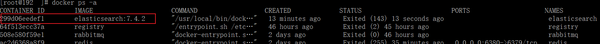

查询docker ps发现并没有启动起来

查询elasticsearch日志看看是什么问题

```shell
docker logs elasticsearch
```

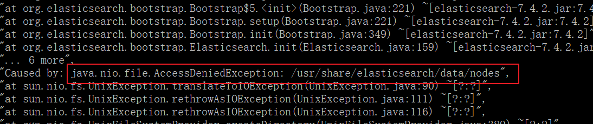

表示说明权限不够，查看文件权限

```
cd /mydata/elasticsearch
```

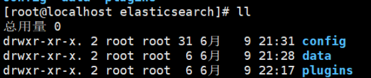

发现:其它用户只有 r可读，x可执行的权限，没有w写的权限,所以修改权限。
将mydata/elasticsearch/目录下所有文件修改为可读可写可执行

```
chmod -R 777 /mydata/elasticsearch/
```

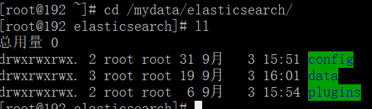

再次启动es,启动成功

```
docker start elasticsearch
```

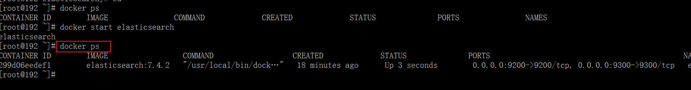

#### 访问es

```
192.168.200.129:9200
```

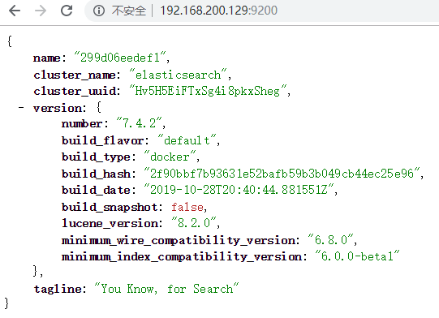

### 2、安装kibana

#### 安装kibana

```shell
docker run --name=kibana --privileged=true \
-e ELASTICSEARCH_HOSTS=http://192.168.200.132:9200 -p 5601:5601 \
-d kibana:7.4.2
```

#### 查看是否启动

```
docker ps
```

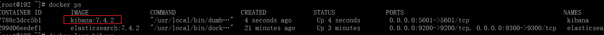

#### 访问kibana

```
192.168.200.129:5601
```

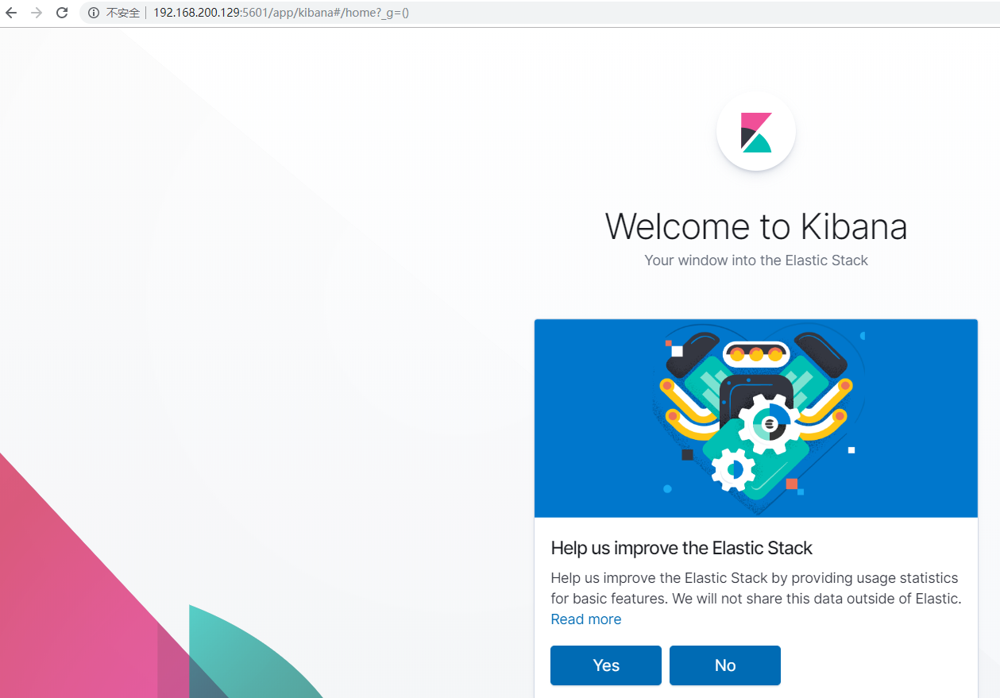


### 3、安装IK分词器

ik分词器的版本要和elasticsearch的版本对应，
在安装elasticsearch时将plusgin文件夹映射到主机上

#### 下载IK

```shell
#进入plugins文件夹
cd /mydata/elasticsearch/plugins/
#下载ik.zip
wget https://github.com/medcl/elasticsearch-analysis-ik/releases/download/v7.4.2/elasticsearch-analysis-ik-7.4.2.zip
```

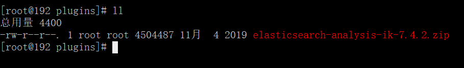

#### 解压

```
yum install zip 
yum install unzip
```

```
unzip elasticsearch-analysis-ik-7.4.2.zip -d ik7.4.2
```

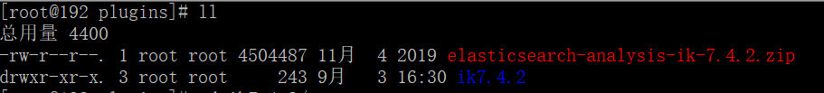

#### 删除压缩包

```
rm -rf elasticsearch-analysis-ik-7.4.2.zip
```

==注意：一定要删除，否则elasticsearch重启启动不起来==

#### 修改权限

```
chmod -R 777 ik7.4.2
```

#### 重启es

```
docker restart elasticsearch
```

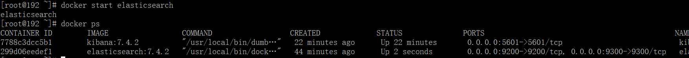


## 二、Docker安装ElasticSearch5.6.8

### 1、安装ElasticSearch

docker中安装elasticSearch容器部署步骤如下:

####  拉取ES镜像

~~~shell
docker pull elasticsearch:5.6.8
~~~

#### 创建ES容器

~~~shell
docker run -di --name=es5 -p 9200:9200 -p 9300:9300 -e ES_JAVA_OPTS="-Xms64m -Xmx128m"  -v /usr/share/elasticsearch/elasticsearch.yml:/usr/share/elasticsearch/config/elasticsearch.yml elasticsearch:5.6.8
~~~

进入配置文件所在位置,查看文件，能看到挂载的文件

```shell
cd /usr/share/elasticsearch

ls
```

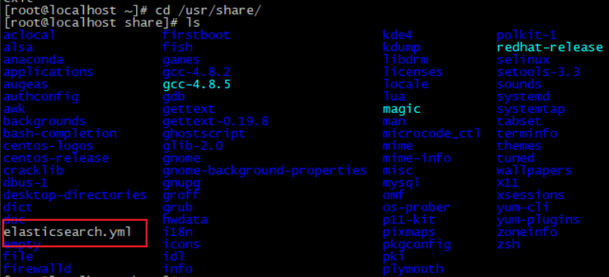

把文件拉出来改

```shell
vi elasticsearch.yml
```

​	a. 配置tcp端口访问

~~~shell
http.host: 0.0.0.0 #表示开启远程访问
transport.host: 0.0.0.0   #此行配置默认是被注释掉的，取消注释即可
~~~

​	b. 添加http端口跨域访问配置

~~~shell
http.cors.enabled: true
http.cors.allow-origin: "*"
~~~

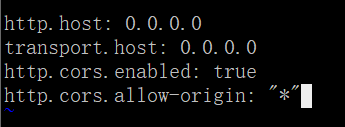


#### 启动ES容器

```
docker ps
#如果没启动，则启动es
docker start es5
```

注意：启动不起来的话

```properties
1、首先查看日志
docker logs es5
	如果报一个内容溢出的问题的话，表示内存不足了
2、在测试环境下的解决方案是：
在linux中内核中分配最大空间
	vi /etc/sysctl.conf
添加 vm.max_map_count=655360
```

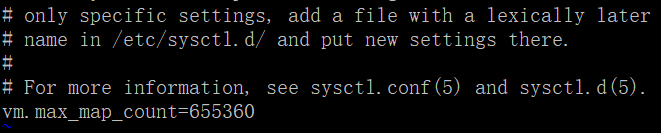

```properties
3、重启生效
	sysctl -p
```

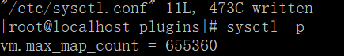

```properties
4、重启docker及docker容器
systemctl restart docker 
docker start|restart es5
```

发现报这个错误：

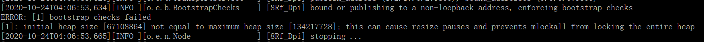

错误原因是只能单个节点执行。

```properties
5、在elasticsearch.yml中添加只能单节点启动

discovery.type: single-node
```

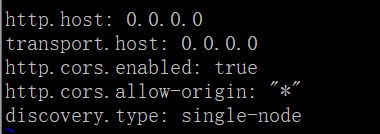

```properties
6、重新启动elasticsearch容器
docker start|restart es5
```


#### 访问ES5

```
http://192.168.200.129:9200/
```

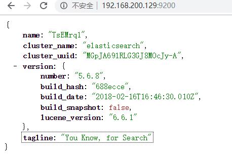

### 2、安装kibana

在docker容器中没有kibana5.6.8版本，官方文档中也介绍到

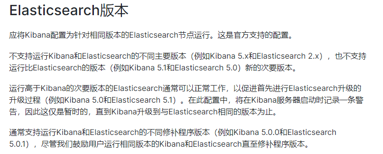

### 3、安装ElasticSearch-header插件

下载ElasticSearch Head Chrome.rar插件

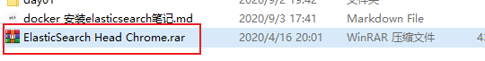

安装到谷歌浏览器中

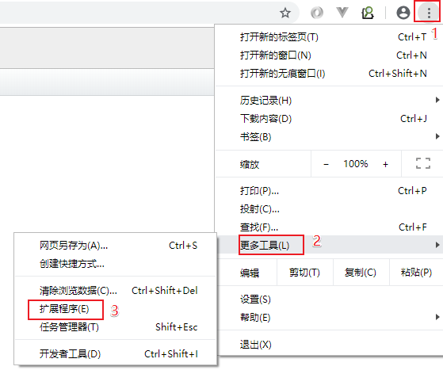

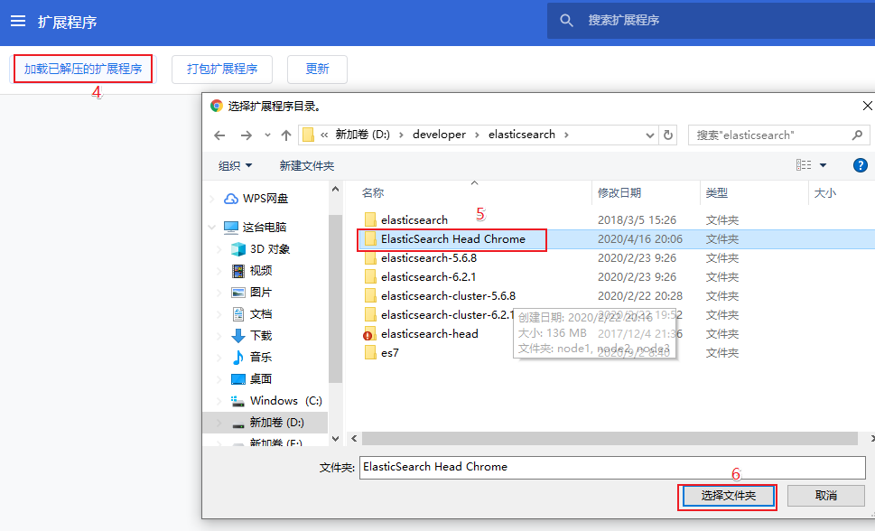


点击8就进入ElasticSearch-head界面中，默认链接是localhost:9200，属于未连接状态

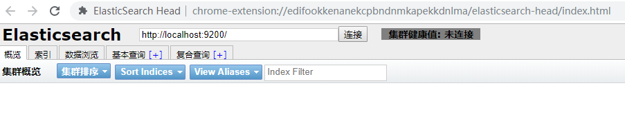

连接状态

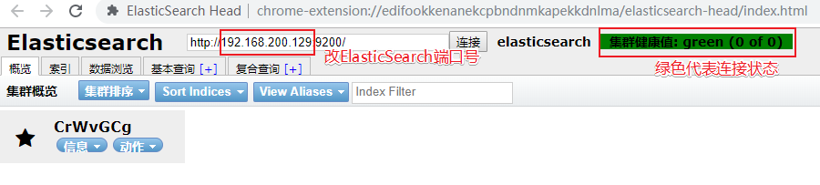

### 4、安装IK分词器

#### 上传IK分词器文件夹到服务器

直接放在root目录即可

alt+p进入sftp

```shell
put D:\developer\elasticsearch\elasticsearch-analysis-ik-5.6.8.zip
```

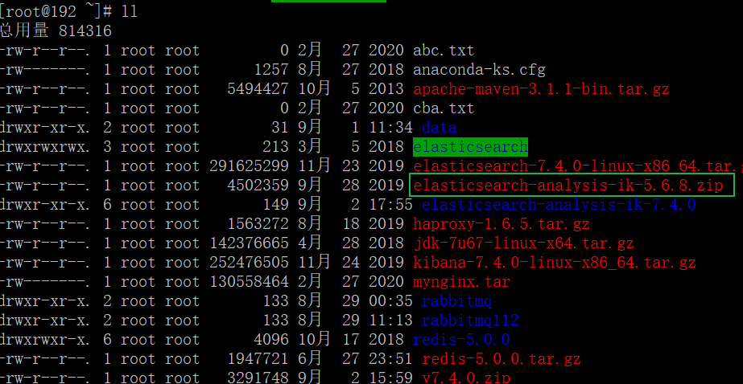

#### 解压IK

```
unzip elasticsearch-analysis-ik-5.6.8.zip 
```

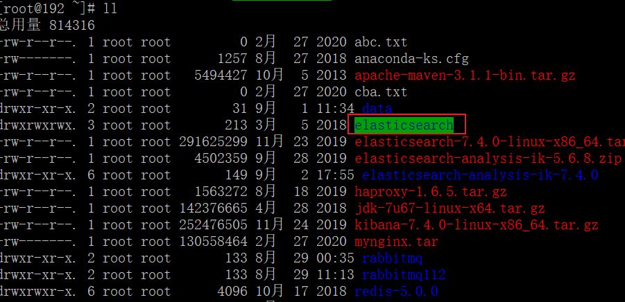

#### 拷贝IK分词器到ES5容器中

```shell
#cp是拷贝的意思，           es5表示容器名称:后面的路径是容器内部路径
#docker cp /root/elasticsearch  表示docker cp /root目录下/ik分词器的解压包
docker cp /root/elasticsearch es5:/usr/share/elasticsearch/plugins/IKAnalyzer
```

#### 重启ES容器

```
docker restart es5
```

#### 测试ik分词器

使用默认分词器

```
GET http://192.168.200.129:9200/_analyze?analyzer=standard&text=我是程序员
```

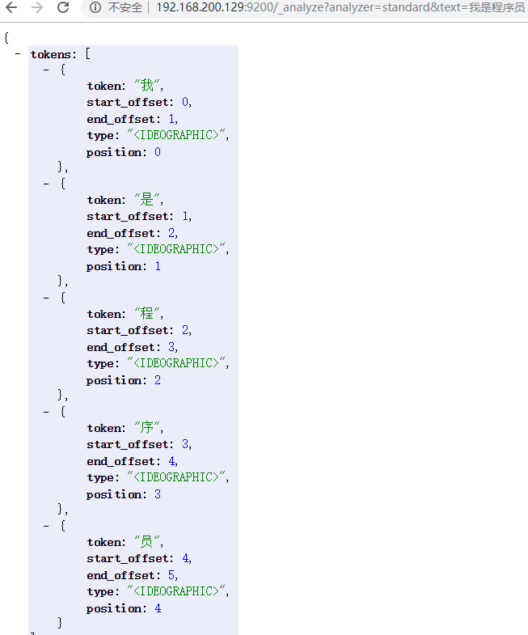

使用IK分词器：

1、analyzer=ik_smart的话是粗粒度的分词

2、analyzer=ik_max_word的话是细粒度的分词

```
GET http://192.168.200.129:9200/_analyze?analyzer=ik_smart&text=我是程序员
```

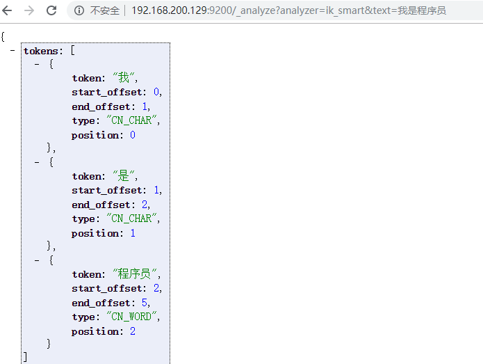

## 三、SpringBoot整合ElasticSearch7.4.2

### 1、创建springboot环境

#### pom.xml

```xml
 <parent>
        <groupId>org.springframework.boot</groupId>
        <artifactId>spring-boot-starter-parent</artifactId>
        <version>2.1.16.RELEASE</version>
        <relativePath/> <!-- lookup parent from repository -->
    </parent>
<dependencies>
    <dependency>
        <groupId>org.springframework.boot</groupId>
        <artifactId>spring-boot-starter</artifactId>
    </dependency>
    <dependency>
        <groupId>org.projectlombok</groupId>
        <artifactId>lombok</artifactId>
    </dependency>
    <dependency>
        <groupId>org.springframework.boot</groupId>
        <artifactId>spring-boot-starter-test</artifactId>
        <scope>test</scope>
        <exclusions>
            <exclusion>
                <groupId>org.junit.vintage</groupId>
                <artifactId>junit-vintage-engine</artifactId>
            </exclusion>
        </exclusions>
    </dependency>
        <!--引入es的坐标-->
    <dependency>
        <groupId>org.elasticsearch.client</groupId>
        <artifactId>elasticsearch-rest-high-level-client</artifactId>
        <version>7.4.0</version>
    </dependency>
    <dependency>
        <groupId>org.elasticsearch.client</groupId>
        <artifactId>elasticsearch-rest-client</artifactId>
        <version>7.4.0</version>
    </dependency>
    <dependency>
        <groupId>org.elasticsearch</groupId>
        <artifactId>elasticsearch</artifactId>
        <version>7.4.0</version>
    </dependency>
</dependencies>
```

#### application.yml

```yml
elasticsearch:
    host: 192.168.200.129
    port: 9200
```

#### EsConfig.java

```java
@Configuration
@ConfigurationProperties(prefix = "elasticsearch")
@Data
public class ESConfig {
    private String host;
    private int port;
    //把RestHighLevelClient类注入到spring IOC容器中，表示连接上es
    @Bean
    public RestHighLevelClient client(){
        return new RestHighLevelClient(RestClient.builder(
                new HttpHost(host,port)
        ));
    }
}
```

#### 测试类

```java
@SpringBootTest
public class EsTest {

    @Autowired
    RestHighLevelClient client;

    /**
     * 测试
     */
    @Test
    void contextLoads() {
        System.out.println(client);
    }
}
```

### 2、创建索引

#### 添加索引，未指定映射(create)

```java
@RunWith(SpringRunner.class)
@SpringBootTest
public class ESTest {

    @Autowired
    private RestHighLevelClient client;
    //创建索引
    @Test
    public void createIndex() throws IOException {
        //1、创建索引对象
        IndicesClient indices = client.indices();
		//3.指定索引名称 itheima
        CreateIndexRequest createIndexRequest=new CreateIndexRequest("itheima");
        //4.使用默认请求参数
        RequestOptions requestOptions=RequestOptions.DEFAULT;
        //2.执行创建索引，参数1表示索引请求对象，参数2索引请求参数
        CreateIndexResponse response = indices.create(createIndexRequest, requestOptions);
        System.out.println(response.isAcknowledged());
    }
}
```

打印结果：

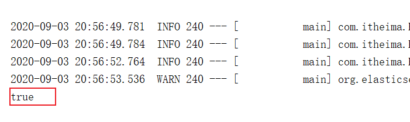

查看索引库

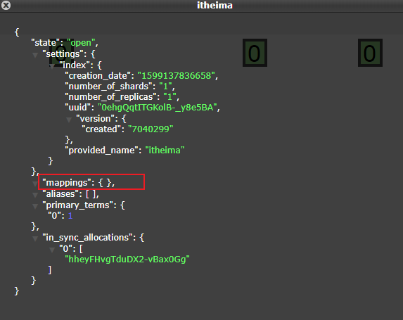

#### 添加索引，并指定映射(create)

```java
@Test
    public void createIndexAndMapping() throws IOException {
       //1、创建索引对象
        IndicesClient indices = client.indices();
		//3.指定索引名称 itheima
        CreateIndexRequest createIndexRequest=new CreateIndexRequest("itcast");

        /**
           3.1 添加映射条件
         * mapping(String type, String source, XContentType xContentType)
         参数1表示文档类型，参数2表示映射条件，参数3表示映射类型
         */
        String mapping="{\n" +
                "      \"properties\" : {\n" +
                "        \"address\" : {\n" +
                "          \"type\" : \"text\",\n" +
                "          \"analyzer\" : \"ik_max_word\"\n" +
                "        },\n" +
                "        \"age\" : {\n" +
                "          \"type\" : \"long\"\n" +
                "        },\n" +
                "        \"name\" : {\n" +
                "          \"type\" : \"keyword\"\n" +
                "        }\n" +
                "      }\n" +
                "    }";
        createIndexRequest.mapping("_doc",mapping, XContentType.JSON);
  		//4.使用默认请求参数
        RequestOptions requestOptions=RequestOptions.DEFAULT;
         //2.执行创建索引，参数1表示索引请求对象，参数2索引请求参数
        CreateIndexResponse response = indices.create(createIndexRequest, requestOptions);
        System.out.println(response.isAcknowledged());
    }
```


### 3、查询，删除，判断索引

#### 查询索引（get）

```java
    //查询 索引
    @Test
    public void findIndex() throws IOException {
        //1、创建索引对象
        IndicesClient indices = client.indices();
        //3.指定索引名称 itcast
        GetIndexRequest getIndexRequest=new GetIndexRequest("itcast");
        //4.使用默认请求参数
        RequestOptions requestOptions=RequestOptions.DEFAULT;
        //2.查询索引，参数1表示索引请求对象，参数2索引请求参数
        GetIndexResponse response = indices.get(getIndexRequest, requestOptions);
        Map<String, MappingMetaData> mappings = response.getMappings();
        for (String key : mappings.keySet()) {
            System.out.println(key+"===="+mappings.get(key).getSourceAsMap());
        }
    }
```

打印结果：

```
itcast===={properties={address={analyzer=ik_max_word, type=text}, name={type=keyword}, age={type=long}}}
```

#### 删除索引(delete)

```java
//删除索引
    @Test
    public void deleteIndex() throws IOException {
        //1、创建索引对象
        IndicesClient indices = client.indices();
        //3.指定索引名称 itheima
        DeleteIndexRequest deleteRequest=new DeleteIndexRequest("itheima");
        //4.使用默认请求参数
        RequestOptions requestOptions=RequestOptions.DEFAULT;
        //2.删除索引，参数1表示索引请求对象，参数2索引请求参数
        AcknowledgedResponse delete = indices.delete(deleteRequest, requestOptions);
        System.out.println(delete.isAcknowledged());
    }
```

#### 索引是否存在(exists)

```java
//判断索引
    @Test
    public void isIndex() throws IOException {
        //1、创建索引对象
        IndicesClient indices = client.indices();
        //3.指定索引名称 itheima
        GetIndexRequest getIndexRequest=new GetIndexRequest("itheima");
        //4.使用默认请求参数
        RequestOptions requestOptions=RequestOptions.DEFAULT;
        //2.判断索引，参数1表示索引请求对象，参数2索引请求参数
        boolean exists = indices.exists(getIndexRequest, requestOptions);
        System.out.println(exists);
    }
```

### 4、添加文档（index）

#### 添加文档,使用map作为数据

```java
//添加文档
    @Test
    public void addDoc1() throws IOException {
        Map<String, Object> map=new HashMap<>();
        map.put("name","张三");
        map.put("age","18");
        map.put("address","北京二环");
        //2.指定索引名称，id()表示指定id,source表示添加文档内容参数
        IndexRequest indexRequest=new IndexRequest("itcast").id("1").source(map);
        /*
        1.添加文档，index(IndexRequest indexRequest, RequestOptions options)
        参数1表示索引请求对象，参数2索引参数对象
        */
        IndexResponse index = client.index(indexRequest, RequestOptions.DEFAULT);
        System.out.println(index.getId());
    }
```

索引库中显示：

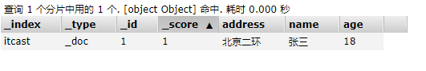

#### 添加文档,使用对象作为数据

创建person实体

```java
@Data
public class Person {
    String id;
    String name;
    int age;
    String address;
}
```

加入fastjson依赖

```xml
 <dependency>
        <groupId>com.alibaba</groupId>
        <artifactId>fastjson</artifactId>
        <version>1.2.62</version>
    </dependency>
```

测试类方法

```java
//添加文档  
@Test
    public void addDoc2() throws IOException {
        Person person=new Person();
        person.setId("2");
        person.setName("李四");
        person.setAge(20);
        person.setAddress("北京三环");
        String data = JSON.toJSONString(person);
         //2.指定索引名称，id()表示指定id,source表示添加文档内容参数
        IndexRequest request=new IndexRequest("itcast").id(person.getId()).source(data,XContentType.JSON);
         /*
        1.添加文档，index(IndexRequest indexRequest, RequestOptions options)
        参数1表示索引请求对象，参数2索引参数对象
        */
        IndexResponse response = client.index(request, RequestOptions.DEFAULT);
        System.out.println(response.getId());
    }
```

索引库显示

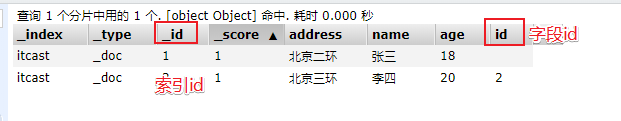

### 5、修改，查询，删除文档

#### 修改文档：添加文档时，如果id存在则修改，id不存在则添加

```java
   /**
     * 修改文档：添加文档时，如果id存在则修改，id不存在则添加
     */ 
@Test
    public void updateDoc() throws IOException {
        Person person=new Person();
        person.setId("2");
        person.setName("李四");
        person.setAge(20);
        person.setAddress("北京三环12郎");
        String data = JSON.toJSONString(person);
         //2.指定索引名称，id()表示指定id,source表示添加文档内容参数
        IndexRequest request=new IndexRequest("itcast").id(person.getId()).source(data,XContentType.JSON);
         /*
        1.添加文档，index(IndexRequest indexRequest, RequestOptions options)
        参数1表示索引请求对象，参数2索引参数对象
        */
        IndexResponse response = client.index(request, RequestOptions.DEFAULT);
        System.out.println(response.getId());
    }
```

#### 根据id查询文档

```java
    /**
     * 根据id查询文档
     */
    @Test
    public void getDoc() throws IOException {
        //设置查询的索引、文档
        GetRequest indexRequest=new GetRequest("itcast","2");
		//查询
        GetResponse response = client.get(indexRequest, RequestOptions.DEFAULT);
        System.out.println(response.getSourceAsString());
    }
```

打印结果

```
{"address":"北京三环","age":20,"id":"2","name":"李四"}
```

#### 全查文档

```java
 /**
     * 查询文档
     * @throws IOException
     */
    @Test
    public void getDoc2() throws IOException {
        //2.指定索引库名称
        SearchRequest searchRequest=new SearchRequest("person");
        //1.search表示全查索引库
        SearchResponse response = client.search(searchRequest, RequestOptions.DEFAULT);
        //3.响应对象中获取查询命中的集合
        SearchHits hits = response.getHits();
        for (SearchHit hit : hits) {
            String sourceAsString = hit.getSourceAsString();
            System.out.println(sourceAsString);
        }
    }
```

打印结果

```
{"address":"北京天安门","name":"习大大","age":60}
{"address":"北京二环内四合院","age":18,"name":"刘国澳不要睡觉了"}
```


#### 根据id删除文档

```java
/**
     * 根据id删除文档
     */
    @Test
    public void delDoc() throws IOException {

        //设置要删除的索引、文档
        DeleteRequest deleteRequest=new DeleteRequest("itcast","1");
        DeleteResponse response = client.delete(deleteRequest, RequestOptions.DEFAULT);
        System.out.println(response.getId());
    }
```


## 四、SpringBoot整合ElasticSearch5.6.8

### 1、创建springboot环境

#### pom.xml

```xml
 <parent>
        <groupId>org.springframework.boot</groupId>
        <artifactId>spring-boot-starter-parent</artifactId>
        <version>2.1.16.RELEASE</version>
        <relativePath/> <!-- lookup parent from repository -->
    </parent>
    <dependencies>
        <dependency>
            <groupId>org.springframework.boot</groupId>
            <artifactId>spring-boot-starter-test</artifactId>
        </dependency>
        <dependency>
            <groupId>org.springframework.boot</groupId>
            <artifactId>spring-boot-starter-data-elasticsearch</artifactId>
        </dependency>
        <dependency>
            <groupId>org.projectlombok</groupId>
            <artifactId>lombok</artifactId>
        </dependency>
    </dependencies>
```

#### application.yml

```yml
server:
  port: 8080
spring:
  data:
    elasticsearch:
      cluster-name: elasticsearch
      cluster-nodes: 192.168.200.129:9300
```

#### 实体类

```java
//注意：索引indexName值不可以包含大写字母
@Data
@Document(indexName = "userinfo",type = "docs")
public class UserInfo {
    @Id
    Long id;
    @Field(type = FieldType.Text,analyzer = "ik_max_word")
    String title; //标题
    @Field(type = FieldType.Keyword)
    String category;// 分类
    @Field(type = FieldType.Keyword)
    String brand; // 品牌
    @Field(type = FieldType.Double)
    Double price; // 价格
    @Field(type = FieldType.Keyword)
    String images; // 图片地址
}
```

### 2、创建索引

```java
@RunWith(SpringRunner.class)
@SpringBootTest
public class EsTest {

    @Autowired
    private ElasticsearchTemplate template;

  //创建索引库
    @Test
    public void createIndex(){
        //创建索引
        elasticsearchTemplate.createIndex(UserInfo.class);
        //创建映射
        elasticsearchTemplate.putMapping(UserInfo.class);
    }
}
```

启动执行报错：

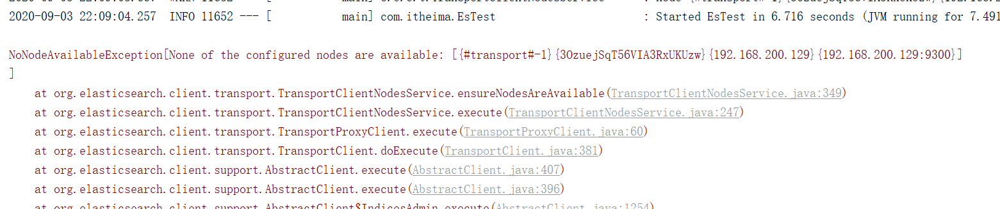

这个原因是：cluster.name在**es配置文件（\usr\share\elasticsearch.yml**）存在

我们在application.yml中指定了cluser-name，但是我们安装elasticsearch的时候并没有指定cluster-name导致的错误

所以，修改配置

```yml
cd /usr/share

vi elasticserach.yml

transport.host: 0.0.0.0
#加入这行代码，cluster.name的值必须要和java代码中application.yml中的cluster-name值一致
cluster.name: my-application  
http.cors.enabled: true
http.cors.allow-origin: "*"
```

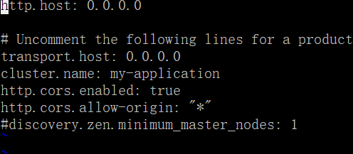

然后重启es,再次执行测试类，发现还是报错，但是这个错误已经不再是刚才那个错误了

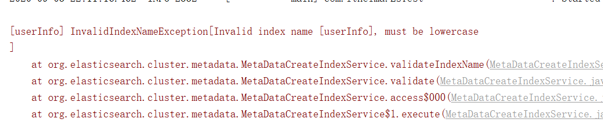

这个错误原因是索引名称中包含了大写字母，索引名称必须是小写字母导致的

所以修改实体类中映射的索引库名称

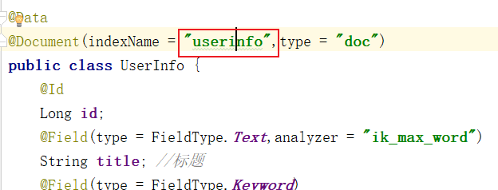

然后再次重启启动测试类,创建成功

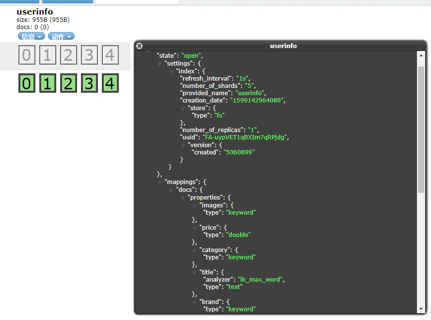

### 3、操作文档

Spring Data 的强大之处，就在于你不用写任何DAO处理，自动根据方法名或类的信息进行CRUD操作。只要你定义一个接口，然后继承Repository提供的一些子接口，就能具备各种基本的CRUD功能。

#### 创建UserInfoRepository

```java
/**
 * 创建一个接口，实现ElasticsearchRepository类<实体类,id类型>
 */
public interface UserInfoRepository extends ElasticsearchRepository<UserInfo, Long> {
}
```

#### 添加文档

```java
    @Autowired
    private UserInfoRepository userInfoRepository;
	//添加文档
    @Test
    public void testAdd() {
        UserInfo userInfo=new UserInfo();
        userInfo.setId(1L);
        userInfo.setTitle("我是程序员");
        userInfo.setBrand("小米");
        userInfo.setCategory("手机");
        userInfo.setPrice(12d);
        userInfoRepository.save(userInfo);
    }
```

索引库信息


#### 修改(id存在就是修改，否则就是插入)

```java
  //id存在就是修改，否则就是插入
    @Test
    public void testUpdate() {
        UserInfo userInfo=new UserInfo();
        userInfo.setId(1L);
        userInfo.setTitle("我是程序员7777");
        userInfo.setBrand("小米");
        userInfo.setCategory("手机");
        userInfo.setPrice(12d);
        userInfoRepository.save(userInfo);
    }
```

索引库信息


#### 批量新增

```java
//添加文档
    @Test
    public void testAddList() {
        UserInfo userInfo=new UserInfo();
        userInfo.setId(2L);
        userInfo.setTitle("我是前端工程师");
        userInfo.setBrand("小米");
        userInfo.setCategory("手机");
        userInfo.setPrice(12d);

        UserInfo userInfo2=new UserInfo();
        userInfo2.setId(3L);
        userInfo2.setTitle("我是JAVA工程师");
        userInfo2.setBrand("小米");
        userInfo2.setCategory("手机");
        userInfo2.setPrice(12d);

        List<UserInfo> list=new ArrayList<>();
        list.add(userInfo);
        list.add(userInfo2);

        userInfoRepository.saveAll(list);
    }
```

索引库信息

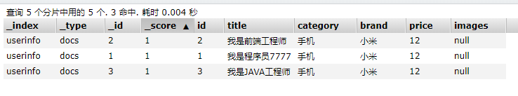

#### 删除操作

```JAVA
  @Test
    public void delete(){
        userInfoRepository.deleteById(1L);
    }
```

索引库信息

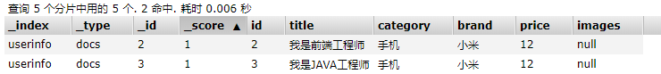

#### 根据id查询

```java
  @Test
    public void findId(){
        Optional<UserInfo> optionalInfo = userInfoRepository.findById(2L);
        UserInfo userInfo = optionalInfo.get();
        System.out.println(userInfo);
    }
```

打印结果

```
UserInfo(id=2, title=我是前端工程师, category=手机, brand=小米, price=12.0, images=null)
```

#### 查询全部，并按照id降序排序

```java
  @Test
    public void find(){
        Iterable<UserInfo> iterable = userInfoRepository.findAll(Sort.by(Sort.Direction.DESC, "id"));
        for (UserInfo userInfo : iterable) {
            System.out.println(userInfo);
        }
    }
```

打印结果

```
UserInfo(id=3, title=我是JAVA工程师, category=手机, brand=小米, price=12.0, images=null)
UserInfo(id=2, title=我是前端工程师, category=手机, brand=小米, price=12.0, images=null)
```

#### 高级查询

高级查询暂时不在本节课中演示，可以先提前查看资料预习：
预习资料链接：https://www.cnblogs.com/ifme/p/12005026.html