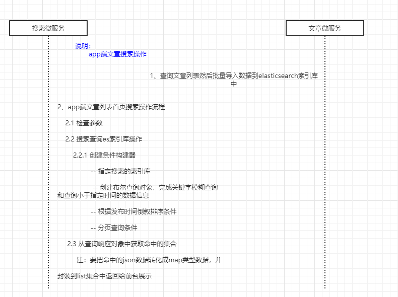
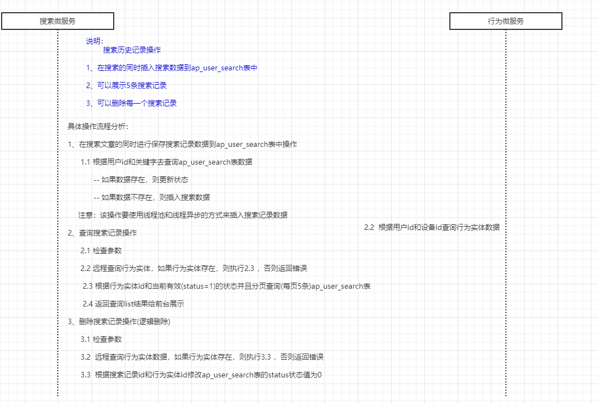
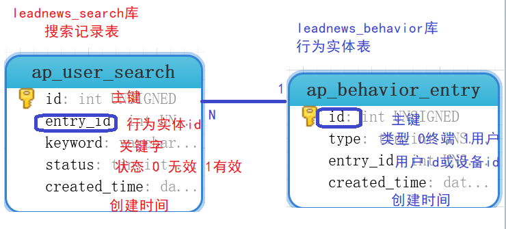
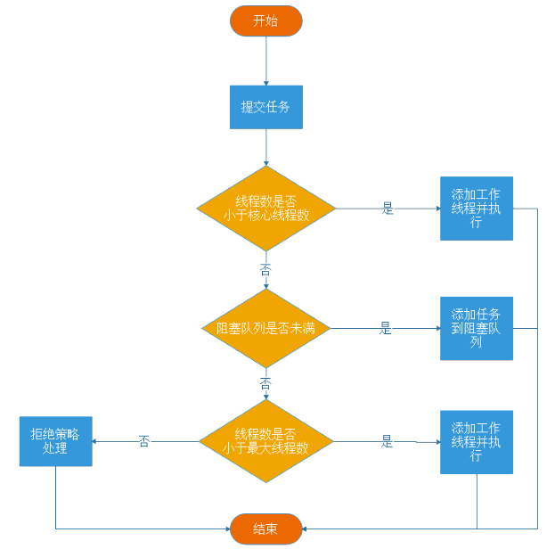
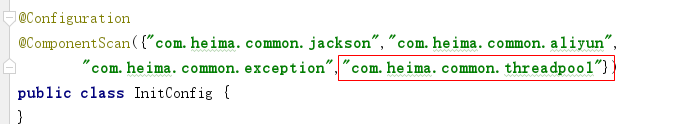

# 第十二章 app端文章搜索

## 目标

- 能够熟悉docker搭建ElasticSearch的环境
- 能够掌握创建索引的思路
- 能够完成app端文章的搜索
- 能够完成app端搜索记录的管理
- 能够完成搜索关键词的联想功能

## 1 搭建ElasticSearch环境

### 1.1 拉取镜像

```shell
docker pull elasticsearch:7.4.0
```

### 1.2 创建容器

```shell
docker run -id --name elasticsearch  -p 9200:9200 -p 9300:9300 -v /usr/share/elasticsearch/plugins:/usr/share/elasticsearch/plugins -e "discovery.type=single-node" elasticsearch:7.4.0
```

### 1.3 配置中文分词器 ik

因为在创建elasticsearch容器的时候，映射了目录，所以可以在宿主机上进行配置ik中文分词器

在去选择ik分词器的时候，需要与elasticsearch的版本好对应上

把资料中的`elasticsearch-analysis-ik-7.4.0.zip`上传到服务器上,放到对应目录（plugins）解压

```shell
#切换目录
cd /usr/share/elasticsearch/plugins
#新建目录
mkdir analysis-ik
cd analysis-ik
#root根目录中拷贝文件
mv elasticsearch-analysis-ik-7.4.0.zip /usr/share/elasticsearch/plugins/analysis-ik
#解压文件
cd /usr/share/elasticsearch/plugins/analysis-ik
unzip elasticsearch-analysis-ik-7.4.0.zip

#如果没有unzip的指令的话需要安装
yum install unzip  #解压命令
yum install zip   #压缩命令
```

### 1.4 测试

http://192.168.200.130:9200


### 1.5 设置开机启动

```shell
docker update --restart=always  elasticsearch
```


### 1.6 安装kibana

拉取镜像

```shell
docker pull kibana:7.4.0
```

创建容器

```shell
docker run -di -p 5601:5601 --link elasticsearch -e "ELASTICSEARCH_URL=http://192.168.200.129:9200" kibana:7.4.0
```

测试:http://192.168.200.130:5601/


## 2 app端文章搜索

### 2.1 需求分析

搜索页面


搜索结果页面


- 用户输入关键可搜索文章列表
- 文章列表展示与home展示一样，当用户点击某一篇文章，可查看文章详情

### 2.2 思路分析

为了加快检索的效率，在查询的时候不会直接从数据库中查询文章，需要在elasticsearch中进行高速检索。

实现思路

- 需要把文章相关的数据存储到es索引库中
- 在搜索微服务中进行检索，查询的是es库，展示文章列表，需要根据关键字进行查询
- 在搜索的时候，用户输入了关键字，需要对当前用户记录搜索历史

需求流程分析：



### 2.3 功能实现

#### 2.3.1 创建索引和映射

在kibana中手动创建索引和映射

```json
PUT app_info_article
{
    "mappings":{
        "properties":{
            "id":{
                "type":"text"
            },
            "publishTime":{
                "type":"date"
            },
            "layout":{
                "type":"short"
            },
            "images":{
                "type":"text"
            },
            "authorId": {
          		"type": "integer"
       		},
            "title":{
                "type":"text",
                "fields":{
                    "keyword":{
                        "type":"keyword",
                        "ignore_above":256
                    }
                },
                "analyzer":"ik_smart"
            }
        }
    }
}
```


创建成功后：

可查询当前索引库，只需要把put请求改为get请求即可。

```java
GET app_info_article
```


#### 2.3.2 搜索微服务搭建

（1）创建工程  heima-leadnews-search


（2）pom依赖

```xml
<dependencies>
    <!-- 引入依赖模块 -->
    <dependency>
        <groupId>com.heima</groupId>
        <artifactId>heima-leadnews-model</artifactId>
    </dependency>
    <dependency>
        <groupId>com.heima</groupId>
        <artifactId>heima-leadnews-common</artifactId>
    </dependency>
    <dependency>
        <groupId>com.heima</groupId>
        <artifactId>heima-leadnews-apis</artifactId>
    </dependency>
    <!-- Spring boot starter -->
    <dependency>
        <groupId>org.springframework.boot</groupId>
        <artifactId>spring-boot-starter-web</artifactId>
    </dependency>
    <dependency>
        <groupId>org.springframework.boot</groupId>
        <artifactId>spring-boot-starter-test</artifactId>
        <scope>test</scope>
    </dependency>
    <dependency>
        <groupId>com.alibaba.cloud</groupId>
        <artifactId>spring-cloud-starter-alibaba-nacos-discovery</artifactId>
    </dependency>
    <dependency>
        <groupId>org.springframework.cloud</groupId>
        <artifactId>spring-cloud-starter-openfeign</artifactId>
    </dependency>

    <!--elasticsearch-->
    <dependency>
        <groupId>org.elasticsearch.client</groupId>
        <artifactId>elasticsearch-rest-high-level-client</artifactId>
        <version>7.4.0</version>
    </dependency>
    <dependency>
        <groupId>org.elasticsearch.client</groupId>
        <artifactId>elasticsearch-rest-client</artifactId>
        <version>7.4.0</version>
    </dependency>
    <dependency>
        <groupId>org.elasticsearch</groupId>
        <artifactId>elasticsearch</artifactId>
        <version>7.4.0</version>
    </dependency>
</dependencies>
```

（3）application.yml

```yaml
server:
  port: 9007
spring:
  application:
    name: leadnews-search
  cloud:
    nacos:
      discovery:
        server-addr: 192.168.200.130:8848
  datasource:
    driver-class-name: com.mysql.jdbc.Driver
    url: jdbc:mysql://localhost:3306/leadnews_search?useUnicode=true&characterEncoding=UTF-8&serverTimezone=UTC
    username: root
    password: root
# 设置Mapper接口所对应的XML文件位置，如果你在Mapper接口中有自定义方法，需要进行该配置
mybatis-plus:
  mapper-locations: classpath*:mapper/*.xml
  # 设置别名包扫描路径，通过该属性可以给包中的类注册别名
  type-aliases-package: com.heima.model.search.pojos

#取消对elastsearch的健康检查
management:
  health:
    elasticsearch:
      enabled: false
#自定义elasticsearch连接配置
elasticsearch:
  host: 192.168.200.130
  port: 9200
```

(4)引导类

```java
package com.heima.search;

import com.baomidou.mybatisplus.extension.plugins.PaginationInterceptor;
import org.mybatis.spring.annotation.MapperScan;
import org.springframework.boot.SpringApplication;
import org.springframework.boot.autoconfigure.SpringBootApplication;
import org.springframework.cloud.client.discovery.EnableDiscoveryClient;
import org.springframework.context.annotation.Bean;

@SpringBootApplication
@MapperScan("com.heima.search.mapper")
@EnableDiscoveryClient
public class SearchApplication {

    public static void main(String[] args) {
        SpringApplication.run(SearchApplication.class,args);
    }

    /**
     * mybatis-plus分页插件
     */
    @Bean
    public PaginationInterceptor paginationInterceptor() {
        return new PaginationInterceptor();
    }
}
```

（5）配置es环境

```java
package com.heima.search.config;

import lombok.Getter;
import lombok.Setter;
import org.apache.http.HttpHost;
import org.elasticsearch.client.RestClient;
import org.elasticsearch.client.RestHighLevelClient;
import org.springframework.boot.context.properties.ConfigurationProperties;
import org.springframework.context.annotation.Bean;
import org.springframework.context.annotation.Configuration;
import org.springframework.context.annotation.PropertySource;

@Getter
@Setter
@Configuration
@ConfigurationProperties(prefix = "elasticsearch")
public class ElasticSearchConfig {
    private String host;
    private int port;

    @Bean
    public RestHighLevelClient client(){
        System.out.println(host);
        System.out.println(port);
        return new RestHighLevelClient(RestClient.builder(
                new HttpHost(
                        host,
                        port,
                        "http"
                )
        ));
    }
}
```


#### 2.3.3 数据初始化

这个只有在项目的数据初始化的时候才会使用，在后期自动审核文章的时候会自动创建索引。

第一，在article文章微服务中集成ElasticSearch（参考搜索微服务中的集成方式）

第二，在文章微服务中编写测试代码

```java
package com.heima.article.test;

import com.heima.article.ArticleApplication;
import com.heima.article.service.ApArticleService;
import com.heima.model.article.pojos.ApArticle;
import org.elasticsearch.action.index.IndexRequest;
import org.elasticsearch.client.RequestOptions;
import org.elasticsearch.client.RestHighLevelClient;
import org.junit.Test;
import org.junit.runner.RunWith;
import org.springframework.beans.factory.annotation.Autowired;
import org.springframework.boot.test.context.SpringBootTest;
import org.springframework.test.context.junit4.SpringRunner;

import java.io.IOException;
import java.util.HashMap;
import java.util.List;
import java.util.Map;

@SpringBootTest(classes = ArticleApplication.class)
@RunWith(SpringRunner.class)
public class ArticleTest {

    @Autowired
    private ApArticleService articleService;

    @Autowired
    private RestHighLevelClient restHighLevelClient;

    @Test
    public void testImportAll() throws IOException {

        List<ApArticle> list = articleService.list();
        for (ApArticle apArticle : list) {
            Map<String, Object> map = new HashMap<String, Object>();
            map.put("id", apArticle.getId());
            map.put("publishTime", apArticle.getPublishTime());
            map.put("layout", apArticle.getLayout());
            map.put("images", apArticle.getImages());
            map.put("authorId", apArticle.getAuthorId());
            map.put("title", apArticle.getTitle());
            IndexRequest indexRequest = new IndexRequest("app_info_article").id(apArticle.getId().toString()).source(map);
            restHighLevelClient.index(indexRequest, RequestOptions.DEFAULT);
        }
    }
}
```

#### 2.3.4 搜索接口定义

```java
package com.heima.apis.search;

import com.heima.model.article.dtos.UserSearchDto;
import com.heima.model.common.dtos.ResponseResult;

public interface ArticleSearchControllerApi {

    /**
     *  搜索文章
     * @param userSearchDto
     * @return
     */
    public ResponseResult search(UserSearchDto userSearchDto);
}
```

UserSearchDto

```java
package com.heima.model.search.dtos;

import com.heima.model.common.annotation.IdEncrypt;
import com.heima.model.search.pojos.ApUserSearch;
import lombok.Data;

import java.util.Date;
import java.util.List;


@Data
public class UserSearchDto {

    // 设备ID
    @IdEncrypt
    Integer equipmentId;
    /**
    * 搜索关键字
    */
    String searchWords;
    /**
    * 当前页
    */
    int pageNum;
    /**
    * 分页条数
    */
    int pageSize;
    /**
    * 最小时间
    */
    Date minBehotTime;

    public int getFromIndex(){
        if(this.pageNum<1)return 0;
        if(this.pageSize<1) this.pageSize = 10;
        return this.pageSize * (pageNum-1);
    }
}
```

#### 2.3.5 业务层实现

创建业务层接口：ApArticleSearchService

```java
package com.heima.search.service;

import com.heima.model.article.dtos.UserSearchDto;
import com.heima.model.common.dtos.ResponseResult;

public interface ApArticleSearchService {

    /**
     ES文章分页搜索
     @return
     */
    ResponseResult search(UserSearchDto userSearchDto);
}
```

实现类：

```java
package com.heima.search.service.impl;

import com.alibaba.fastjson.JSONObject;
import com.heima.model.common.dtos.ResponseResult;
import com.heima.model.common.enums.AppHttpCodeEnum;
import com.heima.model.search.dtos.UserSearchDto;
import com.heima.search.service.ArticleSearchService;
import lombok.extern.log4j.Log4j2;
import org.apache.commons.lang3.StringUtils;
import org.elasticsearch.action.search.SearchRequest;
import org.elasticsearch.action.search.SearchResponse;
import org.elasticsearch.client.RequestOptions;
import org.elasticsearch.client.RestHighLevelClient;
import org.elasticsearch.index.query.BoolQueryBuilder;
import org.elasticsearch.index.query.QueryBuilders;
import org.elasticsearch.search.SearchHit;
import org.elasticsearch.search.builder.SearchSourceBuilder;
import org.elasticsearch.search.sort.SortOrder;
import org.springframework.beans.factory.annotation.Autowired;
import org.springframework.stereotype.Service;

import java.io.IOException;
import java.util.ArrayList;
import java.util.List;
import java.util.Map;


@Service
@Log4j2
public class ArticleSearchServiceImpl implements ArticleSearchService {

    @Autowired
    private RestHighLevelClient restHighLevelClient;


    @Override
    public ResponseResult search(UserSearchDto dto) throws IOException {
        //1.检查参数
        if(dto == null || StringUtils.isBlank(dto.getSearchWords())){
            return ResponseResult.errorResult(AppHttpCodeEnum.PARAM_INVALID);
        }
        //2.从es中检索数据
        SearchRequest searchRequest = new SearchRequest("app_info_article");
        //创建条件构建器
        SearchSourceBuilder searchSourceBuilder = new SearchSourceBuilder();
        //创建布尔查询对象
        BoolQueryBuilder boolQueryBuilder = QueryBuilders.boolQuery();

        //根据关键字模糊查询
        boolQueryBuilder.must(QueryBuilders.wildcardQuery("title",dto.getSearchWords()));
        //查询小于当前时间的数据
        boolQueryBuilder.filter(QueryBuilders.rangeQuery("publishTime").lte(dto.getMinBehotTime()));

        searchSourceBuilder.query(boolQueryBuilder);
        //根据发布时间倒序排序
        searchSourceBuilder.sort("publishTime", SortOrder.DESC);
        //分页查询
        searchSourceBuilder.from(dto.getPageNum());
        searchSourceBuilder.size(dto.getPageSize());
        searchRequest.source(searchSourceBuilder);
        SearchResponse searchResponse = restHighLevelClient.search(searchRequest, RequestOptions.DEFAULT);

        //3.从hits获取数据，封装返回
        List<Map> articleList = new ArrayList<>();

        SearchHit[] hits = searchResponse.getHits().getHits();
        for (SearchHit hit : hits) {
            String sourceAsString = hit.getSourceAsString();
            Map map = JSONObject.parseObject(sourceAsString, Map.class);
            articleList.add(map);
        }
        return ResponseResult.okResult(articleList);
    }

}
```

#### 2.3.6 控制层实现

新建控制器ArticleSearchController

```java
package com.heima.search.controller;

import com.heima.api.search.ArticleSearchControllerApi;
import com.heima.model.article.dtos.UserSearchDto;
import com.heima.model.common.dtos.ResponseResult;
import com.heima.search.service.ApArticleSearchService;
import org.springframework.beans.factory.annotation.Autowired;
import org.springframework.web.bind.annotation.PostMapping;
import org.springframework.web.bind.annotation.RequestBody;
import org.springframework.web.bind.annotation.RequestMapping;
import org.springframework.web.bind.annotation.RestController;

@RestController
@RequestMapping("/api/v1/article/search")
public class ArticleSearchController implements ArticleSearchControllerApi {

    @Autowired
    private ApArticleSearchService apArticleSearchService;

    @PostMapping("/search")
    @Override
    public ResponseResult search(@RequestBody UserSearchDto userSearchDto) {
        return apArticleSearchService.search(userSearchDto);
    }
}
```

#### 2.3.7 测试

首先需要在app的网关中添加搜索微服务的路由配置

```yaml
#搜索微服务
- id: leadnews-search
uri: lb://leadnews-search
predicates:
- Path=/search/**
filters:
- StripPrefix= 1
```

启动项目进行测试，至少要启动文章微服务，用户微服务，搜索微服务，app网关微服务，app前端工程

### 2.5 文章自动审核构建索引

第一，在admin微服务中集成elasticSearch，参考搜索微服务

第二，在admin微服务中的自动审核代码中的saveAppArticle方法的最下方添加如下代码

```java
//TODO es索引创建
Map<String, Object> map = new HashMap<String, Object>();
map.put("id", apArticle.getId());
map.put("publishTime", apArticle.getPublishTime());
map.put("layout", apArticle.getLayout());
map.put("images", apArticle.getImages());
map.put("authorId", apArticle.getAuthorId());
map.put("title", apArticle.getTitle());
IndexRequest indexRequest = new IndexRequest("app_info_article").id(apArticle.getId().toString()).source(map);
try {
    restHighLevelClient.index(indexRequest, RequestOptions.DEFAULT);
} catch (IOException e) {
    e.printStackTrace();
}
```

## 3 app端搜索-搜索记录

### 3.1 需求分析


- 展示用户的搜索记录5条
- 可以删除搜索记录

### 3.2 思路分析

表结构：

ap_user_search APP用户搜索信息表


对应实体：

```java
package com.heima.model.search.pojos;

import com.baomidou.mybatisplus.annotation.IdType;
import com.baomidou.mybatisplus.annotation.TableField;
import com.baomidou.mybatisplus.annotation.TableId;
import com.baomidou.mybatisplus.annotation.TableName;
import lombok.Data;

import java.io.Serializable;
import java.util.Date;

/**
 * <p>
 * APP用户搜索信息表
 * </p>
 *
 * @author itheima
 */
@Data
@TableName("ap_user_search")
public class ApUserSearch implements Serializable {

    private static final long serialVersionUID = 1L;

    /**
     * 主键
     */
    @TableId(value = "id", type = IdType.AUTO)
    private Integer id;

    /**
     * 用户ID
     */
    @TableField("entry_id")
    private Integer entryId;

    /**
     * 搜索词
     */
    @TableField("keyword")
    private String keyword;

    /**
     * 当前状态0 无效 1有效
     */
    @TableField("status")
    private Integer status;

    /**
     * 创建时间
     */
    @TableField("created_time")
    private Date createdTime;

}
```

实现思路：

- 保存用户搜索记录
  - 用户输入关键字进行搜索的异步记录关键字
  - 利用线程池重用，减少创建和销毁线程的性能开销
  - 保存关键字需要先查询行为实体（登录用户或设备用户）
  - 如果是已经存在的关键字，查看状态是否为0，如果为0则修改状态为1


- 加载搜索记录列表

  根据行为实体查询用户搜索记录表，默认加载5条数据

- 删除搜索记录

  根据行为实体和当前id逻辑删除搜索记录，status设置为0

#### 流程需求分析：



数据库表分析：



### 3.3 远程接口定义

在查询用户搜索记录的时候需要根据行为实体查询，所以需要定义一个feign接口

```java
package com.heima.search.feign;

import com.heima.model.behavior.pojos.ApBehaviorEntry;
import com.heima.model.behavior.pojos.ApLikesBehavior;
import com.heima.model.behavior.pojos.ApUnlikesBehavior;
import org.springframework.cloud.openfeign.FeignClient;
import org.springframework.web.bind.annotation.GetMapping;
import org.springframework.web.bind.annotation.RequestParam;

@FeignClient("leadnews-behavior")
public interface BehaviorFeign {

    @GetMapping("/api/v1/behavior_entry/one")
    public ApBehaviorEntry findByUserIdOrEntryId(@RequestParam("userId") Integer userId, @RequestParam("equipmentId") Integer equipmentId);

}
```

在搜索的引导中添加`@EnableFeignClients`注解

### 3.4 线程池准备

使用线程池可以给我们带来很多好处，首先通过线程池中线程的重用，减少创建和销毁线程的性能开销。其次，能控制线程池中的并发数，否则会因为大量的线程争夺CPU资源造成阻塞。

下面是spring框架封装之后的线程池

```java
package com.heima.common.threadpool;

import lombok.Data;
import org.springframework.context.annotation.Bean;
import org.springframework.context.annotation.Configuration;
import org.springframework.scheduling.annotation.EnableAsync;
import org.springframework.scheduling.concurrent.ThreadPoolTaskExecutor;

import java.util.concurrent.ThreadPoolExecutor;

@Data
@Configuration
@EnableAsync //开启异步请求
public class ThreadPoolConfig {

    private static final int corePoolSize = 10;   // 核心线程数（默认线程数）
    private static final int maxPoolSize = 100;   // 最大线程数
    private static final int keepAliveTime = 10;  // 允许线程空闲时间（单位：默认为秒）
    private static final int queueCapacity = 500; // 缓冲队列数

    /**
     * 默认异步线程池
     * @return
     */
    @Bean("taskExecutor")
    public ThreadPoolTaskExecutor taskExecutor(){
        ThreadPoolTaskExecutor pool = new ThreadPoolTaskExecutor();
        pool.setThreadNamePrefix("--------------全局线程池-----------------");
        pool.setCorePoolSize(corePoolSize);
        pool.setMaxPoolSize(maxPoolSize);
        pool.setKeepAliveSeconds(keepAliveTime);
        pool.setQueueCapacity(queueCapacity);
        // 直接在execute方法的调用线程中运行
        pool.setRejectedExecutionHandler(new ThreadPoolExecutor.CallerRunsPolicy());
        // 初始化
        pool.initialize();
        return pool;
    }

}
```

Reject策略预定义有四种： 

- ThreadPoolExecutor.AbortPolicy策略，是默认的策略,处理程序遭到拒绝将抛出运行时 RejectedExecutionException。 
- ThreadPoolExecutor.CallerRunsPolicy策略 ,调用者的线程会执行该任务,如果执行器已关闭,则丢弃. 
- ThreadPoolExecutor.DiscardPolicy策略，不能执行的任务将被丢弃. 
- ThreadPoolExecutor.DiscardOldestPolicy策略，如果执行程序尚未关闭，则位于工作队列头部的任务将被删除，然后重试执行程序（如果再次失败，则重复此过程）

线程池工作流程：



在搜索的微服务中增加配置



### 3.5 功能实现

#### 3.5.1 接口定义

新建接口

```java
package com.heima.apis.search;

import com.heima.model.article.dtos.UserSearchDto;
import com.heima.model.common.dtos.ResponseResult;

public interface ApUserSearchControllerApi {


    /**
     * 查询搜索历史
     * @param userSearchDto
     * @return
     */
    public ResponseResult findUserSearch(UserSearchDto userSearchDto) ;

    /**
     * 删除搜索历史
     * @param userSearchDto
     * @return
     */
    public ResponseResult delUserSearch(UserSearchDto userSearchDto) ;

}
```

修改UserSearchDto，添加属性

```java
package com.heima.model.search.dtos;

import com.heima.model.common.annotation.IdEncrypt;
import com.heima.model.search.pojos.ApUserSearch;
import lombok.Data;

import java.util.Date;
import java.util.List;


@Data
public class UserSearchDto {
	// 设备ID
    @IdEncrypt
    Integer equipmentId;
    /**
    * 搜索关键字
    */
    String searchWords;
    /**
    * 当前页
    */
    int pageNum;
    /**
    * 分页条数
    */
    int pageSize;
    /**
    * 最小时间
    */
    Date minBehotTime;
    /**
    * 接收搜索历史记录id
    */
   Integer id;

    public int getFromIndex(){
        if(this.pageNum<1)return 0;
        if(this.pageSize<1) this.pageSize = 10;
        return this.pageSize * (pageNum-1);
    }
    
}
```


#### 3.5.2  mapper

```java
package com.heima.search.mapper;

import com.baomidou.mybatisplus.core.mapper.BaseMapper;
import com.heima.model.search.pojos.ApUserSearch;
import org.apache.ibatis.annotations.Mapper;

/**
 * <p>
 * APP用户搜索信息表 Mapper 接口
 * </p>
 *
 * @author itheima
 */
@Mapper
public interface ApUserSearchMapper extends BaseMapper<ApUserSearch> {

}
```

#### 3.5.3 业务层

在业务层中有一个插入的方法，是为了让用户进行检索的时候插入当前搜索记录

```java
package com.heima.search.service;

import com.baomidou.mybatisplus.extension.service.IService;
import com.heima.model.article.dtos.UserSearchDto;
import com.heima.model.common.dtos.ResponseResult;
import com.heima.model.user.pojos.ApUserSearch;

/**
 * <p>
 * APP用户搜索信息表 服务类
 * </p>
 *
 * @author itheima
 */
public interface ApUserSearchService extends IService<ApUserSearch> {

    /**
     查询搜索历史
     @param userSearchDto
     @return
     */
    ResponseResult findUserSearch(UserSearchDto userSearchDto);

    /**
     删除搜索历史
     @param userSearchDto
     @return
     */
    ResponseResult delUserSearch(UserSearchDto userSearchDto);

    /**
     插入搜索记录
     @param
     @return
     */
    void insert(Integer entryId,String searchWords);

}
```

因为需要获取到当前登录用户，所以需要增加获取用户的代码

```java
package com.heima.search.filter;

import com.heima.model.user.pojos.ApUser;
import com.heima.utils.threadlocal.AppThreadLocalUtils;
import org.springframework.core.annotation.Order;
import org.springframework.web.filter.GenericFilterBean;

import javax.servlet.FilterChain;
import javax.servlet.ServletException;
import javax.servlet.ServletRequest;
import javax.servlet.ServletResponse;
import javax.servlet.annotation.WebFilter;
import javax.servlet.http.HttpServletRequest;
import javax.servlet.http.HttpServletResponse;
import java.io.IOException;

@Order(1)
@WebFilter(filterName = "appTokenFilter", urlPatterns = "/*")
public class AppTokenFilter extends GenericFilterBean {
    @Override
    public void doFilter(ServletRequest servletRequest, ServletResponse servletResponse, FilterChain filterChain) throws IOException, ServletException {
        HttpServletRequest request = (HttpServletRequest) servletRequest;
        HttpServletResponse response = (HttpServletResponse) servletResponse;
        //得到header中的信息
        String userId = request.getHeader("userId");
        if (userId != null && Integer.valueOf(userId).intValue() != 0) {
            ApUser apUser = new ApUser();
            apUser.setId(Integer.valueOf(userId));
            AppThreadLocalUtils.setUser(apUser);
        }
        filterChain.doFilter(request, response);
    }
}
```

在引导类中添加注解`@ServletComponentScan`

------


业务层实现类：

在插入方法中使用注解`@Async("taskExecutor")`进行异步调用，使得该方法加入线程池运行，这个值为在是线程池中的方法名称，需要与`@EnableAsync`一块使用，之前在创建线程池的类中已经开启

```java
package com.heima.search.service.impl;

import com.baomidou.mybatisplus.core.metadata.IPage;
import com.baomidou.mybatisplus.core.toolkit.Wrappers;
import com.baomidou.mybatisplus.extension.plugins.pagination.Page;
import com.baomidou.mybatisplus.extension.service.impl.ServiceImpl;
import com.heima.model.behavior.pojos.ApBehaviorEntry;
import com.heima.model.common.dtos.ResponseResult;
import com.heima.model.common.enums.AppHttpCodeEnum;
import com.heima.model.search.dtos.UserSearchDto;
import com.heima.model.search.pojos.ApUserSearch;
import com.heima.model.user.pojos.ApUser;
import com.heima.search.feign.BehaviorFeign;
import com.heima.search.mapper.ApUserSearchMapper;
import com.heima.search.service.ApUserSearchService;
import com.heima.utils.threadlocal.AppThreadLocalUtils;
import lombok.extern.log4j.Log4j2;
import org.springframework.beans.factory.annotation.Autowired;
import org.springframework.scheduling.annotation.Async;
import org.springframework.stereotype.Service;

import java.util.Date;

@Service
@Log4j2
public class ApUserSearchServiceImpl extends ServiceImpl<ApUserSearchMapper, ApUserSearch> implements ApUserSearchService {
    //查询搜索记录
    @Override
    public ResponseResult findUserSearch(UserSearchDto userSearchDto) {
        //1.检查数据
        if(userSearchDto.getPageSize() > 50){
            return ResponseResult.errorResult(AppHttpCodeEnum.PARAM_INVALID);
        }

        //2.查询行为实体
        ApBehaviorEntry apBehaviorEntry = getEntry(userSearchDto);
        if(apBehaviorEntry == null){
            return ResponseResult.errorResult(AppHttpCodeEnum.PARAM_INVALID);
        }

        //3.分页查询，默认查询5条数据返回
        IPage pageParam = new Page(0, userSearchDto.getPageSize());
        IPage page = page(pageParam, Wrappers.<ApUserSearch>lambdaQuery().eq(ApUserSearch::getEntryId, apBehaviorEntry.getId())
                .eq(ApUserSearch::getStatus, 1));

        return ResponseResult.okResult(page.getRecords());
    }


    @Autowired
    private BehaviorFeign behaviorFeign;

    /**
     * 获取行为实体
     * @param userSearchDto
     * @return
     */
    private ApBehaviorEntry getEntry(UserSearchDto userSearchDto) {
        ApUser user = AppThreadLocalUtils.getUser();
        return behaviorFeign.findByUserIdOrEntryId(user.getId(),userSearchDto.getEquipmentId());
    }
	//删除搜索记录
    @Override
    public ResponseResult delUserSearch(UserSearchDto userSearchDto) {
        //1.检查参数
        if(userSearchDto.getId() == null){
            return ResponseResult.errorResult(AppHttpCodeEnum.PARAM_INVALID);
        }
        //2.更新当前搜索记录的状态  status  0
        ApBehaviorEntry apBehaviorEntry = getEntry(userSearchDto);
        if(apBehaviorEntry == null){
            return ResponseResult.errorResult(AppHttpCodeEnum.PARAM_INVALID);
        }
        update(Wrappers.<ApUserSearch>lambdaUpdate().eq(ApUserSearch::getId,userSearchDto.getId()).eq(ApUserSearch::getEntryId,apBehaviorEntry.getId())
                .set(ApUserSearch::getStatus,0));
        return ResponseResult.okResult(AppHttpCodeEnum.SUCCESS);
    }
	
    //插入搜索记录
    @Override
    @Async("taskExecutor")
    public void insert(Integer entryId, String searchWords) {
//        int a = 1/0;
        //1.查询当前搜索记录
        ApUserSearch apUserSearch = getOne(Wrappers.<ApUserSearch>lambdaQuery().eq(ApUserSearch::getEntryId, entryId).eq(ApUserSearch::getKeyword, searchWords));

        //2.如果存在 更新状态
        if(apUserSearch != null && apUserSearch.getStatus() == 1){
            log.info("当前关键字已存在，无需再次保存");
            return;
        }else if(apUserSearch != null && apUserSearch.getStatus() == 0){
            apUserSearch.setStatus(1);
            updateById(apUserSearch);
            return;
        }

        //3.如果不存在，保存新的数据
        apUserSearch = new ApUserSearch();
        apUserSearch.setEntryId(entryId);
        apUserSearch.setStatus(1);
        apUserSearch.setKeyword(searchWords);
        apUserSearch.setCreatedTime(new Date());
        save(apUserSearch);

    }
}
```

修改ApArticleSearchServiceImpl中的esArticleSearch方法，检索的时候存储当前搜索记录

```java
package com.heima.search.service.impl;

import com.alibaba.fastjson.JSONObject;
import com.heima.model.behavior.pojos.ApBehaviorEntry;
import com.heima.model.common.dtos.ResponseResult;
import com.heima.model.common.enums.AppHttpCodeEnum;
import com.heima.model.search.dtos.UserSearchDto;
import com.heima.model.user.pojos.ApUser;
import com.heima.search.feign.BehaviorFeign;
import com.heima.search.service.ApUserSearchService;
import com.heima.search.service.ArticleSearchService;
import com.heima.utils.threadlocal.AppThreadLocalUtils;
import lombok.extern.log4j.Log4j2;
import org.apache.commons.lang3.StringUtils;
import org.elasticsearch.action.search.SearchRequest;
import org.elasticsearch.action.search.SearchResponse;
import org.elasticsearch.client.RequestOptions;
import org.elasticsearch.client.RestHighLevelClient;
import org.elasticsearch.index.query.BoolQueryBuilder;
import org.elasticsearch.index.query.Operator;
import org.elasticsearch.index.query.QueryBuilders;
import org.elasticsearch.search.SearchHit;
import org.elasticsearch.search.builder.SearchSourceBuilder;
import org.elasticsearch.search.sort.SortOrder;
import org.springframework.beans.factory.annotation.Autowired;
import org.springframework.stereotype.Service;

import java.io.IOException;
import java.util.ArrayList;
import java.util.List;
import java.util.Map;


@Service
@Log4j2
public class ArticleSearchServiceImpl implements ArticleSearchService {

    @Autowired
    private RestHighLevelClient restHighLevelClient;

    @Autowired
    private ApUserSearchService apUserSearchService;

    @Override
    public ResponseResult search(UserSearchDto dto) throws IOException {
        //1.检查参数
        if(dto == null || StringUtils.isBlank(dto.getSearchWords())){
            return ResponseResult.errorResult(AppHttpCodeEnum.PARAM_INVALID);
        }
        //只有在首页查询的时候才会保存
        if(dto.getFromIndex() == 0){
            ApBehaviorEntry apBehaviorEntry = getEntry(dto);
            if(apBehaviorEntry == null){
                return ResponseResult.errorResult(AppHttpCodeEnum.PARAM_INVALID);
            }
            apUserSearchService.insert(apBehaviorEntry.getId(),dto.getSearchWords());
        }


        //2.从es中检索数据
        SearchRequest searchRequest = new SearchRequest("app_info_article");
        //创建条件构建器
        SearchSourceBuilder searchSourceBuilder = new SearchSourceBuilder();
        //创建布尔查询对象
        BoolQueryBuilder boolQueryBuilder = QueryBuilders.boolQuery();

        //根据关键字模糊查询
        boolQueryBuilder.must(QueryBuilders.wildcardQuery("title",dto.getSearchWords()));
        //查询小于当前时间的数据
        boolQueryBuilder.filter(QueryBuilders.rangeQuery("publishTime").lte(dto.getMinBehotTime()));

        searchSourceBuilder.query(boolQueryBuilder);
        //根据发布时间倒序排序
        searchSourceBuilder.sort("publishTime", SortOrder.DESC);
        //分页查询
        searchSourceBuilder.from(dto.getPageNum());
        searchSourceBuilder.size(dto.getPageSize());
        searchRequest.source(searchSourceBuilder);
        SearchResponse searchResponse = restHighLevelClient.search(searchRequest, RequestOptions.DEFAULT);

        //3.从hits获取数据，封装返回
        List<Map> articleList = new ArrayList<>();

        SearchHit[] hits = searchResponse.getHits().getHits();
        for (SearchHit hit : hits) {
            String sourceAsString = hit.getSourceAsString();
            Map map = JSONObject.parseObject(sourceAsString, Map.class);
            articleList.add(map);
        }
        return ResponseResult.okResult(articleList);
    }

    @Autowired
    private BehaviorFeign behaviorFeign;

    /**
     * 获取行为实体
     * @param userSearchDto
     * @return
     */
    private ApBehaviorEntry getEntry(UserSearchDto userSearchDto) {
        ApUser user = AppThreadLocalUtils.getUser();
        return behaviorFeign.findByUserIdOrEntryId(user.getId(),userSearchDto.getEquipmentId());
    }

}
```

#### 3.5.4 控制器

```java
package com.heima.search.controller.v1;

import com.heima.apis.search.ApUserSearchControllerApi;
import com.heima.model.common.dtos.ResponseResult;
import com.heima.model.search.dtos.UserSearchDto;
import com.heima.search.service.ApUserSearchService;
import lombok.extern.slf4j.Slf4j;
import org.springframework.beans.factory.annotation.Autowired;
import org.springframework.web.bind.annotation.PostMapping;
import org.springframework.web.bind.annotation.RequestBody;
import org.springframework.web.bind.annotation.RequestMapping;
import org.springframework.web.bind.annotation.RestController;

/**
 * <p>
 * APP用户搜索信息表 前端控制器
 * </p>
 *
 * @author itheima
 */
@Slf4j
@RestController
@RequestMapping("/api/v1/history")
public class ApUserSearchController implements ApUserSearchControllerApi {

    @Autowired
    private ApUserSearchService apUserSearchService;

    @PostMapping("/load")
    @Override
    public ResponseResult findUserSearch(@RequestBody UserSearchDto userSearchDto) {
        return apUserSearchService.findUserSearch(userSearchDto);
    }

    @PostMapping("/del")
    @Override
    public ResponseResult delUserSearch(@RequestBody UserSearchDto userSearchDto) {
        return apUserSearchService.delUserSearch(userSearchDto);
    }

}
```

#### 3.5.5 测试

打开前端页面进行联调测试

## 4 app端搜索-关键字联想词

### 4.1 需求分析


- 根据用户输入的关键字展示联想词

### 4.2 思路分析

表结构：

ap_associate_words 联想词表


对应实体：

```java
package com.heima.model.search.pojos;

import com.baomidou.mybatisplus.annotation.IdType;
import com.baomidou.mybatisplus.annotation.TableField;
import com.baomidou.mybatisplus.annotation.TableId;
import com.baomidou.mybatisplus.annotation.TableName;
import lombok.Data;

import java.io.Serializable;
import java.util.Date;

/**
 * <p>
 * 联想词表
 * </p>
 *
 * @author itheima
 */
@Data
@TableName("ap_associate_words")
public class ApAssociateWords implements Serializable {

    private static final long serialVersionUID = 1L;

    @TableId(value = "id", type = IdType.AUTO)
    private Integer id;

    /**
     * 联想词
     */
    @TableField("associate_words")
    private String associateWords;

    /**
     * 创建时间
     */
    @TableField("created_time")
    private Date createdTime;

}
```

根据当前时间进行检索数据

### 4.3 功能实现

#### 4.3.1 接口定义

新建接口

```java
package com.heima.apis.search;

import com.heima.model.common.dtos.ResponseResult;
import com.heima.model.search.dtos.UserSearchDto;

public interface ApAssociateWordsControllerApi {

    /**
     联想词
     @param userSearchDto
     @return
     */
    ResponseResult search(UserSearchDto userSearchDto);
}
```

#### 4.3.2 mapper

新建联想词mapper接口

```java
package com.heima.search.mapper;

import com.baomidou.mybatisplus.core.mapper.BaseMapper;
import com.heima.model.search.pojos.ApAssociateWords;
import org.apache.ibatis.annotations.Mapper;

/**
 * <p>
 * 联想词表 Mapper 接口
 * </p>
 *
 * @author itheima
 */
@Mapper
public interface ApAssociateWordsMapper extends BaseMapper<ApAssociateWords> {

}
```

#### 4.3.3 业务层

新建联想词业务层接口

```java
package com.heima.search.service;

import com.baomidou.mybatisplus.extension.service.IService;
import com.heima.model.common.dtos.ResponseResult;
import com.heima.model.search.dtos.UserSearchDto;
import com.heima.model.search.pojos.ApAssociateWords;

/**
 * <p>
 * 联想词表 服务类
 * </p>
 *
 * @author itheima
 */
public interface ApAssociateWordsService extends IService<ApAssociateWords> {

    /**
     联想词
     @param userSearchDto
     @return
     */
    ResponseResult search(UserSearchDto userSearchDto);

}
```

实现类

```java
package com.heima.search.service.impl;

import com.baomidou.mybatisplus.core.metadata.IPage;
import com.baomidou.mybatisplus.core.toolkit.Wrappers;
import com.baomidou.mybatisplus.extension.plugins.pagination.Page;
import com.baomidou.mybatisplus.extension.service.impl.ServiceImpl;
import com.heima.model.common.dtos.ResponseResult;
import com.heima.model.common.enums.AppHttpCodeEnum;
import com.heima.model.search.dtos.UserSearchDto;
import com.heima.model.search.pojos.ApAssociateWords;
import com.heima.search.mapper.ApAssociateWordsMapper;
import com.heima.search.service.ApAssociateWordsService;
import lombok.extern.slf4j.Slf4j;
import org.springframework.stereotype.Service;

/**
 * <p>
 * 联想词表 服务实现类
 * </p>
 *
 * @author itheima
 */
@Slf4j
@Service
public class ApAssociateWordsServiceImpl extends ServiceImpl<ApAssociateWordsMapper, ApAssociateWords> implements ApAssociateWordsService {

     @Override
    public ResponseResult search(UserSearchDto dto) {
        //1.检查参数
        if (dto.getPageSize() > 50) {
            return ResponseResult.okResult(AppHttpCodeEnum.PARAM_INVALID);
        }
        //2.模糊查询数据
        IPage pageParam = new Page(0, dto.getPageSize());
        List<ApAssociateWords> list = list();
        IPage page = page(pageParam, Wrappers.<ApAssociateWords>lambdaQuery().like(ApAssociateWords::getAssociateWords, dto.getSearchWords()));
        return ResponseResult.okResult(page.getRecords());
    }
}
```

#### 4.3.4  控制器

新建联想词控制器

```java
package com.heima.search.controller.v1;

import com.heima.apis.search.ApAssociateWordsControllerApi;
import com.heima.model.common.dtos.ResponseResult;
import com.heima.model.search.dtos.UserSearchDto;
import com.heima.search.service.ApAssociateWordsService;
import lombok.extern.slf4j.Slf4j;
import org.springframework.beans.factory.annotation.Autowired;
import org.springframework.web.bind.annotation.PostMapping;
import org.springframework.web.bind.annotation.RequestBody;
import org.springframework.web.bind.annotation.RequestMapping;
import org.springframework.web.bind.annotation.RestController;

/**
 * <p>
 * 联想词表 前端控制器
 * </p>
 *
 * @author itheima
 */
@Slf4j
@RestController
@RequestMapping("/api/v1/associate")
public class ApAssociateWordsController implements ApAssociateWordsControllerApi {

    @Autowired
    private ApAssociateWordsService apAssociateWordsService;

    @PostMapping("/search")
    @Override
    public ResponseResult search(@RequestBody UserSearchDto userSearchDto) {
        return apAssociateWordsService.search(userSearchDto);
    }
}
```

#### 4.3.5 测试

同样，打开前端联调测试效果

### 4.4 优化改造关键字联想词

#### 4.4.1现有问题

每次输入关键字的时候都会调用后台获取数据，频繁的发起请求查询数据库，并且是模糊查询

随着联想词的搜索越来越频繁，每次从数据库查询非常占用数据库资源，同时查询效率比较低

#### 4.4.2 优化方案Trie树

优化方案：

- 数据能够缓存到redis
- 构造Trie树数据结构，高效查询数据

Trie树：又称单词查找树，Trie树，是一种树形结构，是一种哈希树的变种。典型应用是用于统计，排
序和保存大量的字符串（但不仅限于字符串），所以经常被搜索引擎系统用于文本词频统计。它的优点
是：利用字符串的公共前缀来减少查询时间，最大限度地减少无谓的字符串比较，查询效率比哈希树
高。

**词组为：黑马程序员、黑马头条、黑马旅游、黑猫**


- 根节点不包含字符，除根节点外的每一个子节点都包含一个字符。

- 从根节点到某一节点，路径上经过的字符连接起来，就是该节点对应的字符串。

- 每个单词的公共前缀作为一个字符节点保存。

工具类TrieNode

```java
package com.heima.search.model;

import java.util.HashMap;
import java.util.Map;

public class TrieNode {
    public char var;
    public boolean isWord;
    public Map<Character,TrieNode> children = new HashMap<>();
    public boolean containLongTail = false;
    public TrieNode(){}
    public TrieNode(char c){
        TrieNode node = new TrieNode();
        node.var = c;
    }
}
```


```java
package com.heima.search.model;

import java.util.ArrayList;
import java.util.List;

public class Trie {
    private TrieNode root;
    public Trie(){
        root = new TrieNode();
        root.var = ' ';
    }
    /**
     * 插入trie树
     * @param word
     */
    public void insert(String word){
        TrieNode ws = root;
        for(int i = 0; i < word.length(); i++){
            char c = word.charAt(i);
            if(!ws.children.keySet().contains(c)){
                ws.children.put(c,new TrieNode(c));
            }
            ws = ws.children.get(c);
        }
        ws.isWord = true;
    }

    /**
     * 查询trie树
     * @param prefix
     * @return
     */
    public List<String> startWith(String prefix){
        List<String> match = new ArrayList<>();
        TrieNode ws = root;
        for(int i = 0; i < prefix.length(); i++){
            char c = prefix.charAt(i);
            if(!ws.children.keySet().contains(c)) return match;
            ws = ws.children.get(c);
            if(!ws.containLongTail){
                for (char cc : ws.children.keySet()){
                    match.add(prefix+cc);
                }
            }else{
                //包含长尾词 从map中取
            }
        }
        return match;
    }

    public static void main(String[] args) {
        Trie t = new Trie();
        t.insert("黑马");
        List<String> ret = t.startWith("黑");
        System.out.println(ret);
    }
}
```

#### 4.4.3 搭建redis环境

(1)使用docker创建容器

拉取镜像

```shell
docker pull redis
```

创建容器并设置开机自启

```shell
docker run -d --name redis --restart=always -p 6379:6379 redis --requirepass "1234qwer"
```

（2）在common模块中集成redis

新建redis.properties文件

```properties
#redis config
spring.redis.host=192.168.200.130
spring.redis.port=6379
#spring.redis.password=123456
spring.redis.password=1234qwer
spring.redis.timeout=90000
#连接池的最大数据库连接数
spring.redis.lettuce.pool.max-active=8
#连接池的最大空闲数
spring.redis.lettuce.pool.max-idle=8
#连接池的最大建立连接等待时间  -1 为无限等待
spring.redis.lettuce.pool.max-wait=-1
#连接池的最大空闲数  0 表示不限制
spring.redis.lettuce.pool.min-idle=0
```

新建配置类

```java
package com.heima.common.redis;

import org.springframework.boot.context.properties.ConfigurationProperties;
import org.springframework.context.annotation.Configuration;
import org.springframework.context.annotation.PropertySource;

@Configuration
@PropertySource("classpath:redis.properties")
@ConfigurationProperties(prefix = "spring.redis")
public class RedisConfiguration {
    
}
```

(3)在搜索微服务中集成redis

```java
package com.heima.search.config;

import org.springframework.context.annotation.ComponentScan;
import org.springframework.context.annotation.Configuration;

@Configuration
@ComponentScan("com.heima.common.redis")
public class RedisConfig {
}
```

#### 4.4.4 改造现有service

在ApAssociateWordsService中新增V2版本的方法

```java
/**
     联想词 V2
     @param userSearchDto
     @return
     */
ResponseResult searchV2(UserSearchDto userSearchDto);
```

实现方法

```java
@Autowired
private StringRedisTemplate redisTemplate;

@Override
public ResponseResult searchV2(UserSearchDto dto) {
    //1.从缓存中获取数据
    String assoStr = redisTemplate.opsForValue().get("associate_list");
    List<ApAssociateWords> apAssociateWords = null;
    if(StringUtils.isNotEmpty(assoStr)){
        //2.缓存中存在，直接拿数据
        apAssociateWords = JSON.parseArray(assoStr, ApAssociateWords.class);
    }else {
        //3.缓存中不存在，从数据库中获取数据，存储到redis
        apAssociateWords = list();
        redisTemplate.opsForValue().set("associate_list", JSON.toJSONString(apAssociateWords));
    }
    //4.构建trie数据结构，从trie中获取数据，封装返回
    Trie t = new Trie();
    for (ApAssociateWords apAssociateWord : apAssociateWords) {
        t.insert(apAssociateWord.getAssociateWords());
    }

    List<String> ret = t.startWith(dto.getSearchWords());
    List<ApAssociateWords> resultList  = new ArrayList<>();
    for (String s : ret) {
        ApAssociateWords aaw = new ApAssociateWords();
        aaw.setAssociateWords(s);
        resultList.add(aaw);
    }

    return ResponseResult.okResult(resultList);
}
```

#### 4.4.5 改造现有controller

新建v2版本的控制器

```java
package com.heima.search.controller.v2;

import com.heima.apis.search.ApAssociateWordsControllerApi;
import com.heima.model.common.dtos.ResponseResult;
import com.heima.model.search.dtos.UserSearchDto;
import com.heima.search.service.ApAssociateWordsService;
import org.springframework.beans.factory.annotation.Autowired;
import org.springframework.web.bind.annotation.PostMapping;
import org.springframework.web.bind.annotation.RequestBody;
import org.springframework.web.bind.annotation.RequestMapping;
import org.springframework.web.bind.annotation.RestController;

@RestController
@RequestMapping("/api/v2/associate")
public class ApAssociateWordsV2Controller implements ApAssociateWordsControllerApi {

    @Autowired
    private ApAssociateWordsService apAssociateWordsService;

    @PostMapping("/search")
    @Override
    public ResponseResult search(@RequestBody UserSearchDto dto) {
        return apAssociateWordsService.searchV2(dto);
    }
}
```

#### 4.4.6 测试

