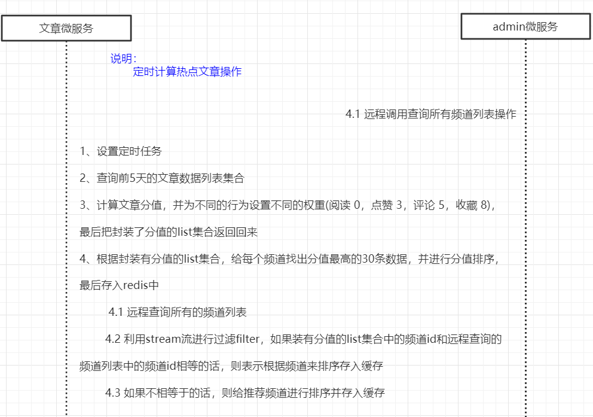

# 第十三章 热点文章计算

## 今日目标

- 能够理解什么是实时流式计算
- 能够理解kafkaStream处理实时流式计算的流程
- 能够完成kafkaStream实时流式计算的入门案例
- 能够完成app端热点文章计算的功能
- 能够完成app端文章列表接口的优化改造

## 1 实时流式计算

### 1.1 概念

一般流式计算会与批量计算相比较。在流式计算模型中，输入是持续的，可以认为在时间上是无界的，也就意味着，永远拿不到全量数据去做计算。同时，计算结果是持续输出的，也即计算结果在时间上也是无界的。流式计算一般对实时性要求较高，同时一般是先定义目标计算，然后数据到来之后将计算逻辑应用于数据。同时为了提高计算效率，往往尽可能采用增量计算代替全量计算。


流式计算就相当于上图的右侧扶梯，是可以源源不断的产生数据，源源不断的接收数据，没有边界。

### 1.2 应用场景

- 日志分析

  网站的用户访问日志进行实时的分析，计算访问量，用户画像，留存率等等，实时的进行数据分析，帮助企业进行决策

- 大屏看板统计

  可以实时的查看网站注册数量，订单数量，购买数量，金额等。

- 公交实时数据

  可以随时更新公交车方位，计算多久到达站牌等

- 实时文章分值计算

  头条类文章的分值计算，通过用户的行为实时文章的分值，分值越高就越被推荐。

### 1.3 技术方案选型

- Hadoop 

  

- Apche Storm

  Storm 是一个分布式实时大数据处理系统，可以帮助我们方便地处理海量数据，具有高可靠、高容错、高扩展的特点。是流式框架，有很高的数据吞吐能力。

- Kafka Stream 

  可以轻松地将其嵌入任何Java应用程序中，并与用户为其流应用程序所拥有的任何现有打包，部署和操作工具集成。

## 2 Kafka Stream 

### 2.1 概述

Kafka Stream是Apache Kafka从0.10版本引入的一个新Feature。它是提供了对存储于Kafka内的数据进行流式处理和分析的功能。

Kafka Stream的特点如下：

- Kafka Stream提供了一个非常简单而轻量的Library，它可以非常方便地嵌入任意Java应用中，也可以任意方式打包和部署
- 除了Kafka外，无任何外部依赖
- 充分利用Kafka分区机制实现水平扩展和顺序性保证
- 通过可容错的state store实现高效的状态操作（如windowed join和aggregation）
- 支持正好一次处理语义
- 提供记录级的处理能力，从而实现毫秒级的低延迟
- 支持基于事件时间的窗口操作，并且可处理晚到的数据（late arrival of records）
- 同时提供底层的处理原语Processor（类似于Storm的spout和bolt），以及高层抽象的DSL（类似于Spark的map/group/reduce）

### 2.2 Kafka Streams的关键概念

（1）Stream处理拓扑

- **流**是Kafka Stream提出的最重要的抽象概念：它表示一个无限的，不断更新的数据集。流是一个有序的，可重放（反复的使用），不可变的容错序列，数据记录的格式是键值对（key-value）。
- 通过Kafka Streams编写一个或多个的计算逻辑的处理器拓扑。其中处理器拓扑是一个由流（边缘）连接的流处理（节点）的图。
- **流处理器**是`处理器拓扑`中的一个节点；它表示一个处理的步骤，用来转换流中的数据（从拓扑中的上游处理器一次接受一个输入消息，并且随后产生一个或多个输出消息到其下游处理器中）。 

（2）在拓扑中有两个特别的处理器：

- **源处理器（Source Processor）**：源处理器是一个没有任何上游处理器的特殊类型的流处理器。它从一个或多个kafka主题生成输入流。通过消费这些主题的消息并将它们转发到下游处理器。
- **Sink处理器**：sink处理器是一个没有下游流处理器的特殊类型的流处理器。它接收上游流处理器的消息发送到一个指定的**Kafka主题**。


### 2.3 KStream&KTable

（1）数据结构类似于map,如下图，key-value键值对


（2）KStream

**KStream**数据流（data stream），即是一段顺序的，可以无限长，不断更新的数据集。
数据流中比较常记录的是事件，这些事件可以是一次鼠标点击（click），一次交易，或是传感器记录的位置数据。

KStream负责抽象的，就是数据流。与Kafka自身topic中的数据一样，类似日志，每一次操作都是**向其中插入（insert）新数据。**

为了说明这一点，让我们想象一下以下两个数据记录正在发送到流中：

（“ alice”，1）->（“” alice“，3）

如果您的流处理应用是要总结每个用户的价值，它将返回`4`了`alice`。为什么？因为第二条数据记录将不被视为先前记录的更新。（insert）新数据

（3）KTable

**KTable**传统数据库，包含了各种存储了大量状态（state）的表格。KTable负责抽象的，就是表状数据。每一次操作，都是**更新插入（update）**

为了说明这一点，让我们想象一下以下两个数据记录正在发送到流中：

（“ alice”，1）->（“” alice“，3）

如果您的流处理应用是要总结每个用户的价值，它将返回`3`了`alice`。为什么？因为第二条数据记录将被视为先前记录的更新。


**KStream - 每个新数据都包含了部分信息。**

**KTable - 每次更新都合并到原记录上。**

### 2.4 Kafka Stream入门案例编写

（1）引入依赖

在之前的kafka-demo工程的pom文件中引入

```xml
<dependency>
    <groupId>org.apache.kafka</groupId>
    <artifactId>kafka-streams</artifactId>
    <version>${kafka.client.version}</version>
    <exclusions>
        <exclusion>
            <artifactId>connect-json</artifactId>
            <groupId>org.apache.kafka</groupId>
        </exclusion>
        <exclusion>
            <groupId>org.apache.kafka</groupId>
            <artifactId>kafka-clients</artifactId>
        </exclusion>
    </exclusions>
</dependency>
```

(2)创建类

```java
package com.itheima.kafka.simple;

import org.apache.kafka.common.serialization.Serdes;
import org.apache.kafka.streams.*;
import org.apache.kafka.streams.kstream.*;

import java.util.Arrays;
import java.util.Properties;

/**
 * 需求：
 *  接收kafka消息内容并计算消息内单词的个数
 *  如：
 *      hello kafka stareams
 *      hello heima kafka
 *      hello beijing heima kafka
 *
 *  结果：
 *      hello  3
 *      kafka 3
 *      streams 1
 *      heima 2
 *      beijing 1
 */
public class KafkaStreamFastStart {

    public static void main(String[] args) {
        //kafka配置信息
        Properties prop = new Properties();
        prop.put(StreamsConfig.BOOTSTRAP_SERVERS_CONFIG,"192.168.200.130:9092");
        prop.put(StreamsConfig.DEFAULT_KEY_SERDE_CLASS_CONFIG, Serdes.String().getClass());
        prop.put(StreamsConfig.DEFAULT_VALUE_SERDE_CLASS_CONFIG, Serdes.String().getClass());
        prop.put(StreamsConfig.APPLICATION_ID_CONFIG,"streams-faststart");

        //stream构建器
        StreamsBuilder builder = new StreamsBuilder();

        //流式计算
        group(builder);

        //创建kafkaStream
        KafkaStreams kafkaStreams = new KafkaStreams(builder.build(),prop);

        //开启kafka流计算
        kafkaStreams.start();
    }

    /**
     * 实时流式计算
     * @param builder
     */
    private static void group(StreamsBuilder builder) {
        //接收上游处理器的消息
        KStream<String, String> stream = builder.stream("input_topic");
        KStream<String, String> map = stream.flatMapValues(new ValueMapper<String, Iterable<String>>() {
            /**
             * 把消息中的词组，转换为一个一个的单词放到集合中
             * @param value
             * @return
             */
            @Override
            public Iterable<String> apply(String value) {
                return Arrays.asList(value.split(" "));
            }
        }).map(new KeyValueMapper<String, String, KeyValue<String, String>>() {
            /**
             * 把消息的key,重新赋值，目前消息的key,就是一个个的单词，把单词作为key进行聚合
             * @param key
             * @param value
             * @return
             */
            @Override
            public KeyValue<String, String> apply(String key, String value) {
                return new KeyValue<>(value, value);
            }
        })
                //根据key进行分组  目前的key 就是value,就是一个个的单词
                .groupByKey()
                //聚合的时间窗口  多久聚合一次
                .windowedBy(TimeWindows.of(10000))
                //聚合  求单词的个数，调用count后，消息的vlaue是聚合单词后的统计数值  是一个long类型
                //Materialized.as("count-article-num-001")  是当前消息的状态值，不重复即可
                .count(Materialized.as("count-article-num-001"))
                //转换成 Kstream
                .toStream()
                //把处理后的key和value转成string
                .map((key, value) -> {
                    return new KeyValue<>(key.key().toString(), value.toString());
                });
        //处理后的结果，发送给下游处理器
        map.to("out_topic");
    }
}
```

(3)测试

准备

- 使用生产者在topic为：`input_topic`中发送多条消息
- 使用消费者接收topic为：`out_topic`

①生产者代码修改ProducerFastStart

```java
package com.itheima.kafka.simple;

import org.apache.kafka.clients.producer.*;
import org.apache.kafka.common.protocol.types.Field;

import java.util.Properties;

/**
 * 消息生产者
 */
public class ProducerFastStart {

    private static final String INPUT_TOPIC="input_topic";

    public static void main(String[] args) {

        //添加kafka的配置信息
        Properties properties = new Properties();
        //配置broker信息
        properties.put("bootstrap.servers","192.168.200.130:9092");
        properties.put(ProducerConfig.KEY_SERIALIZER_CLASS_CONFIG,"org.apache.kafka.common.serialization.StringSerializer");
        properties.put(ProducerConfig.VALUE_SERIALIZER_CLASS_CONFIG,"org.apache.kafka.common.serialization.StringSerializer");
        properties.put(ProducerConfig.RETRIES_CONFIG,10);

        //生产者对象
        KafkaProducer<String,String> producer = new KafkaProducer<String, String>(properties);


        try {
            //封装消息
            for (int i = 0; i < 10; i++) {
                if (i % 2 == 0) {
                    ProducerRecord<String,String> record =
                            new ProducerRecord<String, String>(INPUT_TOPIC,i+"","hello shanghai kafka stream hello");
                    //发送消息
                    producer.send(record);
                    System.out.println("发送消息："+record);
                }else {
                    ProducerRecord<String,String> record =
                            new ProducerRecord<String, String>(INPUT_TOPIC,i+"","helloworld kafka stream");
                    //发送消息
                    producer.send(record);
                    System.out.println("发送消息："+record);
                }
            }

        }catch (Exception e){
            e.printStackTrace();
        }

        //关系消息通道
        producer.close();

    }
}
```

②消费者ConsumerFastStart

```java
package com.itheima.kafka.simple;

import com.sun.scenario.effect.Offset;
import jdk.nashorn.internal.runtime.logging.Logger;
import org.apache.kafka.clients.consumer.*;
import org.apache.kafka.common.TopicPartition;

import java.time.Duration;
import java.util.Collections;
import java.util.Map;
import java.util.Properties;

/**
 * 消息消费者
 */
public class ConsumerFastStart {

    private static final String OUT_TOPIC="out_topic";

    public static void main(String[] args) {

        //添加配置信息
        Properties properties = new Properties();
        properties.put(ConsumerConfig.BOOTSTRAP_SERVERS_CONFIG, "192.168.200.130:9092");
        properties.put(ConsumerConfig.KEY_DESERIALIZER_CLASS_CONFIG, "org.apache.kafka.common.serialization.StringDeserializer");
        properties.put(ConsumerConfig.VALUE_DESERIALIZER_CLASS_CONFIG, "org.apache.kafka.common.serialization.StringDeserializer");
        //设置分组
        properties.put(ConsumerConfig.GROUP_ID_CONFIG, "group2");
        properties.put(ConsumerConfig.ENABLE_AUTO_COMMIT_CONFIG, "false");

        //创建消费者
        KafkaConsumer<String, String> consumer = new KafkaConsumer<String, String>(properties);
        //订阅主题
        consumer.subscribe(Collections.singletonList(OUT_TOPIC));


        while (true) {
            ConsumerRecords<String, String> records = consumer.poll(Duration.ofMillis(1000));
            for (ConsumerRecord<String, String> record : records) {
                System.out.println(record.key()+":"+record.value());
                /*try {
                    //手动提交偏移量
                    consumer.commitSync();
                }catch (CommitFailedException e){
                    e.printStackTrace();
                    System.out.println("记录错误信息为："+e);
                }*/

            }
            consumer.commitAsync(new OffsetCommitCallback() {
                @Override
                public void onComplete(Map<TopicPartition, OffsetAndMetadata> map, Exception e) {
                    if(e!=null){
                        System.out.println("记录当前错误信息时提交的偏移量"+map+",异常信息为："+e);
                    }
                }
            });
        }
    }
}
```

结果：

- 通过流式计算，会把生产者的多条消息汇总成一条发送到消费者中输出


### 2.5 SpringBoot集成Kafka Stream

从资料文件夹中把提供好的4个类拷贝到项目的config目录下

当前kafka-demo项目需要添加lombok的依赖包

```xml
<properties>
    <lombok.version>1.18.8</lombok.version>
</properties>

<dependency>
    <groupId>org.projectlombok</groupId>
    <artifactId>lombok</artifactId>
    <version>${lombok.version}</version>
    <scope>provided</scope>
</dependency>
```

（1）自定配置参数

```java
/**
 * 通过重新注册KafkaStreamsConfiguration对象，设置自定配置参数
 */
@Setter
@Getter
@Configuration
@EnableKafkaStreams
@ConfigurationProperties(prefix="kafka")
public class KafkaStreamConfig {
    private static final int MAX_MESSAGE_SIZE = 16* 1024 * 1024;
    private String hosts;
    private String group;

    /**
     * 重新定义默认的KafkaStreams配置属性，包括：
     * 1、服务器地址
     * 2、应用ID
     * 3、流消息的副本数等配置
     * @return
     */
    @Bean(name = KafkaStreamsDefaultConfiguration.DEFAULT_STREAMS_CONFIG_BEAN_NAME)
    public KafkaStreamsConfiguration defaultKafkaStreamsConfig() {
        Map<String, Object> props = new HashMap<>();
        props.put(StreamsConfig.BOOTSTRAP_SERVERS_CONFIG, hosts);
        props.put(StreamsConfig.APPLICATION_ID_CONFIG, this.getGroup()+"_stream_aid");
        props.put(StreamsConfig.CLIENT_ID_CONFIG, this.getGroup()+"_stream_cid");
        props.put(StreamsConfig.RETRIES_CONFIG, 10);
        props.put(StreamsConfig.DEFAULT_KEY_SERDE_CLASS_CONFIG, Serdes.String().getClass());
        props.put(StreamsConfig.DEFAULT_VALUE_SERDE_CLASS_CONFIG, Serdes.String().getClass());
        // 消息副本数量
        props.put(StreamsConfig.REPLICATION_FACTOR_CONFIG, 1);
        props.put(StreamsConfig.RETRY_BACKOFF_MS_CONFIG, 5_000);
        props.put(StreamsConfig.SEND_BUFFER_CONFIG, 3*MAX_MESSAGE_SIZE);
        props.put(ConsumerConfig.AUTO_OFFSET_RESET_CONFIG, Topology.AutoOffsetReset.EARLIEST.name().toLowerCase());
        return new KafkaStreamsConfiguration(props);
    }
}
```

修改application.yml文件，在最下方添加自定义配置

```yaml
kafka:
  hosts: 192.168.200.130:9092
  group: ${spring.application.name}
```


（2）定义监听接口

```java
/**
 * 流数据的监听消费者实现的接口类，系统自动会通过
 * KafkaStreamListenerFactory类扫描项目中实现该接口的类，
 * 并注册为流数据的消费端。
 *
 * 其中泛型可是KStream或KTable
 * @param <T>
 */
public interface KafkaStreamListener<T> {

    // 监听的类型
    String listenerTopic();
    // 处理结果发送的类
    String sendTopic();
    // 对象处理逻辑
    T getService(T stream);

}
```

(3)KafkaStream自动处理包装类

```java
/**
 * KafkaStream自动处理包装类
 */
public class KafkaStreamProcessor {

    // 流构建器
    StreamsBuilder streamsBuilder;
    private String type;
    KafkaStreamListener listener;

    public KafkaStreamProcessor(StreamsBuilder streamsBuilder,KafkaStreamListener kafkaStreamListener){
        this.streamsBuilder = streamsBuilder;
        this.listener = kafkaStreamListener;
        this.parseType();
        Assert.notNull(this.type,"Kafka Stream 监听器只支持kstream、ktable,当前类型是"+this.type);
    }

    /**
     * 通过泛型类型自动注册对应类型的流处理器对象
     * 支持KStream、KTable
     * @return
     */
    public Object doAction(){
        if("kstream".equals(this.type)) {
            KStream<?, ?> stream = streamsBuilder.stream(listener.listenerTopic(), Consumed.with(Topology.AutoOffsetReset.LATEST));
            stream=(KStream)listener.getService(stream);
            stream.to(listener.sendTopic());
            return stream;
        }else{
            KTable<?, ?> table = streamsBuilder.table(listener.listenerTopic(), Consumed.with(Topology.AutoOffsetReset.LATEST));
            table = (KTable)listener.getService(table);
            table.toStream().to(listener.sendTopic());
            return table;
        }
    }

    /**
     * 解析传入listener类的泛型类
     */
    private void parseType(){
        Type[] types = listener.getClass().getGenericInterfaces();
        if(types!=null){
            for (int i = 0; i < types.length; i++) {
                if( types[i] instanceof ParameterizedType){
                    ParameterizedType t = (ParameterizedType)types[i];
                    String name = t.getActualTypeArguments()[0].getTypeName().toLowerCase();
                    if(name.contains("org.apache.kafka.streams.kstream.kstream")||name.contains("org.apache.kafka.streams.kstream.ktable")){
                        this.type = name.substring(0,name.indexOf('<')).replace("org.apache.kafka.streams.kstream.","").trim();
                        break;
                    }
                }
            }
        }
    }
}
```

(4)KafkaStreamListener扫描和实例化成KafkaStreamProcessor.doAction的返回类，完成监听器实际注册的过程

```java
@Component
public class KafkaStreamListenerFactory implements InitializingBean {

    Logger logger = LoggerFactory.getLogger(KafkaStreamListenerFactory.class);

    @Autowired
    DefaultListableBeanFactory defaultListableBeanFactory;

    /**
     * 初始化完成后自动调用
     */
    @Override
    public void afterPropertiesSet() {
        Map<String, KafkaStreamListener> map = defaultListableBeanFactory.getBeansOfType(KafkaStreamListener.class);
        for (String key : map.keySet()) {
            KafkaStreamListener k = map.get(key);
            KafkaStreamProcessor processor = new KafkaStreamProcessor(defaultListableBeanFactory.getBean(StreamsBuilder.class),k);
            String beanName = k.getClass().getSimpleName()+"AutoProcessor" ;
            //注册baen,并且执行doAction方法
            defaultListableBeanFactory.registerSingleton(beanName,processor.doAction());
            logger.info("add kafka stream auto listener [{}]",beanName);
        }
    }
}
```

(5)手动创建监听器

> 1,该类需要实现KafkaStreamListener接口
>
> 2,listenerTopic方法返回需要监听的topic
>
> 3,sendTopic方法返回需要处理完后发送的topic
>
> 4,getService方法，主要处理流数据

```java
package com.itheima.kafka.stream.listerer;

import com.itheima.kafka.config.KafkaStreamListener;
import org.apache.kafka.streams.KeyValue;
import org.apache.kafka.streams.kstream.*;
import org.springframework.stereotype.Component;

import java.util.Arrays;

/**
 * KafkaStreamListener的泛型是固定的，有两种泛型可以选择
 * KTable
 * KStream
 */
@Component
public class StreamHandlerListener implements KafkaStreamListener<KStream<String,String>> {
    /**
     * 在哪里接收消息  源处理器
     * @return
     */
    @Override
    public String listenerTopic() {
        return "input_topic";
    }

    /**
     * 计算完成后的结果发送到什么位置  下游处理器
     * @return
     */
    @Override
    public String sendTopic() {
        return "out_topic";
    }

    @Override
    public KStream<String, String> getService(KStream<String, String> stream) {
        //计算
        return stream.flatMapValues(new ValueMapper<String, Iterable<String>>() {
            /**
             * 把消息中的词组，转换为一个一个的单词放到集合中
             * @param value
             * @return
             */
            @Override
            public Iterable<String> apply(String value) {
                System.out.println("消息的value:"+value);//hello kafka stareams
                String[] strings = value.split(" ");
                return Arrays.asList(strings);
            }
        }).map(new KeyValueMapper<String, String, KeyValue<String, String>>() {
            /**
             * 把消息的key,重新赋值，目前消息的key就是单词
             * @param key
             * @param value
             * @return
             */
            @Override
            public KeyValue<String, String> apply(String key, String value) {
                return new KeyValue<>(value,value);
            }
        }).groupByKey()
                //时间聚合窗口
                .windowedBy(TimeWindows.of(5000))
                //消息的value就是聚合单词后的统计数值，long类型
                .count(Materialized.as("count-word-num-0001"))
                //转换为Kstream
                .toStream()
                //把处理后的key和value转换String
                .map((key,value)->{
                    return new KeyValue<>(key.key().toString(),value.toString());
                });

    }
}
```

测试：

​	启动微服务，正常发送消息，可以正常接收到消息

## 3 app端热点文章计算

### 3.1 需求分析

- 筛选出文章列表中最近5天热度较高的文章在每个频道的首页展示
- 根据用户的行为（阅读、点赞、评论、收藏）实时计算热点文章


### 3.2 思路分析

如下图：（如果看不清楚则可以开发资料中的pdf）


整体实现思路共分为3步

- 定时计算热点文章

  - 定时任务每天凌晨1点，查询前5天的文章

  - 计算每个文章的分值，其中不同的行为设置不同的权重（阅读：0，点赞：3，评论：5，收藏：8）

  - 按照分值排序，给每个频道找出分值较高的30条数据，存入缓存中

    为什么要按照频道缓存？

    在前端工程中的如下代码：

    

    这些就是首页的频道信息，其中的`id`就是与ad_channel表中的id要对应上。
    
    

- 实时计算热点文章

  - 行为微服务，用户阅读或点赞了某一篇文章（目前实现这两个功能），发送消息给kafka
  - 文章微服务，接收行为消息，使用kafkastream流式处理进行聚合，发消息给kafka
  - 文章微服务，接收聚合之后的消息，计算文章分值（当日分值计算方式，在原有权重的基础上再*3）
  - 根据当前文章的频道id查询缓存中的数据
  - 当前文章分值与缓存中的数据比较，如果当前分值大于某一条缓存中的数据，则直接替换
  - 新数据重新设置到缓存中
  - 更新数据库文章的行为数量

- 查询热点数据

  - 判断是否是首页
  - 是首页，选择是推荐，tag值为`__all__`，从所有缓存中筛选出分值最高的30条数据返回
  - 是首页，选择是具体的频道，tag是具体的数字，从缓存中获取对应的频道中的数据返回
  - 不是，则查询数据库中的数据

### 3.3 功能实现

#### 3.3.1 文章新数据分值计算（定时任务）

需求流程分析：



分值计算不涉及到前端工程，也无需提供api接口，是一个纯后台的功能的开发。

1）redis集成

在laednews-article模块中引入redis

```java
package com.heima.article.config;

import org.springframework.context.annotation.ComponentScan;
import org.springframework.context.annotation.Configuration;

@Configuration
@ComponentScan({"com.heima.common.jackson","com.heima.common.redis"})
public class InitConfig {

}
```

2）频道列表远程接口准备

计算完成新热数据后，需要给每个频道缓存一份数据，所以需要查询所有频道信息

① 定义admin的远程接口

```java
package com.heima.article.feign;

import com.heima.model.admin.pojos.AdChannel;
import org.springframework.cloud.openfeign.FeignClient;
import org.springframework.web.bind.annotation.GetMapping;

import java.util.List;

@FeignClient("leadnews-admin")
public interface AdminFeign {

    @GetMapping("/api/v1/channel/channels")
    ResponseResult selectAllChannel();
}
```

② admin端提供接口

该功能之前已实现

3）热文章业务层

定义业务层接口

```java
package com.heima.article.service;


/**
 * <p>
 * 热文章表 服务类
 * </p>
 *
 * @author itheima
 */
public interface HotArticlesService{

    /**
     * 计算热文章
     */
    public void computeHotArticle();

}
```

修改ArticleConstans，添加一个属性

```java
package com.heima.common.constans.article;

public class ArticleConstans{
    public static final Short LOADTYPE_LOAD_MORE = 1;
    public static final Short LOADTYPE_LOAD_NEW = 2;
    public static final String DEFAULT_TAG = "__all__";

    public static final Integer HOT_ARTICLE_LIKE_WEIGHT = 3;
    public static final Integer HOT_ARTICLE_COMMENT_WEIGHT = 5;
    public static final Integer HOT_ARTICLE_COLLECTION_WEIGHT = 8;

    public static final String HOT_ARTICLE_FIRST_PAGE = "hot_article_first_page_";

}
```

创建一个vo接收计算分值后的对象

```java
package com.heima.model.article.vo;

import com.heima.model.article.pojos.ApArticle;
import lombok.Data;

@Data
public class HotArticleVo extends ApArticle {

    /**
     * 分值
     */
    private Integer score;
}
```


业务层实现类

```java
package com.heima.article.service.impl;

import com.alibaba.fastjson.JSON;
import com.baomidou.mybatisplus.core.toolkit.Wrappers;
import com.heima.article.feign.AdminFeign;
import com.heima.article.mapper.ApArticleMapper;
import com.heima.article.service.HotArticleService;
import com.heima.common.constants.ArticleConstants;
import com.heima.model.admin.pojos.AdChannel;
import com.heima.model.article.pojos.ApArticle;
import com.heima.model.article.vo.HotArticleVo;
import com.heima.model.common.dtos.ResponseResult;
import org.joda.time.DateTime;
import org.springframework.beans.BeanUtils;
import org.springframework.beans.factory.annotation.Autowired;
import org.springframework.data.redis.core.StringRedisTemplate;
import org.springframework.stereotype.Service;
import org.springframework.transaction.annotation.Transactional;

import java.util.ArrayList;
import java.util.Comparator;
import java.util.List;
import java.util.stream.Collectors;

@Service
@Transactional
public class HotArticleServiceImpl implements HotArticleService {

    @Autowired
    private ApArticleMapper apArticleMapper;

    /**
     * 定时 计算热点文章数据
     */
    @Override
    public void computeHotArticle() {
        //1.查询前5天的文章数据
        String dayParam = DateTime.now().minusDays(5).toString("yyyy-MM-dd 00:00:00");
        List<ApArticle> apArticles = apArticleMapper.selectList(Wrappers.<ApArticle>lambdaQuery().gt(ApArticle::getPublishTime, dayParam));

        //2.计算文章分值
        List<HotArticleVo> hotArticleVoList = computeHotArticle(apArticles);

        //3.为每一个频道缓存热点较高的30条文章
        cacheTagToRedis(hotArticleVoList);

    }

    @Autowired
    private AdminFeign adminFeign;

    @Autowired
    private StringRedisTemplate redisTemplate;

    /**
     * 给每一个频道缓存分值较高的30条数据
     * @param hotArticleVoList
     */
    private void cacheTagToRedis(List<HotArticleVo> hotArticleVoList) {
        //1.查询所有的频道
        ResponseResult responseResult = adminFeign.selectAllChannel();
        List<AdChannel> channels = JSON.parseArray(JSON.toJSONString(responseResult.getData()), AdChannel.class);

        //2.检索出频道对应的文章列表
        if(hotArticleVoList!= null && !hotArticleVoList.isEmpty()){
            for (AdChannel channel : channels) {
                List<HotArticleVo> hotArticleVos = hotArticleVoList.stream().filter(x -> x.getChannelId().equals(channel.getId())).collect(Collectors.toList());
                //3.给每个频道进行缓存
                sortAndCache(hotArticleVos, ArticleConstans.HOT_ARTICLE_FIRST_PAGE + channel.getId());

            }
        }

        //4.给推荐频道缓存30条数据  所有文章排序之后的前30条
        sortAndCache(hotArticleVoList, ArticleConstans.HOT_ARTICLE_FIRST_PAGE+ArticleConstans.DEFAULT_TAG);

    }

    /**
     * 排序并缓存
     * @param hotArticleVos
     * @param s
     */
    private void sortAndCache(List<HotArticleVo> hotArticleVos, String s) {
        hotArticleVos.sort(new Comparator<HotArticleVo>() {
            @Override
            public int compare(HotArticleVo o1, HotArticleVo o2) {
                return o2.getScore().compareTo(o1.getScore());
            }
        });
        if (hotArticleVos.size() > 30) {
            hotArticleVos = hotArticleVos.subList(0, 30);
        }
        redisTemplate.opsForValue().set(s, JSON.toJSONString(hotArticleVos));
    }

    /**
     * 计算文章的分值
     * @param apArticles
     * @return
     */
    private List<HotArticleVo> computeHotArticle(List<ApArticle> apArticles) {

        List<HotArticleVo> resultList = new ArrayList<>();

        HotArticleVo hotArticleVo = null;
        if(apArticles!= null && !apArticles.isEmpty()){
            for (ApArticle apArticle : apArticles) {
                hotArticleVo = new HotArticleVo();
                BeanUtils.copyProperties(apArticle,hotArticleVo);
                //计算分值
                Integer score = computeScore(apArticle);
                //封装分值
                hotArticleVo.setScore(score);
                //把vo封装到list中返回
                resultList.add(hotArticleVo);
            }
        }
        return resultList;
    }

    /**
     * 计算某一个文章的分值
     * @param apArticle
     * @return
     */
    private Integer computeScore(ApArticle apArticle) {
        Integer score = 0;
        if(apArticle.getLikes()!=null){
            //原始数据*权重
            score+=apArticle.getLikes()* ArticleConstans.HOT_ARTICLE_LIKE_WEIGHT;
        }
        if(apArticle.getViews()!=null){
            score+=apArticle.getViews();
        }
        if(apArticle.getComment()!=null){
            score+=apArticle.getComment()* ArticleConstans.HOT_ARTICLE_COMMENT_WEIGHT;
        }
        if(apArticle.getCollection()!=null){
            score+=apArticle.getCollection()* ArticleConstans.HOT_ARTICLE_COLLECTION_WEIGHT;
        }
        return score;
    }
}
```

可以先使用单元测试调试代码，需要首先启动admin微服务

现在数据库中准备点数据

```
1、更改文章与频道id的匹配
2、更改文章时间，在当前时间的前五天的时间
```

测试类

```java
package com.heima.article.test;

import com.heima.article.ArticleApplication;
import com.heima.article.service.HotArticleService;
import org.junit.Test;
import org.junit.runner.RunWith;
import org.springframework.beans.factory.annotation.Autowired;
import org.springframework.boot.test.context.SpringBootTest;
import org.springframework.test.context.junit4.SpringRunner;

@SpringBootTest(classes = ArticleApplication.class)
@RunWith(SpringRunner.class)
public class HotArticleServiceTest {

    @Autowired
    private HotArticleService hotArticleService;

    @Test
    public void testComputeHotArticle(){
        hotArticleService.computeHotArticle();
    }
}
```

测试完成以后，可以安装资料文件夹下的redis连接工具

傻瓜式安装即可

新建连接


查看数据


4）定时任务创建

① 在xxl-job-admin中新建执行器和任务

新建执行器:leadnews-article-executor


新建任务


② leadnews-article中集成xxl-job

修改application.yml，新增以下内容,其中appname和port要与其他任务区分

```yaml
xxljob:
  admin:
    addresses: http://192.168.200.130:8888/xxl-job-admin
  executor:
    appname: leadnews-article-executor
    port: 9991
```

配置类：

```java
package com.heima.article.config;

import com.xxl.job.core.executor.impl.XxlJobSpringExecutor;
import lombok.extern.log4j.Log4j2;
import org.springframework.beans.factory.annotation.Value;
import org.springframework.context.annotation.Bean;
import org.springframework.context.annotation.Configuration;

@Log4j2
@Configuration
public class XxlJobConfig {

    @Value("${xxljob.admin.addresses}")
    private String adminAddresses;

    @Value("${xxljob.executor.appname}")
    private String appName;

    @Value("${xxljob.executor.port}")
    private int port;

    @Bean
    public XxlJobSpringExecutor xxlJobExecutor() {
        log.info(">>>>>>>>>>> xxl-job config init.");
        XxlJobSpringExecutor xxlJobSpringExecutor = new XxlJobSpringExecutor();
        xxlJobSpringExecutor.setAdminAddresses(adminAddresses);
        xxlJobSpringExecutor.setAppName(appName);
        xxlJobSpringExecutor.setPort(port);
        xxlJobSpringExecutor.setLogRetentionDays(30);

        return xxlJobSpringExecutor;
    }
}
```

③ java程序新建任务

```java
package com.heima.article.job;

import com.heima.article.service.HotArticleService;
import com.xxl.job.core.biz.model.ReturnT;
import com.xxl.job.core.handler.annotation.XxlJob;
import lombok.extern.log4j.Log4j2;
import org.springframework.beans.factory.annotation.Autowired;
import org.springframework.stereotype.Component;

@Component
@Log4j2
public class ComputeHotArticleJob {

    @Autowired
    private HotArticleService hotArticleService;

    @XxlJob("computeHotArticleJob")
    public ReturnT<String> handle(String param) throws Exception {
        log.info("热文章分值计算调度任务开始执行....");
        hotArticleService.computeHotArticle();
        log.info("热文章分值计算调度任务开始执行....");

        return ReturnT.SUCCESS;
    }
}
```

5）测试

启动leadnews-admin,leadnews-behavior，leadnews-article完成测试

#### 3.3.2 文章分值实时计算-流时间窗口计算

1）用户行为（阅读量，评论，点赞，收藏）发送消息，目前课程中完成的有阅读和点赞

①在leadnews-behavior微服务中集成kafka生产者配置

修改application.yml，新增内容

```yaml
spring:
  application:
    name: leadnews-behavior
  kafka:
    bootstrap-servers: 192.168.200.130:9092
    producer:
      retries: 10
      key-serializer: org.apache.kafka.common.serialization.StringSerializer
      value-serializer: org.apache.kafka.common.serialization.StringSerializer
```

②修改ApLikesBehaviorServiceImpl新增发送消息

定义消息发送封装类：UpdateArticleMess

```java
package com.heima.model.mess.app;

import lombok.Data;

@Data
public class UpdateArticleMess {

    /**
     * 修改文章的字段类型
      */
    private UpdateArticleType type;
    /**
     * 文章ID
     */
    private Long articleId;
    /**
     * 修改数据的增量，可为正负
     */
    private Integer add;

    public enum UpdateArticleType{
        COLLECTION,COMMENT,LIKES,VIEWS;
    }
}
```

topic常量类：

```java
package com.heima.common.constants.message;

public class HotArticleConstants {

    public static final String HOT_ARTICLE_SCORE_TOPIC="hot.article.score.topic";
   
}
```


如图：


完整代码如下：

```java
package com.heima.behavior.service.impl;

import com.alibaba.fastjson.JSON;
import com.baomidou.mybatisplus.core.toolkit.Wrappers;
import com.baomidou.mybatisplus.extension.service.impl.ServiceImpl;
import com.heima.behavior.mapper.ApLikesBehaviorMapper;
import com.heima.behavior.service.ApBehaviorEntryService;
import com.heima.behavior.service.ApLikesBehaviorService;
import com.heima.common.constans.message.HotArticleConstants;
import com.heima.model.article.mess.UpdateArticleMess;
import com.heima.model.behavior.dtos.LikesBehaviorDto;
import com.heima.model.behavior.pojos.ApBehaviorEntry;
import com.heima.model.behavior.pojos.ApLikesBehavior;
import com.heima.model.common.dtos.ResponseResult;

import com.heima.model.common.enums.AppHttpCodeEnum;
import com.heima.model.user.pojos.ApUser;
import com.heima.utils.threadlocal.AppThreadLocalUtils;
import org.springframework.beans.factory.annotation.Autowired;
import org.springframework.kafka.core.KafkaTemplate;
import org.springframework.stereotype.Service;

import java.util.Date;
import java.util.UUID;


@Service
public class ApLikesBehaviorServiceImpl extends ServiceImpl<ApLikesBehaviorMapper, ApLikesBehavior> implements ApLikesBehaviorService {

    @Autowired
    private ApBehaviorEntryService apBehaviorEntryService;

    @Autowired
    KafkaTemplate kafkaTemplate;

    @Override
    public ResponseResult like(LikesBehaviorDto dto) {
        //1.检查参数
        if(dto == null || dto.getArticleId() == null || (dto.getType() < 0 && dto.getType() > 2) || (dto.getOperation() < 0 && dto.getOperation() > 1)){
            return ResponseResult.errorResult(AppHttpCodeEnum.PARAM_INVALID);
        }
        //2.查询行为实体
        ApUser user = AppThreadLocalUtils.getUser();
        ApBehaviorEntry apBehaviorEntry = apBehaviorEntryService.findByUserIdOrEquipmentId(user.getId(), dto.getEquipmentId());
        if(apBehaviorEntry == null){
            return ResponseResult.errorResult(AppHttpCodeEnum.PARAM_INVALID);
        }

        //3.点赞或取消点赞
        ApLikesBehavior apLikesBehavior = getOne(Wrappers.<ApLikesBehavior>lambdaQuery().eq(ApLikesBehavior::getArticleId, dto.getArticleId()).eq(ApLikesBehavior::getEntryId, apBehaviorEntry.getId()));

        //发送消息
        if(dto.getOperation() ==0){
            UpdateArticleMess mess = new UpdateArticleMess();
            mess.setAdd(1);
            mess.setType(UpdateArticleMess.UpdateArticleType.LIKES);
            mess.setArticleId(dto.getArticleId());
            kafkaTemplate.send(HotArticleConstants.HOT_ARTICLE_SCORE_TOPIC, UUID.randomUUID().toString(), JSON.toJSONString(mess));
        }


        if(apLikesBehavior == null && dto.getOperation() == 0){
            apLikesBehavior = new ApLikesBehavior();
            apLikesBehavior.setOperation(dto.getOperation());
            apLikesBehavior.setArticleId(dto.getArticleId());
            apLikesBehavior.setEntryId(apBehaviorEntry.getId());
            apLikesBehavior.setType(dto.getType());
            apLikesBehavior.setCreatedTime(new Date());
            boolean save = save(apLikesBehavior);


            return ResponseResult.okResult(AppHttpCodeEnum.SUCCESS);
        }else{
            apLikesBehavior.setOperation(dto.getOperation());
            updateById(apLikesBehavior);
            return ResponseResult.okResult(AppHttpCodeEnum.SUCCESS);
        }
    }
}
```

③修改阅读行为的类ApReadBehaviorServiceImpl发送消息

如图：


完整代码：

```java
package com.heima.behavior.service.impl;

import com.alibaba.fastjson.JSON;
import com.baomidou.mybatisplus.core.toolkit.Wrappers;
import com.baomidou.mybatisplus.extension.service.impl.ServiceImpl;
import com.heima.behavior.mapper.ApReadBehaviorMapper;
import com.heima.behavior.service.ApBehaviorEntryService;
import com.heima.behavior.service.ApReadBehaviorService;
import com.heima.common.constans.message.HotArticleConstants;
import com.heima.model.article.mess.UpdateArticleMess;
import com.heima.model.behavior.dtos.ReadBehaviorDto;
import com.heima.model.behavior.pojos.ApBehaviorEntry;
import com.heima.model.behavior.pojos.ApReadBehavior;
import com.heima.model.common.dtos.ResponseResult;
import com.heima.model.common.enums.AppHttpCodeEnum;
import com.heima.model.user.pojos.ApUser;
import com.heima.utils.threadlocal.AppThreadLocalUtils;
import lombok.extern.log4j.Log4j2;
import org.springframework.beans.factory.annotation.Autowired;
import org.springframework.kafka.core.KafkaTemplate;
import org.springframework.stereotype.Service;

import java.util.Date;
import java.util.UUID;

@Service
@Log4j2
public class ApReadBehaviorServiceImpl extends ServiceImpl<ApReadBehaviorMapper, ApReadBehavior> implements ApReadBehaviorService {

    @Autowired
    private ApBehaviorEntryService apBehaviorEntryService;

    @Autowired
    private KafkaTemplate kafkaTemplate;

    @Override
    public ResponseResult readBehavior(ReadBehaviorDto dto) {
        //1.参数校验
        if(dto == null || dto.getArticleId() == null){
            return ResponseResult.errorResult(AppHttpCodeEnum.PARAM_INVALID);
        }
        //2.查询行为实体
        ApUser user = AppThreadLocalUtils.getUser();
        ApBehaviorEntry apBehaviorEntry = apBehaviorEntryService.findByUserIdOrEquipmentId(user.getId(), dto.getEquipmentId());
        if(apBehaviorEntry == null){
            return ResponseResult.errorResult(AppHttpCodeEnum.PARAM_INVALID);
        }

        //3.保存或更新阅读的行为
        ApReadBehavior apReadBehavior = getOne(Wrappers.<ApReadBehavior>lambdaQuery().eq(ApReadBehavior::getEntryId, apBehaviorEntry.getId()).eq(ApReadBehavior::getArticleId, dto.getArticleId()));
        if(apReadBehavior == null){
            apReadBehavior = new ApReadBehavior();
            apReadBehavior.setCount(dto.getCount());
            apReadBehavior.setArticleId(dto.getArticleId());
            apReadBehavior.setPercentage(dto.getPercentage());
            apReadBehavior.setEntryId(apBehaviorEntry.getId());
            apReadBehavior.setLoadDuration(dto.getLoadDuration());
            apReadBehavior.setReadDuration(dto.getReadDuration());
            apReadBehavior.setCreatedTime(new Date());

        }else{
            apReadBehavior.setUpdatedTime(new Date());
            apReadBehavior.setCount((short)(apReadBehavior.getCount()+1));
            updateById(apReadBehavior);
        }
        //发送消息
        UpdateArticleMess mess = new UpdateArticleMess();
        mess.setAdd(1);
        mess.setType(UpdateArticleMess.UpdateArticleType.VIEWS);
        mess.setArticleId(apReadBehavior.getArticleId());
        kafkaTemplate.send(HotArticleConstants.HOT_ARTICLE_SCORE_TOPIC, UUID.randomUUID().toString(), JSON.toJSONString(mess));
        save(apReadBehavior);
        return ResponseResult.okResult(AppHttpCodeEnum.SUCCESS);
    }
}
```

2）使用kafkaStream实时接收消息，聚合内容

①在leadnews-article微服务中集成kafkaStream 

参考入门案例中的springboot集成kafka Stream ,把4个配置类拷贝过来，如下图


application.yml中新增自定义配置

```yaml
kafka:
  hosts: 192.168.200.130:9092
  group: ${spring.application.name}
```

②定义实体类，用于聚合之后的分值封装

```java
package com.heima.model.article.mess;

import lombok.Data;

@Data
public class ArticleVisitStreamMess {
    /**
     * 文章id
     */
    private Long articleId;
    /**
     * 阅读
     */
    private long view;
    /**
     * 收藏
     */
    private long collect;
    /**
     * 评论
     */
    private long comment;
    /**
     * 点赞
     */
    private long like;
}
```

修改常量类：增加常量

```java
package com.heima.common.constans.message;

public class HotArticleConstants {

    public static final String HOT_ARTICLE_SCORE_TOPIC="hot.article.score.topic";
    public static final String HOT_ARTICLE_INCR_HANDLE_TOPIC="hot.article.incr.handle.topic";
}
```

③ 定义stream,接收消息并聚合

```java
package com.heima.article.stream.listener;

import com.alibaba.fastjson.JSON;
import com.heima.article.config.stream.KafkaStreamListener;
import com.heima.common.constans.message.HotArticleConstants;
import com.heima.model.article.mess.ArticleVisitStreamMess;
import com.heima.model.article.mess.UpdateArticleMess;
import lombok.extern.log4j.Log4j2;
import lombok.extern.slf4j.Slf4j;
import org.apache.kafka.streams.KeyValue;
import org.apache.kafka.streams.kstream.*;
import org.springframework.stereotype.Component;

import java.util.Arrays;


@Component
@Slf4j
public class HotArticleStreamHandler implements KafkaStreamListener<KStream<String,String>> {

    @Override
    public String listenerTopic() {
        return HotArticleConstants.HOT_ARTICLE_SCORE_TOPIC;
    }

    @Override
    public String sendTopic() {
        return HotArticleConstants.HOT_ARTICLE_INCR_HANDLE_TOPIC;
    }

    @Override
    public KStream<String, String> getService(KStream<String, String> stream) {
        return stream.flatMapValues(new ValueMapper<String, Iterable<String>>() {
            @Override
            public Iterable<String> apply(String value) {
                //UpdateArticleMess
                UpdateArticleMess updateArticleMess = JSON.parseObject(value, UpdateArticleMess.class);
                log.info("recevie message value:{}",updateArticleMess);
                //按照文章的id和行为进行聚合查询  --》  1232323232323:LIEKS
                return Arrays.asList(updateArticleMess.getArticleId()+":"+updateArticleMess.getType());
            }
        }).map(new KeyValueMapper<String, String, KeyValue<String, String>>() {
            @Override
            public KeyValue<String, String> apply(String key, String value) {
                return new KeyValue<>(value,value);
            }
        }).groupByKey().windowedBy(TimeWindows.of(10000))
                .count(Materialized.as("count-article-num-00008"))
                .toStream().map((key,value)->{
                   return new KeyValue<>(key.key().toString(),formatObj(key.key().toString(),value.toString()));
        });
    }

    /**
     * 封装消息
     * @param key  1232323232323:LIEKS
     * @param value  5
     * @return
     */
    private String formatObj(String key, String value) {
        ArticleVisitStreamMess mess = new ArticleVisitStreamMess();
        String[] split = key.split(":");
        //文章id
        mess.setArticleId(Long.valueOf(split[0]));
        if(split[1].equals(UpdateArticleMess.UpdateArticleType.LIKES.name())){
            mess.setLike(Long.valueOf(value));
        }
        if(split[1].equals(UpdateArticleMess.UpdateArticleType.VIEWS.name())){
            mess.setView(Long.valueOf(value));
        }
        if(split[1].equals(UpdateArticleMess.UpdateArticleType.COLLECTION.name())){
            mess.setCollect(Long.valueOf(value));
        }
        if(split[1].equals(UpdateArticleMess.UpdateArticleType.COMMENT.name())){
            mess.setComment(Long.valueOf(value));
        }

        log.info("处理之后的结果为:{}",mess);

        return JSON.toJSONString(mess);
    }
}
```

3）重新计算文章的分值，更新到数据库和缓存中

文章微服务接收到kafka stream 实时流式处理后的结果消息后，需要做两件事情：

1. 更新MySQL数据库文章表的相关行为的分值
2. 更新Redis缓存中热点文章

①在ApArticleService添加方法，用于更新数据库中的文章分值

```java
/**
     * 重新计算文章分值
     * @param mess
     */
public void updateApArticle(ArticleVisitStreamMess mess);
```

实现类方法

```java
@Autowired
private StringRedisTemplate redisTemplate;

/**
     * 重新计算文章的分值
     *
     * @param mess
     */
@Override
public void updateApArticle(ArticleVisitStreamMess mess) {
    //1.查询文章
    ApArticle apArticle = getById(mess.getArticleId());

    if (apArticle == null) {
        throw new RuntimeException("当前文章不存在");
    }

    //2.修改文章
    //阅读数量
    int view = (int) (apArticle.getViews() == null ? mess.getView() : mess.getView() + apArticle.getViews());
    apArticle.setViews(view);
    //点赞数量
    int like = (int) (apArticle.getLikes() == null ? mess.getLike() : mess.getLike() + apArticle.getLikes());
    apArticle.setLikes(like);
    //评论数量
    int comment = (int) (apArticle.getComment() == null ? mess.getComment() : mess.getComment() + apArticle.getComment());
    apArticle.setComment(comment);
    //收藏数量
    int collection = (int) (apArticle.getCollection() == null ? mess.getCollect() : mess.getCollect() + apArticle.getCollection());
    apArticle.setCollection(collection);
    //修改数据
    updateById(apArticle);

    //3.计算文章的分值  权重*3
    Integer score = computeScore(apArticle);
    score = score * 3;
    //4.查询redis  替换分值较低的数据
    String articleListStr = redisTemplate.opsForValue().get(ArticleConstans.HOT_ARTICLE_FIRST_PAGE + apArticle.getChannelId());
    updateArticleCache(apArticle, score, articleListStr);

    //5.更新推荐缓存中的数据
    String articleListStrAll = redisTemplate.opsForValue().get(ArticleConstans.HOT_ARTICLE_FIRST_PAGE+ArticleConstans.DEFAULT_TAG);
    updateArticleCache(apArticle,score,articleListStrAll);
}

/**
     * 更新文章的分值
     * @param apArticle
     * @param score
     * @param articleListStr
     */
private void updateArticleCache(ApArticle apArticle, Integer score, String articleListStr) {
    boolean flag = false;
    if(StringUtils.isNotBlank(articleListStr)){
        List<HotArticleVo> hotArticleVoList = JSON.parseArray(articleListStr, HotArticleVo.class);
        //4.1.如果当前缓存中有当前文章，则更新分值
        for (HotArticleVo hotArticleVo : hotArticleVoList) {
            if(hotArticleVo.getId().equals(apArticle.getId())){
                hotArticleVo.setScore(score);
                flag = true;
                break;
            }
        }

        if(!flag){
            //4.2.如果缓存中没有当前文章，获取缓存中分值较低的数据进行对比
            if(hotArticleVoList.size() >= 30){
                //排序
                hotArticleVoList = hotArticleVoList.stream().sorted(Comparator.comparing(HotArticleVo::getScore).reversed()).collect(Collectors.toList());
                //分值最低的文章数据
                HotArticleVo hotArticleVo = hotArticleVoList.get(hotArticleVoList.size() - 1);
                if(hotArticleVo.getScore() < score){
                    //先删除，再添加
                    hotArticleVoList.remove(hotArticleVo);
                    HotArticleVo hot = new HotArticleVo();
                    BeanUtils.copyProperties(apArticle,hot);
                    hotArticleVo.setScore(score);
                    hotArticleVoList.add(hot);
                }

            }else {
                //当前缓存中不满足30条数据，直接把当前文章添加到缓存
                HotArticleVo hotArticleVo = new HotArticleVo();
                BeanUtils.copyProperties(apArticle,hotArticleVo);
                hotArticleVo.setScore(score);
                hotArticleVoList.add(hotArticleVo);
            }
        }
        //更新数据到缓存中
        redisTemplate.opsForValue().set(ArticleConstans.HOT_ARTICLE_FIRST_PAGE + apArticle.getChannelId(),
                                        JSON.toJSONString(hotArticleVoList));

    }
}

/**
     * 计算分值
     *
     * @param apArticle
     * @return
     */
private Integer computeScore(ApArticle apArticle) {
    Integer score = 0;
    if (apArticle.getLikes() != null) {
        score += apArticle.getLikes() * ArticleConstans.HOT_ARTICLE_LIKE_WEIGHT;
    }
    if (apArticle.getViews() != null) {
        score += apArticle.getViews();
    }
    if (apArticle.getComment() != null) {
        score += apArticle.getComment() * ArticleConstans.HOT_ARTICLE_COMMENT_WEIGHT;
    }
    if (apArticle.getCollection() != null) {
        score += apArticle.getCollection() * ArticleConstans.HOT_ARTICLE_COLLECTION_WEIGHT;
    }

    return score;

}
```

②定义监听，接收聚合之后的数据，文章的分值重新进行计算

```java
package com.heima.article.listener;


import com.alibaba.fastjson.JSON;
import com.heima.article.service.ApArticleService;
import com.heima.common.constants.ArticleConstants;
import com.heima.common.constants.HotArticleConstants;
import com.heima.model.mess.ArticleVisitStreamMess;
import org.apache.kafka.clients.consumer.ConsumerRecord;
import org.springframework.beans.factory.annotation.Autowired;
import org.springframework.kafka.annotation.KafkaListener;
import org.springframework.stereotype.Component;

import java.util.Optional;

@Component
public class ArticleIncrHandleListener {

    @Autowired
    private ApArticleService articleService;

    @KafkaListener(topics = HotArticleConstants.HOT_ARTICLE_INCR_HANDLE_TOPIC)
    public void receiveMessage(ConsumerRecord<?,?> record){
        Optional<? extends ConsumerRecord<?, ?>> optional = Optional.ofNullable(record);
        if(optional.isPresent()){
            ArticleVisitStreamMess mess = JSON.parseObject((String) record.value(), ArticleVisitStreamMess.class);
            articleService.updateApArticle(mess);
        }
    }
}
```

③测试，启动服务

#### 3.3.3 用户查询热文章接口改造

1）在ApArticleService中新增方法

```java
/**
     * 根据参数加载文章列表  v2
     * @param loadtypeLoadMore
     * @param dto
     * @param firstPage
     * @return
     */
    public ResponseResult load2(Short loadtypeLoadMore, ArticleHomeDto dto,boolean firstPage);
```

实现类：

```java
@Override
public ResponseResult load2(ArticleHomeDto dto, Short loadType, boolean firstPage) {
    if(firstPage){
        String jsonStr = redisTemplate.opsForValue().get(ArticleConstans.HOT_ARTICLE_FIRST_PAGE + dto.getTag());
        if(StringUtils.isNotBlank(jsonStr)){
            List<HotArticleVo> hotArticleVoList = JSON.parseArray(jsonStr, HotArticleVo.class);
            if(!hotArticleVoList.isEmpty()&& hotArticleVoList.size() > 0){
                ResponseResult responseResult = ResponseResult.okResult(hotArticleVoList);
                responseResult.setHost(fileServerUrl);
                return responseResult;
            }
        }
    }
    return load(dto,loadType);
}
```

2）定义v2控制器

```java
package com.heima.article.controller.v1;

import com.heima.api.article.ArticleHomeControllerApi;
import com.heima.article.service.ApArticleService;
import com.heima.common.constants.article.ArticleConstans;
import com.heima.model.article.dtos.ArticleHomeDto;
import com.heima.model.common.dtos.ResponseResult;
import org.springframework.beans.factory.annotation.Autowired;
import org.springframework.web.bind.annotation.PostMapping;
import org.springframework.web.bind.annotation.RequestBody;
import org.springframework.web.bind.annotation.RequestMapping;
import org.springframework.web.bind.annotation.RestController;

@RestController
@RequestMapping("/api/v1/article")
public class ArticleHomeController implements ArticleHomeControllerApi {

    @Autowired
    private ApArticleService articleService;

    @PostMapping("/load")
    @Override
    public ResponseResult load(@RequestBody ArticleHomeDto dto) {
//        return articleService.load(dto, ArticleConstans.LOADTYPE_LOAD_MORE);
        return articleService.load2(dto,ArticleConstans.LOADTYPE_LOAD_MORE,true);
    }

    @Override
    @PostMapping("/loadmore")
    public ResponseResult loadMore(@RequestBody ArticleHomeDto dto) {
        return articleService.load( ArticleConstans.LOADTYPE_LOAD_MORE, dto,false);
    }

    @Override
    @PostMapping("/loadnew")
    public ResponseResult loadNew(@RequestBody ArticleHomeDto dto) {
        return articleService.load( ArticleConstans.LOADTYPE_LOAD_NEW, dto,false);
    }
}
```


