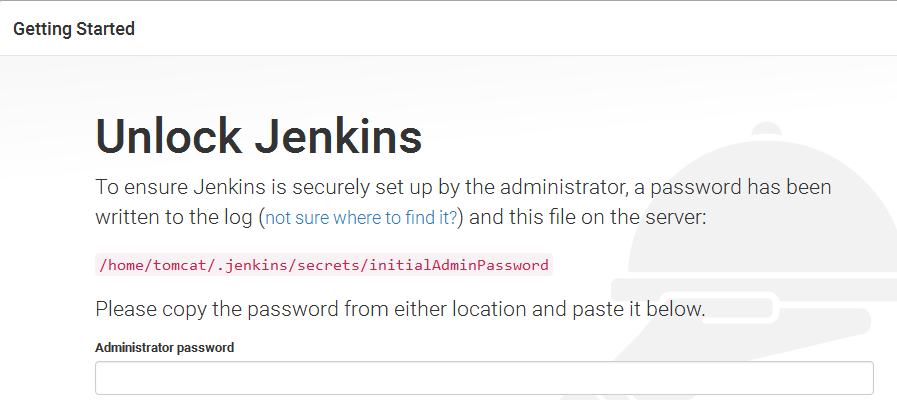
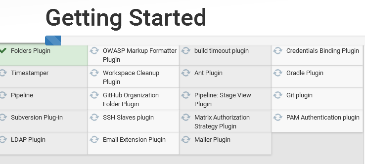
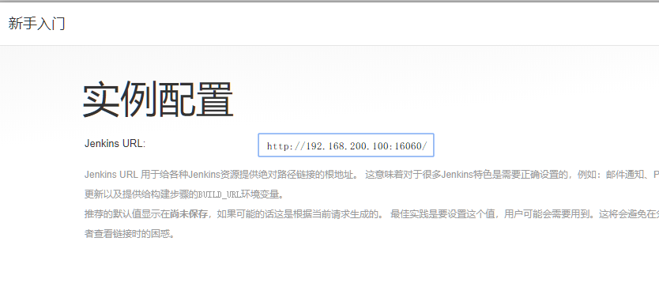
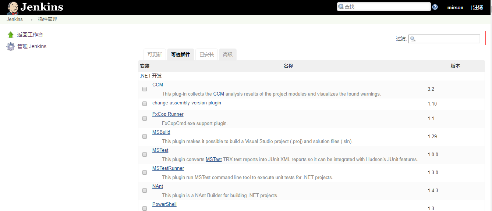

# 第十四章 项目部署_持续集成

## 目标：

- 能够理解什么是持续集成
- 能够完成jenkins环境的搭建
- 能够完成jenkins插件的安装及配置
- 能够完成dockerfile的配置
- 能够完成项目的多环境部署
- 能够完成项目的部署与持续交付

## 1 持续集成

### 1.1 软件开发生命周期

软件开发生命周期又叫做SDLC（Software Development Life Cycle），它是集合了计划、开发、测试和部署过程的集合。如下图所示 ：


- 需求分析

  这是生命周期的第一阶段，根据项目需求，团队执行一个可行性计划的分析。项目需求可能是公司内部或者客户提出的。这阶段主要是对信息的收集，也有可能是对现有项目的改善和重新做一个新的项目。还要分析项目的预算多长，可以从哪方面受益及布局，这也是项目创建的目标。

- 设计

  第二阶段就是设计阶段，系统架构和满意状态（就是要做成什么样子，有什么功能），和创建一个项目计划。计划可以使用图表，布局设计或者文字的方式呈现。

- 实现

  第三阶段就是实现阶段，项目经理创建和分配工作给开发者，开发者根据任务和在设计阶段定义的目标进行开发代码。依据项目的大小和复杂程度，可以需要数月或更长时间才能完成。

- 测试

  测试人员进行代码测试 ，包括功能测试、代码测试、压力测试等。

- 进化

  最后进阶段就是对产品不断的进化改进和维护阶段，根据用户的使用情况，可能需要对某功能进行修改，bug修复，功能增加等。

### 1.2 软件开发瀑布模型

瀑布模型是最著名和最常使用的软件开发模型。瀑布模型就是一系列的软件开发过程。它是由制造业繁衍出来的。一个高度化的结构流程在一个方向上流动，有点像生产线一样。在瀑布模型创建之初，没有其它开发的模型，有很多东西全靠开发人员去猜测，去开发。这样的模型仅适用于那些简单的软件开发， 但是已经不适合现在的开发了。

下图对软件开发模型的一个阐述。


| 优势                                       | 劣势                                                         |
| ------------------------------------------ | ------------------------------------------------------------ |
| 简单易用和理解                             | 各个阶段的划分完全固定，阶段之间产生大量的文档，极大地增加了工作量。 |
| 当前一阶段完成后，您只需要去关注后续阶段。 | 由于开发模型是线性的，用户只有等到整个过程的末期才能见到开发成果，从而增加了开发风险。 |
| 为项目提供了按阶段划分的检查节点           | 瀑布模型的突出缺点是不适应用户需求的变化。                   |

### 1.3 软件的敏捷开发

- 什么是敏捷开发？

  敏捷开发（Agile Development） 的核心是迭代开发（Iterative Development） 与 增量开发（Incremental Development）。

- 何为迭代开发？

  对于大型软件项目，传统的开发方式是采用一个大周期（比如一年）进行开发，整个过程就是一次"大开发"；迭代开发的方式则不一样，它将开发过程拆分成多个小周期，即一次"大开发"变成多次"小开发"，每次小开发都是同样的流程，所以看上去就好像重复在做同样的步骤。

  举例来说，SpaceX 公司想造一个大推力火箭，将人类送到火星。但是，它不是一开始就造大火箭，而是先造一个最简陋的小火箭 Falcon 1。结果，第一次发射就爆炸了，直到第四次发射，才成功进入轨道。然后，开发了中型火箭 Falcon 9，九年中发射了70次。最后，才开发 Falcon 重型火箭。如果SpaceX 不采用迭代开发，它可能直到现在还无法上天。

- 何为增量开发？

  软件的每个版本，都会新增一个用户可以感知的完整功能。也就是说，按照新增功能来划分迭代。

  举例来说，房产公司开发一个10栋楼的小区。如果采用增量开发的模式，该公司第一个迭代就是交付一号楼，第二个迭代交付二号楼......每个迭代都是完成一栋完整的楼。而不是第一个迭代挖好10栋楼的地基，第二个迭代建好每栋楼的骨架，第三个迭代架设屋顶......

- 敏捷开发如何迭代？

  虽然敏捷开发将软件开发分成多个迭代，但是也要求，每次迭代都是一个完整的软件开发周期，必须按照软件工程的方法论，进行正规的流程管理。


- 敏捷开发有什么好处？

  - 早期交付

    敏捷开发的第一个好处，就是早期交付，从而大大降低成本。 还是以上一节的房产公司为例，如果按照传统的"瀑布开发模式"，先挖10栋楼的地基、再盖骨架、然后架设屋顶，每个阶段都等到前一个阶段完成后开始，可能需要两年才能一次性交付10栋楼。也就是说，如果不考虑预售，该项目必须等到两年后才能回款。 敏捷开发是六个月后交付一号楼，后面每两个月交付一栋楼。因此，半年就能回款10%，后面每个月都会有现金流，资金压力就大大减轻了。

  - 降低风险

    敏捷开发的第二个好处是，及时了解市场需求，降低产品不适用的风险。 请想一想，哪一种情况损失比较小：10栋楼都造好以后，才发现卖不出去，还是造好第一栋楼，就发现卖不出去，从而改进或停建后面9栋楼？

### 1.4 什么是持续集成

持续集成（ Continuous integration ， 简称 CI ）指的是，频繁地（一天多次）将代码集成到主干


**持续集成的组成要素**

一个自动构建过程， 从检出代码、 编译构建、 运行测试、 结果记录、 测试统计等都是自动完成的， 无需人工干预。

一个代码存储库，即需要版本控制软件来保障代码的可维护性，同时作为构建过程的素材库，一般使用SVN或Git。

一个持续集成服务器， Jenkins 就是一个配置简单和使用方便的持续集成服务器。


### 1.5 持续集成的好处

1、降低风险，由于持续集成不断去构建，编译和测试，可以很早期发现问题，所以修复的代价就少；
2、对系统健康持续检查，减少发布风险带来的问题；
3、减少重复性工作；
4、持续部署，提供可部署单元包；
5、持续交付可供使用的版本；
6、增强团队信心；


## 2 Jenkins安装配置

### 2.1 Jenkins介绍


Jenkins  是一款流行的开源持续集成（Continuous Integration）工具，广泛用于项目开发，具有自动化构建、测试和部署等功能。官网：  http://jenkins-ci.org/。

Jenkins的特征：

- 开源的 Java语言开发持续集成工具，支持持续集成，持续部署。
- 易于安装部署配置：可通过 yum安装,或下载war包以及通过docker容器等快速实现安装部署，可方便web界面配置管理。
- 消息通知及测试报告：集成 RSS/E-mail通过RSS发布构建结果或当构建完成时通过e-mail通知，生成JUnit/TestNG测试报告。
- 分布式构建：支持 Jenkins能够让多台计算机一起构建/测试。
- 文件识别： Jenkins能够跟踪哪次构建生成哪些jar，哪次构建使用哪个版本的jar等。
- 丰富的插件支持：支持扩展插件，你可以开发适合自己团队使用的工具，如 git，svn，maven，docker等。


Jenkins安装和持续集成环境配置


1 ）首先，开发人员每天进行代码提交，提交到Git仓库

2）然后，Jenkins作为持续集成工具，使用Git工具到Git仓库拉取代码到集成服务器，再配合JDK，Maven等软件完成代码编译，代码测试与审查，测试，打包等工作，在这个过程中每一步出错，都重新再执行一次整个流程。

3）最后，Jenkins把生成的jar或war包分发到测试服务器或者生产服务器，测试人员或用户就可以访问应用。

### 2.2 Jenkins环境搭建

#### 2.2.1  Jenkins安装配置

可以导入资料中的镜像：

```java
服务器用户名：root   密码：itcast

jenkins  用户名：itcast   密码：itcast
```


1. 第一种方式：采用YUM方式安装

   安装wget命令

   ```sh
   yum install wget
   ```

   加入jenkins安装源：(建议使用第一种)

   ```sh
   sudo wget -O /etc/yum.repos.d/jenkins.repo https://pkg.jenkins.io/redhat-stable/jenkins.repo --no-check-certificate
   
   sudo rpm --import https://pkg.jenkins.io/redhat-stable/jenkins.io.key
   ```

   执行yum命令安装：

   ```sh
   yum -y install jenkins
   ```

2. 第二种方式：采用RPM安装包方式(下载太慢)

   [Jenkins安装包下载地址](https://pkg.jenkins.io/redhat-stable/)

   ```sh
   wget https://pkg.jenkins.io/redhat-stable/jenkins-2.190.1-1.1.noarch.rpm
   ```

   执行安装：

   ```sh
   rpm -ivh jenkins-2.190.1-1.1.noarch.rpm
   ```

3. 配置：

   修改配置文件：

   ```sh
   vi /etc/sysconfig/jenkins
   ```

   修改内容：

   ```sh
   # 修改为对应的目标用户， 这里使用的是root
   $JENKINS_USER="root"
   # 服务监听端口，默认是8080
   JENKINS_PORT="16060"
   ```

   目录权限：

   ```sh
   chown -R root:root /var/lib/jenkins
   chown -R root:root /var/cache/jenkins
   chown -R root:root /var/log/jenkins
   ```

   重启：

   ```sh
   #重启jenkins
   systemctl restart jenkins
   #查看jenkins状态
   systemctl status jenkins
   #启动jenkins
   systemctl start jenkins
   ```

   如果启动失败， 出现错误信息：

   ```sh
   Starting Jenkins bash: /usr/bin/java: No such file or directory
   ```

   

   创建JAVA环境的软链接：

   

   ```sh
   #获取jdk所在的包路径
   [root@localhost bin]# whereis java
   java: /usr/bin/java /usr/java/jdk1.8.0_161/bin/java
   # 然后创建软链接
   ln -s /usr/java/jdk1.8.0_161/bin/java /usr/bin/java
   #最终结果
   ```

   

   ```sh
   #最后：重新启动jenkins
   systemctl start jenkins
   ```

4. 管理后台初始化设置

   http://IP:16060/

   需要输入管理密码， 在以下位置查看：

   ```sh
   cat /var/lib/jenkins/secrets/initialAdminPassword
   ```

   

   按默认设置，把建议的插件都安装上

   

   这一步等待时间较长， 安装完成之后， 创建管理员用户：

   

配置访问地址：




配置完成之后， 会进行重启， 之后可以看到管理后台：


#### 2.2.2  Jenkins插件安装

在实现持续集成之前， 需要确保以下插件安装成功。

- Maven Integration plugin： Maven 集成管理插件。
- Docker plugin： Docker集成插件。
- GitLab Plugin： GitLab集成插件。
- Publish Over SSH：远程文件发布插件。
- SSH: 远程脚本执行插件。

安装方法：

1. 进入【系统管理】-【插件管理】

2. 点击标签页的【可选插件】

   在过滤框中搜索插件名称

   

3. 勾选插件， 点击直接安装即可。

>注意，如果没有安装按钮，需要更改配置
>
>在安装插件的高级配置中，修改升级站点的连接为：http://updates.jenkins.io/update-center.json   保存
>
>
>
>

#### 2.2.3  Git安装配置

1. yum 安装方式

   ```sh
   yum -y install git
   ```

2. 采用源码包方式安装

   - 安装依赖包

     ```sh
     yum -y install curl-devel expat-devel gettext-devel openssl-devel zlib-devel
     yum -y install gcc perl-ExtUtils-MakeMaker
     ```

   - 如果之前有安装旧版本， 先做卸载， 没有安装则忽略

     ```sh
     yum remove git
     ```

   - 下载源码包

     ```sh
     cd /usr/local
     wget https://mirrors.edge.kernel.org/pub/software/scm/git/git-1.8.3.1.tar.gz
     tar -xvf git-1.8.3.1.tar.gz
     ```

     也可以安装其他版本， 地址：https://mirrors.edge.kernel.org/pub/software/scm/git/

   - 编译安装

     ```sh
     cd git-1.8.3.1
     make prefix=/usr/local/git all
     make prefix=/usr/local/git install
     echo "export PATH=$PATH:/usr/local/git/bin" >> /etc/bashrc
     source /etc/bashrc
     ```

3. 检查git版本

   ```sh
   [root@localhost jenkins]# git version
   git version 1.8.3.1
   ```


#### 2.2.4  Maven安装配置

1. 下载安装包

   下载地址： https://maven.apache.org/download.cgi

2. 解压安装包

   ```sh
   cd /usr/local/maven
   unzip -o apache-maven-3.5.2.zip
   ```

3. 配置

   环境变量配置

   ```sh
   vi /etc/profile
   ```

   增加：

   
   
   ```sh
   export MAVEN_HOME=/usr/local/maven/apache-maven-3.5.2
export PATH=$PATH:$MAVEN_HOME/bin
   ```

   如果权限不够，则需要增加当前目录的权限
   
   ```shell
chmod 777 /usr/local/maven/apache-maven-3.5.2/bin/mvn
   ```

   
   
   修改镜像仓库配置：
   
   ```sh
   vi /usr/local/maven/apache-maven-3.5.2/conf/settings.xml
   ```
   
   需要把本机的仓库打包上传到服务器上（不上传会自动下载）
   
   
   
   然后指定上传后的仓库配置
   
   

#### 2.2.5  Docker安装配置

1. 更新软件包版本

   ```sh
   yum -y update
   ```

2. 卸载旧版本

   ```sh
   yum -y remove docker  docker-common docker-selinux docker-engine
   ```

3. 安装软件依赖包

   ```sh
   yum install -y yum-utils device-mapper-persistent-data lvm2
   ```

4. 设置yum源为阿里云

   ```sh
   sudo yum-config-manager --add-repo http://mirrors.aliyun.com/docker-ce/linux/centos/docker-ce.repo
   ```

5. 安装后查看docker版本

   ```sh
   docker -v
   ```
   
6. 启动

   设置开机启动：

   ```sh
   systemctl enable docker
   ```

   启动docker

   ```sh
   systemctl start docker
   ```


#### 2.2.6  Docker Registry私有仓库安装配置

对于持续集成环境的配置，Jenkins会发布大量的微服务， 要与多台机器进行交互， 可以采用docker镜像的保存与导出功能结合SSH实现， 但这样交互繁琐，稳定性差， 而且不便管理， 这里我们通过搭建Docker的私有仓库来实现， 这个有点类似GIT仓库， 集中统一管理资源， 由客户端拉取或更新。

1. 下载最新Registry镜像

   ```sh
   docker pull registry:latest
   ```

2. 启动Registry镜像服务

   ```sh
   docker run -d -p 5000:5000 --name registry -v /usr/local/docker/registry:/var/lib/registry registry:latest
   ```

   映射5000端口； -v是将Registry内的镜像数据卷与本地文件关联， 便于管理和维护Registry内的数据。

3. 查看仓库资源

   访问地址：http://192.168.200.100:5000/v2/_catalog

   启动正常， 可以看到返回：

   ```json
   {"repositories":[]}
   ```

   目前并没有上传镜像， 显示空数据。

   如果上传成功， 可以看到数据:
   

4. 配置Docker客户端

   正常生产环境中使用， 要配置HTTPS服务， 确保安全，内部开发或测试集成的局域网环境，可以采用简便的方式， 不做安全控制。

   先确保持续集成环境的机器已安装好Docker客户端， 然后做以下修改：

   ```sh
   vi /lib/systemd/system/docker.service
   ```

   修改内容：

   ```sh
   ExecStart=/usr/bin/dockerd --insecure-registry 192.168.200.100:5000
   ```

   指向安装Registry的服务IP与端口。

   重启生效：

   ```sh
   systemctl daemon-reolad
   systemctl restart docker.service
   ```

==注意：第二种方式（建议）==

```sh
# 1、拉取私有仓库镜像 
docker pull registry 
# 2、启动私有仓库容器 
docker run -di --name=registry -p 5000:5000 registry 
# 3、打开浏览器 输入地址http://宿主机ip:5000/v2/_catalog，看到{"repositories":[]} 表示私有仓库 搭建成功 
# 4、修改daemon.json 
vi /etc/docker/daemon.json 
# 在上述文件中添加一个key，保存退出。此步用于让 docker 信任私有仓库地址；注意将宿主机ip修改为自己宿主 机真实ip 
{
  "registry-mirrors": ["https://7oc12mqc.mirror.aliyuncs.com"],  #镜像加速器
  "insecure-registries":["192.168.200.129:5000"]                  #让docker去信任私有仓库
}
# 5、重启docker 服务 
systemctl daemon-reload
systemctl restart docker 
docker start registry
```


## 3 持续集成生产实践配置

###  3.1 Jenkins工具配置

1. 进入【系统管理】--> 【全局工具配置】

   

2. MAVEN配置全局设置

   

3. 指定JDK配置

   


4. 指定MAVEN 目录

   

5. 指定DOCKER目录

   

   如果不清楚docker的安装的目录，可以使用`whereis docker` 命令查看docker的安装的目录

6. 设置远程应用服务主机

   添加凭证：

   

   新增凭证，输入用户名和密码保存即可

   
   
   
   
   进入【系统管理】-【系统设置】
   
   
   
   输入主机名称和登陆信息， 点击【check connections】验证， 如果成功， 会显示“Successfull connection”。
   
   

### 3.2 环境准备

#### 3.2.1 mysql部署

可以把mysql部署到192.168.200.130这台服务器上

拉取镜像：

```shell
docker pull mysql:5.7
```

创建容器

```shell
docker run -di --name=mysql -p 3306:3306 -e MYSQL_ROOT_PASSWORD=root mysql:5.7
```

使用本地工具测试，导入第一章资料中的sql脚本，导入第八章xxl-job需要的sql脚本

#### 3.2.2 xxl-job-admin部署

（1）修改xxl-job-admin中的application.properties文件，修改端口号为8888，数据库连接指向130这台服务器

```properties
### web
server.port=8888
server.servlet.context-path=/xxl-job-admin

### actuator
management.server.servlet.context-path=/actuator
management.health.mail.enabled=false

### resources
spring.mvc.servlet.load-on-startup=0
spring.mvc.static-path-pattern=/static/**
spring.resources.static-locations=classpath:/static/

### freemarker
spring.freemarker.templateLoaderPath=classpath:/templates/
spring.freemarker.suffix=.ftl
spring.freemarker.charset=UTF-8
spring.freemarker.request-context-attribute=request
spring.freemarker.settings.number_format=0.##########

### mybatis
mybatis.mapper-locations=classpath:/mybatis-mapper/*Mapper.xml
#mybatis.type-aliases-package=com.xxl.job.admin.core.model

### xxl-job, datasource
spring.datasource.url=jdbc:mysql://192.168.200.130:3306/xxl_job?Unicode=true&characterEncoding=UTF-8
spring.datasource.username=root
spring.datasource.password=root
spring.datasource.driver-class-name=com.mysql.cj.jdbc.Driver

### datasource-pool
spring.datasource.type=com.zaxxer.hikari.HikariDataSource
spring.datasource.hikari.minimum-idle=10
spring.datasource.hikari.maximum-pool-size=30
spring.datasource.hikari.auto-commit=true
spring.datasource.hikari.idle-timeout=30000
spring.datasource.hikari.pool-name=HikariCP
spring.datasource.hikari.max-lifetime=900000
spring.datasource.hikari.connection-timeout=10000
spring.datasource.hikari.connection-test-query=SELECT 1

### xxl-job, email
spring.mail.host=smtp.qq.com
spring.mail.port=25
spring.mail.username=xxx@qq.com
spring.mail.password=xxx
spring.mail.properties.mail.smtp.auth=true
spring.mail.properties.mail.smtp.starttls.enable=true
spring.mail.properties.mail.smtp.starttls.required=true
spring.mail.properties.mail.smtp.socketFactory.class=javax.net.ssl.SSLSocketFactory

### xxl-job, access token
xxl.job.accessToken=

### xxl-job, i18n (default is zh_CN, and you can choose "zh_CN", "zh_TC" and "en")
xxl.job.i18n=zh_CN

## xxl-job, triggerpool max size
xxl.job.triggerpool.fast.max=200
xxl.job.triggerpool.slow.max=100

### xxl-job, log retention days
xxl.job.logretentiondays=30
```

(2)执行打包命令,把生成的jar文件上传到130服务器上，放置根目录的xxl-job目录下（没有则创建）


（3）在xxl-job目录下创建Dockerfile文件，内容如下

```dockerfile
 FROM java:8u111
 COPY xxl-job-admin-2.2.0-SNAPSHOT.jar /app.jar
 CMD java -jar /app.jar
 EXPOSE 8888
```

执行构建镜像命令：

```shell
docker build -t xxl-job-admin:2.2.0 .
```


(4)创建容器

```shell
docker run -di --name=xxl-job-admin -p 8888:8888 xxl-job-admin:2.2.0
```

(5)访问


#### 3.3.3 seata部署

（1）拉取镜像

```shell
docker pull seataio/seata-server:1.3.0
```

（2）创建容器

```shell
docker run --name seata --restart=always -p 8091:8091 -e SEATA_IP=192.168.200.130 -e SEATA_PORT=8091 -d seataio/seata-server:1.3.0
```

### 3.3 多环境切换

（1）修改heima-leadnews父工程的pom文件，修改profiles部分

```xml
<profiles>
    <profile>
        <id>dev</id>
        <properties>
            <seata.address>192.168.200.130:8091</seata.address>
        </properties>
        <activation>
            <activeByDefault>true</activeByDefault>
        </activation>
        <build>
            <filters>
                <filter>maven_dev.properties</filter>
            </filters>
        </build>
    </profile>
    <profile>
        <id>test</id>

        <build>
            <filters>
                <filter>maven_test.properties</filter>
            </filters>
        </build>
    </profile>
    <profile>
        <id>prod</id>
        <properties>
            <seata.address>192.168.200.130:8091</seata.address>
        </properties>
        <build>
            <filters>
                <filter>maven_prod.properties</filter>
            </filters>
        </build>
    </profile>
</profiles>
```

- profiles标签为配置文件标识。这里设置了三个环境， dev, test和pord。通过activeByDefault标签， 默认激活的是dev环境

- 其中的标签`seata.address`为自定义，指的是seata的服务地址，做出一个变量，适用于不同的环境

  同时需要修改依赖与seata的工程，修改file.conf文件，连接seata的地址为：`${seata.address}`

  如下代码：

  

（2）在properties文件中添加配置，以heima-leadnews-admin项目为例

修改maven_dev.properties  开发环境

```properties
profiles.name=dev

# kafka地址
kafka.servers=192.168.200.130:9092
#nacos地址
nacos.server=192.168.200.130:8848

#数据库连接配置信息
datasource.url=jdbc:mysql://192.168.200.130:3306/leadnews_admin?useUnicode=true&characterEncoding=UTF-8&serverTimezone=UTC
datasource.username=root
datasource.password=root

#es配置信息
elasticsearch.host=192.168.200.130
elasticsearch.port=9200

#图片访问ip
fdfs.url: http://192.168.200.130/

#xxljob连接配置信息
xxljob.admin.addresses=http://192.168.200.130:8888/xxl-job-admin
xxljob.admin.appname=leadnews-admin-executor
xxljob.admin.port=9999
```

修改maven_prod.properties  生成环境

```properties
profiles.name=prod

# kafka地址
kafka.servers=192.168.200.130:9092
#nacos地址
nacos.server=192.168.200.130:8848

#数据库连接配置信息
datasource.url=jdbc:mysql://52.82.20.5:33066/leadnews_admin?useUnicode=true&characterEncoding=UTF-8&serverTimezone=UTC
datasource.username=root
datasource.password=qwe123zxcasd

#es配置信息
elasticsearch.host=192.168.200.130
elasticsearch.port=9200

#图片访问ip
fdfs.url: http://192.168.200.130/

#xxljob连接配置信息
xxljob.admin.addresses=http://192.168.200.130:8888/xxl-job-admin
xxljob.admin.appname=leadnews-admin-executor
xxljob.admin.port=9999
```

修改application.yml文件如下,可变的地址设置为变量，从properties文件中读取

```yaml
server:
  port: 9001
spring:
  application:
    name: leadnews-admin
  kafka:
    bootstrap-servers: ${kafka.servers}
    consumer:
      group-id: ${spring.application.name}-kafka-group
      key-deserializer: org.apache.kafka.common.serialization.StringDeserializer
      value-deserializer: org.apache.kafka.common.serialization.StringDeserializer
  cloud:
    nacos:
      discovery:
        server-addr: ${nacos.server}
    alibaba:
      seata:
        tx-service-group: ${spring.application.name}_tx_group
  datasource:
    driver-class-name: com.mysql.jdbc.Driver
    url: ${datasource.url}
    username: ${datasource.username}
    password: ${datasource.password}
# 设置Mapper接口所对应的XML文件位置，如果你在Mapper接口中有自定义方法，需要进行该配置
mybatis-plus:
  mapper-locations: classpath*:mapper/*.xml
  # 设置别名包扫描路径，通过该属性可以给包中的类注册别名
  type-aliases-package: com.heima.model.admin.pojos

#图片访问ip
fdfs.url: ${fdfs.url}
xxljob:
  admin:
    addresses: ${xxljob.admin.addresses}
  executor:
    appname: ${xxljob.admin.appname}
    port: ${xxljob.admin.port}
#取消对elastsearch的健康检查
management:
  health:
    elasticsearch:
      enabled: false
#自定义elasticsearch连接配置
elasticsearch:
  host: ${elasticsearch.host}
  port: ${elasticsearch.port}
```

其他微服务配置请参考资料文件夹的内容，一一进行修改


所有环境配置完成以后，可以使用maven的命令进行打包

如果使用 `mvn package `则默认加载dev的环境，也可以使用`mvn package -P prod` 指定环境打包

### 3.4 服务集成Docker配置

每个微服务使用的dockerfile的方式进行构建镜像后创建容器，需要在每个微服务中添加docker相关的配置

（1）修改**每个微服务**的pom文件，添加dockerfile的插件

```xml
<properties>
    <docker.image>docker_storage</docker.image>
</properties>
<build>
    <finalName>heima-leadnews-admin</finalName>
    <plugins>
        <plugin>
            <groupId>org.springframework.boot</groupId>
            <artifactId>spring-boot-maven-plugin</artifactId>
            <executions>
                <execution>
                    <goals>
                        <goal>repackage</goal>
                    </goals>
                </execution>
            </executions>
        </plugin>
        <plugin>
            <groupId>org.apache.maven.plugins</groupId>
            <artifactId>maven-compiler-plugin</artifactId>
            <version>3.7.0</version>
            <configuration>
                <source>${java.version}</source>
                <target>${java.version}</target>
            </configuration>
        </plugin>
        <plugin>
            <groupId>com.spotify</groupId>
            <artifactId>dockerfile-maven-plugin</artifactId>
            <version>1.3.6</version>
            <configuration>
                <repository>${docker.image}/${project.artifactId}</repository>
                <buildArgs>
                    <JAR_FILE>target/${project.build.finalName}.jar</JAR_FILE>
                </buildArgs>
            </configuration>
        </plugin>
    </plugins>
</build>
```

（2）在每个微服务的根目录下创建Dockerfile文件，如下：

```dockerfile
# 设置JAVA版本
FROM java:8
# 指定存储卷, 任何向/tmp写入的信息都不会记录到容器存储层
VOLUME /tmp
# 拷贝运行JAR包
ARG JAR_FILE
COPY ${JAR_FILE} app.jar
# 设置JVM运行参数， 这里限定下内存大小，减少开销
ENV JAVA_OPTS="\
-server \
-Xms256m \
-Xmx512m \
-XX:MetaspaceSize=256m \
-XX:MaxMetaspaceSize=512m"
# 入口点， 执行JAVA运行命令
ENTRYPOINT java ${JAVA_OPTS}  -jar /app.jar
```


### 3.5 基础依赖打包配置

在微服务运行之前需要在本地仓库中先去install所依赖的jar包，所以第一步应该是从git中拉取代码，并且把基础的依赖部分安装到仓库中

（1）新创建一个item,起名为heima-leadnews


（2）配置当前heima-leadnews

- 描述项目


- 源码管理：

  选中git，输入git的仓库地址（前提条件，需要把代码上传到gitee仓库中），最后输入getee的用户名和密码

  如果没有配置Credentials，可以选择添加，然后输入用户名密码即可


- 其中构**建触发器**与**构建环境**暂不设置

- 设置**构建**配置

  选择`Invoke top-level Maven targets`


​	maven版本：就是之前在jenkins中配置的maven

​	目标：输入maven的命令  `clean install -Dmaven.test.skip=true`  跳过测试安装


(3)启动项目

创建完成以后可以在主页上看到这个item


启动项目：点击刚才创建的项目，然后Build Now


在左侧可以查看构建的进度：


点进去以后，可以查看构建的日志信息

构建的过程中，会不断的输入日志信息，如果报错也会提示错误信息


jenkins会先从git仓库中拉取代码，然后执行maven的install命令，把代码安装到本地仓库中

最终如果是success则为构建成功


### 3.6 微服务打包配置

（1）新建item，以heima-leadnews-admin微服务为例


(2)配置

- 概述


- 源码管理


- 构建

配置maven


执行maven命令：`clean install -Dmaven.test.skip=true -P prod dockerfile:build -f heima-leadnews-admin/pom.xml`

>-Dmaven.test.skip=true   跳过测试
>
>-P prod  指定环境为生成环境
>
>dockerfile:build  启动dockerfile插件构建容器
>
>-f heima-leadnews-admin/pom.xml  指定需要构建的文件（必须是pom）


执行shell命令


```shell
if [ -n  "$(docker ps -a -f  name=heima-$JOB_NAME  --format '{{.ID}}' )" ]
 then
 #删除之前的容器
 docker rm -f $(docker ps -a -f  name=heima-$JOB_NAME  --format '{{.ID}}' )
fi
 # 清理镜像
docker image prune -f 
 # 启动docker服务
docker run -d --net=host  --name heima-$JOB_NAME docker_storage/heima-$JOB_NAME
```


这里不是只单纯的启动服务， 我们要考虑每次构建， 都会产生镜像， 所以要先做检查清理， 然后再启动服务。

Docker有五种网络连接模式， 因为我们不是所有服务都采用docker构建， 中间件服务部署在宿主机上面， 这里我们采用host模式， 这样docker容器和主机服务之间就是互通的。

- bridge模式

  使用命令： --net=bridge， 这是dokcer网络的默认设置，为容器创建独立的网络命名空间，容器具有独立的网卡等所有单独的网络栈，这是默认模式。

- host模式

  使用命令： --net=host，直接使用容器宿主机的网络命名空间， 即没有独立的网络环境。它使用宿主机的ip和端口。

- none模式

  命令： --net=none,  为容器创建独立网络命名空间, 这个模式下，dokcer不为容器进行任何网络配置。需要我们自己为容器添加网卡，配置IP。

- container模式

  命令： --net=container:NAME_or_ID， 与host模式类似， 这个模式就是指定一个已有的容器，共享该容器的IP和端口。

- 自定义模式

  docker 1.9版本以后新增的特性，允许容器使用第三方的网络实现或者创建单独的bridge网络，提供网络隔离能力。


**到此就配置完毕了，保存即可**

（3）启动该项目 Build Now

- 首先从git中拉取代码
- 编译打包项目
- 构建镜像
- 创建容器
- 删除多余的镜像

可以从服务器中查看镜像


容器也已创建完毕


可以使用postman测试测试该服务接口

### 3.7 构建其他微服务

可以参考admin微服务创建其他微服务，每个项目可能会有不同的maven构建命令，请按照实际需求配置

- heima-leadnews-admin-gateway微服务的配置：

>maven命令：clean install -Dmaven.test.skip=true dockerfile:build -f heima-leadnews-admin-gateway/pom.xml
>
>

- heima-leadnews-user微服务的配置：

>maven命令：clean install -Dmaven.test.skip=true dockerfile:build -f heima-leadnews-user/pom.xml
>
>

所有项目构建完成以后，在本地启动admin前端工程，修改configs中的网关地址为：`192.168.200.100`,进行效果测试

### 3.8 部署前端项目

（1）安装nginx

官方网站下载 nginx：http://nginx.org/，也可以使用资料中的安装包，版本为：nginx-1.18.0

**安装依赖**

- 需要安装 gcc 的环境

```shell
yum install gcc-c++
```

- 第三方的开发包。

  - PCRE(Perl Compatible Regular Expressions)是一个 Perl 库，包括 perl 兼容的正则表达式库。nginx 的 http 模块使用 pcre 来解析正则表达式，所以需要在 linux 上安装 pcre 库。

    ```shell
    yum install -y pcre pcre-devel
    ```

    注：pcre-devel 是使用 pcre 开发的一个二次开发库。nginx 也需要此库。

  - zlib 库提供了很多种压缩和解压缩的方式，nginx 使用 zlib 对 http 包的内容进行 gzip，所以需要在 linux 上安装 zlib 库。

    ```shell
    yum install -y zlib zlib-devel
    ```

  - OpenSSL 是一个强大的安全套接字层密码库，囊括主要的密码算法、常用的密钥和证书封装管理功能及 SSL 协议，并提供丰富的应用程序供测试或其它目的使用。nginx
    不仅支持 http 协议，还支持 https（即在 ssl 协议上传输 http），所以需要在 linux安装 openssl 库。

    ```shell
    yum install -y openssl openssl-devel
    ```

**Nginx安装**

第一步：把 nginx 的源码包nginx-1.18.0.tar.gz上传到 linux 系统

第二步：解压缩

```shell
tar zxvf nginx-1.18.0.tar.gz
```

第三步：进入nginx-1.18.0目录   使用 configure 命令创建一 makeFile 文件。

```shell
./configure \
--prefix=/usr/local/nginx \
--pid-path=/var/run/nginx/nginx.pid \
--lock-path=/var/lock/nginx.lock \
--error-log-path=/var/log/nginx/error.log \
--http-log-path=/var/log/nginx/access.log \
--with-http_gzip_static_module \
--http-client-body-temp-path=/var/temp/nginx/client \
--http-proxy-temp-path=/var/temp/nginx/proxy \
--http-fastcgi-temp-path=/var/temp/nginx/fastcgi \
--http-uwsgi-temp-path=/var/temp/nginx/uwsgi \
--http-scgi-temp-path=/var/temp/nginx/scgi
```

执行后可以看到Makefile文件

第四步：编译

```shell
make
```

第五步：安装

```shell
make install
```

第六步：启动

注意：启动nginx 之前，上边将临时文件目录指定为/var/temp/nginx/client， 需要在/var  下创建此
目录

```shell
mkdir /var/temp/nginx/client -p
```

进入到Nginx目录下的sbin目录

```shell
cd /usr/local/ngiux/sbin
```

输入命令启动Nginx

```shell
./nginx
```

启动后查看进程

```shell
ps aux|grep nginx
```

（2）上传nginx前端项目

修改配置config\index.js，网关地址指向100这台服务器


打包admin前端工程


找到项目根目录，会生成dist文件夹，然后压缩

把压缩之后的dist压缩包上传到服务器上，拷贝到linux的root目录下创建workspace/admin（没有目录则创建）

解压当前压缩包

```shell
unzip -o dist.zip
```


（3）配置nginx

打开linux的目录：/usr/local/nginx/conf

编辑nginx.conf文件，替换如下：

```shell

user  root;
worker_processes  1;

events {
    worker_connections  1024;
}

http {
    include       mime.types;
    default_type  application/octet-stream;


    upstream  heima-admin-gateway{
        server localhost:6001;
    }

    server {
	listen 80;
	server_name localhost;

	location / {
	    alias /root/workspace/admin/dist/;
	    index index.html ;
	    allow all;
	}
	location ~/service_6001/(.*) {
	    proxy_pass http://heima-admin-gateway/$1;
	    proxy_set_header HOST $host;
	    proxy_pass_request_body on;
	    proxy_pass_request_headers on;
	    proxy_set_header X-Real-IP $remote_addr;
	    proxy_set_header X-Forwarded-For $proxy_add_x_forwarded_for;
	}
	
     }

}
```

重启nginx

进入到/usr/local/nginx/sbin目录，执行命令

```shell
./nginx -s reload
```

（4）效果

在本地浏览器中输入：http://192.168.200.100/    可访问系统


### 3.9 部署服务到远程服务器上

通过远程部署方式发布， 需要用到Docker的Registry仓库服务。

（1）创建item

跟之前没有区别

（2）配置

- 选择参数化构建：


设置私有仓库的地址和端口：192.168.200.100:5000


- 源码管理 与之前相同


- 构建


执行 Execute shell


```shell
image_tag=$docker_registry/docker_storage/heima-$JOB_NAME
echo '================docker镜像清理================'
if [ -n  "$(docker ps -a -f  name=heima-$JOB_NAME  --format '{{.ID}}' )" ]
 then
 #删除之前的容器
 docker rm -f $(docker ps -a -f  name=heima-$JOB_NAME  --format '{{.ID}}' )
fi
 # 清理镜像
docker image prune -f 

# 创建TAG
docker tag docker_storage/heima-$JOB_NAME $image_tag
echo '================docker镜像推送================'
# 推送镜像
docker push $image_tag
# 删除TAG
docker rmi $image_tag
echo '================docker tag 清理 ================'
```

在远程服务器上执行脚本


```shell
echo '================拉取最新镜像================'
docker pull $docker_registry/docker_storage/heima-$JOB_NAME

echo '================删除清理容器镜像================'
if [ -n  "$(docker ps -a -f  name=heima-$JOB_NAME  --format '{{.ID}}' )" ]
 then
 #删除之前的容器
 docker rm -f $(docker ps -a -f  name=heima-$JOB_NAME  --format '{{.ID}}' )
fi
 # 清理镜像
docker image prune -f 

echo '===============启动容器================'
docker run -d   --net=host --name heima-$JOB_NAME $docker_registry/docker_storage/heima-$JOB_NAME
```


（3）构建

使用参数构建，选中之前的参数


如果在远程服务器上不能pull镜像，则需要在远程服务器上设置，配置docker信任私有仓库地址

修改daemon.json

```shell
vi /etc/docker/daemon.json
```

添加以下内容，保存退出。

```shell
{"insecure-registries":["192.168.200.100:5000"]} 
```


重新启动docker生效

```shell
systemctl restart docker
```

重新构建

### 3.10 构建触发器配置

- 触发远程构建
- 其他工程构建后触发（ Build after other projects are build）
- 定时构建（ Build periodically）
- 轮询 SCM（Poll SCM）


（1）触发远程构建


触发构建 url： http://192.168.200.100:16060/job/leadnews-admin/build?token=88888888

(2)配置需要触发的工程


(3)定时构建（ Build periodically）


定时字符串从左往右分别为： 分 时 日 月 周

定时表达式的例子

>每30分钟构建一次：H代表形参 H/30 * * * * 10:02 10:32
>
>每2个小时构建一次: H H/2 * * *
>
>每天的8点，12点，22点，一天构建3次： (多个时间点中间用逗号隔开) 0 8,12,22 * * *
>
>每天中午12点定时构建一次 H 12 * * *
>
>每天下午18点定时构建一次 H 18 * * *
>
>在每个小时的前半个小时内的每10分钟 H(0-29)/10 * * * *
>
>每两小时一次，每个工作日上午9点到下午5点(也许是上午10:38，下午12:38，下午2:38，下午
>4:38) H H(9-16)/2 * * 1-5

(4)轮询 SCM（Poll SCM）

轮询SCM，是指定时扫描本地代码仓库的代码是否有变更，如果代码有变更就触发项目构建。


 Jenkins会定时扫描本地整个项目的代码，增大系统的开销，不建议使用。


